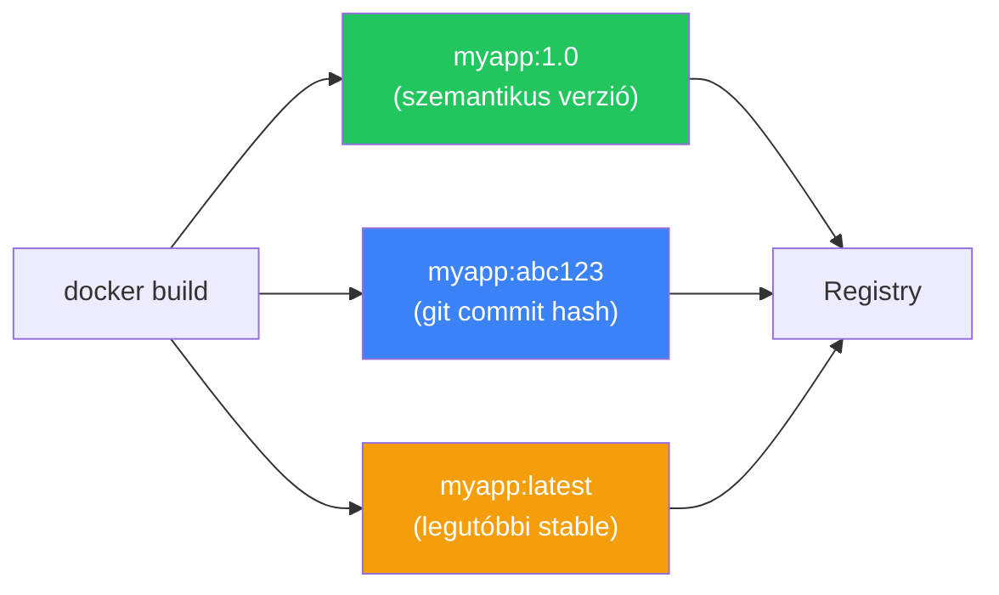

---
tags:
  - docker
  - devops
  - ci-cd
datum: 2026-03-06
szint: "🧱 Brick"
kapcsolodo:
  - "[[cloud/docker-alapok|Docker alapok]]"
  - "[[cloud/ci-cd-pipelines|CI/CD Pipelines]]"
  - "[[foundations/git-es-github|Git és GitHub]]"
  - "[[cloud/docker-multi-stage-builds|Docker Multi-stage Builds]]"
  - "[[_moc/moc-docker|MOC - Docker]]"
---

# Registry kezelés

## Összefoglaló

A **container registry** egy központi tároló, ahova a Docker image-eket push-olod, és ahonnan a szerverek pull-olják. Olyan mint a [[foundations/git-es-github|GitHub]], csak nem kódnak, hanem image-eknek. Ha értesz a `git push` / `git pull` logikához, a registry ugyanez -- csak `docker push` / `docker pull`.

## Miért kell?

```
Fejlesztő gépe                    Production szerver
┌─────────────┐                   ┌─────────────┐
│ docker build │ ──push──→ 📦 Registry ──pull──→ │ docker run  │
│ myapp:1.0    │                                  │ myapp:1.0   │
└─────────────┘                                   └─────────────┘
```

Registry nélkül hogyan jutna el az image a szerverre? USB-n? SCP-vel? A registry a **közös pont** a build és a deploy között.

## A főbb registry-k

| Registry | URL | Mikor jó |
|---|---|---|
| **Docker Hub** | hub.docker.com | Publikus image-ek (nginx, postgres, node), ingyenes |
| **GitHub Container Registry (GHCR)** | ghcr.io | [[foundations/git-es-github|GitHub]] repo-hoz kötött, CI/CD-ben egyszerű |
| **AWS ECR** | *.dkr.ecr.*.amazonaws.com | AWS-en deployolsz |
| **Google Artifact Registry** | *.pkg.dev | GCP-n deployolsz |
| **Azure Container Registry** | *.azurecr.io | Azure-on deployolsz |
| **Self-hosted** | registry.sajatdomain.com | Teljes kontroll, privát |

> [!tip] Melyiket válaszd?
> Ha [[foundations/git-es-github|GitHub]]-on van a kódod, a **GHCR** a legegyszerűbb választás -- a GitHub Actions-ből natívan elérhető, nincs külön fiók. Ha csak publikus image-eket akarsz használni (nem sajátot push-olni), a **Docker Hub** az alapértelmezett.

## Docker Hub

A Docker Hub az alapértelmezett registry. Amikor `docker pull nginx`-et írsz, a Docker Hub-ról jön.

```bash
# Bejelentkezés
docker login

# Image push (a username kell a tag-ben)
docker tag myapp:1.0 username/myapp:1.0
docker push username/myapp:1.0

# Image pull
docker pull username/myapp:1.0
```

**Limitációk:**
- Free tier: 1 privát repo, 200 pull/6 óra (anonymous)
- Publikus image-ek korlátlanul pull-olhatók (bejelentkezve)

## GitHub Container Registry (GHCR)

A GHCR a GitHub-hoz kötött registry. A [[cloud/ci-cd-pipelines|CI/CD pipeline]]-ban a `GITHUB_TOKEN` automatikusan elérhető -- nem kell külön credential.

```bash
# Bejelentkezés Personal Access Token-nel
echo $GITHUB_TOKEN | docker login ghcr.io -u USERNAME --password-stdin

# Image tagging és push
docker tag myapp:1.0 ghcr.io/username/myapp:1.0
docker push ghcr.io/username/myapp:1.0
```

### GitHub Actions-ben automatikusan

```yaml
# .github/workflows/docker-publish.yml
name: Build & Push

on:
  push:
    branches: [main]

jobs:
  build:
    runs-on: ubuntu-latest
    permissions:
      contents: read
      packages: write

    steps:
      - uses: actions/checkout@v4

      - name: Login to GHCR
        uses: docker/login-action@v3
        with:
          registry: ghcr.io
          username: ${{ github.actor }}
          password: ${{ secrets.GITHUB_TOKEN }}

      - name: Build and push
        uses: docker/build-push-action@v5
        with:
          push: true
          tags: |
            ghcr.io/${{ github.repository }}:latest
            ghcr.io/${{ github.repository }}:${{ github.sha }}
```

> [!info] Verzió tagging
> Mindig adj **specifikus verziót** a tag-nek (`myapp:1.0`, `myapp:abc123`), ne csak `latest`-et. A `latest` nem garantálja hogy a legújabb -- egyszerűen az az image amit utoljára `latest`-nek tag-eltél.

## Image tagging stratégiák



| Stratégia | Tag példa | Mikor jó |
|---|---|---|
| **Semantic version** | `myapp:1.2.3` | Stabil release-ek, rollback egyértelmű |
| **Git commit hash** | `myapp:a1b2c3d` | CI/CD, pontosan tudod melyik kódból jött |
| **Branch név** | `myapp:main`, `myapp:develop` | Preview / staging environment |
| **Dátum** | `myapp:2026-03-06` | Napi build-ek |

## Privát registry futtatása

Ha teljes kontrollt akarsz, futtathatsz saját registry-t Docker-ben:

```bash
# Hivatalos registry image indítása
docker run -d \
  -p 5000:5000 \
  --name registry \
  --restart always \
  -v registry-data:/var/lib/registry \
  registry:2

# Image push a saját registry-be
docker tag myapp:1.0 localhost:5000/myapp:1.0
docker push localhost:5000/myapp:1.0

# Image pull
docker pull localhost:5000/myapp:1.0
```

> [!warning] SSL nélkül nem működik távoli gépről
> A Docker alapból HTTPS-t vár. Ha a privát registry-d nem HTTPS mögött van, `insecure-registries`-ként kell konfigurálni a Docker daemon-t -- ez nem ajánlott production-ben. Használj [[cloud/traefik|Traefik]]-et vagy [[cloud/nginx|Nginx]]-et SSL terminálásra.

## Image méret optimalizálás

A registry-be push-olt image mérete számít -- nagyobb image = lassabb deploy, több tárhely.

```bash
# Image méret ellenőrzése
docker images myapp
# REPOSITORY   TAG    SIZE
# myapp        1.0    1.2GB   ← túl nagy!

# Optimalizálás utáni cél:
# myapp        1.0    150MB   ← multi-stage build-del
```

**Hogyan csökkentsd:**
1. **Alpine base image** -- `node:20-alpine` (50MB) vs `node:20` (350MB)
2. **[[cloud/docker-multi-stage-builds|Multi-stage build]]** -- csak a futtatáshoz szükséges fájlok kerülnek az image-be
3. **`.dockerignore`** -- ne másolj felesleges fájlokat (`node_modules`, `.git`, `.env`)

## Kapcsolódó

- [[cloud/docker-alapok|Docker alapok]] -- image build és registry alapok
- [[cloud/ci-cd-pipelines|CI/CD Pipelines]] -- automatikus build és push a registry-be
- [[cloud/docker-multi-stage-builds|Docker Multi-stage Builds]] -- kisebb image-ek a registry-be
- [[foundations/git-es-github|Git és GitHub]] -- a GHCR a GitHub-hoz kötött
- [[_moc/moc-docker|MOC - Docker]]
