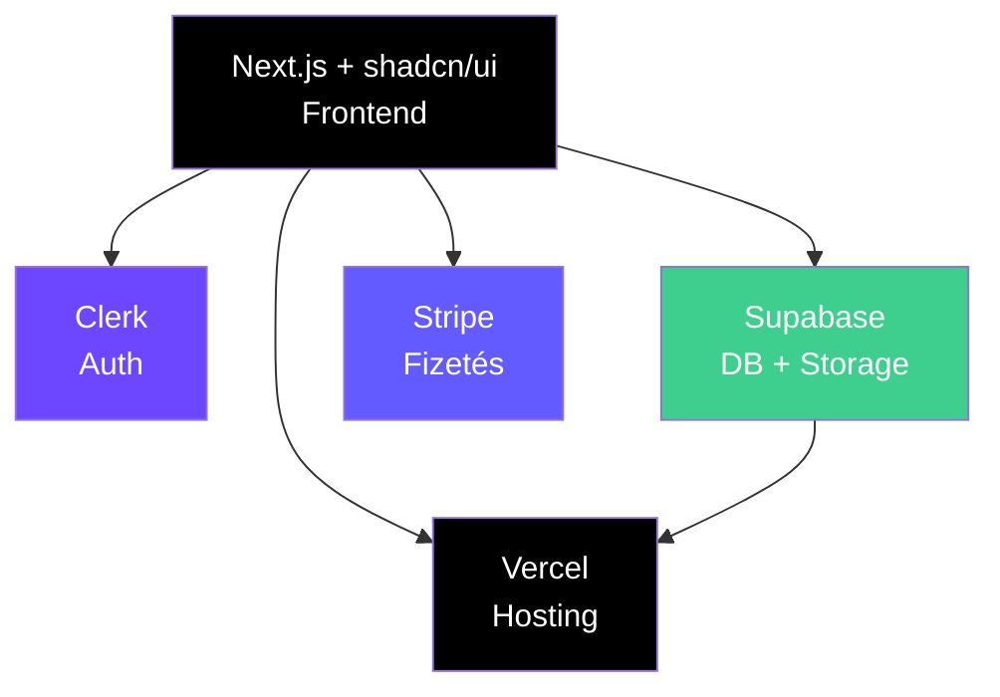

---
tags:
  - deployment
  - business
  - saas
datum: 2026-03-06
szint: "🧱 Scout"
kapcsolodo:
  - "[[cloud/vercel|Vercel]]"
  - "[[database/supabase|Supabase]]"
  - "[[cloud/railway|Railway]]"
  - "[[cloud/cloudflare|Cloudflare]]"
  - "[[cloud/deployment-checklist|Deployment checklist]]"
  - "[[cloud/12-faktoros-alkalmazas-epites|12 Faktoros alkalmazás építés]]"
  - "[[_moc/moc-deployment|MOC - Deployment]]"
---

# SaaS MVP Deployment

## Összefoglaló

A leggyorsabb út az **ötlettől a production-ig**, ha SaaS (Software as a Service) alkalmazást építesz. Stack választás üzleti szempontból — minimális költséggel, maximális sebességgel. A [[cloud/12-faktoros-alkalmazas-epites|12 Faktoros alkalmazás építés]] elveit követve portábilis, skálázható appot kapsz.

## Az MVP Stack



| Réteg | Szolgáltatás | Költség (MVP) | Miért ez |
|-------|-------------|---------------|----------|
| Frontend | [[cloud/vercel|Vercel]] | $0 | Next.js natív, preview deploy-ok |
| Auth | [[backend/clerk|Clerk]] | $0 (10k MAU-ig) | Social login, webhooks, 5 perc setup |
| DB | [[database/supabase|Supabase]] | $0 (500MB-ig) | Postgres + Auth + Storage + Realtime |
| Fizetés | Stripe | Pay-as-you-go | Subscription billing, invoice-ok |
| Domain | [[cloud/cloudflare|Cloudflare]] | $10/év | DNS + CDN + DDoS védelem |

**Összköltség MVP-hez: ~$10/hó** (domain + esetleg Clerk Pro ha kinövöd a free tier-t)

## Deploy lépések

### 1. Projekt init (5 perc)

```bash
npx create-next-app@latest my-saas --typescript --tailwind --app
cd my-saas
npx shadcn-ui@latest init
```

### 2. Supabase setup (10 perc)

```bash
npx supabase init
npx supabase start  # lokális fejlesztéshez
```

### 3. Vercel deploy (2 perc)

```bash
# GitHub-ra push után:
vercel
# Vagy: vercel.com dashboard → Import Git Repository
```

### 4. Environment változók

```
# Vercel Dashboard → Project Settings → Environment Variables
NEXT_PUBLIC_SUPABASE_URL=...
NEXT_PUBLIC_SUPABASE_ANON_KEY=...
SUPABASE_SERVICE_ROLE_KEY=...
NEXT_PUBLIC_CLERK_PUBLISHABLE_KEY=...
CLERK_SECRET_KEY=...
STRIPE_SECRET_KEY=...
STRIPE_WEBHOOK_SECRET=...
```

> [!tip] Free tier-ekkel messzire jutsz
> A Vercel + Supabase + Clerk free tier-jei bőven elegendőek az első 100-1000 felhasználóig. Ne optimalizálj költségre az elején — építsd meg először, és ha kinövöd, akkor váltasz.

## Mikor váltsd le az MVP stack-et

| Jel | Következő lépés |
|-----|-----------------|
| Vercel function timeout (10s) | [[cloud/railway|Railway]] backend-nek |
| Supabase 500MB limit | Supabase Pro ($25/hó) |
| Clerk 10k MAU | Clerk Pro ($25/hó) |
| Komplex background job-ok | Inngest / Trigger.dev |
| Saját infra kell | [[cloud/docker-alapok|Docker]] + VPS |

## Kapcsolódó

- [[cloud/vercel|Vercel]] — frontend hosting
- [[database/supabase|Supabase]] — backend szolgáltatás
- [[cloud/railway|Railway]] — ha kinövöd a Vercel-t
- [[cloud/cloudflare|Cloudflare]] — DNS és CDN
- [[cloud/deployment-checklist|Deployment checklist]] — deploy előtti ellenőrző lista
- [[cloud/12-faktoros-alkalmazas-epites|12 Faktoros alkalmazás építés]] — cloud-native elvek amiket az MVP-nél is érdemes követni
