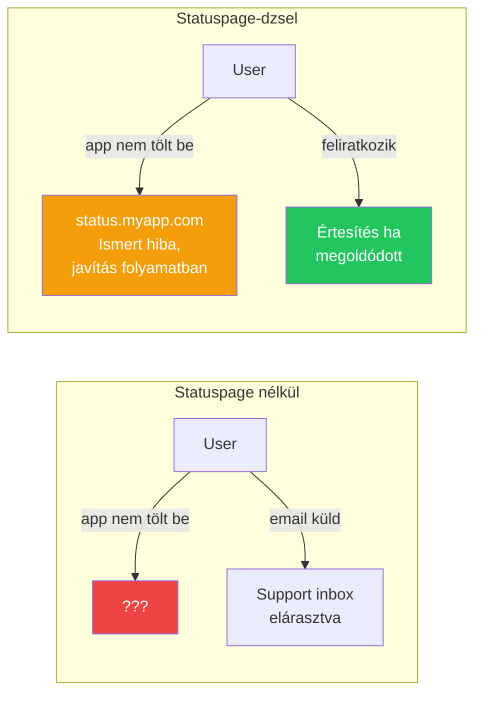
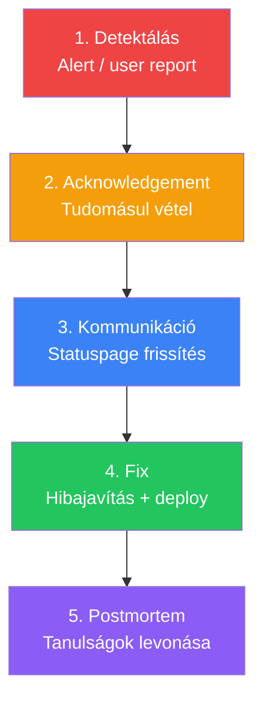

---
tags:
  - devops
  - monitoring
  - communication
datum: 2026-03-06
szint: "🧱 Scout"
kapcsolodo:
  - "[[cloud/monitoring-es-logging|Monitoring és Logging]]"
  - "[[cloud/deployment-checklist|Deployment checklist]]"
  - "[[cloud/vercel|Vercel]]"
  - "[[cloud/railway|Railway]]"
  - "[[toolbox/grafana|Grafana]]"
  - "[[_moc/moc-deployment|MOC - Deployment]]"
---

# Statuspage és Incident Management

## Összefoglaló

Ha az appod leáll production-ben, a felhasználóidnak tudniuk kell róla. A **statuspage** egy publikus oldal ami mutatja az app állapotát, az **incident management** a folyamat ahogy kezeled és kommunikálod a problémát. A postmortem kultúra pedig arról szól, hogy tanuljatok a hibákból, ne ismétlődjön meg.

## Miért kell ez?



**Statuspage nélkül:** A felhasználók nem tudják mi történik → support inbox robban → bizalomvesztés.
**Statuspage-dzsel:** A felhasználók látják hogy tudsz a hibáról és dolgozol rajta → kevesebb support ticket → megőrzött bizalom.

## Statuspage eszközök

### Betterstack Status (ajánlott)

```
betterstack.com → Status pages
Free: 1 statuspage, email értesítés
Pro: $20/hó — custom domain, Slack integráció
```

**Setup (5 perc):**
1. Betterstack Dashboard → Status pages → Create
2. Add monitors (az uptime monitorok amiket már beállítottál)
3. Custom domain: `status.myapp.com` (CNAME rekord)
4. Felhasználók feliratkozhatnak email értesítésre

### Instatus (egyszerű alternatíva)

```
instatus.com
Free: 1 statuspage, 100 feliratkozó
Pro: $20/hó
```

### Cachet (self-hosted, ingyenes)

```
cachethq.io
Docker-rel futtatható a saját VPS-eden
Teljesen ingyenes, de te üzemelteted
```

> [!tip] Kis csapatnak a Betterstack Free elég
> Ha 1-2 appod van és < 1000 user, a Betterstack Free tier tökéletes. Ne építs saját statuspage-et -- az is leállhat.

## Incident Management folyamat

### Az 5 lépés



### 1. Detektálás

Honnan tudod meg, hogy baj van?

| Forrás | Eszköz | Reakcióidő |
|--------|--------|-----------|
| Uptime monitor alert | UptimeRobot / Betterstack | 1-5 perc |
| Error rate spike | Sentry / [[toolbox/grafana|Grafana]] alert | Perceken belül |
| User report | Email / Slack / support ticket | Változó |
| [[cloud/monitoring-es-logging|Monitoring]] dashboard | Grafana / Vercel Logs | Ha épp nézed |

### 2. Acknowledgement (tudomásul vétel)

```
Első 5 percben:
- [ ] Megerősíted hogy van probléma (nem false alarm)
- [ ] Statuspage: "Investigating" státusz
- [ ] Csapat értesítése (Slack, ha van)
```

### 3. Kommunikáció

A statuspage frissítések sablonja:

**Investigating (vizsgálat):**
```
Ismert probléma az [app funkció]-val. Vizsgáljuk az okot.
Következő frissítés: 30 percen belül.
```

**Identified (ok azonosítva):**
```
Az [app funkció] problémáját azonosítottuk: [rövid ok].
Javítás folyamatban. Várható helyreállás: [idő].
```

**Monitoring (javítás deploy-olva):**
```
A javítást deploy-oltuk. Figyeljük a rendszert.
Ha továbbra is problémát tapasztalsz, jelezd a [email].
```

**Resolved (megoldva):**
```
A probléma megoldódott. Az [app funkció] normálisan működik.
Köszönjük a türelmet. Részletes postmortem-et [holnap/link] publikálunk.
```

> [!warning] Kommunikáció szabályai
> - **Ne hazudj** -- ha nem tudod mi a baj, mondd hogy vizsgálod
> - **Adj időkeretet** -- "30 percen belül frissítjük" jobb mint csend
> - **Frissíts rendszeresen** -- akkor is ha nincs új info ("még dolgozunk rajta")
> - **Ne mutogass** -- "a Supabase leállt" helyett "az adatbázis szolgáltatónál probléma van"

### 4. Fix

```bash
# Claude Code-dal:
"Ez a hibaüzenet jön a logból: [paste]. Mi okozhatja?"

# Hotfix deploy:
git checkout -b hotfix/db-connection
# ... javítás ...
git push origin hotfix/db-connection
# PR → merge → auto-deploy
```

Ha a managed platform maga áll le ([[cloud/vercel|Vercel]], [[cloud/railway|Railway]], [[database/supabase|Supabase]]):
- Ellenőrizd a platform statuspage-ét:
  - `vercel-status.com`
  - `status.railway.app`
  - `status.supabase.com`
- Ilyenkor nem tudsz mit tenni -- kommunikáld az ügyfélnek hogy a szolgáltató oldalán van a probléma

### 5. Postmortem

A postmortem **nem bűnbakkeresés** -- hanem tanulási lehetőség. Minden komolyabb incidens után írj egyet.

### Postmortem sablon

```markdown
# Postmortem: [Incidens neve]
**Dátum:** 2026-03-06
**Időtartam:** 14:30 - 15:15 (45 perc)
**Hatás:** Az API nem volt elérhető, ~200 user érintett
**Súlyosság:** P1 (service outage)

## Mi történt?
Időrendi leírás:
- 14:30 — UptimeRobot alert: API 503
- 14:35 — Vizsgálat indult, Railway logok ellenőrzése
- 14:40 — Azonosítva: DB connection pool kimerült
- 14:55 — Hotfix: connection pool limit emelése (5 → 20)
- 15:00 — Deploy + health check OK
- 15:15 — Monitoring megerősíti: stabil

## Kiváltó ok (root cause)
A reggeli deploy új batch job-ot indított ami nem zárta le a DB
connection-öket. A connection pool 30 perc alatt kimerült.

## Mi ment jól
- Az uptime monitor 5 percen belül riasztott
- A statuspage-en 10 percen belül volt frissítés
- A hotfix 20 perc alatt production-be került

## Mi ment rosszul
- A batch job nem volt tesztelve DB connection kezeléssel
- Nem volt alertünk a connection pool metrikára

## Action items
- [ ] Connection pool monitoring hozzáadása (Grafana alert)
- [ ] Batch job-ok DB connection kezelésének review-ja
- [ ] Staging környezeten load test a deploy előtt
```

## Severity szintek

| Szint | Leírás | Példa | Reakcióidő |
|-------|--------|-------|-----------|
| **P1** | Service outage, senki sem tud dolgozni | App teljesen leállt | Azonnal |
| **P2** | Fő funkció nem működik | Fizetés sikertelen | < 1 óra |
| **P3** | Részleges probléma | Lassú betöltés, egy page hibás | < 4 óra |
| **P4** | Kozmetikai / nem kritikus | Elcsúszott design, typo | Következő sprint |

## Mikor használd / Mikor NE

**Kell statuspage:**
- Production app, fizető ügyfelek
- SaaS ahol az uptime az SLA része
- Ha > 100 aktív felhasználód van

**Nem kell:**
- Belső tool, 5 fős csapat -- Slack üzenet elég
- MVP / prototípus -- még nincs kinek kommunikálni
- Fejlesztői környezet

**Kell postmortem:**
- P1/P2 incidens (downtime, adatvesztés)
- Ismétlődő probléma (harmadszor is ugyanaz romlik el)
- Ügyfél közvetlenül érintett volt

**Nem kell postmortem:**
- P4 kozmetikai hiba
- A platform maga állt le és te nem tehettél semmit
- 2 perces downtime amiről senki sem tudott

## Kapcsolódó

- [[cloud/monitoring-es-logging|Monitoring és Logging]] — honnan tudod meg, ha valami elromlik
- [[cloud/deployment-checklist|Deployment checklist]] — deploy előtti ellenőrzés ami megelőzi az incidenseket
- [[toolbox/grafana|Grafana]] — monitoring dashboard amivel korán észreveszed a problémát
- [[cloud/vercel|Vercel]] — Vercel status: vercel-status.com
- [[cloud/railway|Railway]] — Railway status: status.railway.app
