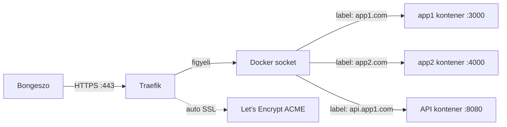

---
tags:
  - devops
  - networking
  - reverse-proxy
datum: 2026-03-06
szint: "🏗️ Builder"
kapcsolodo:
  - "[[cloud/nginx|Nginx]]"
  - "[[cloud/docker-compose|Docker Compose]]"
  - "[[cloud/docker-alapok|Docker alapok]]"
  - "[[cloud/hostinger|Hostinger]]"
  - "[[foundations/halozatok-es-ip-cimek|Hálózatok és IP cimek]]"
---

# Traefik

**Kategoria:** `reverse proxy` / `load balancer` / `edge router`
**URL:** https://traefik.io
**Ar/Terv:** Ingyenes, open source / Traefik Enterprise (fizetos)

---

## Mi ez és mire jó?

> [!tldr] Egy mondatban
> A Traefik egy **Docker-native reverse proxy** -- automatikusan felismeri a futo konténereket, és konfig irasa nelkul iranyitja felejuk a forgalmat. Az SSL tanúsítványt is automatikusan kezeli Let's Encrypt-tel.

Az [[cloud/nginx|Nginx]]-nel manuálisan irsz konfig fájlt minden service-hez. A Traefik-nel a konfig a Docker label-ekben el -- a service-ek magukat "regisztraljak" a proxy-ba indulaskor.

**Mikor jobb mint az Nginx:**
- [[cloud/docker-compose|Docker Compose]]-ban sok service fut, mindegyiknek saját domain/path kell
- Automatikus Let's Encrypt SSL kell, certbot nelkul
- Dinamikus környezet -- service-ek jonnek-mennek (pl. staging/prod egyszerre)
- Nem akarsz minden domain-hoz kulon konfig fájlt irni

**Mikor jobb az [[cloud/nginx|Nginx]]:**
- Egyszerű statikus fájl hosting kell
- Finomhangolt teljesítmény / caching / rate limiting kell
- Nem Docker-és deploymentnel (bare metal, systemd service)
- Ismered az Nginx-et és a Docker label szintaxis idegen

---

## Nginx vs Traefik -- mikor melyik?

| Szempont | Nginx | Traefik |
|---|---|---|
| **Konfig helye** | `/etc/nginx/sites-available/` fájlok | Docker label-ek a `docker-compose.yml`-ben |
| **Új service hozzáadasa** | Új konfig fájl + reload | Label hozzáadasa + `docker compose up` |
| **SSL** | Certbot kezzel, megujitas cron | Automatikus, beepitett ACME |
| **Docker integracio** | Nincs nativ | Teljes -- konténereket figyeli |
| **Statikus fájl** | Nativ, gyors | Nem az erossege |
| **Tanulasi gorbe** | Kozepes (konfig szintaxis) | Alacsony ha Docker-t ismered |
| **Tipikus use case** | VPS, bare metal, statikus site | Docker Compose stack-ek |

---

## Architektúra



A Traefik a Docker sockethez csatlakozik és **valós idoben figyeli** a konténereket. Ha egy konténer elindul a megfelelő label-ekkel, a Traefik automatikusan elkezdi ra iranyitani a forgalmat -- ujrainditas nelkul.

---

## Setup -- lépésrol lépésre

### 1. Alapstruktura

```
/opt/traefik/
├── docker-compose.yml      # Traefik service
├── traefik.yml             # statikus konfig
└── acme.json               # SSL tanusitványok (auto-generalt)
```

```bash
mkdir -p /opt/traefik
cd /opt/traefik
touch acme.json
chmod 600 acme.json  # kötelezö! Let's Encrypt megkoveteli
```

### 2. traefik.yml -- statikus konfig

```yaml
# /opt/traefik/traefik.yml

api:
  dashboard: true        # beepitett web UI

entryPoints:
  web:
    address: ":80"
    http:
      redirections:
        entryPoint:
          to: websecure  # HTTP → HTTPS redirect
          scheme: https
  websecure:
    address: ":443"

certificatesResolvers:
  letsencrypt:
    acme:
      email: te@email.com
      storage: /acme.json
      httpChallenge:
        entryPoint: web

providers:
  docker:
    exposedByDefault: false  # csak label-lel jelolt kontenerek
```

### 3. Traefik docker-compose.yml

```yaml
# /opt/traefik/docker-compose.yml

services:
  traefik:
    image: traefik:v3.0
    restart: unless-stopped
    ports:
      - "80:80"
      - "443:443"
    volumes:
      - /var/run/docker.sock:/var/run/docker.sock:ro  # Docker figyeles
      - ./traefik.yml:/traefik.yml:ro
      - ./acme.json:/acme.json
    networks:
      - proxy

networks:
  proxy:
    external: true  # kulso network, mas compose stack-ek is csatlakoznak
```

```bash
# Kozos Docker network letrehozasa
docker network create proxy

# Traefik inditasa
docker compose up -d
```

### 4. App service label-ekkel

```yaml
# /opt/myapp/docker-compose.yml

services:
  app:
    image: myapp:latest
    networks:
      - proxy                        # csatlakozik a Traefik network-hoz
    labels:
      - "traefik.enable=true"
      - "traefik.http.routers.myapp.rule=Host(`myapp.com`)"
      - "traefik.http.routers.myapp.entrypoints=websecure"
      - "traefik.http.routers.myapp.tls.certresolver=letsencrypt"
      - "traefik.http.services.myapp.loadbalancer.server.port=3000"

networks:
  proxy:
    external: true
```

```bash
docker compose up -d
# Traefik azonnal eszreveszi, SSL tanusitvanyt igenyel, forgalom indul
```

### 5. Több service egy szerveren

```yaml
services:
  frontend:
    image: frontend:latest
    networks: [proxy]
    labels:
      - "traefik.enable=true"
      - "traefik.http.routers.frontend.rule=Host(`myapp.com`)"
      - "traefik.http.routers.frontend.entrypoints=websecure"
      - "traefik.http.routers.frontend.tls.certresolver=letsencrypt"
      - "traefik.http.services.frontend.loadbalancer.server.port=3000"

  api:
    image: api:latest
    networks: [proxy]
    labels:
      - "traefik.enable=true"
      - "traefik.http.routers.api.rule=Host(`api.myapp.com`)"
      - "traefik.http.routers.api.entrypoints=websecure"
      - "traefik.http.routers.api.tls.certresolver=letsencrypt"
      - "traefik.http.services.api.loadbalancer.server.port=8080"

  grafana:
    image: grafana/grafana:latest
    networks: [proxy]
    labels:
      - "traefik.enable=true"
      - "traefik.http.routers.grafana.rule=Host(`grafana.myapp.com`)"
      - "traefik.http.routers.grafana.entrypoints=websecure"
      - "traefik.http.routers.grafana.tls.certresolver=letsencrypt"
      - "traefik.http.services.grafana.loadbalancer.server.port=3000"

networks:
  proxy:
    external: true
```

---

## Middleware -- extra funkciok

A middleware-ek a keres és a service kozott futnak -- auth, redirect, rate limit stb.

### Basic Auth védelem (pl. dashboard, admin felület)

```bash
# Jelszo hash generalasa
echo $(htpasswd -nb admin jelszavam) | sed -e s/\\$/\\$\\$/g
# → admin:$$apr1$$...
```

```yaml
labels:
  - "traefik.http.middlewares.auth.basicauth.users=admin:$$apr1$$..."
  - "traefik.http.routers.dashboard.middlewares=auth"
```

### IP whitelist

```yaml
labels:
  - "traefik.http.middlewares.ipwhitelist.ipwhitelist.sourcerange=100.x.x.x/32"
  - "traefik.http.routers.myapp.middlewares=ipwhitelist"
```

> [!tip] IP whitelist + Tailscale
> A Traefik IP whitelist middleware-rel és Tailscale IP-vel konnyen vedhetsz belső service-eket (pl. Grafana, admin panelek) -- csak a Tailscale hálózatbol elérheto.

---

## Traefik Dashboard

```yaml
# Traefik sajat dashboard-ja domain-en
labels:
  - "traefik.enable=true"
  - "traefik.http.routers.dashboard.rule=Host(`traefik.mydomain.com`)"
  - "traefik.http.routers.dashboard.service=api@internal"
  - "traefik.http.routers.dashboard.entrypoints=websecure"
  - "traefik.http.routers.dashboard.tls.certresolver=letsencrypt"
  - "traefik.http.routers.dashboard.middlewares=auth"  # vedd jelszoval!
```

---

## Buktatok

> [!bug] `acme.json` permission
> Ha az `acme.json`-on nem `chmod 600` van, a Traefik nem indul el és/vagy a Let's Encrypt nem működik. Ez a leggyakoribb hiba first-time setup-nal.

> [!warning] `exposedByDefault: false`
> Mindig allitsd be! Alapbol a Traefik **minden** konténert expose-ol. `false`-szal csak a `traefik.enable=true` label-és service-ek latszanak kivulrol.

> [!warning] Let's Encrypt rate limit
> Let's Encrypt production-nal van 5 tanúsítvány/domain/het limit. Tesztelés kozben használd a staging ACME szervert: `caServer: https://acme-staging-v02.api.letsencrypt.org/directory` -- ez nem er bele a limitbe, de a tanúsítvány nem trusted.

> [!bug] Több `docker-compose.yml` -- network csatlakozas
> Ha az app egy kulon `docker-compose.yml`-ben van (nem ugyanabban mint a Traefik), kötelező a kozos `proxy` external network. Különben a Traefik látja a label-t, de nem tud csatlakozni a konténerhez → 502.

---

## Hasznos parancsok

```bash
# Traefik logok
docker compose logs -f traefik

# Osszes futo route megjelenitese (API-n keresztul)
curl http://localhost:8080/api/http/routers | jq

# acme.json -- tanusitvany allapot olvashatoan
cat /opt/traefik/acme.json | jq '.letsencrypt.Certificates[].domain'
```

---

## Hasznos linkek

- Docs: https://doc.traefik.io/traefik/
- Getting Started (Docker): https://doc.traefik.io/traefik/getting-started/quick-start/
- Middleware referencia: https://doc.traefik.io/traefik/middlewares/overview/

---

## Kapcsolodo

- [[cloud/nginx|Nginx]] -- alternativa, jobb statikus fájlokhoz és nem-Docker deploymentnel
- [[cloud/docker-compose|Docker Compose]] -- Traefik Docker Compose stack-ekkel működik a legjobban
- [[cloud/docker-alapok|Docker alapok]] -- Traefik a Docker socket-en keresztul ismeri fel a konténereket
- [[cloud/hostinger|Hostinger]] -- a VPS ahol a Traefik fut
- Grafana -- Traefik mögé teheto, IP whitelist middleware-rel vedheto
