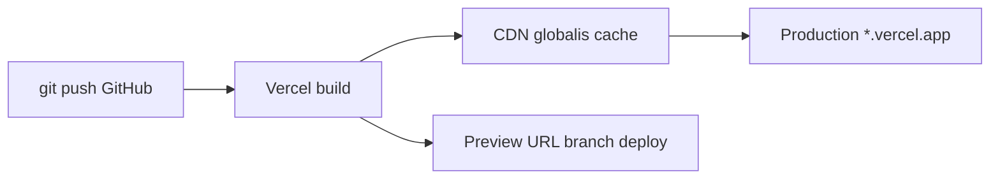

---
tags:
  - hosting
  - deployment
  - vercel
datum: 2026-03-06
szint: "🧱 Brick"
kapcsolodo:
  - "[[database/supabase|Supabase]]"
  - "[[cloud/railway|Railway]]"
  - "[[cloud/cloudflare|Cloudflare]]"
  - "[[frontend/nextjs|Next.js]]"
  - "[[backend/clerk|Clerk]]"
  - "[[foundations/git-es-github|Git es GitHub]]"
  - "[[cloud/deployment-checklist|Deployment checklist]]"
  - "[[_moc/moc-deployment|MOC - Deployment]]"
---

# Vercel

**Kategoria:** `hosting`
**URL:** https://vercel.com
**Ar/Terv:** Hobby (ingyenes) / Pro ($20/ho)

---

## Mi ez es mire jo?

A Vercel egy **frontend hosting platform**, ami arra van optimalizalva hogy [[frontend/nextjs|Next.js]] (es mas frontend framework) appokat a leheto legegyszerubben deployolj. Push-olsz [[foundations/git-es-github|Git es GitHub]]-ra → automatikusan buildel es deployol.

**Egyszeruen:** A Vercel az ahol az appod el es a felhasznalok elerik.

**Mikor hasznald:**
- Next.js app hosting (erre a legjobb, ok csinaltak a Next.js-t)
- Statikus oldalak, landing page-ek
- Ha gyors, globalis CDN kell
- Ha nem akarsz szerver konfiguracioval foglalkozni

**Mikor NE hasznald:**
- Ha hosszan futo backend processek kellenek (erre [[cloud/railway|Railway]] jobb)
- Ha sajat adatbazist akarsz futtatni (erre [[database/supabase|Supabase]] vagy [[cloud/railway|Railway]])
- Ha a Serverless Functions 10s/60s timeout limit nem eleg

**Alternativak:** Netlify, [[cloud/cloudflare|Cloudflare]] Pages, [[cloud/railway|Railway]], Fly.io

---

## Deploy flow



---

## Setup -- lepesrol lepesre

### 1. Regisztracio
- Menj a vercel.com-ra → Sign up GitHub-bal
- Ez a legegyszerubb, mert automatikusan latja a repoidat

### 2. Projekt importalasa
- Dashboard → "Add New Project"
- Valaszd ki a GitHub repot
- Vercel automatikusan felismeri hogy Next.js projekt → beallitja a build parancsot
- Kattints "Deploy"

### 3. Environment valtozok beallitasa
- Project Settings → Environment Variables
- Ide kerulnek: `DATABASE_URL`, `NEXT_PUBLIC_SUPABASE_URL`, API kulcsok, stb.
- **Fontos:** Kulon allitsd be Production / Preview / Development kornyezetekre

### 4. Domain hozzaadasa
- Project Settings → Domains
- Add meg a sajat domained → Vercel ad DNS beallitasi utmutatot
- HTTPS automatikusan bekapcsol

---

## Best Practices

### Architektura / Struktura

- **Egy repo = egy Vercel projekt** -- ne tegyel tobb appot egy repoba
- Az `app/` vagy `pages/` konyvtarban levo route-ok automatikusan API endpointok is lehetnek (`app/api/`)
- Serverless Functions = az `api/` mappaban levo fajlok, minden request kulon indul

### Biztonsag

- **Soha ne tedd a `.env` fajlt GitHubra** -- `.gitignore`-ban legyen
- Environment valtozokat a Vercel dashboardon allitsd be, NE a kodban
- A `NEXT_PUBLIC_` prefixu valtozok a **kliens oldali kodba** is bekerulnek -- ide NE tegyel titkos kulcsokat
- Hasznalj Preview deploymenteket (branch push) tesztelesre, ne eles production-t

### Teljesitmeny

- Vercel globalis CDN-t hasznal -- a statikus tartalom automatikusan cache-elve van vilagszerte
- Hasznalj `next/image`-et kepekhez -- automatikus optimalizalas
- ISR (Incremental Static Regeneration) -- az oldal statikusan buildel, de hatterben frissul

### Koltsegoptimalizalas

- Hobby tier ingyenes egyeni projektekhez
- Figyelj a Serverless Function hivasok szamara -- sok API hivas = magasabb szamla Pro-n
- A Bandwidth limit (100GB/ho Hobby-n) eleg a legtobb kisebb projekthez
- Ha tul sokat fizetsz → vizsgald meg hogy nem hiv-e feleslegesen API-t a frontend

---

## Gyakori mintak / Hasznalati esetek

### 1. Next.js fullstack app + Supabase

```
Vercel (frontend + API routes) ←→ Supabase (adatbazis + auth)
```
A leggyakoribb setup. A frontend es az API a Vercelen, az adat a Supabase-ben.

### 2. Landing page / marketing oldal

Egyszeru statikus oldal, gyors deploy, preview URL-ek minden PR-hez.

### 3. Monorepo tobb app-pal

Turborepo + Vercel -- egy repoban tobb app, Vercel mindegyiket kulon deployolja.

---

## Buktatok es hibak amiket elkerulj

- **Serverless Function timeout:** Hobby = 10s, Pro = 60s. Ha ennel tobbre van szukseg (video feldolgozas, nagy AI hivas), hasznalj [[cloud/railway|Railway]]-t backend-nek
- **Cold start:** Ha a function regota nem futott, az elso keres lassabb. Nem tudsz vele sokat tenni, de erdemes tudni
- **Build hiba:** Ha lokalisan megy de Vercelen nem → ellenorizd az env valtozokat (production-ben masok kellenek mint dev-ben)
- **A `node_modules` nem megy fel** -- a Vercel maga installalja. Ha valami hianyzik, a `package.json`-ban kell legyen

---

## Hasznos parancsok / kodreszletek

```bash
# Vercel CLI telepites
npm i -g vercel

# Lokalis dev a Vercel environment valtozokkal
vercel env pull .env.local
vercel dev

# Manualis deploy (ha nem GitHub integracioval megy)
vercel              # preview deploy
vercel --prod       # production deploy

# Logok megnezes
vercel logs projekt-neve.vercel.app
```

---

## Hasznos linkek

- Docs: https://vercel.com/docs
- Dashboard: https://vercel.com/dashboard
- Kozosseg: https://github.com/vercel/next.js/discussions
- Statusz oldal: https://www.vercel-status.com

---

## Kapcsolodo anyagok
- [[database/supabase|Supabase]]
- [[cloud/railway|Railway]]
- [[cloud/cloudflare|Cloudflare]] -- edge-alapu alternativa, $5/ho
- [[cloud/nextjs-on-cloudflare-workers|Next.js on Cloudflare Workers]] -- Next.js futtatasa CF Workers-on, Vercel nelkul ($5/ho)
- [[frontend/nextjs|Next.js]]
- [[backend/clerk|Clerk]]
- [[foundations/git-es-github|Git es GitHub]]
- [[cloud/deployment-checklist|Deployment checklist]]
- Env valtozok Next.js-ben
- [[_moc/moc-deployment|MOC - Deployment]]
