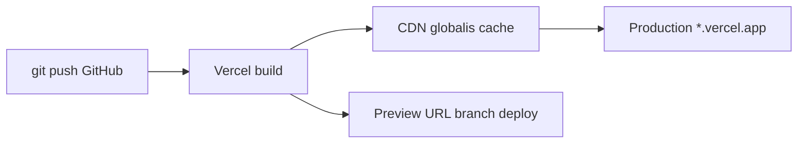

---
tags:
  - hosting
  - deployment
  - vercel
datum: 2026-03-06
szint: "🧱 Scout"
kapcsolodo:
  - "[[database/supabase|Supabase]]"
  - "[[cloud/railway|Railway]]"
  - "[[cloud/cloudflare|Cloudflare]]"
  - "[[frontend/nextjs|Next.js]]"
  - "[[backend/clerk|Clerk]]"
  - "[[foundations/git-es-github|Git és GitHub]]"
  - "[[cloud/deployment-checklist|Deployment checklist]]"
  - "[[_moc/moc-deployment|MOC - Deployment]]"
---

# Vercel

**Kategoria:** `hosting`
**URL:** https://vercel.com
**Ar/Terv:** Hobby (ingyenes) / Pro ($20/hó)

---

## Mi ez és mire jó?

A Vercel egy **frontend hosting platform**, ami arra van optimalizálva hogy [[frontend/nextjs|Next.js]] (és mas frontend framework) appokat a lehető legegyszerubben deployolj. Push-olsz [[foundations/git-es-github|Git és GitHub]]-ra → automatikusan buildel és deployol.

**Egyszerűen:** A Vercel az ahol az appod el és a felhasználók elérik.

**Mikor használd:**
- Next.js app hosting (erre a legjobb, ok csináltak a Next.js-t)
- Statikus oldalak, landing page-ek
- Ha gyors, globális CDN kell
- Ha nem akarsz szerver konfigurácioval foglalkozni

**Mikor NE használd:**
- Ha hosszan futo backend processek kellenek (erre [[cloud/railway|Railway]] jobb)
- Ha saját adatbázist akarsz futtatni (erre [[database/supabase|Supabase]] vagy [[cloud/railway|Railway]])
- Ha a Serverless Functions 10s/60s timeout limit nem eleg

**Alternativak:** Netlify, [[cloud/cloudflare|Cloudflare]] Pages, [[cloud/railway|Railway]], Fly.io

---

## Deploy flow



---

## Setup -- lépésrol lépésre

### 1. Regisztrácio
- Menj a vercel.com-ra → Sign up GitHub-bal
- Ez a legegyszerubb, mert automatikusan látja a repoidat

### 2. Projekt importalasa
- Dashboard → "Add New Project"
- Valaszd ki a GitHub repot
- Vercel automatikusan felismeri hogy Next.js projekt → beállítja a build parancsot
- Kattints "Deploy"

### 3. Environment változók beállítása
- Project Settings → Environment Variables
- Ide kerulnek: `DATABASE_URL`, `NEXT_PUBLIC_SUPABASE_URL`, API kulcsok, stb.
- **Fontos:** Kulon allitsd be Production / Preview / Development környezetekre

### 4. Domain hozzáadasa
- Project Settings → Domains
- Add még a saját domained → Vercel ad DNS beállítási utmutatot
- HTTPS automatikusan bekapcsol

---

## Best Practices

### Architektúra / Struktúra

- **Egy repo = egy Vercel projekt** -- ne tegyel több appot egy repoba
- Az `app/` vagy `pages/` könyvtárban levo route-ok automatikusan API endpointok is lehetnek (`app/api/`)
- Serverless Functions = az `api/` mappaban levo fájlok, minden request kulon indul

### Biztonság

- **Soha ne tedd a `.env` fájlt GitHubra** -- `.gitignore`-ban legyen
- Environment változókat a Vercel dashboardon allitsd be, NE a kódban
- A `NEXT_PUBLIC_` prefixu változók a **kliens oldali kódba** is bekerulnek -- ide NE tegyel titkos kulcsokat
- Használj Preview deploymenteket (branch push) tesztelésre, ne éles production-t

### Teljesítmény

- Vercel globális CDN-t használ -- a statikus tartalom automatikusan cache-elve van vilagszerte
- Használj `next/image`-et kepekhez -- automatikus optimalizálas
- ISR (Incremental Static Regeneration) -- az oldal statikusan buildel, de háttérben frissül

### Költségoptimalizalas

- Hobby tier ingyenes egyeni projektekhez
- Figyelj a Serverless Function hivasok szamara -- sok API hivas = magasabb szamla Pro-n
- A Bandwidth limit (100GB/hó Hobby-n) eleg a legtobb kisebb projekthez
- Ha tul sokat fizetsz → vizsgald még hogy nem hiv-e feleslegesen API-t a frontend

---

## Gyakori mintak / Használati esetek

### 1. Next.js fullstack app + Supabase

```
Vercel (frontend + API routes) ←→ Supabase (adatbazis + auth)
```
A leggyakoribb setup. A frontend és az API a Vercelen, az adat a Supabase-ben.

### 2. Landing page / marketing oldal

Egyszerű statikus oldal, gyors deploy, preview URL-ek minden PR-hez.

### 3. Monorepo több app-pal

Turborepo + Vercel -- egy repoban több app, Vercel mindegyiket kulon deployolja.

---

## Buktatok és hibak amiket elkerülj

- **Serverless Function timeout:** Hobby = 10s, Pro = 60s. Ha ennel többre van szükség (video feldolgozas, nagy AI hivas), használj [[cloud/railway|Railway]]-t backend-nek
- **Cold start:** Ha a function régóta nem futott, az első keres lassabb. Nem tudsz vele sokat tenni, de érdemes tudni
- **Build hiba:** Ha lokálisan megy de Vercelen nem → ellenőrizd az env változókat (production-ben masok kellenek mint dev-ben)
- **A `node_modules` nem megy fel** -- a Vercel maga installalja. Ha valami hianyzik, a `package.json`-ban kell legyen

---

## Hasznos parancsok / kodreszletek

```bash
# Vercel CLI telepites
npm i -g vercel

# Lokalis dev a Vercel environment valtozokkal
vercel env pull .env.local
vercel dev

# Manualis deploy (ha nem GitHub integracioval megy)
vercel              # preview deploy
vercel --prod       # production deploy

# Logok megnezes
vercel logs projekt-neve.vercel.app
```

---

## Hasznos linkek

- Docs: https://vercel.com/docs
- Dashboard: https://vercel.com/dashboard
- Kozosseg: https://github.com/vercel/next.js/discussions
- Statusz oldal: https://www.vercel-status.com

---

## Kapcsolodo anyagok
- [[database/supabase|Supabase]]
- [[cloud/railway|Railway]]
- [[cloud/cloudflare|Cloudflare]] -- edge-alapu alternativa, $5/hó
- [[cloud/nextjs-on-cloudflare-workers|Next.js on Cloudflare Workers]] -- Next.js futtatasa CF Workers-on, Vercel nelkul ($5/hó)
- [[frontend/nextjs|Next.js]]
- [[backend/clerk|Clerk]]
- [[foundations/git-es-github|Git és GitHub]]
- [[cloud/deployment-checklist|Deployment checklist]]
- Env változók Next.js-ben
- [[_moc/moc-deployment|MOC - Deployment]]
