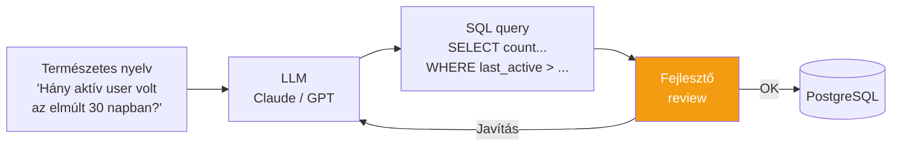
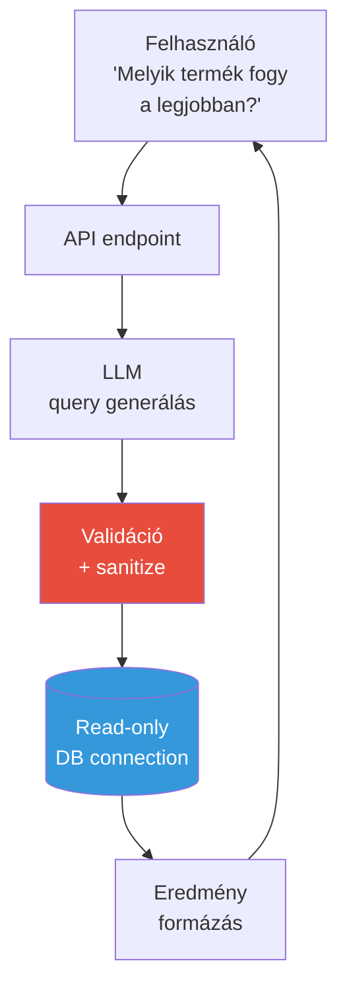

---
tags:
  - adatbazis
  - ai
  - sql
datum: 2026-03-06
szint: "🧱 Scout"
kapcsolodo:
  - "[[database/sql-adatbazisok|SQL adatbázisok]]"
  - "[[database/sql-index-szabalyok|SQL Index szabályok]]"
  - "[[database/supabase|Supabase]]"
  - "[[toolbox/ai-first-fejlesztoi-workflow|AI-first fejlesztői workflow]]"
  - "[[_moc/moc-database|MOC - Database]]"
---

# AI-generált SQL

## Összefoglaló

Az LLM-ek (Large Language Models) remekül írnak SQL-t — de **vakon bízni bennük production-ben veszélyes**. Ez a jegyzet megmutatja, hogyan használd az AI-t SQL query íráshoz hatékonyan, milyen mintákat érdemes követni a "natural language to SQL" megoldásoknál, és mire figyelj.

## A workflow



## Hogyan adj kontextust az LLM-nek?

Az LLM csak annyira jó SQL-t ír, amennyire jól leírod neki az adatbázis struktúráját. Minél több kontextust adsz, annál pontosabb lesz.

### Séma leírás a promptban

```
Az adatbázis PostgreSQL. A séma:

CREATE TABLE users (
  id uuid PRIMARY KEY,
  email text UNIQUE NOT NULL,
  name text,
  plan text DEFAULT 'free',  -- 'free', 'pro', 'enterprise'
  created_at timestamptz DEFAULT now(),
  last_active_at timestamptz
);

CREATE TABLE orders (
  id uuid PRIMARY KEY,
  user_id uuid REFERENCES users(id),
  total numeric(10,2) NOT NULL,
  status text DEFAULT 'pending',  -- 'pending', 'completed', 'cancelled'
  created_at timestamptz DEFAULT now()
);

Kérdés: Melyik 10 pro user költötte a legtöbbet az elmúlt 90 napban?
```

### Eredmény

```sql
SELECT
  u.name,
  u.email,
  SUM(o.total) AS total_spent,
  COUNT(o.id) AS order_count
FROM users u
JOIN orders o ON o.user_id = u.id
WHERE u.plan = 'pro'
  AND o.status = 'completed'
  AND o.created_at > now() - INTERVAL '90 days'
GROUP BY u.id, u.name, u.email
ORDER BY total_spent DESC
LIMIT 10;
```

> [!tip] A séma legyen a CLAUDE.md-ben vagy a projekt kontextusban
> Ha az [[toolbox/ai-first-fejlesztoi-workflow|AI-first fejlesztői workflow]]-t követed, a `CLAUDE.md` fájlba vagy egy `docs/schema.sql` fájlba tedd a séma leírást. Így a Claude Code automatikusan ismeri az adatmodellt és jobb query-ket ír.

## Prompt minták amik működnek

### 1. Reporting query-k

```
Írj egy SQL query-t ami megmutatja:
- Havi bontásban a regisztrációk számát
- Az elmúlt 12 hónapra
- Csak a nem törölt felhasználókat (deleted_at IS NULL)
- Formatáld a hónapot YYYY-MM formátumban
```

### 2. Migration generálás

```
Írj egy PostgreSQL migration-t ami:
1. Hozzáad egy 'status' oszlopot az orders táblához (text, default 'pending')
2. Backfill-eli a meglévő sorokat 'completed' értékkel ahol paid_at NOT NULL
3. Hozzáad egy indexet a (user_id, status) kombinációra
4. Zero-downtime legyen (CONCURRENTLY index)
```

### 3. Teljesítmény optimalizálás

```
Ez a query lassú (2.3 sec, 500K sor). Optimalizáld:

EXPLAIN ANALYZE eredmény:
[ide másold az EXPLAIN ANALYZE outputot]

A séma:
[ide a CREATE TABLE]

Meglévő indexek:
[ide a pg_indexes output]
```

### 4. RLS policy generálás

```
Írj RLS policy-kat az orders táblához:
- A user csak a saját rendeléseit lássa
- Admin role mindent lát
- Service role bypass
- A Supabase auth.uid() és auth.jwt() függvényeket használd
```

## Natural Language to SQL alkalmazásokban

Ha az alkalmazásodban a végfelhasználó kérdez természetes nyelven és az LLM SQL-t generál, ezeket a biztonsági szabályokat tartsd be:

### Biztonsági szabályok

```typescript
// ❌ SOHA — raw LLM output futtatása
const query = await llm.generate(`SQL query: ${userQuestion}`)
await db.execute(query)  // SQL injection, DROP TABLE, stb.

// ✅ Validáció és korlátozás
async function safeNLtoSQL(userQuestion: string) {
  const systemPrompt = `
    Te egy SQL generátor vagy. SZABÁLYOK:
    - CSAK SELECT query-t generálhatsz
    - NEM használhatsz: DROP, DELETE, UPDATE, INSERT, ALTER, TRUNCATE
    - CSAK ezeket a táblákat érheted el: orders, products
    - Maximum 1000 sort adjon vissza (LIMIT 1000)
    - Generálj CSAK a nyers SQL query-t, semmi mást
  `

  const query = await llm.generate(systemPrompt, userQuestion)

  // Második védelmi vonal: regex validáció
  if (/\b(DROP|DELETE|UPDATE|INSERT|ALTER|TRUNCATE|GRANT)\b/i.test(query)) {
    throw new Error('Tiltott SQL művelet')
  }

  // Harmadik védelmi vonal: read-only DB user
  return readOnlyDb.execute(query)
}
```

> [!warning] Mindig read-only DB user-rel futtasd
> Ha az alkalmazás LLM-generált SQL-t futtat, **soha ne a fő alkalmazás DB user-rel** csináld. Hozz létre egy read-only user-t akinek csak `SELECT` joga van a publikus táblákon.

```sql
-- Read-only user az LLM-generált query-khez
CREATE ROLE llm_reader WITH LOGIN PASSWORD 'safe_password';
GRANT USAGE ON SCHEMA public TO llm_reader;
GRANT SELECT ON orders, products, categories TO llm_reader;
-- Semmi más: nincs INSERT, UPDATE, DELETE, DDL
```

### Architektúra



## Mikor használd / Mikor NE

| Mikor IGEN | Mikor NE |
|-----------|----------|
| Fejlesztői workflow: gyors query írás, debug | Production: LLM output közvetlen futtatása validáció nélkül |
| Reporting / analytics dashboard | Write műveletek generálása (INSERT, UPDATE) |
| Ad-hoc adatelemzés (egyszer lefutó query) | Ha az adatbázis séma titkos / bizalmas |
| Migration / index generálás (review után) | Ha pontos, determinisztikus eredmény kell |
| SQL tanulás és megértés | Ha a felhasználó nem bízható (publikus API) |

## Eszközök

| Eszköz | Mire jó |
|--------|---------|
| **Claude Code** | Projekt kontextusban SQL generálás, séma ismeretével |
| **Supabase AI** | SQL Editor-ban természetes nyelvű query generálás |
| **Prisma AI** | [[database/prisma|Prisma]] query generálás természetes nyelven |
| **Cursor / Copilot** | IDE-ben inline SQL javaslatok |
| **AskYourDatabase** | Vizuális NL-to-SQL tool PostgreSQL-hez |

## Kapcsolódó

- [[database/sql-adatbazisok|SQL adatbázisok]] — SQL alapok amire az LLM-generált query-k épülnek
- [[database/sql-index-szabalyok|SQL Index szabályok]] — az EXPLAIN ANALYZE értelmezése AI segítségével
- [[database/supabase|Supabase]] — Supabase AI SQL Editor
- [[toolbox/ai-first-fejlesztoi-workflow|AI-first fejlesztői workflow]] — AI-first fejlesztés, ahol az SQL generálás egy része
- [[_moc/moc-database|MOC - Database]]
