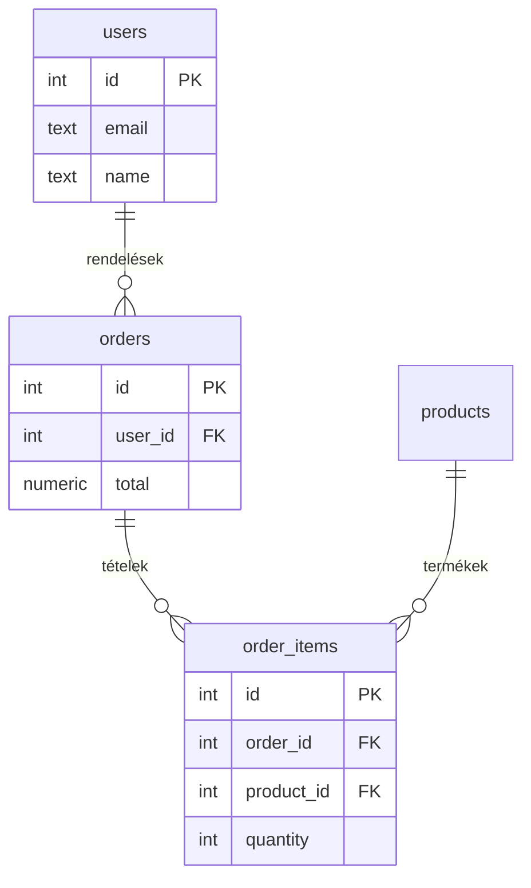

---
tags:
  - adatbazis
  - sql
datum: 2026-03-06
szint: "🧱 Brick"
kapcsolodo:
  - "[[database/sql-adatbazisok|SQL adatbázisok]]"
  - "[[database/sql-index-szabalyok|SQL Index szabályok]]"
  - "[[database/supabase|Supabase]]"
  - "[[database/prisma|Prisma]]"
  - "[[database/drizzle|Drizzle]]"
  - "[[_moc/moc-database|MOC - Database]]"
---

# Database design patterns

## Összefoglaló

Az adatbázis tervezés határozza meg, hogy a rendszered **gyors, karbantartható és skálázható** lesz-e — vagy egy lassuló, összegubancolódó katasztrófa. Ez a jegyzet a három legfontosabb pattern-t mutatja be: **normalizálás**, **denormalizálás** és **soft delete**.

## Normalizálás

A normalizálás lényege: **minden adat pontosan egy helyen legyen tárolva**, és relációk (foreign key-ek) kössék össze a táblákat.

### Normálformák (a gyakorlatban)

| Forma | Szabály | Példa |
|-------|---------|-------|
| **1NF** | Nincsenek ismétlődő csoportok, minden mező atomi | `tags: "a,b,c"` helyett külön tábla |
| **2NF** | Minden nem-kulcs mező a teljes kulcstól függ | Ne tárold az ügyfél nevét a rendelés táblában |
| **3NF** | Nincs tranzitív függés | Ha `city` meghatározza `country`-t, az külön tábla |

> [!tip] Gyakorlatban 3NF elég
> A legtöbb webes alkalmazásnál a **3NF** (Third Normal Form) elegendő. A magasabb normálformák (BCNF, 4NF, 5NF) főleg akadémiai érdekességek.

### Normalizált séma példa

```sql
-- Normalizált: minden adat egy helyen
CREATE TABLE users (
  id serial PRIMARY KEY,
  email text UNIQUE NOT NULL,
  name text NOT NULL
);

CREATE TABLE orders (
  id serial PRIMARY KEY,
  user_id integer REFERENCES users(id),
  total numeric(10,2) NOT NULL,
  created_at timestamptz DEFAULT now()
);

CREATE TABLE order_items (
  id serial PRIMARY KEY,
  order_id integer REFERENCES orders(id),
  product_id integer REFERENCES products(id),
  quantity integer NOT NULL,
  unit_price numeric(10,2) NOT NULL
);
```



**Előnyök:**
- Nincs adatduplikáció — frissítés egy helyen
- Konzisztencia garantált
- Kisebb táblaméretek

**Hátrányok:**
- Sok JOIN kell a lekérdezésekhez
- Olvasási teljesítmény romolhat komplex query-knél

## Denormalizálás

A denormalizálás **tudatos döntés**: az olvasási teljesítményért cserébe elfogadod az adatduplikációt. Nem hiba — stratégia.

### Mikor denormalizálj?

```
Normalizálás → "tervezz helyesen"
Denormalizálás → "gyorsítsd az olvasást, ahol kell"
```

| Mikor IGEN | Mikor NE |
|-----------|----------|
| Read-heavy rendszer (10:1 olvasás:írás arány) | Write-heavy rendszer (gyakori frissítés) |
| Komplex JOIN-ok lassítanak | Kis tábla, kevés adat |
| Dashboard / reporting query-k | Ha nincs mérésed hogy a JOIN lassú |
| Cache-elhető összesítések | Ha a konzisztencia kritikus (pénzügyi adat) |

### Denormalizálás példák

```sql
-- 1. Kalkulált mező cache-elése
-- Normalizált: minden lekérdezésnél COUNT-olni kell
SELECT u.*, (SELECT count(*) FROM orders WHERE user_id = u.id) as order_count
FROM users u;

-- Denormalizált: az orders_count a users táblában
ALTER TABLE users ADD COLUMN orders_count integer DEFAULT 0;

-- Trigger ami frissíti
CREATE OR REPLACE FUNCTION update_orders_count()
RETURNS TRIGGER AS $$
BEGIN
  IF TG_OP = 'INSERT' THEN
    UPDATE users SET orders_count = orders_count + 1
    WHERE id = NEW.user_id;
  ELSIF TG_OP = 'DELETE' THEN
    UPDATE users SET orders_count = orders_count - 1
    WHERE id = OLD.user_id;
  END IF;
  RETURN NULL;
END;
$$ LANGUAGE plpgsql;

CREATE TRIGGER orders_count_trigger
AFTER INSERT OR DELETE ON orders
FOR EACH ROW EXECUTE FUNCTION update_orders_count();
```

```sql
-- 2. Snapshot mentés (rendelésnél a termék aktuális ára)
CREATE TABLE order_items (
  id serial PRIMARY KEY,
  order_id integer REFERENCES orders(id),
  product_id integer REFERENCES products(id),
  quantity integer NOT NULL,
  unit_price numeric(10,2) NOT NULL,  -- ár snapshot a rendeléskor
  product_name text NOT NULL          -- név snapshot
);
-- Ha a termék ára változik, a korábbi rendelések érintetlenek maradnak
```

> [!warning] Denormalizálásnál a konzisztenciát TE tartod karban
> Ha denormalizált adatot tartasz, biztosítanod kell, hogy szinkronban maradjon. Triggerek, batch job-ok, vagy alkalmazás-szintű logika kell hozzá.

## Soft delete

A **soft delete** azt jelenti, hogy törléskor nem `DELETE`-olsz, hanem egy `deleted_at` mezőt állítasz be. Az adat megmarad az adatbázisban, de az alkalmazás szűri.

### Implementáció

```sql
-- Soft delete oszlop
ALTER TABLE users ADD COLUMN deleted_at timestamptz;

-- "Törlés" = timestamp beállítása
UPDATE users SET deleted_at = now() WHERE id = 42;

-- Lekérdezéseknél szűrés
SELECT * FROM users WHERE deleted_at IS NULL;

-- Partial index: csak az aktív rekordokat indexeli
CREATE INDEX idx_users_active ON users(email) WHERE deleted_at IS NULL;
```

### ORM-ben (Prisma / Drizzle)

```typescript
// Drizzle: soft delete middleware-szerű megoldás
import { isNull } from 'drizzle-orm'

// Mindig szűrd a törölt rekordokat
const activeUsers = await db
  .select()
  .from(users)
  .where(isNull(users.deletedAt))
```

```typescript
// Prisma: middleware-rel automatizálható
// prisma/schema.prisma
model User {
  id        String    @id @default(cuid())
  email     String    @unique
  deletedAt DateTime? @map("deleted_at")
}
```

### Mikor használd / Mikor NE

| Mikor IGEN | Mikor NE |
|-----------|----------|
| Audit trail kell (ki mit törölt, mikor) | GDPR — a felhasználó valódi törlést kér |
| "Kuka" funkció (visszaállítás lehetőség) | Nagyon sok adat — a tábla nő, sosem csökken |
| Kaszkád törlés kerülése (referenciák megmaradnak) | Egyszerű rendszer, nincs szükség visszaállításra |
| SaaS: subscription törlés → adat megőrzés X napig | Ha elfelejtesz mindenhol szűrni → régi adat szivárog |

> [!warning] Soft delete buktatók
> - **Unique constraint**: ha `email` unique, a "törölt" user email-je blokkolja az újraregisztrációt. Megoldás: partial unique index: `CREATE UNIQUE INDEX ON users(email) WHERE deleted_at IS NULL;`
> - **Elfelejtett szűrés**: ha egy helyen elfelejtesz `WHERE deleted_at IS NULL`-t, törölt adat jelenik meg. Middleware vagy view-val automatizáld.

## Egyéb hasznos pattern-ek

### Timestamps minden táblán

```sql
CREATE TABLE posts (
  id serial PRIMARY KEY,
  title text NOT NULL,
  created_at timestamptz DEFAULT now(),
  updated_at timestamptz DEFAULT now()
);

-- updated_at trigger
CREATE OR REPLACE FUNCTION set_updated_at()
RETURNS TRIGGER AS $$
BEGIN
  NEW.updated_at = now();
  RETURN NEW;
END;
$$ LANGUAGE plpgsql;

CREATE TRIGGER set_posts_updated_at
BEFORE UPDATE ON posts
FOR EACH ROW EXECUTE FUNCTION set_updated_at();
```

### UUID vs serial ID

```sql
-- Serial: egyszerű, sorrendben növekszik — de kitalálható
id serial PRIMARY KEY

-- UUID: globálisan egyedi — API-ban nem lehet "következő ID-t" kitalálni
id uuid PRIMARY KEY DEFAULT gen_random_uuid()
```

Az [[database/supabase|Supabase]] és a [[database/prisma|Prisma]] is UUID-t vagy `cuid()`-t preferálja az auto-increment helyett.

## Kapcsolódó

- [[database/sql-adatbazisok|SQL adatbázisok]] — SQL alapok és adatbázis választás
- [[database/sql-index-szabalyok|SQL Index szabályok]] — indexek a design pattern-ekhez
- [[database/supabase|Supabase]] — RLS + trigger-ek a Supabase-ben
- [[database/prisma|Prisma]] — séma design Prisma-ban
- [[database/drizzle|Drizzle]] — séma design Drizzle-ben
- [[_moc/moc-database|MOC - Database]]
