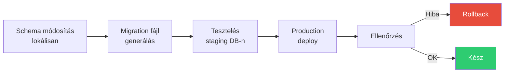

---
tags:
  - adatbazis
  - devops
  - deployment
datum: 2026-03-06
szint: "🏗️ Builder"
kapcsolodo:
  - "[[database/prisma|Prisma]]"
  - "[[database/drizzle|Drizzle]]"
  - "[[database/supabase|Supabase]]"
  - "[[database/sql-adatbazisok|SQL adatbázisok]]"
  - "[[cloud/ci-cd-pipelines|CI/CD Pipelines]]"
  - "[[_moc/moc-database|MOC - Database]]"
---

# Database migration stratégiák

## Összefoglaló

A **database migration** az adatbázis sémájának verziókezelt, reprodukálható módosítása. Amíg lokálisan dolgozol, nyugodtan drobolhatod a DB-t és újraépítheted — de production-ben egyetlen rossz migration leállíthatja a rendszert. Ez a jegyzet arról szól, hogyan csinálj **zero-downtime** migrációkat és hogyan tervezz **rollback** stratégiát.

## A migration workflow



## ORM-specifikus migration toolok

### Prisma

A [[database/prisma|Prisma]] `prisma migrate` paranccsal kezeli a migrációkat:

```bash
# 1. Schema módosítás → migration generálás (dev)
npx prisma migrate dev --name add_status_to_orders

# 2. Production deploy (csak alkalmaz, nem generál)
npx prisma migrate deploy

# 3. Migration státusz ellenőrzése
npx prisma migrate status
```

### Drizzle

A [[database/drizzle|Drizzle]] `drizzle-kit` toolja:

```bash
# 1. Schema módosítás → migration SQL generálás
npx drizzle-kit generate

# 2. Gyors dev push (migration fájl nélkül)
npx drizzle-kit push

# 3. Production migration alkalmazás
npx drizzle-kit migrate
```

### Supabase

A [[database/supabase|Supabase]] CLI-vel:

```bash
# 1. Új migration fájl létrehozása
supabase migration new add_status_column

# 2. SQL migration megírása (supabase/migrations/xxxxx_add_status_column.sql)
# 3. Lokális alkalmazás
supabase db reset

# 4. Production push
supabase db push
```

## Zero-downtime migration szabályok

A cél: a migration **ne állítsa le az alkalmazást** és **ne veszítsen adatot**. Ehhez az **expand-contract** mintát használd.

### Az expand-contract minta

```
1. EXPAND  — új oszlop/tábla hozzáadása (régi megmarad)
2. MIGRATE — adat átmásolása az új struktúrába
3. CODE    — alkalmazás kód frissítése (mindkettőt olvassa/írja)
4. CONTRACT — régi oszlop/tábla eltávolítása (ha már nincs rá szükség)
```

### Biztonságos műveletek (zero-downtime)

```sql
-- ✅ Új oszlop hozzáadása (nem blokkoló)
ALTER TABLE orders ADD COLUMN status text DEFAULT 'pending';

-- ✅ Új tábla létrehozása
CREATE TABLE order_events (...);

-- ✅ Új index CONCURRENTLY (nem blokkol)
CREATE INDEX CONCURRENTLY idx_orders_status ON orders(status);

-- ✅ Nullable oszlop hozzáadása
ALTER TABLE users ADD COLUMN phone text;
```

### Veszélyes műveletek (downtime-ot okozhat)

```sql
-- ⚠️ Oszlop törlése — ha a kód még használja, elszáll
ALTER TABLE orders DROP COLUMN old_status;

-- ⚠️ Oszlop átnevezése — minden query elszáll ami a régi nevet használja
ALTER TABLE orders RENAME COLUMN status TO order_status;

-- ⚠️ Típus változtatás — lock-olhatja a táblát nagy tábláknál
ALTER TABLE orders ALTER COLUMN amount TYPE numeric(12,2);

-- ⚠️ NOT NULL hozzáadása meglévő oszlophoz — full table scan + lock
ALTER TABLE orders ALTER COLUMN status SET NOT NULL;
```

> [!warning] Soha ne nevezz át oszlopot egyetlen lépésben
> Oszlop átnevezés = **két deploy**:
> 1. Deploy: Új oszlop hozzáadás + adat másolás + kód frissítés (mindkettőt kezeli)
> 2. Deploy: Régi oszlop törlése (ha már nincs rá referencia)

### Példa: Oszlop átnevezés biztonságosan

```sql
-- Deploy 1: Expand
ALTER TABLE orders ADD COLUMN order_status text;
UPDATE orders SET order_status = status WHERE order_status IS NULL;

-- (Alkalmazás kód: mindkét oszlopot kezeli)

-- Deploy 2: Contract (napokkal/hetekkel később)
ALTER TABLE orders DROP COLUMN status;
```

## Rollback stratégia

### Minden migration-höz legyen reverse migration

```sql
-- Migration: 001_add_status.sql
ALTER TABLE orders ADD COLUMN status text DEFAULT 'pending';

-- Rollback: 001_add_status_down.sql
ALTER TABLE orders DROP COLUMN status;
```

### Rollback checklist

1. **Mindig legyen backup** — `pg_dump` production deploy előtt
2. **Teszteld a rollback-et** staging-en deploy előtt
3. **Ne csinálj destruktív migration-t** azonnal — várj napokat, amíg biztos vagy
4. **Feature flag** — ha a migration nagy kód változással jár, kapcsold ki a feature-t rollback helyett

```bash
# Production backup deploy előtt
pg_dump -Fc $DATABASE_URL > backup_$(date +%Y%m%d_%H%M%S).dump

# Rollback szükség esetén
pg_restore -d $DATABASE_URL backup_20260306_120000.dump
```

> [!tip] CI/CD pipeline-ba építsd be
> A migration-t a [[cloud/ci-cd-pipelines|CI/CD pipeline]]-ba integrálva automatizálhatod: migration futtatás → smoke test → rollback ha a teszt elbukik. Ne kézzel futtass migration-t production-ben.

## Adatmigráció nagy tábláknál

Ha millió soron kell módosítani, ne egy `UPDATE`-tel csináld:

```sql
-- ❌ Egy nagy UPDATE — lock-olja a táblát percekre
UPDATE orders SET status = 'pending' WHERE status IS NULL;

-- ✅ Batch-elt migration — kis darabokban, lock nélkül
DO $$
DECLARE
  batch_size INT := 10000;
  rows_updated INT := 1;
BEGIN
  WHILE rows_updated > 0 LOOP
    WITH batch AS (
      SELECT id FROM orders
      WHERE status IS NULL
      LIMIT batch_size
      FOR UPDATE SKIP LOCKED
    )
    UPDATE orders SET status = 'pending'
    WHERE id IN (SELECT id FROM batch);

    GET DIAGNOSTICS rows_updated = ROW_COUNT;
    RAISE NOTICE 'Updated % rows', rows_updated;
    PERFORM pg_sleep(0.1);  -- szünet a DB-nek
  END LOOP;
END $$;
```

## Mikor használd / Mikor NE

| Mikor IGEN | Mikor NE |
|-----------|----------|
| Production adatbázis módosítása | Lokális dev — ott `db push` vagy `db reset` gyorsabb |
| Csapatban dolgozol (verziókezelt séma) | Egyedül prototípust építesz |
| Zero-downtime elvárás | Karbantartási ablakban megengedett a leállás |
| Audit trail kell (melyik migration mikor futott) | Egyszeri adat import |

## Kapcsolódó

- [[database/prisma|Prisma]] — `prisma migrate` workflow
- [[database/drizzle|Drizzle]] — `drizzle-kit` migration tool
- [[database/supabase|Supabase]] — Supabase CLI migration management
- [[database/sql-adatbazisok|SQL adatbázisok]] — SQL alapok, amire a migration-ök épülnek
- [[cloud/ci-cd-pipelines|CI/CD Pipelines]] — migration automatizálás a deploy pipeline-ban
- [[_moc/moc-database|MOC - Database]]
