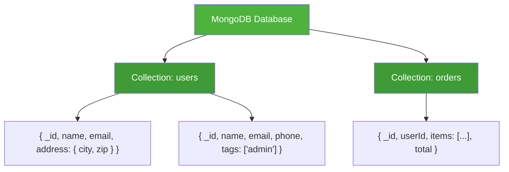

---
tags:
  - adatbazis
  - nosql
datum: 2026-03-06
szint: "🧱 Brick"
kapcsolodo:
  - "[[database/sql-adatbazisok|SQL adatbázisok]]"
  - "[[database/redis|Redis]]"
  - "[[database/supabase|Supabase]]"
  - "[[database/prisma|Prisma]]"
  - "[[database/drizzle|Drizzle]]"
  - "[[_moc/moc-database|MOC - Database]]"
---

# MongoDB

## Összefoglaló

A **MongoDB** a legnépszerűbb document-based NoSQL adatbázis. Az adatokat nem táblákban és sorokban tárolja (mint az [[database/sql-adatbazisok|SQL adatbázisok]]), hanem **JSON-szerű dokumentumokban** (BSON formátum). Nincs fix séma — minden dokumentum más-más mezőket tartalmazhat.

## Hogyan működik?



| SQL fogalom | MongoDB megfelelője |
|-------------|---------------------|
| Database | Database |
| Table | Collection |
| Row | Document |
| Column | Field |
| JOIN | Embedded document / `$lookup` |
| Schema | Nincs (schema-less) |

## Alapvető műveletek

```javascript
// Beszúrás
db.users.insertOne({
  name: "Teszt Felhasználó",
  email: "teszt@example.com",
  address: {
    city: "Budapest",
    zip: "1011"
  },
  tags: ["developer", "admin"],
  createdAt: new Date()
})

// Keresés
const user = await db.users.findOne({ email: "teszt@example.com" })

// Szűrt lekérdezés beágyazott mezőre
const budapestUsers = await db.users.find({
  "address.city": "Budapest"
}).toArray()

// Frissítés
await db.users.updateOne(
  { email: "teszt@example.com" },
  { $set: { "address.city": "Debrecen" }, $push: { tags: "editor" } }
)

// Törlés
await db.users.deleteOne({ email: "teszt@example.com" })

// Aggregation pipeline (SQL GROUP BY megfelelője)
const stats = await db.orders.aggregate([
  { $match: { status: "completed" } },
  { $group: { _id: "$userId", totalSpent: { $sum: "$total" } } },
  { $sort: { totalSpent: -1 } },
  { $limit: 10 }
]).toArray()
```

## Node.js / TypeScript setup

```bash
npm install mongodb
```

```typescript
// lib/mongodb.ts
import { MongoClient } from 'mongodb'

const client = new MongoClient(process.env.MONGODB_URI!)
const db = client.db('myapp')

export { db }

// Használat
import { db } from '@/lib/mongodb'

const users = db.collection('users')
const result = await users.find({ tags: 'admin' }).toArray()
```

> [!tip] Mongoose vs natív driver
> A **Mongoose** ORM-szerű sémát ad a MongoDB-hez (validáció, middleware, virtual mezők). Ha TypeScript-ben dolgozol és sémát akarsz, a Mongoose hasznos — de a natív MongoDB driver is type-safe a generics-kel.

## Mikor használd / Mikor NE

| Mikor IGEN | Mikor NE |
|-----------|----------|
| Flexibilis séma kell (CMS, katalógus) | Komplex relációk, sok JOIN |
| Gyorsan változó adatmodell, prototípus | Tranzakciók kritikusak (pénzügyi rendszer) |
| Hierarchikus / beágyazott adat (nested JSON) | Ha már PostgreSQL-t használsz — JSONB ugyanezt tudja |
| IoT / log adatok nagy mennyiségben | Kis projekt, ahol SQLite is elég |
| Real-time analytics (aggregation pipeline) | Ha az ORM ökoszisztéma fontos ([[database/drizzle|Drizzle]], [[database/prisma|Prisma]]) |

> [!warning] A modern web stack-ben PostgreSQL az alapértelmezés
> A legtöbb SaaS projekthez **nem kell MongoDB**. A [[database/supabase|Supabase]] PostgreSQL JSONB-vel szinte ugyanazt tudod mint MongoDB-vel, de relációkkal, RLS-sel és a teljes SQL ökoszisztémával. MongoDB-t akkor válaszd, ha az adatod természeténél fogva dokumentum-alapú (CMS, termék katalógus, log aggregáció).

## Hosting opciók

| Platform | Mikor jó |
|----------|----------|
| **MongoDB Atlas** (mongodb.com) | Managed, free tier (512MB), a hivatalos hosted verzió |
| **Docker** | Lokális fejlesztés: `docker run -d mongo:7` |
| **AWS DocumentDB** | Enterprise, MongoDB-kompatibilis |
| **Saját VPS** | Ha teljes kontroll kell |

```bash
# Lokális MongoDB Docker-rel
docker run -d --name mongo \
  -p 27017:27017 \
  -e MONGO_INITDB_ROOT_USERNAME=admin \
  -e MONGO_INITDB_ROOT_PASSWORD=secret \
  mongo:7
```

## PostgreSQL JSONB vs MongoDB

Ha már PostgreSQL-t használsz, a JSONB mező szinte ugyanazt tudja:

```sql
-- PostgreSQL JSONB: MongoDB-szerű dokumentum tárolás relációs DB-ben
CREATE TABLE products (
  id serial PRIMARY KEY,
  data jsonb NOT NULL
);

INSERT INTO products (data) VALUES ('{"name": "Widget", "specs": {"weight": 100}}');

-- Beágyazott mező keresés (mint MongoDB find)
SELECT * FROM products WHERE data->>'name' = 'Widget';
SELECT * FROM products WHERE data->'specs'->>'weight'::int > 50;

-- GIN index a gyors kereséshez
CREATE INDEX idx_products_data ON products USING GIN (data);
```

**Különbség:** MongoDB-ben a dokumentum AZ adat. PostgreSQL-ben a JSONB egy oszlop a relációs táblában — kombinálhatod relációkkal, JOIN-okkal, RLS-sel.

## Kapcsolódó

- [[database/sql-adatbazisok|SQL adatbázisok]] — relációs alternatíva, a legtöbb esetben ez az alapértelmezés
- [[database/redis|Redis]] — in-memory NoSQL, cache és session store
- [[database/supabase|Supabase]] — PostgreSQL + JSONB, ha dokumentum-szerű adat kell SQL-ben
- [[database/prisma|Prisma]] — ORM ami SQL adatbázisokhoz type-safe réteget ad
- [[database/drizzle|Drizzle]] — lightweight TypeScript ORM (SQL-közelebb)
- [[_moc/moc-database|MOC - Database]]
