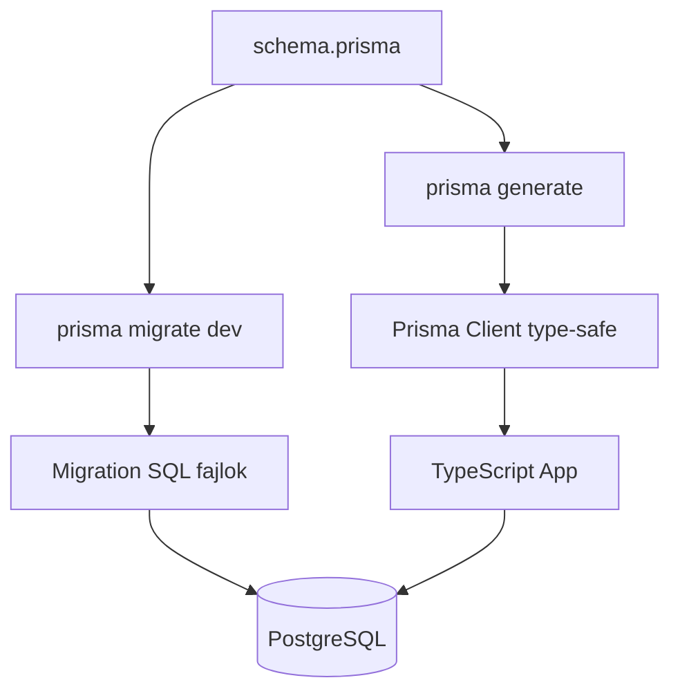

---
tags:
  - adatbazis
  - orm
  - typescript
datum: 2026-03-06
szint: "🧱 Brick"
kapcsolodo:
  - "[[database/drizzle|Drizzle]]"
  - "[[database/supabase|Supabase]]"
  - "[[database/sql-adatbazisok|SQL adatbazisok]]"
  - "[[database/sql-index-szabalyok|SQL Index szabalyok]]"
  - "[[_moc/moc-database|MOC - Database]]"
---

# Prisma

**Kategoria:** `adatbazis` / `ORM` / `dev tool`
**URL:** https://prisma.io
**Ar/Terv:** Open source, ingyenes. Prisma Accelerate (connection pooling): fizeto

---

## Mi ez es mire jo?

> [!tldr] Egy mondatban
> A Prisma egy TypeScript ORM -- a `schema.prisma` fajlban definialod az adatmodellt, o generalja a type-safe klienst es kezeli a migration-oket.

Raw SQL helyett TypeScript-ben irsz lekerdezeseket, es a compiler megmondja ha hibas. A Prisma a Drizzle-nel magasabb szintu absztrakcio: nem kell SQL-t irni, de cserebe kevesebb kontrollod van.

**A harom fo komponens:**

| Komponens | Feladat |
|---|---|
| **Prisma Client** | Auto-generalt, type-safe adatbazis kliens |
| **Prisma Migrate** | Migration fajlok generalasa es futtatasa |
| **Prisma Studio** | GUI az adatbazishoz (localhost:5555) |

## Workflow



**Mikor valaszd a Drizzle helyett:**
- Komplex relacios lekerdezesek kellenek (`include`, `select` nested objektumokkal)
- Gyorsan akarsz haladni, nem akarod az SQL-t manualisan irni
- Prisma Studio-t szeretned (vizualis adatbazis editor)
- A projekt nem edge/serverless (Prisma engine-je nehez, nem jo Vercel Edge-re)

**Mikor NE valaszd (→ [[database/drizzle|Drizzle]] inkabb):**
- Vercel Edge Functions / Cloudflare Workers -- Prisma engine nem fut edge-en
- Ha finomabb SQL kontroll kell
- Ha a bundle size szamit (Prisma ~2MB engine)

---

## Setup -- lepesrol lepesre

### 1. Telepites

```bash
npm install prisma @prisma/client
npx prisma init
```

Ez letrehozza:
- `prisma/schema.prisma` -- az adatmodell definicio
- `.env` -- `DATABASE_URL` env variable

### 2. schema.prisma felepitese

```prisma
// prisma/schema.prisma

generator client {
  provider = "prisma-client-js"
}

datasource db {
  provider = "postgresql"
  url      = env("DATABASE_URL")
}

model User {
  id        String   @id @default(cuid())
  email     String   @unique
  name      String?
  createdAt DateTime @default(now())
  updatedAt DateTime @updatedAt
  posts     Post[]
}

model Post {
  id        String   @id @default(cuid())
  title     String
  content   String?
  published Boolean  @default(false)
  author    User     @relation(fields: [authorId], references: [id])
  authorId  String
  createdAt DateTime @default(now())

  @@index([authorId])          // index a foreign key-re
  @@index([published, createdAt]) // compound index szureshez
}
```

### 3. Prisma Client generalasa

```bash
npx prisma generate
```

Minden schema valtozas utan lefuttatando -- ujrageneralja a type-safe klienst.

### 4. Migration futtatasa

```bash
# Fejlesztesi kornyezetben (schema → migration → apply)
npx prisma migrate dev --name add_post_model

# Production-ben (csak apply, nem general ujat)
npx prisma migrate deploy
```

### 5. Supabase bekotese

```bash
# .env
DATABASE_URL="postgresql://postgres:<JELSZO>@db.<PROJEKT_REF>.supabase.co:5432/postgres"
```

> [!warning] Supabase + Prisma connection pooling
> Supabase Direct connection (port 5432) helyett hasznalj **connection pooler**-t (port 6543 + `?pgbouncer=true`), kulonben serverless env-ben elfogynak a connection-ok:
> ```
> DATABASE_URL="postgresql://postgres:<JELSZO>@db.<REF>.supabase.co:6543/postgres?pgbouncer=true"
> ```

### 6. Prisma Client hasznalat

```typescript
// lib/prisma.ts -- singleton a Next.js-hez
import { PrismaClient } from '@prisma/client'

const globalForPrisma = globalThis as unknown as { prisma: PrismaClient }

export const prisma =
  globalForPrisma.prisma ??
  new PrismaClient({ log: ['query'] })

if (process.env.NODE_ENV !== 'production') {
  globalForPrisma.prisma = prisma
}
```

```typescript
// Hasznalat
import { prisma } from '@/lib/prisma'

// Lekerdezes relacioval
const users = await prisma.user.findMany({
  where: { posts: { some: { published: true } } },
  include: { posts: { where: { published: true } } },
  orderBy: { createdAt: 'desc' },
  take: 10,
})

// Letrehozas
const user = await prisma.user.create({
  data: {
    email: 'test@example.com',
    posts: {
      create: { title: 'Elso post' },
    },
  },
})

// Frissites
await prisma.post.update({
  where: { id: postId },
  data: { published: true },
})

// Torles
await prisma.user.delete({ where: { id: userId } })
```

---

## Best Practices

### Schema design

- Minden tabla kapjon `id`, `createdAt`, `updatedAt` mezot
- Foreign key mezokre mindig legyen `@@index` (pl. `@@index([userId])`)
- `cuid()` vagy `uuid()` az ID-khez (nem auto-increment integer)

### Migration workflow

```bash
# 1. Modositod a schema.prisma-t
# 2. Migration generalas + apply
npx prisma migrate dev --name <leiro_nev>
# pl: add_post_table, add_index_to_posts, add_published_field

# 3. Client regeneralas (automatikus migrate dev utan, de expliciten is futtatható)
npx prisma generate
```

### Prisma Studio -- gyors adatnezes

```bash
npx prisma studio
# http://localhost:5555
```

Nem kell SQL klienst (TablePlus, DBeaver) megnyitni -- Prisma Studio-ban szerkesztheto az adat kozvetlenul. Hasznos fejlesztes kozben.

### Index-ek a schema-ban

Lasd: [[database/sql-index-szabalyok|SQL Index szabalyok]] -- az ott leirt elvek alapjan add a `@@index`-eket. Prisma-ban:

```prisma
model Post {
  // ...
  @@index([authorId])                    // FK index
  @@index([published, createdAt(sort: Desc)])  // compound, szures + rendezes
  @@unique([email])                      // unique constraint = implicit index
}
```

---

## Buktatok es hibak amiket elkerulj

- **Ne felejtsd el `prisma generate`-et futtatni** schema valtozas utan -- kulonben a kliens nem latja az uj mezoket
- **Prisma Studio adatbazis jelszo** -- ne futtasd production connection string-gel ha nem muszaj
- **N+1 problema** -- `findMany` + relaciok iteralasanal hasznalj `include`-ot, ne kulon query-t minden elemhez
- **Edge runtime** -- Prisma Client nem fut Vercel Edge-en. Ha edge kell → [[database/drizzle|Drizzle]]

---

## Hasznos parancsok

```bash
npx prisma init                          # Prisma inicializalas
npx prisma generate                      # Kliens regeneralas
npx prisma migrate dev --name <nev>      # Migration fejleszteshez
npx prisma migrate deploy                # Migration production-ra
npx prisma migrate status                # Pending migration-ok listaja
npx prisma db push                       # Schema push migration nelkul (prototyping)
npx prisma studio                        # GUI az adatbazishoz
npx prisma db seed                       # Seed adat futtatasa
```

---

## Hasznos linkek

- Docs: https://prisma.io/docs
- Schema referencia: https://prisma.io/docs/orm/reference/prisma-schema-reference
- Prisma vs Drizzle: https://www.prisma.io/docs/orm/more/comparisons/prisma-and-drizzle

---

## Kapcsolodo

- [[database/drizzle|Drizzle]] -- alternativ ORM, SQL-kozelibb, jobb edge-re
- [[database/supabase|Supabase]] -- PostgreSQL backend, amivel Prisma-t altalaban osszekotjuk
- [[database/sql-adatbazisok|SQL adatbazisok]] -- SQL alapok, amire Prisma epul
- [[database/sql-index-szabalyok|SQL Index szabalyok]] -- index strategia a schema.prisma @@index-ekhez
- [[_moc/moc-database|MOC - Database]]
