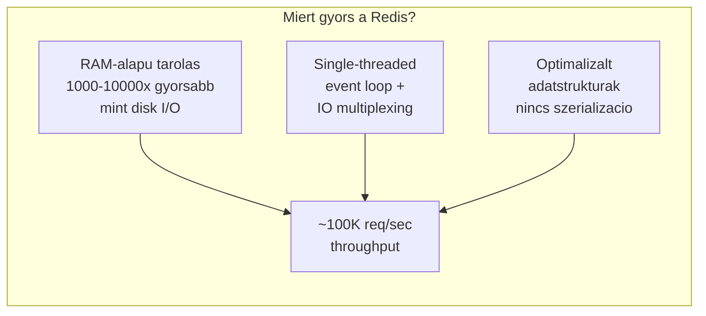
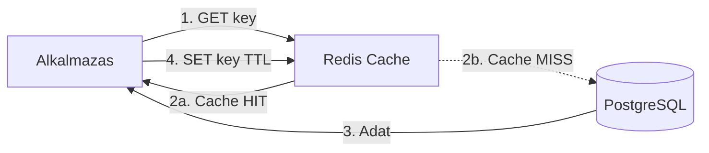
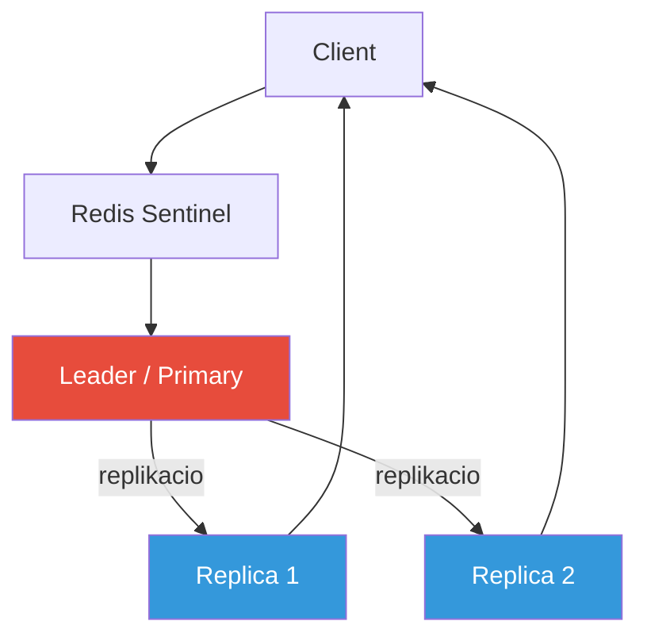

---
tags:
  - adatbazis
  - cache
  - redis
datum: 2026-03-06
szint: "🧱 Brick"
kapcsolodo:
  - "[[database/supabase|Supabase]]"
  - "[[cloud/docker-alapok|Docker alapok]]"
  - "[[frontend/nextjs|Next.js]]"
  - "[[cloud/vercel|Vercel]]"
  - "[[cloud/railway|Railway]]"
  - "[[_moc/moc-database|MOC - Database]]"
---

## Mi ez?

A **Redis** (Remote Dictionary Server) egy in-memory adatbazis, amit elsosorban cache-kent, session store-kent, message broker-kent es real-time adatkezeloként hasznalnak. Az adatokat RAM-ban tarolja, ezert **1000-10000x gyorsabb** mint a hagyomanyos disk-alapu adatbazisok.

Nem csak egy egyszeru key-value store -- gazdag adatstrukturakat tamogat (listak, halmazok, sorted set-ek, hash-ek, stream-ek), ezert szinte barmilyen real-time problemara megoldas.

> [!info] Forras
> Ez a jegyzet a [ByteByteGo Redis video](https://www.youtube.com/watch?v=z_NbVtbgBJw) es a kapcsolodo ByteByteGo cikkek alapjan keszult.

## Miert ilyen gyors?



1. **In-memory storage** -- az osszes adat RAM-ban van, nincs disk I/O bottleneck
2. **Single-threaded event loop + IO multiplexing** -- egyetlen szal kezeli az osszes connection-t (epoll/kqueue), nincs context switching, nincs lock contention
3. **Optimalizalt adatstrukturak** -- SDS (Simple Dynamic Strings), ziplist/listpack, skiplist, intset -- mind memoriara optimalizalva, nincs szerializacio/deszerializacio overhead

> [!tip] Miert single-threaded?
> Meglepo, de a single-threaded modell gyorsabb mint a multi-threaded, mert eliminal minden lock-ot, mutex-ot es context switch-et. A bottleneck nem a CPU, hanem a halozat es a memoria -- Redis 6.0+ ota az I/O reszt mar multi-threaded kezeli, de az execution marad single-threaded.

## Adatstrukturak

| Struktura | Mire jo | Pelda parancs | Use case |
|-----------|---------|---------------|----------|
| **String** | Egyszeru key-value | `SET user:1:name "User"` | Cache, counter, session token |
| **Hash** | Objektum-szeru tarolas | `HMSET user:bob name Bob location "Budapest"` | User profile, settings |
| **List** | Sorba rendezett elemek | `LPUSH`, `RPUSH`, `LRANGE` | Message queue, activity feed |
| **Set** | Egyedi elemek halmaza | `SADD`, `SMEMBERS`, `SINTER` | Tag-ek, egyedi visitor-ok, baratlista |
| **Sorted Set** | Pontszammal rendezett halmaz | `ZADD leaderboard 100 "player1"` | Leaderboard, timeline, priority queue |
| **Stream** | Append-only log | `XADD`, `XREAD`, `XGROUP` | Event stream, message queue (Kafka-lite) |
| **Bitmap** | Bit-szintu muveletek | `SETBIT`, `BITCOUNT` | Feature flag-ek, napi aktiv user tracking |
| **HyperLogLog** | Kozelito kardinalitas | `PFADD`, `PFCOUNT` | Egyedi latogatok szamlalasa (nagyon keves memoria) |
| **Geospatial** | Foldrajzi koordinatak | `GEOADD`, `GEODIST`, `GEORADIUS` | Kozeli helyek keresese, ride-hailing |

## Fo use case-ek

### 1. Caching (leggyakoribb)

Az alkalmazas es az adatbazis koze kerul:



- **Pareto-elv**: a lekerdezesek ~80%-a az adatok ~20%-ara vonatkozik -- ezt erdemes cache-elni
- **Eviction policy-k**: LRU (Least Recently Used), LFU (Least Frequently Used), TTL-alapu
- Tobbszintu cache: app-szintu (in-process HashMap) → Redis (distributed) → DB

### 2. Session Store

Elosztott kornyezetben a user session-oket Redis-ben tartjuk, nem a szerveren:

1. User bejelentkezik → session ID generalodik, Redis-be mentodik
2. Client megkapja a session ID-t (cookie)
3. Kovetkezo request-nel a session ID alapjan barmelyik szerver ki tudja olvasni az adatot
4. Nincs szukseg sticky session-re a load balancer-nel

### 3. Rate Limiting

```
INCR api:user:123:minute
EXPIRE api:user:123:minute 60
```
Ha az ertek > limit → 429 Too Many Requests. Redis atomi muveletei garantaljak a konzisztenciat.

### 4. Leaderboard

Sorted Set-tel nativan megoldhato:
```
ZADD game:leaderboard 1500 "player_a"
ZADD game:leaderboard 2300 "player_b"
ZREVRANGE game:leaderboard 0 9 WITHSCORES  # Top 10
```

### 5. Pub/Sub es Message Queue

- **Pub/Sub**: valos ideju uzenetkuldés subscriber-eknek (chat, notification)
- **Streams**: tartos message queue, consumer group-okkal (Kafka-lite, de egyszerubb)
- **List**: egyszeru queue `LPUSH` + `BRPOP` komboval

### 6. Distributed Lock

```
SET lock:resource "owner" NX EX 30
```
`NX` = only if not exists, `EX` = expire. Elosztott kornyezetben ez a legegyszerubb lock mechanizmus (Redlock algoritmus a robosztusabb verzio).

## Perzisztencia

Redis alapvetoen in-memory, de az adatok nem vesznek el ujrainditaskor:

| Mod | Hogyan mukodik | Trade-off |
|-----|---------------|-----------|
| **RDB** (Snapshot) | Idoszakos point-in-time snapshot a teljes adatbazisrol | Gyors recovery, de az utolso snapshot ota elveszhet adat |
| **AOF** (Append Only File) | Minden iras muveletet logol (mint egy commit log) | Biztonsagosabb, de nagyobb fajl, lassabb recovery |
| **RDB + AOF** | Mindketto egyutt | Legjobb kombo production-ben |
| **Nincs** | Perzisztencia kikapcsolva | Tisztan cache use case, kis adatmennyiseg |

> [!warning] Redis ≠ primary database
> Redis-t nem szabad egyeduli adatbaziskent hasznalni (bar vannak akik igy csinalják). A legjobb minta: **[[database/supabase|Supabase]]** / PostgreSQL mint source of truth + Redis mint cache/session layer.

## High Availability



- **Leader-Follower replikacio**: a leader kezeli az irasokat, a replica-k a read-eket
- **Redis Sentinel**: monitoring + automatikus failover -- ha a leader meghal, egy replica-t eloleptet
- **Redis Cluster**: horizontalis sharding -- az adatok elosztasa tobb node kozott (16384 hash slot)

## Mikor hasznald / Mikor NE

| Mikor IGEN | Mikor NE |
|-----------|----------|
| Cache layer a DB ele | Primary database (egyedul) |
| Session management | Nagy meretu blob tarolas (>512MB value) |
| Real-time leaderboard | Komplex relacios query-k (JOIN, GROUP BY) |
| Rate limiting | Ha az adat nem fer a RAM-ba |
| Pub/Sub, event streaming | Ha nem kell sub-millisecond latency |
| Distributed lock | ACID tranzakciok kellenek (bank) |

## Hosting opciok

| Szolgaltatas | Mikor jo |
|-------------|----------|
| **Redis Cloud** (redis.com) | Managed, Redis Ltd. hivatalos |
| **Upstash** | Serverless Redis, pay-per-request -- [[cloud/vercel|Vercel]] Edge-hez idealis |
| **AWS ElastiCache** | Enterprise, nagy volumen |
| **Railway** | Redis kontener egyszeruen -- [[cloud/railway|Railway]] |
| **Docker** | Sajat gep / VPS -- `docker run redis:alpine` |

> [!tip] Serverless-hez Upstash
> Ha [[cloud/vercel|Vercel]]-en vagy [[frontend/nextjs|Next.js]]-sel dolgozol es serverless function-okbol akarsz Redis-t elerni, az **Upstash** a legjobb valasztas: HTTP-alapu API, nincs persistent connection problema, pay-per-request arazas.

## Kapcsolodo

- [[database/supabase|Supabase]] -- PostgreSQL mint primary DB, Redis mint cache layer melle
- [[cloud/docker-alapok|Docker alapok]] -- Redis kontenerben futtatasa lokalisan
- [[frontend/nextjs|Next.js]] -- server-side cache, session store Next.js API route-okbol
- [[cloud/vercel|Vercel]] -- Edge Function + Upstash Redis kombo
- [[cloud/railway|Railway]] -- managed Redis hosting
- [[_moc/moc-database|MOC - Database]]
