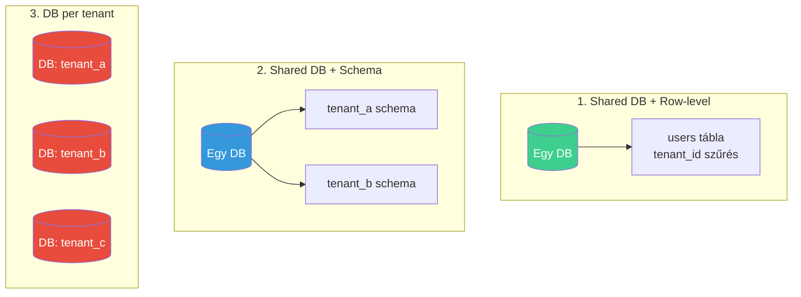
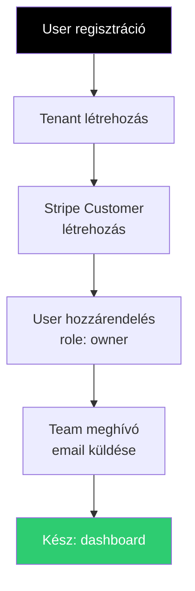

---
tags:
  - adatbazis
  - saas
  - tervezes
datum: 2026-03-06
szint: "🏗️ Builder"
kapcsolodo:
  - "[[database/sql-adatbazisok|SQL adatbázisok]]"
  - "[[database/supabase|Supabase]]"
  - "[[database/prisma|Prisma]]"
  - "[[database/drizzle|Drizzle]]"
  - "[[database/postgresql-specifikus|PostgreSQL specifikus tudás]]"
  - "[[cloud/saas-mvp-deployment|SaaS MVP Deployment]]"
  - "[[_moc/moc-database|MOC - Database]]"
---

# SaaS adatbázis tervezés

## Összefoglaló

Ha SaaS alkalmazást építesz, az adatbázis tervezés az egyik legkritikusabb döntés. Hogyan **különíted el a tenant-ek adatait**? Hogyan kapcsolod össze a **billing-et az adatmodellel**? Hogyan skálázol **100-ról 10 000 ügyfélre** anélkül, hogy újraírnád az egészet? Ez a jegyzet ezekre ad választ.

## Multi-tenant architektúra modellek

Három fő megközelítés létezik — mindegyiknek más a trade-off-ja:



### Összehasonlítás

| Szempont | Shared + Row | Shared + Schema | DB per tenant |
|----------|-------------|-----------------|---------------|
| **Komplexitás** | Alacsony | Közepes | Magas |
| **Izoláció** | Gyenge (RLS kell!) | Közepes | Teljes |
| **Skálázhatóság** | 1000+ tenant | 100-500 tenant | 10-100 tenant |
| **Költség** | Legolcsóbb | Közepes | Legdrágább |
| **Migration** | Egy migration, egy séma | Migration per schema | Migration per DB |
| **Mikor jó** | SaaS MVP, legtöbb app | Erős izoláció + egy DB | Enterprise, compliance |

> [!tip] Az MVP-hez szinte mindig Shared + Row-level
> Ha most kezded a SaaS-odat, a **shared database + row-level tenant izoláció** a legjobb választás. Egyszerű, olcsó, és [[database/supabase|Supabase]] RLS-sel az izoláció is erős. Majd ha kinövöd, migrálhatsz.

## Shared DB + Row-level izoláció (ajánlott)

### A séma

```sql
-- Tenant (szervezet / cég)
CREATE TABLE tenants (
  id uuid PRIMARY KEY DEFAULT gen_random_uuid(),
  name text NOT NULL,
  slug text UNIQUE NOT NULL,        -- URL-ben: app.example.com/acme
  plan text DEFAULT 'free',         -- 'free', 'pro', 'enterprise'
  stripe_customer_id text,
  stripe_subscription_id text,
  created_at timestamptz DEFAULT now()
);

-- Felhasználó (egy user egy tenant-hez tartozik)
CREATE TABLE users (
  id uuid PRIMARY KEY DEFAULT gen_random_uuid(),
  tenant_id uuid NOT NULL REFERENCES tenants(id),
  email text NOT NULL,
  name text,
  role text DEFAULT 'member',       -- 'owner', 'admin', 'member'
  created_at timestamptz DEFAULT now(),
  UNIQUE(tenant_id, email)          -- email unique per tenant
);

-- Tenant-specifikus adat (pl. projektek)
CREATE TABLE projects (
  id uuid PRIMARY KEY DEFAULT gen_random_uuid(),
  tenant_id uuid NOT NULL REFERENCES tenants(id),
  name text NOT NULL,
  created_by uuid REFERENCES users(id),
  created_at timestamptz DEFAULT now()
);

-- Indexek: MINDEN tábla tenant_id-ra indexelve
CREATE INDEX idx_users_tenant ON users(tenant_id);
CREATE INDEX idx_projects_tenant ON projects(tenant_id);
```

### RLS policy-k a tenant izolációhoz

```sql
-- RLS bekapcsolása
ALTER TABLE projects ENABLE ROW LEVEL SECURITY;

-- A user csak a saját tenant-je projektjeit látja
CREATE POLICY "tenant_isolation" ON projects
  FOR ALL
  USING (
    tenant_id = (
      SELECT tenant_id FROM users
      WHERE id = auth.uid()
    )
  );

-- Alternatíva: tenant_id JWT claim-ből (gyorsabb)
CREATE POLICY "tenant_isolation_jwt" ON projects
  FOR ALL
  USING (
    tenant_id = (auth.jwt() ->> 'tenant_id')::uuid
  );
```

> [!warning] Elfelejtett tenant_id = adatszivárgás
> Minden táblán ahol tenant-specifikus adat van, **kötelező** a `tenant_id` oszlop + RLS policy. Ha elfelejtesz egy táblát, az adott tenant adatai minden felhasználó számára láthatóvá válnak.

### ORM szintű szűrés

Ha nem [[database/supabase|Supabase]]-t használsz (nincs RLS), az alkalmazás szintjén szűrj:

```typescript
// Drizzle: tenant-aware query wrapper
import { eq, and } from 'drizzle-orm'

function tenantQuery(tenantId: string) {
  return {
    async getProjects() {
      return db.select()
        .from(projects)
        .where(eq(projects.tenantId, tenantId))
    },

    async createProject(name: string, userId: string) {
      return db.insert(projects).values({
        tenantId,
        name,
        createdBy: userId,
      }).returning()
    }
  }
}

// Használat (middleware-ből jön a tenantId)
const tenant = tenantQuery(currentUser.tenantId)
const myProjects = await tenant.getProjects()
```

## Billing-hez kapcsolt adatmodell

### Stripe + tenant séma

```sql
-- A tenant tábla tartalmazza a billing mezőket
CREATE TABLE tenants (
  id uuid PRIMARY KEY DEFAULT gen_random_uuid(),
  name text NOT NULL,

  -- Stripe integráció
  stripe_customer_id text UNIQUE,
  stripe_subscription_id text,
  stripe_price_id text,

  -- Plan + usage tracking
  plan text DEFAULT 'free',
  plan_seats_limit integer DEFAULT 5,    -- max user a planen
  plan_projects_limit integer DEFAULT 3, -- max projekt a planen
  billing_cycle_start timestamptz,

  created_at timestamptz DEFAULT now()
);
```

### Limit ellenőrzés

```typescript
// Mielőtt új user-t vagy projektet hozol létre, ellenőrizd a limitet
async function canAddUser(tenantId: string): Promise<boolean> {
  const tenant = await db.query.tenants.findFirst({
    where: eq(tenants.id, tenantId)
  })

  const userCount = await db
    .select({ count: sql<number>`count(*)` })
    .from(users)
    .where(eq(users.tenantId, tenantId))

  return userCount[0].count < (tenant?.planSeatsLimit ?? 5)
}

async function canCreateProject(tenantId: string): Promise<boolean> {
  const tenant = await db.query.tenants.findFirst({
    where: eq(tenants.id, tenantId)
  })

  const projectCount = await db
    .select({ count: sql<number>`count(*)` })
    .from(projects)
    .where(eq(projects.tenantId, tenantId))

  return projectCount[0].count < (tenant?.planProjectsLimit ?? 3)
}
```

### Stripe webhook → plan frissítés

```typescript
// app/api/webhooks/stripe/route.ts
export async function POST(req: Request) {
  const event = await verifyStripeWebhook(req)

  switch (event.type) {
    case 'customer.subscription.updated': {
      const subscription = event.data.object
      const priceId = subscription.items.data[0].price.id

      // Plan mapping
      const planMap: Record<string, { plan: string; seats: number; projects: number }> = {
        'price_free': { plan: 'free', seats: 5, projects: 3 },
        'price_pro': { plan: 'pro', seats: 25, projects: 50 },
        'price_enterprise': { plan: 'enterprise', seats: 999, projects: 999 },
      }

      const planConfig = planMap[priceId] ?? planMap['price_free']

      await db.update(tenants)
        .set({
          plan: planConfig.plan,
          planSeatsLimit: planConfig.seats,
          planProjectsLimit: planConfig.projects,
          stripeSubscriptionId: subscription.id,
          stripePriceId: priceId,
        })
        .where(eq(tenants.stripeCustomerId, subscription.customer as string))

      break
    }

    case 'customer.subscription.deleted': {
      // Downgrade free-re
      await db.update(tenants)
        .set({
          plan: 'free',
          planSeatsLimit: 5,
          planProjectsLimit: 3,
          stripeSubscriptionId: null,
          stripePriceId: null,
        })
        .where(eq(tenants.stripeCustomerId, event.data.object.customer as string))

      break
    }
  }
}
```

## Tenant onboarding flow



```typescript
async function onboardTenant(ownerEmail: string, tenantName: string) {
  return db.transaction(async (tx) => {
    // 1. Tenant létrehozás
    const [tenant] = await tx.insert(tenants).values({
      name: tenantName,
      slug: slugify(tenantName),
    }).returning()

    // 2. Owner user létrehozás
    const [user] = await tx.insert(users).values({
      tenantId: tenant.id,
      email: ownerEmail,
      role: 'owner',
    }).returning()

    // 3. Stripe customer (tranzakción kívül, mert külső API)
    // Ez a webhook-ból jön vissza, frissíti a tenant-et

    return { tenant, user }
  })
}
```

## Mikor használd / Mikor NE

| Mikor IGEN | Mikor NE |
|-----------|----------|
| SaaS alkalmazás több ügyféllel | Egyszeri belső tool (nincs multi-tenant) |
| Ügyfelenként izolált adat kell | Egyszemélyes projekt |
| Subscription-based billing | Ha nincs fizetős plan (nincs billing) |
| Team meghívó, role kezelés kell | Ha az [[cloud/saas-mvp-deployment|MVP stack]] még nem nőtte ki a free tier-t |

## Kapcsolódó

- [[database/sql-adatbazisok|SQL adatbázisok]] — PostgreSQL alapok
- [[database/supabase|Supabase]] — RLS-alapú tenant izoláció
- [[database/prisma|Prisma]] — ORM multi-tenant séma kezeléssel
- [[database/drizzle|Drizzle]] — ORM tenant-aware query-kkel
- [[database/postgresql-specifikus|PostgreSQL specifikus tudás]] — RLS részletesen
- [[cloud/saas-mvp-deployment|SaaS MVP Deployment]] — a teljes SaaS deploy stack
- [[_moc/moc-database|MOC - Database]]
