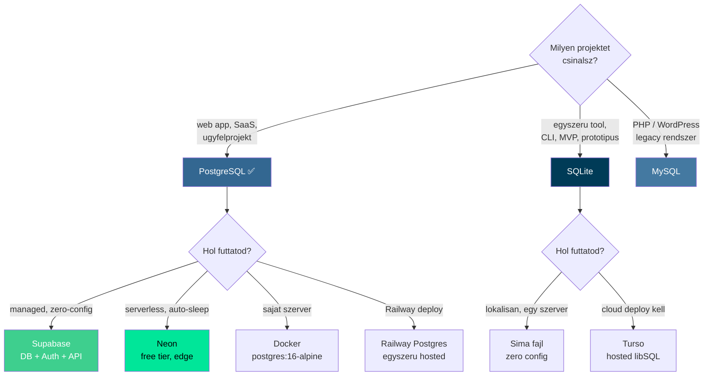

---
tags:
  - adatbazis
  - sql
datum: 2026-03-06
szint: "🌱 Newcomer"
kapcsolodo:
  - "[[database/sql-index-szabalyok|SQL Index szabalyok]]"
  - "[[database/supabase|Supabase]]"
  - "[[database/drizzle|Drizzle]]"
  - "[[database/prisma|Prisma]]"
  - "[[database/redis|Redis]]"
  - "[[cloud/railway|Railway]]"
  - "[[cloud/vercel|Vercel]]"
  - "[[cloud/docker-alapok|Docker alapok]]"
  - "[[_moc/moc-database|MOC - Database]]"
---

## Mi ez?

A harom fo SQL adatbazis osszehasonlitasa: **SQLite**, **PostgreSQL**, es **MySQL**. Melyiket valaszd, mikor, es hol futtasd.

> [!tldr] Gyors valasz
> Ha nem tudod melyiket valaszd: **PostgreSQL**. A [[database/supabase|Supabase]], Neon, [[database/drizzle|Drizzle]], [[database/prisma|Prisma]], [[cloud/vercel|Vercel]], [[cloud/railway|Railway]] -- mind Postgres-re optimalizalt. SQLite csak MVP/prototipus/egyszeru app. MySQL csak ha legacy rendszerhez kell csatlakozni.

---

## Dontesi fa



---

## Adatbazisok osszehasonlitasa

### SQLite

**Mi ez:** Egyetlen fajl, nincs szerver. A DB = egy `.db` fajl a diszken. Az alkalmazas kozvetlenul olvassa/irja.

**Mikor hasznald:**
- Mobil app (iOS/Android nativan hasznalja)
- Egyszeru web app, par tiz user, egy szerver
- CLI tool-ok, desktop appok (Electron)
- Prototipus / MVP -- gyorsan indulsz, nincs setup
- Embedded rendszerek, IoT

**Mikor NE:**
- Tobb szerver / process ir egyszerre (egyetlen writer lock van)
- Magas parhuzamos iras (100+ concurrent write)
- Ha tobb app/service kell ugyanazt a DB-t elerje halozaton keresztul
- Production SaaS -- skalazhatosag korlatozott

**Hol futtatod:**

| Hol | Hogyan | Mikor |
|---|---|---|
| **Lokal / VM** | Egy fajl, semmi install | Mindig ez az alap |
| **Turso** | Hosted libSQL (SQLite fork), edge replication | Ha SQLite kell, de cloud deploy is |
| **Cloudflare D1** | Edge SQLite, Workers-szel | Cloudflare stack-ben |
| **LiteFS** | SQLite replication tobb node kozott | Fly.io deploy |

```bash
# Nincs telepites, nincs semmi
# Node.js-bol:
bun add better-sqlite3

# Vagy Python-bol:
import sqlite3
conn = sqlite3.connect('myapp.db')
```

---

### PostgreSQL

**Mi ez:** A "svajci bicska" -- enterprise-grade, nyilt forraskodu relacios DB. Gyakorlatilag mindent tud. **Ez az alapertelmezett adatbazis valasztas.**

**Mikor hasznald:**
- SaaS alkalmazasok (a legtobb projekt)
- Barmi ahol komplex query-k kellenek (JOIN-ok, subquery-k, CTE-k)
- Full-text search (beepitett `tsvector`)
- JSON adatok (JSONB tipus -- szinte NoSQL-kent is hasznalhato)
- Geolokacio (PostGIS extension)
- Multi-tenant alkalmazasok
- Ha nem tudod elore mit kell majd a DB-nek tudnia -- Postgres mindent tud

**Mikor NE:**
- Nagyon egyszeru app ahol SQLite is eleg (felesleges overhead)
- Ha MySQL-specifikus legacy rendszerhez kell csatlakozni

**Hol futtatod:**

| Hol | Hogyan | Mikor |
|---|---|---|
| **[[database/supabase|Supabase]]** | Hosted Postgres + Auth + API + Storage | **A legtobb projekt** -- full backend egy helyen |
| **Neon** | Serverless Postgres, auto-sleep | Free tier (0.5 GB), serverless/edge app-ok |
| **[[cloud/railway|Railway]]** | Egyszeru hosted Postgres | Ha sajat backend kell, gyors setup |
| **[[cloud/vercel|Vercel]] Postgres** | Neon-ra epul, Vercel integracio | Ha minden Vercel-en van |
| **[[cloud/docker-alapok|Docker]]** | `postgres:16-alpine` image | Dev kornyezet, VPS deploy |
| **Lokal / VM** | `apt install postgresql` | Ha Dockert nem akarsz |
| **AWS RDS** | Managed Postgres | Enterprise, nagy terheles |

```bash
# Docker (dev es VPS)
docker run -d --name pg \
  -e POSTGRES_PASSWORD=secret \
  -p 5432:5432 \
  postgres:16-alpine

# Supabase -- bongeszöben letrehozod, kapsz URL + key-t
# Connection string a Supabase Dashboard-on → Settings → Database
```

> [!tip] Postgres + ORM
> Postgres-t szinte mindig ORM-mel hasznaljuk, nem raw SQL-lel:
> - **[[database/drizzle|Drizzle]]** -- lightweight, type-safe, kozel van a SQL-hez (preferalt)
> - **[[database/prisma|Prisma]]** -- magasabb szintu absztrakcio, schema-first approach
> - **Supabase client** -- ha nincs ORM igeny, a Supabase JS kliens eleg

---

### MySQL

**Mi ez:** A masik nagy nyilt forraskodu relacios DB. A legelterjedtebb a vilagon (WordPress, PHP okoszisztema), Oracle tulajdonaban.

**Mikor hasznald:**
- WordPress, Laravel, PHP-alapu projektek
- Legacy rendszerek amiket MySQL-re irtak
- Egyszeru CRUD alkalmazasok ahol a Postgres feature-ok nem kellenek
- Shared hosting (szinte minden hosting ad MySQL-t ingyen)
- Ha a csapat MySQL-t ismer

**Mikor NE:**
- Komplex query-k, CTE-k, window function-ok (Postgres jobb ebben)
- JSONB kezeles (MySQL JSON support gyengebb)
- Full-text search (Postgres `tsvector` erosebb)
- Geolokacio (PostGIS nem letezik MySQL-ben ilyen szinten)
- Modern TypeScript/[[frontend/nextjs|Next.js]] stack -- a legtobb tool Postgres-re optimalizalt ([[database/drizzle|Drizzle]], [[database/prisma|Prisma]], [[database/supabase|Supabase]], Neon)

**Hol futtatod:**

| Hol | Hogyan | Mikor |
|---|---|---|
| **Lokal / VM** | `apt install mysql-server` | Legacy projekt, PHP stack |
| **Docker** | `mysql:8` image | Dev kornyezet |
| **PlanetScale** | Serverless MySQL, branching | Modern MySQL hosting (Vitess-alapu) |
| **AWS RDS** | Managed MySQL | Enterprise |
| **Shared hosting** | cPanel-bol kattintas | WordPress, olcso hosting |
| **[[cloud/railway|Railway]]** | Hosted MySQL | Gyors deploy |

```bash
# Docker
docker run -d --name mysql \
  -e MYSQL_ROOT_PASSWORD=secret \
  -e MYSQL_DATABASE=myapp \
  -p 3306:3306 \
  mysql:8
```

> [!warning] MySQL a modern stack-ben
> A modern stack-ben MySQL-t gyakorlatilag **nem hasznalunk**. A Supabase Postgres-alapu, a Drizzle es Prisma is Postgres-re van optimalizalva, es a Vercel/Railway Postgres hosting-ja jobb. MySQL-t csak legacy integracional vagy WordPress-nel erdemes.

---

## Osszehasonlito tablazat

|  | SQLite | PostgreSQL | MySQL |
|---|---|---|---|
| **Tipus** | Embedded (fajl) | Client-server | Client-server |
| **Setup** | Nulla | Kozepes | Kozepes |
| **Concurrent writes** | Gyenge (1 writer) | Kivalo | Jo |
| **Concurrent reads** | Kivalo | Kivalo | Kivalo |
| **JSON support** | Alap | Kivalo (JSONB) | Kozepes |
| **Full-text search** | Alap (FTS5) | Kivalo | Kozepes |
| **Geolokacio** | Nincs | PostGIS (a legjobb) | Alap |
| **Replication** | Turso/LiteFS | Nativ | Nativ |
| **Max DB meret** | Gyakorlatban par GB | Korlatlan | Korlatlan |
| **Licence** | Public domain | PostgreSQL License | GPL (Oracle) |
| **ORM tamogatas** | Drizzle, Prisma | Drizzle, Prisma, Supabase | Drizzle, Prisma |
| **Stack-ben** | Csak MVP/prototipus | **Elsodleges valasztas** | Csak legacy |
| **Hosted opciok** | Turso, D1 | Supabase, Neon, Railway, Vercel | PlanetScale, RDS |

---

## Reszletes feature osszehasonlitas

| Feature | SQLite | PostgreSQL | MySQL |
|---------|--------|-----------|-------|
| **ACID compliance** | Igen | Igen | Igen (InnoDB) |
| **Tranzakciok** | Igen | Igen (MVCC) | Igen |
| **Stored procedures** | Nem | Igen (PL/pgSQL) | Igen |
| **Triggers** | Korlatozott | Teljes | Teljes |
| **Views** | Igen | Igen (materialized is!) | Igen |
| **CTE (WITH)** | Igen (3.8.3+) | Igen (rekurziv is) | Igen (8.0+) |
| **Window functions** | Igen (3.25+) | Kivalo | Igen (8.0+) |
| **JSONB** | Nem | Igen (indexelheto!) | JSON (nem indexelheto) |
| **Array tipus** | Nem | Igen | Nem |
| **Enum tipus** | Nem | Igen | Igen |
| **LISTEN/NOTIFY** | Nem | Igen (real-time!) | Nem |
| **Extensions** | Nem | 100+ (PostGIS, pg_trgm, stb.) | Korlatozott |
| **Row-level security** | Nem | Igen (Supabase erre epit!) | Nem |

> [!info] Postgres egyedulallo feature-ok
> Ami miatt a Postgres kiemelkedik a modern web stack-ben:
> - **JSONB** -- relacios es NoSQL-szeru hasznalat egyben, indexelheto
> - **Row-Level Security (RLS)** -- erre epul az egesz [[database/supabase|Supabase]] auth modell
> - **LISTEN/NOTIFY** -- real-time esemenyek DB szinten (Supabase Realtime)
> - **Extensions** -- PostGIS (geo), pg_trgm (fuzzy search), pgvector (AI embeddings)

---

## Hosting koltsegek

| Platform | Ingyenes tier | Fizetos tol | DB tipus |
|----------|-------------|------------|---------|
| **Supabase** | 500 MB, 2 projekt | $25/ho | PostgreSQL |
| **Neon** | 0.5 GB, auto-sleep | $19/ho | PostgreSQL |
| **Vercel Postgres** | 256 MB | $20/ho | PostgreSQL (Neon) |
| **Railway** | $5 kredit/ho | hasznalat alapu | PostgreSQL / MySQL |
| **PlanetScale** | -- | $39/ho | MySQL |
| **Turso** | 9 GB, 500M sorok | $29/ho | SQLite (libSQL) |
| **Sajat VPS (Docker)** | -- | ~$5-10/ho (VPS ar) | Barmelyik |

---

## Kapcsolodo anyagok

- [[database/sql-index-szabalyok|SQL Index szabalyok]]
- [[database/supabase|Supabase]] -- hosted PostgreSQL + Auth + API
- [[database/drizzle|Drizzle]] -- type-safe ORM (preferalt)
- [[database/prisma|Prisma]] -- magas szintu ORM
- [[cloud/railway|Railway]] -- hosted DB opcio
- [[cloud/vercel|Vercel]] -- Vercel Postgres integracio
- [[cloud/docker-alapok|Docker alapok]] -- DB futtatas kontenerben
- [[database/redis|Redis]] -- in-memory adatbazis (cache, session store)
- [[_moc/moc-database|MOC - Database]]
