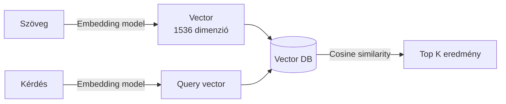

---
tags:
  - adatbazis
  - ai
  - rag
datum: 2026-03-06
szint: "🏗️ Builder"
kapcsolodo:
  - "[[database/sql-adatbazisok|SQL adatbázisok]]"
  - "[[database/supabase|Supabase]]"
  - "[[foundations/machine-learning-alapok|Machine Learning alapok]]"
  - "[[_moc/moc-database|MOC - Database]]"
---

# Vector adatbázisok

## Összefoglaló

A **vector adatbázisok** nagy dimenziós vektorokat (embedding-eket) tárolnak és keresnek hatékonyan. Ez az AI alkalmazások egyik alapköve: a **RAG (Retrieval-Augmented Generation)** rendszerek így keresnek releváns kontextust az LLM prompt-jához.

## Miért kellenek?

Hagyományos keresés: **kulcsszó alapú** (LIKE '%szó%') — csak pontos egyezést talál.
Vector keresés: **szemantikus** — megérti a jelentést.

```
Kérdés: "Hogyan deployoljak Next.js-t?"
Kulcsszó keresés: "deploy" szót tartalmazó dokumentumok
Vector keresés: "Next.js hosting", "Vercel setup", "CI/CD pipeline" — szemantikailag releváns
```

## Hogyan működik?



1. **Embedding generálás** — Szöveget átalakítasz számokká (pl. OpenAI `text-embedding-3-small`)
2. **Tárolás** — A vektort eltárolod a DB-ben
3. **Keresés** — A kérdést is vektorrá alakítod, és a legközelebbi vektorokat keresed (cosine similarity)

## pgvector — PostgreSQL extension

Ha már [[database/supabase|Supabase]]-t használsz, nem kell külön vector DB. A **pgvector** extension az meglévő Postgres-hez ad vector képességeket.

### Setup Supabase-ben

```sql
-- pgvector extension engedélyezése
create extension if not exists vector;

-- Tábla embedding oszloppal
create table documents (
  id bigserial primary key,
  content text not null,
  embedding vector(1536),  -- OpenAI embedding méret
  metadata jsonb default '{}'::jsonb,
  created_at timestamptz default now()
);

-- Index a gyors kereséshez
create index on documents
  using ivfflat (embedding vector_cosine_ops)
  with (lists = 100);
```

### Embedding generálás és tárolás

```typescript
import OpenAI from 'openai'
import { supabase } from '@/lib/supabase'

const openai = new OpenAI()

async function storeDocument(content: string, metadata?: object) {
  // 1. Embedding generálás
  const response = await openai.embeddings.create({
    model: 'text-embedding-3-small',
    input: content,
  })
  const embedding = response.data[0].embedding

  // 2. Tárolás Supabase-ben
  await supabase.from('documents').insert({
    content,
    embedding,
    metadata,
  })
}
```

### Szemantikus keresés

```typescript
async function searchDocuments(query: string, topK = 5) {
  // 1. Query embedding
  const response = await openai.embeddings.create({
    model: 'text-embedding-3-small',
    input: query,
  })
  const queryEmbedding = response.data[0].embedding

  // 2. Cosine similarity keresés
  const { data } = await supabase.rpc('match_documents', {
    query_embedding: queryEmbedding,
    match_threshold: 0.7,
    match_count: topK,
  })

  return data
}
```

```sql
-- Supabase RPC function a kereséshez
create or replace function match_documents(
  query_embedding vector(1536),
  match_threshold float,
  match_count int
)
returns table (id bigint, content text, similarity float)
language sql stable
as $$
  select id, content, 1 - (embedding <=> query_embedding) as similarity
  from documents
  where 1 - (embedding <=> query_embedding) > match_threshold
  order by embedding <=> query_embedding
  limit match_count;
$$;
```

## Alternatívák

| Megoldás | Mikor használd | Előny | Hátrány |
|----------|----------------|-------|---------|
| **pgvector** (Supabase) | Már Postgres-t használsz | Nincs extra infra | Skálázhatóság korlátozott |
| **Pinecone** | Dedikált vector keresés | Gyors, managed | Extra költség, vendor lock-in |
| **Weaviate** | Self-hosted, komplex keresés | Open source, flexibilis | Infra management |
| **Chroma** | Lokális fejlesztés, prototípus | Egyszerű setup | Nem production-ready |

> [!tip] Supabase-zel kezdj
> Ha már [[database/supabase|Supabase]]-t használsz, a pgvector a legjobb választás. Nincs extra szolgáltatás, nincs extra költség, és a free tier is elegendő a legtöbb RAG projekthez.

## Kapcsolódó

- [[database/sql-adatbazisok|SQL adatbázisok]] — a relációs alapok amire pgvector épül
- [[database/supabase|Supabase]] — pgvector hosting és RPC function-ök
- [[foundations/machine-learning-alapok|Machine Learning alapok]] — embedding-ek és neurális hálók
