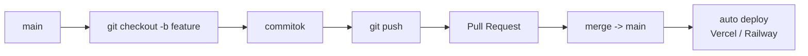

---
tags:
  - git
kapcsolodo:
  - "[[foundations/bash-es-linux-parancssor|Bash és Linux parancssor]]"
  - "[[cloud/vercel|Vercel]]"
  - "[[cloud/railway|Railway]]"
datum: 2026-02-08
szint: "🌱 Newcomer"
---

# Git és GitHub

## Összefoglaló

A Git nyomon követi a kódod változásait -- bármikor visszamehetsz egy korábbi verzióra, és többen dolgozhattok párhuzamosan. A GitHub az ahol a kódod "el" online, és ahonnan a [[cloud/vercel|Vercel]]/[[cloud/railway|Railway]] deployol.

## Mi a Git és miért kell?

Képzeld el hogy van egy Word dokumentumod és Ctrl+Z-vel visszavonod a változásokat. A Git ugyanez, csak:
- **Nem egy fájlra**, hanem az egész projektre vonatkozik
- **Nem csak visszavonás**, hanem bármely korábbi állapothoz visszalephetsz
- **Többen dolgozhattok** egyszerre, és összeolvasztjatok a változásokat

**Miért fontos ha AI-val kódolsz:**
- Ha az AI agent elront valamit -> `git checkout .` és visszaáll minden
- Ha kísérletezz -> branch-en dolgozol, ha nem jó: törlöd
- A Vercel/Railway automatikusan deployol ha push-olsz GitHubra

## A 3 hely ahol a kódod van

```
Working Directory -> Staging Area -> Repository
  (a fajljaid)       (ami menni fog)   (elmentett verzio)
```

1. **Working directory** -- a mappad ahol dolgozol
2. **Staging area** -- amit kijeloltel hogy az következo mentésbe (commit) kerüljon
3. **Repository** -- az elmentett verziók halmaza

## Alapparancsok -- a mindennapok

| Parancs | Mit csinál | Mikor kell |
|---------|------------|------------|
| `git init` | Új Git repo létrehozasa | Projekt elejen, egyszer |
| `git status` | Mi változótt? Mi van staging-ben? | Mindig, mielott commitolsz |
| `git add .` | Az összes változást staging-be teszi | Amikor mindent menteni akarsz |
| `git add fajl.ts` | Csak egy fájlt tesz staging-be | Amikor valogatni akarsz |
| `git commit -m "uzenet"` | Elment egy verziót üzenettel | Amikor egy logikai egyseg kesz |
| `git log --oneline` | Korábbi commitok listaja | Megnezni mi tortent |
| `git diff` | Mi változótt a fájlokban | Mielott commitolsz, atnezni |

## Commit -- a "mentés gomb"

Egy commit = a projekt egy pillanatkipe. Minden commithoz tartozik:
- Egyedi azonosito (hash): `a1b2c3d`
- Üzenet: mit csináltal
- Idopont és szerzo

**Jó commit üzenet:** Rovid, leirja MIT csináltal és Miért
```
feat: add user login page
fix: resolve database connection timeout
```

**Best practice AI-val valo fejleszteshez:**
- **Commitolj gyakran** -- ha az AI agent csinált egy működo valtoztatast, azonnal commitold. Ha a következo valtoztatas elront valamit, könnyű visszaállni
- **Ne commitolj mindent egybe** -- ha az agent 5 fájlt módosított, de 3 egy feature és 2 egy másik, csináld 2 commitban

## Branch -- párhuzamos munka

A branch egy "párhuzamos valóság" a kódodban. Az eredeti kod (`main`) nem valtozik, amig a branchen dolgozol.

```
main:     A -> B -> C
                    \
feature:             D -> E -> F
```

| Parancs | Mit csinál |
|---------|------------|
| `git branch` | Milyen branchek vannak |
| `git branch feature-nev` | Új branch létrehozasa |
| `git checkout feature-nev` | Átváltás a branchre |
| `git checkout -b feature-nev` | Létrehozas + átváltás egyben |
| `git merge feature-nev` | Branch beolvasztasa a jelenlegibe |
| `git branch -d feature-nev` | Branch törlése (ha már merge-olve) |

**Best practice AI-val valo fejleszteshez:**
- **Minden feature-nek új branch** -- ha az AI agent nagy valtoztatast csinál, csináld branchen
- Ha elromlik valami -> `git checkout main` és ott vagy ahol voltal
- A Vercel automatikusan preview deploy-t csinál minden branchhez

## GitHub -- a kod online otthona

A Git lokálisan működik a gépeden. A **GitHub** az ahol:
- A kod online tarolva van (backup)
- Masok (és a Vercel/Railway) hozzáfernek
- Pull Request-ekkel atnezed a változásokat

| Parancs | Mit csinál |
|---------|------------|
| `git remote add origin URL` | GitHub repo hozzárendelese |
| `git push origin main` | Kod feltöltése GitHubra |
| `git push -u origin main` | Feltöltés + megjegyzi (utána eleg `git push`) |
| `git pull` | Legfrissebb verzió lehuzasa GitHubrol |
| `git clone URL` | Meglevo repo letöltése |

## .gitignore -- amit NE tolts fel

A `.gitignore` fájl megmondja a Git-nek mit hagyjon ki:

```gitignore
node_modules/        # fuggosegek (npm install ujra letolti)
.env                 # titkos kulcsok, API key-ek
.env.local           # lokalis environment valtozok
.next/               # Next.js build mappa
dist/                # build output
.DS_Store            # macOS rendszerfajl
```

> [!danger] Titok felkerult GitHubra
> Ha egyszer felkerult GitHubra egy API kulcs vagy jelszó, akkor már keso gitignore-olni. A Git history-ban benne marad -- barki lathatja. Ilyenkor **azonnal új kulcsot kell generalni**, és a regit invalidalni.

## Pull Request (PR) -- valtoztatas atnezese

A PR egy keres: "ezeket a változatasokat szeretnem beolvasztani a main-be". GitHub-on jon letre.

```
1. Csinalsz egy branch-et -> dolgozol rajta
2. Push-olod GitHubra
3. GitHub-on nyitsz egy Pull Request-et
4. Atnezed (vagy masok atnezik) a valtozasokat
5. Merge -> beolvad a main-be
6. Vercel automatikusan deployol
```

**Best practice:**
- Nézd at a PR diff-et mielott merge-olsz -- AI is hibazhat
- A PR-nek legyen leirasa: mit csinál és miért

## Visszaállítas -- ha valami elromlik

| Helyzet | Parancs | Mit csinál |
|---------|---------|------------|
| Még nem commitoltam, mindent vissza | `git checkout .` | Visszaállítja az összes fájlt az utolso commitra |
| Egy fájlt akarok visszaállítani | `git checkout -- fajl.ts` | Csak azt az egyet allitja vissza |
| Commitoltam de még nem pushotam, vissza | `git reset HEAD~1` | Visszavonja az utolso commitot (a fájlok maradnak) |
| Korábbi állapotot akarok megnezni | `git log --oneline` -> `git checkout a1b2c3d` | "Idoutazas" egy regi commithoz |
| Pusholva van, de vissza akarok | `git revert a1b2c3d` | Új committal visszacsinalja a regit (biztonságos) |

**Best practice:**
- Mielott nagy valtoztatast csinálsz -> `git status` és ha kell `git stash` (felreteszi a jelenlegi változásokat)
- Ha az AI agent teljesen szetcseszte a kódot -> `git checkout .` és kezded elorol
- **Ne használj `git reset --hard`-ot** hacsak nem tudod pontosan mit csinál -- ez veglegesen töröl

## GitHub CLI (`gh`) -- gyorsabb mint a bongeszo

```bash
# Telepites
brew install gh

# Bejelentkezes
gh auth login

# Repo letrehozasa az aktualis mappabol
gh repo create projekt-nev --public --source=.

# PR nyitasa
gh pr create --title "Add user auth" --body "Login es register oldal"

# PR-ek listazasa
gh pr list

# Issue letrehozasa
gh issue create --title "Bug: login nem mukodik"
```

## Branch -> commit -> merge flow



## Fo tanulsagok
- **Commitolj gyakran** -- foleg ha AI-val dolgozol, minden működo állapotot ments
- **Branch minden feature-nek** -- így a main mindig működik
- A `.gitignore` az első fájl amit beállítász -- titkok NE kerüljenek GitHubra
- `git checkout .` a mentoov ha az AI agent elront valamit
- A GitHub + Vercel/Railway integracio = push és automatikusan deployol
- PR-eket érdemes atnezni mielott merge-olod, akkor is ha AI irta

## Kapcsolodo anyagok
- [[foundations/bash-es-linux-parancssor|Bash és Linux parancssor]]
- [[cloud/vercel|Vercel]]
- [[cloud/railway|Railway]]
- [[cloud/docker-alapok|Docker alapok]]
