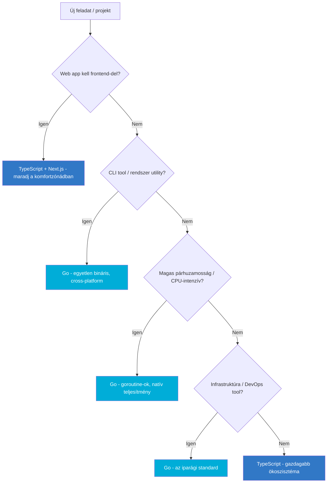

---
tags:
  - nyelv
  - backend
datum: 2026-03-26
szint: "🧱 Brick"
kapcsolodo:
  - "[[foundations/nodejs|Node.js]]"
  - "[[foundations/typescript-vs-python|TypeScript vs Python]]"
  - "[[backend/hono|Hono]]"
  - "[[cloud/cloudflare|Cloudflare]]"
  - "[[cloud/docker-alapok|Docker]]"
---

# Go (Golang)

> [!tldr] Mi ez és mire jó?
> A Go a Google által fejlesztett, statikusan típusos, kompilált nyelv. Egyetlen binárisra fordul, nincs runtime dependency, natív párhuzamosság (goroutine-ok), és rendkívül gyors. A cloud-native infrastruktúra nyelve - [[cloud/docker-alapok|Docker]], Kubernetes, Terraform, Prometheus mind Go-ban íródott.

## Miért létezik - és miért nem JS

A Go-t 2009-ben a Google mérnökei tervezték egy konkrét problémára: **a belső C++ és Java kódbázisok túl lassúak voltak fordítani, túl bonyolultak voltak karbantartani, és nem kezelték jól a párhuzamos végrehajtást**.

A Go filozófiája szándékosan **minimális**:
- Nincs öröklődés, nincs generikus típus (2022-ig nem volt), nincs kivételkezelés (try/catch)
- Egyetlen helyes módja van a legtöbb dolognak - a kód olvashatóbb
- A fordító gyors - nagy projektek is másodpercek alatt fordulnak
- A futtatható fájl egyetlen bináris, nincs `node_modules`, nincs virtualenv

> [!info] A Go kompromisszuma
> A Go szándékosan feláldozza a nyelvi expresszivitást (kevesebb feature) a **karbantarthatóságért és teljesítményért**. Ha TypeScript-ből jössz, először "primitívnek" érzed - de pont ez az ereje.

---

## Go vs TypeScript - fejlesztői perspektíva

| Szempont | Go | TypeScript |
|---|---|---|
| **Típusrendszer** | Statikus, fordításidejű, egyszerű | Statikus, de rugalmasabb (union, generic, utility types) |
| **Futtatás** | Kompilált - egyetlen bináris | Interpretált (Node.js/Bun runtime kell) |
| **Párhuzamosság** | Natív goroutine-ok + channel-ek | Event loop (single-threaded, async/await) |
| **Dependency kezelés** | `go mod` - beépített, egyszerű | npm/pnpm - hatalmas ökoszisztéma, de `node_modules` overhead |
| **Deploy méret** | 5-15 MB (egyetlen bináris) | 100+ MB (Node.js + node_modules) |
| **Cold start** | ~0ms (natív bináris) | 50-500ms (Node.js bootup) |
| **Web framework** | Standard library elég, vagy Gin/Echo/Fiber | Next.js, Hono, Express - gazdag ökoszisztéma |
| **Tanulási görbe** | Egyszerű nyelv, de más gondolkodásmód | Ismerős (JS alapú) |
| **Error handling** | Explicit `if err != nil` (verbose de egyértelmű) | try/catch (tömörebb, de elrejtheti a hibákat) |
| **AI/LLM integráció** | Kevesebb library, de API hívásokra tökéletes | AI SDK, LangChain - gazdag ökoszisztéma |

---

## A Go nyelv kulcs elemei

### Goroutine-ok - miért gyorsabb mint Node.js párhuzamos feladatoknál

A Node.js **egyetlen szálon** fut event loop-pal. I/O-ra kiváló (API hívások, DB query-k), de CPU-intenzív feladatokra nem.

A Go-ban a **goroutine** egy könnyűsúlyú szál (~2KB stack, nem OS szál). Ezreket, akár százezreket indíthatsz:

```go
// 10,000 párhuzamos feladat - Go-ban triviális
for i := 0; i < 10000; i++ {
    go processItem(i)  // "go" kulcsszó = új goroutine
}
```

Node.js-ben ehhez worker thread-ek vagy külső queue (BullMQ) kellene.

### Interface-ek - implicit implementáció

Go-ban nincs `implements` kulcsszó. Ha egy struct-nak megvannak a megfelelő metódusai, automatikusan implementálja az interface-t:

```go
type Writer interface {
    Write([]byte) (int, error)
}
// Bármi ami rendelkezik Write metódussal - automatikusan Writer
```

Ez nagyon hasonlít a TypeScript structural typing-jához - ha a shape stimmel, típuskompatibilis.

### Error handling - nincs try/catch

Go-ban a hibák **visszatérési értékek**, nem kivételek:

```go
result, err := doSomething()
if err != nil {
    return fmt.Errorf("doSomething failed: %w", err)
}
```

Verbose, de soha nem felejted el kezelni a hibát - a fordító figyelmeztet ha elhanyagolod.

---

## Mire használják - a Go ökoszisztéma

### Infrastruktúra és DevOps (a Go otthona)

Szinte az **összes modern cloud-native tool** Go-ban íródott:
- **Docker** - konténerizáció
- **Kubernetes** - konténer orkesztráció
- **Terraform** - infrastruktúra mint kód
- **Prometheus** - monitoring
- **Grafana Agent** - metrika gyűjtés
- **Caddy** - webszerver (automatikus HTTPS)
- **Hugo** - statikus oldal generátor

### CLI toolok

A Go tökéletes CLI-khez: egyetlen bináris, cross-compile bármilyen OS-re, gyors indulás:
- **cobra** - CLI framework (kubectl, gh, docker mind ezt használja)
- **bubbletea** - TUI (terminal UI) framework

### Backend API-k

Ahol Go erősebb mint Node.js/[[backend/hono|Hono]]:
- **Magas párhuzamosság** - 100K+ egyidejű kapcsolat goroutine-okkal
- **CPU-intenzív** feldolgozás (kép, videó, kriptográfia)
- **Alacsony latency** kell - nincs GC pause mint JVM-nél, nincs event loop bottleneck
- **Microservice-ek** - kis bináris, gyors start, Docker-barát

Ahol Node.js/Hono jobb marad:
- **Fullstack web app** (SSR, RSC) - [[frontend/nextjs|Next.js]], nincs Go-s megfelelő
- **AI/LLM integráció** - AI SDK ökoszisztéma jóval gazdagabb
- **Gyors prototípus** - TypeScript-ben gyorsabb iterálni
- **Frontend + backend egy codebase-ben** - Go-ban ez nem járható

---

## Go és [[cloud/cloudflare|Cloudflare]] Workers

> [!warning] Go NEM fut natívan Cloudflare Workers-on
> A Workers V8 isolate-okban futnak (JavaScript/WASM). Go-t **WASM-ra** fordíthatod (`GOOS=js GOARCH=wasm go build`), de ez jelentős limitációkkal jár (nincs goroutine, nincs file I/O, nagyobb bundle). **Ha Workers-re deployolsz, maradj JS/TS-nél vagy Hono-nál.**

Ahol a Go + Cloudflare **jól működik**:
- **Cloudflare Tunnel** (cloudflared) - Go-ban írt
- **Go backend egy Docker konténerben** - Cloudflare előtt mint CDN/proxy
- **[[cloud/vercel|Vercel]] Serverless Functions** - Go-t is támogatja runtime-ként

---

## Go a Vercel-en

A [[cloud/vercel|Vercel]] Serverless Functions natívan támogatja a Go-t:

```text
api/
  hello.go      <- Go serverless function
  users.go      <- másik Go endpoint
```

Minden `.go` fájl az `api/` mappában automatikusan API endpoint lesz. De a legtöbb esetben a Next.js Route Handler-ek + TypeScript jobb megoldás, mert:
- Közös codebase a frontend-del
- AI SDK integráció
- Gazdagabb middleware ökoszisztéma

**Go Vercel function-t akkor válaszd**, ha CPU-intenzív backend logikád van (kép feldolgozás, kriptográfia) és a TypeScript runtime nem elég gyors.

---

## Mikor tanulj Go-t - döntési fa



> [!tip] Ökölszabály
> **TypeScript** = ha web-hez kapcsolódik, AI-t integrálsz, vagy gyorsan kell prototípus.
> **Go** = ha CLI-t, backend microservice-t, vagy infra toolt építesz ahol a teljesítmény és a deploy egyszerűség számít.
> **Mindkettő** = Go backend + Next.js frontend (de a legtöbb projektnél ez overengineering).

---

## Setup - ha el akarod kezdeni

```bash
# macOS telepítés
brew install go

# Verzió ellenőrzés
go version

# Új projekt
mkdir myproject && cd myproject
go mod init github.com/username/myproject

# Futtatás
go run main.go

# Build (egyetlen bináris)
go build -o myapp main.go
./myapp

# Cross-compile (Linux-ra macOS-ról)
GOOS=linux GOARCH=amd64 go build -o myapp-linux main.go
```

---

## Hasznos toolok Go fejlesztéshez

| Tool | Mire jó |
|---|---|
| **gopls** | Go Language Server (VS Code, Neovim) |
| **golangci-lint** | Linter csomag (mint ESLint a JS-hez) |
| **air** | Hot reload dev-hez (mint nodemon) |
| **cobra** | CLI framework |
| **gin / echo / fiber** | Web framework-ok (mint Express/Hono) |
| **sqlc** | SQL - Go kód generálás (mint [[database/drizzle|Drizzle]], de fordított irány) |
| **templ** | HTML template-ek Go-hoz (mint JSX, de szerver-oldali) |

---

## Go és a modern backend trend: HTMX + Go

Egy felkapott pattern: **Go backend + HTMX frontend** - nincs [[frontend/react-vs-spa-vs-preact|React]], nincs build step, szerver-oldalon renderelt HTML amit HTMX interaktívvá tesz. Egyszerűbb mint a fullstack JS, de limitáltabb is.

Ez akkor érdekes, ha:
- Belső admin tool kell, nem kell fancy UI
- Nem akarsz JS build pipeline-t
- A Go backend már megvan

De a legtöbb modern webprojektnél inkább Next.js a jobb választás - gazdagabb UI, AI SDK integráció, SSR.

---

## Hasznos linkek

- **Hivatalos site:** https://go.dev
- **Tour of Go (interaktív tutorial):** https://go.dev/tour
- **Go by Example:** https://gobyexample.com
- **Standard library docs:** https://pkg.go.dev/std
- **Effective Go (best practices):** https://go.dev/doc/effective_go

---

## AI-natív fejlesztés

A Go kód generálása AI-val jól működik, mert a nyelv szándékosan egyszerű és kevés "helyes megoldás" van. Claude Code tud Go-t írni, de a TypeScript ökoszisztéma gazdagabb - ha Go-ban dolgozol, add meg a kontextust a CLAUDE.md-ben.

> [!tip] Hogyan használd AI-val
> - *"Go CLI toolt szeretnék cobra-val - generáld a projekt struktúrát és a fő parancsokat"*
> - *"Írj egy Go HTTP szervert a standard library-vel, ami JSON API-t szolgál ki"*
> - *"Fordítsd le ezt a TypeScript logikát Go-ra - goroutine-okkal párhuzamosítva"*

---

## Kapcsolódó

- [[foundations/nodejs|Node.js]] - a TypeScript runtime, Go alternatívája web-re
- [[foundations/typescript-vs-python|TypeScript vs Python]] - nyelv választás döntési fa (Go hova illeszkedik)
- [[backend/hono|Hono]] - ha Go-s minimalizmus kell de JS-ben akarsz maradni
- [[cloud/docker-alapok|Docker]] - Go binárisok tökéletesek Docker-hez (apró image-ek)
- [[cloud/cloudflare|Cloudflare]] - Go nem fut Workers-on, de az infra toolok Go-ban vannak
- [[foundations/runtime|Runtime]] - hogyan viszonyul a Go más runtime-okhoz
