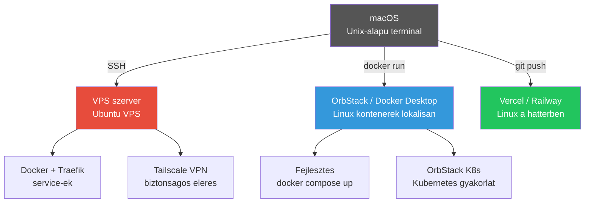
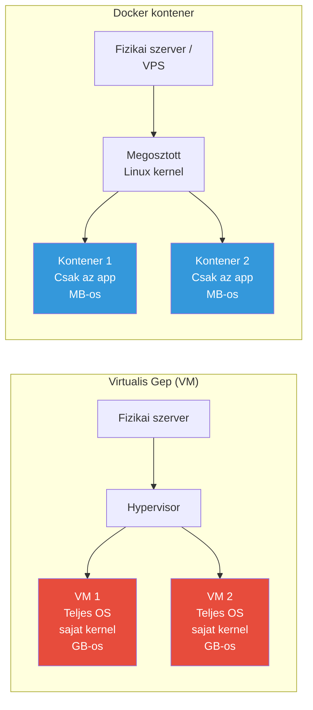

---
tags:
  - linux
  - devops
kapcsolodo:
  - "[[foundations/bash-es-linux-parancssor|Bash es Linux parancssor]]"
  - "[[foundations/bash-es-linux-parancssor-2|Bash es Linux parancssor 2]]"
  - "[[cloud/docker-alapok|Docker alapok]]"
  - "[[cloud/docker-compose|Docker Compose]]"
  - "[[cloud/kubernetes-bevezeto|Kubernetes bevezeto]]"
  - "[[toolbox/tmux|tmux]]"
  - "[[foundations/halozatok-es-ip-cimek|Halozatok es IP cimek]]"
  - "[[cloud/devops|DevOps]]"
datum: 2026-02-08
szint: "🌱 Newcomer"
---

# Linux

A **Linux** egy nyilt forraskodu operacios rendszer kernel, es az erre epulo disztribuciok (Ubuntu, Debian, Alpine stb.) osszefoglalo neve. A szerverek tulnyomo tobbsege Linux-ot futtat, a [[cloud/docker-alapok|Docker]] kontenerek is Linux-alapuak, es a macOS terminal is Unix-parancsokra epul.

> [!tldr] Miert kell a Linux?
> Nem azert mert Linux desktopot hasznalsz -- hanem mert **minden amire deployolsz, Linux-ot futtat**: a VPS-ed, a Docker kontenered, a Railway/Vercel mogotti infrastruktura, meg a [[cloud/kubernetes-bevezeto|Kubernetes]] pod-ok is. Ha ertesz hozza, nem vagy kiszolgaltatva.

---

## Hol talalkozol Linux-szal?



| Kontextus | Mi fut ott | Disztribucio |
|-----------|-----------|--------------|
| **VPS szerver** | Service-ek, reverse proxy | Ubuntu 22.04 |
| **Docker kontenerek** | App image-ek, DB-k, dev environment | Alpine / Debian slim |
| **OrbStack** (lokalis) | Docker + Kubernetes macOS-en | Linux VM a hatterben |
| **[[cloud/railway|Railway]]** | Managed platform, de a kontenered Linux-on fut | Nixpacks / Docker |
| **[[cloud/vercel|Vercel]]** | Serverless function-ok | Amazon Linux (hatter) |
| **Terminal** | A terminalod Unix -- ugyanazok a parancsok | macOS (Unix) |

---

## Disztribuciok amikkel talalkozol

| Disztribucio | Hol | Package manager | Jellemzo |
|---|---|---|---|
| **Ubuntu** | VPS-ek (DigitalOcean, Hetzner stb.) | `apt` | Legelterjedtebb, nagy community, LTS verziok |
| **Debian** | Docker base image, szerverek | `apt` | Stabil, minimalis, Ubuntu erre epul |
| **Alpine** | Docker kontenerek | `apk` | Nagyon kicsi (~5MB), gyors pull/build |
| **Amazon Linux** | AWS, Vercel hatter | `yum`/`dnf` | RHEL-alapu, cloud-optimalizalt |

> [!tip] Docker image valasztas
> Mindig `-alpine` vagy `-slim` image-et hasznalj ha teheted (`node:20-alpine`, `python:3.12-slim`). Kisebb image = gyorsabb build, gyorsabb deploy, kisebb attack surface. Lasd [[cloud/docker-alapok|Docker alapok]].

---

## Linux a gyakorlatban: VPS kezeles

### Elso bejelentkezes egy uj VPS-re

```bash
# SSH kulcsos belepes
ssh root@VPS_IP

# Elso dolgok:
apt update && apt upgrade -y        # Frissitesek telepitese
adduser deploy                       # Non-root user letrehozasa
usermod -aG sudo deploy              # Sudo jog adasa
```

### SSH kulcs beallitas (jelszo helyett)

```bash
# A sajat gepeden:
ssh-keygen -t ed25519 -C "email@example.com"
ssh-copy-id deploy@VPS_IP

# Utana jelszavas login kikapcsolasa a szerveren:
sudo nano /etc/ssh/sshd_config
# PasswordAuthentication no
sudo systemctl restart sshd
```

### Tuzfal (UFW)

```bash
sudo ufw allow 22/tcp     # SSH
sudo ufw allow 80/tcp     # HTTP
sudo ufw allow 443/tcp    # HTTPS
sudo ufw enable
sudo ufw status
```

> [!warning] Mindig engedelyezd az SSH-t (22) mielott bekapcsolod a tuzfalat!
> Kulonben kizarod magad a szerverrol.

### Tailscale a VPS-en

```bash
# Telepites
curl -fsSL https://tailscale.com/install.sh | sh
sudo tailscale up

# Ezutan a VPS elerheto a Tailscale IP-jen, nem kell publikus port
# SSH: ssh deploy@100.x.y.z (Tailscale IP)
```

---

## Linux + Docker (a fo use case)

A legtobb Linux szerver-interakciod Docker-on keresztul tortenik -- nem kozvetlenul telepitesz a szerverre semmit, hanem kontenerekben futtatod.

### Docker telepites VPS-re

```bash
# Ubuntu-n:
curl -fsSL https://get.docker.com | sh
sudo usermod -aG docker deploy    # Docker futtatas sudo nelkul
# Kijelentkezes + visszajelentkezes kell hogy ervenyesuljon
```

### Tipikus VPS stack

```bash
# docker-compose.yml -- service-ek + Traefik + PostgreSQL
docker compose up -d        # Hatterben inditas
docker compose logs -f      # Logok kovetese
docker compose down         # Leallitas (volume marad!)
```

Reszletes leiras: [[cloud/docker-compose|Docker Compose]]

### OrbStack (lokalis Docker macOS-en)

Az OrbStack egy konnyu Docker Desktop alternativa macOS-en:
- Docker kontenerek futtatasa **Linux VM-ben** a hatterben
- Beepitett Kubernetes cluster (K8s gyakorlathoz)
- Gyorsabb es kevesebb RAM-ot eszik mint a Docker Desktop

```bash
# Telepites
brew install orbstack

# Hasznalat -- ugyanazok a docker parancsok:
docker run -p 3000:3000 my-app
docker compose up -d

# K8s cluster engedelyezese OrbStack settings-ben
kubectl get pods    # Kubernetes parancsok azonnal mukodnek
```

---

## Alap Linux parancsok (ami mindig kell)

### Fajlkezeles

| Parancs | Mit csinal | Pelda |
|---------|-----------|-------|
| `ls -la` | Fajlok listazasa (rejtett + jogosultsagok) | `ls -la /var/log/` |
| `cd` | Konyvtar valtas | `cd /home/deploy/app` |
| `pwd` | Hol vagyok most | `pwd` -> `/home/deploy` |
| `mkdir -p` | Konyvtar letrehozas (+ szulo mappak) | `mkdir -p /app/data/logs` |
| `cp -r` | Masolas (rekurziv) | `cp -r ./build /var/www/` |
| `mv` | Athelyezes / atnevezes | `mv old-name.txt new-name.txt` |
| `rm -rf` | Torles (rekurziv, force) | `rm -rf /tmp/cache` |

### Szoveg es kereses

| Parancs | Mit csinal | Pelda |
|---------|-----------|-------|
| `cat` | Fajl tartalom kiirasa | `cat .env` |
| `head -20` | Elso 20 sor | `head -20 access.log` |
| `tail -f` | Utolso sorok, eloben kovetes | `tail -f /var/log/syslog` |
| `grep` | Kereses szovegben | `grep "ERROR" app.log` |
| `grep -r` | Kereses rekurzivan fajlokban | `grep -r "API_KEY" .` |
| `wc -l` | Sorok szama | `cat log.txt \| wc -l` |

### Folyamatok

| Parancs | Mit csinal | Pelda |
|---------|-----------|-------|
| `ps aux` | Futo folyamatok | `ps aux \| grep node` |
| `top` / `htop` | Elo rendszer monitor | `htop` |
| `kill PID` | Folyamat leallitasa | `kill 12345` |
| `kill -9 PID` | Eroszakos leallitas | `kill -9 12345` |
| `lsof -i :PORT` | Ki foglalja a portot | `lsof -i :3000` |
| `pkill -f` | Nev alapu kill | `pkill -f "next dev"` |

### Halozat

| Parancs | Mit csinal | Pelda |
|---------|-----------|-------|
| `curl` | HTTP keres kuldese | `curl -I https://example.com` |
| `wget` | Fajl letoltese | `wget https://example.com/file.zip` |
| `ss -tlnp` | Nyitott portok listazasa | `ss -tlnp` |
| `ping` | Elerheto-e egy host | `ping google.com` |
| `ip addr` | Sajat IP cimek | `ip addr show` |

### Jogosultsagok

```bash
chmod 755 script.sh    # Owner: rwx, Group: rx, Others: rx
chmod 600 .env         # Csak owner olvashatja/irhatja (titkos fajloknak!)
chown deploy:deploy /app  # Tulajdonos valtas
```

Reszletes leiras: [[foundations/bash-es-linux-parancssor|Bash es Linux parancssor]], [[foundations/bash-es-linux-parancssor-2|Bash es Linux parancssor 2]]

---

## Linux + AI fejlesztoeszkozok

A legtobb AI fejlesztoeszkoz terminalbol fut, es a parancsok amiket kiad, Linux/Unix parancsok:

```bash
# Tipikus parancsok amik a hatterben futnak:
ls, cat, grep, find              # fajl muveletek
git status, git diff, git commit  # Git (Linux-on epul)
docker compose up                 # Docker
ssh deploy@vps-ip                 # VPS kezeles
```

> [!tip] SSH es fejlesztoeszkozok
> AI fejlesztoeszkozok nem tudnak kozvetlenul SSH-zni a VPS-edre, de:
> 1. Lokalisan generaltathatod veluk a scripteket, Dockerfile-okat, docker-compose.yml-t
> 2. `scp`-vel vagy `rsync`-kel felrakod a szerverre
> 3. Vagy: az AI eszkozt **a VPS-en** is futtathatod SSH session-bol

---

## Fajlrendszer -- amit tudni kell

| Utvonal | Mire valo |
|---------|-----------|
| `/home/deploy/` | A te user-ed home konyvtara |
| `/root/` | Root user home (ne hasznald napi szinten) |
| `/etc/` | Konfiguracios fajlok (nginx, ssh, stb.) |
| `/var/log/` | Logfajlok |
| `/var/lib/docker/` | Docker adatok (image-ek, volume-ok) |
| `/tmp/` | Ideiglenes fajlok (reboot-nal torlodik) |
| `/opt/` | Opcionalis szoftverek (custom app-ok) |

---

## VM vs kontener -- mi a kulonbseg?



| Szempont | VM (Virtual Machine) | Docker kontener |
|----------|---------------------|----------------|
| **Izolacio** | Teljes -- sajat OS kernel | Reszleges -- megosztott kernel |
| **Meret** | GB-ok (teljes OS) | MB-ok (csak az app) |
| **Indulas** | Percek | Masodpercek |
| **Hasznalat** | VPS, fejlesztoi VM (OrbStack) | App futtatas, microservice-ek |
| **Pelda** | `ssh root@vps-ip` | `docker run nginx:alpine` |

**A VPS-ed egy VM** -> azon belul Docker kontenerek futnak -> az OrbStack meg lokalisan szimulalja ugyanezt.

---

## Kapcsolodo

- [[foundations/bash-es-linux-parancssor|Bash es Linux parancssor]] -- parancssor alapok
- [[foundations/bash-es-linux-parancssor-2|Bash es Linux parancssor 2]] -- halado parancsok
- [[cloud/docker-alapok|Docker alapok]] -- kontenerizacio
- [[cloud/docker-compose|Docker Compose]] -- multi-service setup
- [[cloud/kubernetes-bevezeto|Kubernetes bevezeto]] -- kontener orchestracio
- [[toolbox/tmux|tmux]] -- terminal multiplexer szerveren
- [[foundations/halozatok-es-ip-cimek|Halozatok es IP cimek]] -- networking alapok
- [[cloud/devops|DevOps]]
