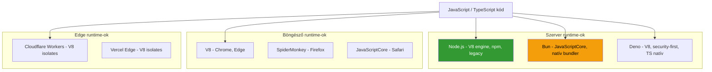

---
tags:
  - runtime
  - alapfogalom
datum: 2026-03-26
szint: "🌱 Newcomer"
kapcsolodo:
  - "[[foundations/nodejs|Node.js]]"
  - "[[foundations/bun|Bun]]"
  - "[[cloud/cloudflare|Cloudflare]]"
  - "[[backend/hono|Hono]]"
  - "[[foundations/yarn|Yarn]]"
---

# Runtime

## Mi az a runtime?

A **runtime** (futtatási környezet) az a rendszer, ami a kódodat ténylegesen végrehajtja. Amikor egy `.ts` vagy `.js` fájlt futtatsz, valami értelmezi és végrehajtja azt - ez a runtime.

> [!tldr]
> **Runtime = a motor ami futtatja a kódot.** Node.js, Bun, Deno a szerveren. V8, SpiderMonkey a böngésződben. Mindegyik JavaScript-et futtat, de más sebességgel, más API-kkal, más filozófiával.



---

## Szerver runtime-ok összehasonlítás

| Szempont | [[foundations/nodejs|Node.js]] | [[foundations/bun|Bun]] | Deno |
|----------|---------|-----|------|
| **Engine** | V8 (Google) | JavaScriptCore (Apple) | V8 (Google) |
| **Csomagkezelő** | npm / yarn / pnpm | `bun install` (beépített) | npm kompatibilis (v2+) |
| **TypeScript** | Kell compiler (tsc/tsx) | Natív - közvetlenül futtat `.ts`-t | Natív |
| **Bundler** | Webpack / Vite / esbuild | Beépített (`bun build`) | - |
| **Teszt runner** | Jest / Vitest | Beépített (`bun test`) | Beépített (`deno test`) |
| **Sebesség** | Alap | **~4x gyorsabb** install, ~3x gyorsabb futtatás | Hasonló Node-hoz |
| **Node.js kompatibilitás** | - | ~95% | ~90% (v2+) |
| **Érettség** | 15+ év, hatalmas ökoszisztéma | Fiatal (2022+), gyorsan fejlődik | Közepes (2020+) |

### Példa: Bun + Next.js

```bash
# Bun-nal futtatjuk a Next.js dev szervert
bun run dev

# Bun-nal telepítünk dependency-ket (~4x gyorsabb mint npm)
bun install

# Bun-nal futtatjuk a seed scriptet
bun run seed:demo
```

---

## Runtime vs. engine vs. framework

Gyakori keveredés - mi mit jelent:

| Fogalom | Mi ez | Példa |
|---------|-------|-------|
| **Engine** | A JS kódot gépi kódra fordítja (JIT compiler) | V8, JavaScriptCore, SpiderMonkey |
| **Runtime** | Engine + API-k (fájlrendszer, hálózat, HTTP) | Node.js, Bun, Deno |
| **Framework** | Runtime-on futó alkalmazás keretrendszer | [[frontend/nextjs|Next.js]], [[backend/express|Express]], [[backend/hono|Hono]] |

```text
Engine (V8)
  -> Runtime (Node.js) - hozzáad: fs, http, crypto, streams
      -> Framework (Next.js) - hozzáad: routing, SSR, API routes
          -> Te kódod
```

---

## Edge runtime

Az **edge runtime** egy könnyített szerver runtime, ami CDN node-okon fut - közel a felhasználóhoz. Nem teljes Node.js - korlátozott API-kkal:

- Nincs `fs` (fájlrendszer)
- Nincs natív modulok (C/C++ binding-ok)
- Korlátozott memória és CPU idő
- Viszont: **nagyon gyors cold start** (~0ms vs Node.js ~200ms)

**Hol találkozol vele:**
- [[frontend/nextjs|Next.js]] `middleware.ts` - edge-en fut, minden request előtt
- [[cloud/cloudflare|Cloudflare]] Workers - V8 isolates
- [[cloud/vercel|Vercel]] Edge Functions

---

## Melyiket válaszd?

| Szituáció | Ajánlás |
|-----------|---------|
| Új Next.js projekt | **Bun** - gyorsabb install és futtatás |
| Legacy Node.js projekt | **Node.js** - ne migráld ha nem muszáj |
| Edge-natív API | [[backend/hono|Hono]] + **Cloudflare Workers** runtime |
| Scriptek, CLI toolok | **Bun** - natív TS, gyors indulás |
| Security-first API | **Deno** - beépített permission rendszer |

---

## AI-natív fejlesztés

A runtime választás közvetlenül befolyásolja az AI-asszisztált fejlesztést: a Claude Code Node.js-en fut, a legtöbb AI SDK (Vercel AI SDK, LangChain) Node.js/Bun-ra épít. Ha érted a runtime-ok közötti különbségeket, jobban tudod megválasztani a megfelelőt az adott projekthez.

> [!tip] Hogyan használd AI-val
> - *"Melyik runtime-ot ajánlod ehhez a projekthez: [projekt leírás]?"*
> - *"Magyarázd el a Node.js event loop-ot - miért blokkolja a CPU-intenzív kód a szervert?"*
> - *"Állítsd be a projektet Bun runtime-mal és jelezd a CLAUDE.md-ben"*

---

## Kapcsolódó

- [[foundations/bun|Bun]] - Bun + Next.js projekt inicializálás
- [[foundations/nodejs|Node.js]] - fő framework ami a runtime-on fut
- [[cloud/cloudflare|Cloudflare]] - edge runtime platform
- [[backend/hono|Hono]] - edge-natív API framework
- [[foundations/yarn|Yarn]] - Node.js csomagkezelő (npm/pnpm alternatíva)
