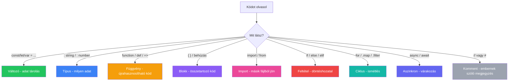

---
tags:
  - nyelv
  - szintaxis
  - alapfogalom
datum: 2026-03-26
szint: "🌱 Newcomer"
kapcsolodo:
  - "[[foundations/python-szintaxis|Python szintaxis]]"
  - "[[foundations/javascript-es-typescript-szintaxis|JavaScript és TypeScript szintaxis]]"
  - "[[foundations/typescript-vs-python|TypeScript vs Python]]"
  - "[[foundations/szoftverfejlesztes-alapjai|Szoftverfejlesztés alapjai]]"
---

# Szintaxis alapok

## Mire jó ez a jegyzet?

Ez a note **nem programozni tanít** - hanem **kódot olvasni**. Ha ránézel egy kódrészletre, tudd felismerni a főbb elemeket: mi a változó, mi a függvény, mi egy típus, mi egy blokk. Mint egy idegen nyelv "szótára" - nem kell mondatokat írnod, csak értsd meg amit olvasol.

> [!tldr]
> Ez a fő "kódolvasás szótár" - a közös fogalmak amik **minden nyelvben** megvannak. A nyelv-specifikus részletekhez lásd: [[foundations/python-szintaxis|Python szintaxis]], [[foundations/javascript-es-typescript-szintaxis|JavaScript és TypeScript szintaxis]].

---

## Változók - az adatok "dobozai"

A **változó** egy név, amihez értéket rendelsz. Olyan mint egy címkézett doboz - belepakolsz valamit, és később a neve alapján visszakapod.

```text
const nev = "Anna"        <- elnevezed, és értéket adsz neki
      ^        ^
      név      érték
```

| Kulcsszó | Nyelv | Mit jelent |
|----------|-------|-----------|
| `const` | JS/TS | Konstans - nem változtatható meg később |
| `let` | JS/TS | Változó - módosítható |
| `var` | JS/TS | Régi stílusú változó (ne használd, de fogod látni régi kódban) |
| `nev = "Anna"` | Python | Nincs kulcsszó - csak hozzárendeled |

```python
# Python - nincs const/let, csak simán adsz értéket
nev = "Anna"
kor = 28
aktiv = True
```

```typescript
// TypeScript - mindig van kulcsszó előtte
const nev = "Anna"
let kor = 28
const aktiv = true
```

> [!tip] Felismerés
> Ha azt látod hogy `valami = ertek` - az egy változó. Ha `const` vagy `let` van előtte - JS/TS. Ha semmi nincs előtte - Python.

---

## Típusok - milyen fajta adat van a dobozban?

A **típus** megmondja, milyen adat van egy változóban. Nem kell megtanulnod az összeset - ezek a leggyakoribbak:

| Típus | Mit jelent | Példa |
|-------|-----------|-------|
| `string` | Szöveg | `"hello"`, `'vilag'`, `` `szia ${nev}` `` |
| `number` | Szám | `42`, `3.14`, `-1` |
| `boolean` | Igen/nem | `true` / `false` (JS) vagy `True` / `False` (Python) |
| `array` / `list` | Lista (több elem sorban) | `[1, 2, 3]`, `["alma", "korte"]` |
| `object` / `dict` | Kulcs-érték párok | `{ nev: "Anna", kor: 28 }` |
| `null` / `undefined` / `None` | "Semmi" / "nincs érték" | `null` (JS), `None` (Python) |

TypeScript-ben **expliciten is megadhatod** a típust:

```typescript
const nev: string = "Anna"       // <- a `: string` mondja meg a típust
const kor: number = 28
const aktiv: boolean = true
const lista: string[] = ["egy", "ketto"]
```

Pythonban a típus opcionális (type hint):

```python
nev: str = "Anna"                # <- `: str` opcionális segítség
kor: int = 28
aktiv: bool = True
lista: list[str] = ["egy", "ketto"]
```

> [!tip] Felismerés
> Ha kettőspontot (`:`) látsz egy változó neve után - az egy típusmegadás. `const x: number = 5` - "x egy szám típusú változó, aminek az értéke 5".

---

## Függvények - újrahasznosítható kódblokkok

A **függvény** egy névvel ellátott kódblokk, amit többször meg tudsz hívni. Olyan mint egy recept: egyszer leírod, utána bárikor elkészítheted.

### Felépítése

```text
function udvozol(nev) {         <- DEFINÍCIÓ: "így kell csinálni"
  return `Szia, ${nev}!`       <- RETURN: amit visszaad
}

udvozol("Anna")                <- HÍVÁS: "csináld meg"
// eredmeny: "Szia, Anna!"
```

| Rész | Mit jelent |
|------|-----------|
| `function` / `def` | "Most egy függvényt definiálok" |
| `udvozol` | A függvény neve |
| `(nev)` | **Paraméter** - mit kap bemenetként |
| `{ ... }` vagy indentáció | A függvény **törzse** - a kód ami lefut |
| `return` | Amit a függvény **visszaad** |

### Különböző szintaxisok

```typescript
// JS/TS - klasszikus
function osszead(a, b) {
  return a + b
}

// JS/TS - arrow function (nyíl függvény) - UGYANAZ, rövidebb szintaxis
const osszead = (a, b) => {
  return a + b
}

// JS/TS - ultra rövid arrow (ha egy sor az egész)
const osszead = (a, b) => a + b
```

```python
# Python - def kulcsszó
def osszead(a, b):
    return a + b

# Python - lambda (ultra rövid, ritkán látod)
osszead = lambda a, b: a + b
```

> [!tip] Felismerés
> - `function` kulcsszó - JS/TS klasszikus függvény
> - `=>` nyíl - JS/TS arrow function (ugyanaz, más szintaxis)
> - `def` kulcsszó - Python függvény
> - Zárójelben a paraméterek: `(a, b)` - "ez a függvény két dolgot kap bemenetként"
> - `return` - "ez az amit a függvény visszaad"

---

## Blokkok - kód csoportosítás

A **blokk** összefoglalja az összetartozó kód sorokat. Ez az egyik legnagyobb különbség a nyelvek között:

### JS/TS: kapcsos zárójelek `{ }`

```typescript
if (aktiv) {               // <- blokk kezdete
  console.log("aktiv")     // <- a blokk belseje
  kuld_email()             // <- még mindig a blokkban
}                          // <- blokk vége
```

### Python: behúzás (indentáció)

```python
if aktiv:                   # <- kettőspont jelzi a blokk kezdetét
    print("aktiv")          # <- 4 szóköz behúzás = a blokkban van
    kuld_email()            # <- még mindig behúzva = blokkban
print("ez már kívül van")  # <- nincs behúzás = kívül van a blokkon
```

> [!warning] A nagy különbség
> **JS/TS-ben** a `{ }` zárójelek jelölik a blokk határait - a behúzás csak szépítés.
> **Pythonban** a behúzás **maga a szintaxis** - ha rosszul húzol be, hibát kapsz.

---

## Objektumok és tömbök - összetett adatszerkezetek

### Tömb / Lista - rendezett elemek

```typescript
// JS/TS - array
const gyumolcsok = ["alma", "korte", "szilva"]
gyumolcsok[0]  // -> "alma" (nullától számol!)
gyumolcsok.length  // -> 3
```

```python
# Python - list
gyumolcsok = ["alma", "korte", "szilva"]
gyumolcsok[0]  # -> "alma"
len(gyumolcsok)  # -> 3
```

### Objektum / Szótár - kulcs-érték párok

```typescript
// JS/TS - object
const felhasznalo = {
  nev: "Anna",
  kor: 28,
  aktiv: true
}
felhasznalo.nev     // -> "Anna"
felhasznalo["kor"]  // -> 28
```

```python
# Python - dictionary (dict)
felhasznalo = {
    "nev": "Anna",
    "kor": 28,
    "aktiv": True
}
felhasznalo["nev"]  # -> "Anna"
```

> [!tip] Felismerés
> - `[...]` szögletes zárójel - **lista/tömb** (rendezett elemek)
> - `{...}` kapcsos kulcs-érték párokkal - **objektum/dict** (névvel elérhető adatok)
> - `.nev` pont-szintaxis - objektum tulajdonság elérése (JS/TS)
> - `["nev"]` szögletes szintaxis - szótár érték elérése (Python)

---

## Import / Export - kód megosztás fájlok között

A valós projektek nem egy fájlban vannak - a kód fájlok között van szétosztva. Az **import** behúz kódot egy másik fájlból.

```typescript
// JS/TS - named import (a leggyakoribb)
import { useState, useEffect } from 'react'
//       ^ konkrétan MIT          ^ HONNAN

// JS/TS - default import
import React from 'react'
//     ^ amit a másik fájl "default"-ként exportált

// JS/TS - mindent importál
import * as schema from './db/schema'
//     ^ mindent betölt "schema" névvel
```

```python
# Python - import
from datetime import datetime
#    ^ HONNAN       ^ MIT

import os
# ^ az egész modult importálja

from pathlib import Path
```

> [!tip] Felismerés
> Ha a fájl elején `import` sorokat látsz - ezek más fájlokból/csomagokból behúzott kódot jelölnek. Az `import` sorok mondják el, milyen "eszközöket" használ az adott fájl.

---

## Kommentek - embernek szóló jegyzetek a kódban

A **komment** olyan szöveg amit a számítógép átugrik - az embernek szól, aki olvassa a kódot.

```typescript
// JS/TS - egysoros komment (dupla perjel)
const x = 5 // ez is komment, sor végén

/* JS/TS - többsoros komment
   több sorban is lehet
   ide bármit írhatsz */
```

```python
# Python - egysoros komment (kettőskereszt)
x = 5  # ez is komment

# Python - többsoros (nincs block comment, soronként #)
# Ez az első sor
# Ez a második sor

"""Python docstring - függvények dokumentálása
Ez nem komment technikailag, hanem string,
de dokumentálásra használják."""
```

---

## Feltételek - döntéshozatal a kódban

Az **if/else** a kód "elágazás" - ha valami igaz, csináld ezt, ha nem, csináld azt.

```typescript
// JS/TS
if (kor >= 18) {
  console.log("felnőtt")
} else if (kor >= 14) {
  console.log("tinédzser")
} else {
  console.log("gyerek")
}
```

```python
# Python
if kor >= 18:
    print("felnőtt")
elif kor >= 14:
    print("tinédzser")
else:
    print("gyerek")
```

| JS/TS | Python | Jelentés |
|-------|--------|---------|
| `if (feltetel) { }` | `if feltetel:` | "ha igaz" |
| `else if` | `elif` | "különben ha" |
| `else { }` | `else:` | "minden más esetben" |
| `&&` | `and` | "ÉS" |
| `\|\|` | `or` | "VAGY" |
| `!` | `not` | "NEM" (tagadás) |
| `===` | `==` | "egyenlő?" |
| `!==` | `!=` | "nem egyenlő?" |

---

## Ciklusok - ismétlés

Ha valamit többször kell csinálni, ciklust használsz:

```typescript
// JS/TS - for...of (lista bejárás)
for (const gyumolcs of gyumolcsok) {
  console.log(gyumolcs)
}

// JS/TS - .map() - NAGYON gyakori React-ben!
const nevek = felhasznalok.map(user => user.nev)
// ^ végigmegy a listán, mindegyikből kiszedi a nevét
```

```python
# Python - for...in
for gyumolcs in gyumolcsok:
    print(gyumolcs)

# Python - list comprehension (tömör listakészítés)
nevek = [user["nev"] for user in felhasznalok]
```

> [!tip] Felismerés
> - `for ... of/in` - végigmegy egy listán egyenként
> - `.map()` - végigmegy egy listán és **átalakítja** az elemeket (új listát ad vissza)
> - `.filter()` - végigmegy és **szűri** az elemeket (ami megfelel a feltételnek, marad)
> - `.forEach()` - végigmegy, de nem ad vissza új listát (csak "csinál valamit")

---

## Async / Await - várakozás

Amikor a kód API-t hív, fájlt olvas, vagy adatbázisból kér adatot, az **időbe telik**. Az `async/await` kezeli ezt a várakozást.

```typescript
// JS/TS
async function felhasznalokBetoltese() {
  const valasz = await fetch('/api/users')  // <- VÁRJ amíg megjön
  const adat = await valasz.json()          // <- VÁRJ amíg feldolgozza
  return adat
}
```

```python
# Python
async def felhasznalok_betoltese():
    valasz = await fetch('/api/users')       # <- VÁRJ
    adat = await valasz.json()               # <- VÁRJ
    return adat
```

| Kulcsszó | Jelentés |
|----------|---------|
| `async` | "Ez a függvény tartalmaz várakozást" - jelöli a függvényt |
| `await` | "VÁRJ erre mielőtt továbblépnél" - jelöli a várakozó műveletet |

> [!tip] Felismerés
> Ha `async`-ot látsz egy függvény előtt - ez a függvény "lassú" dolgokat csinál (hálózat, adatbázis). Ha `await`-et látsz - ott vár a kód valami eredményre. Az `await` nélkül a kód nem várná meg az eredményt.

---

## Összefoglaló - "mit keresek ha ránézek egy kódra?"



---

## AI-natív fejlesztés

A szintaxis alapok ismerete az AI-asszisztált fejlesztés előfeltétele: ha nem tudod olvasni a kódot amit az AI generál, nem tudod review-olni vagy módosítani. Nem kell fejből tudnod mindent - de felismerni igen. Az AI a legjobb "szintaxis szótár": kérdezz rá bármire amit nem értesz.

> [!tip] Hogyan használd AI-val
> - *"Magyarázd el sorról sorra mit csinál ez a kódrészlet: [kód beillesztése]"*
> - *"Mi a különbség a `const` és `let` között? Mikor melyiket használjam?"*
> - *"Nem értem ezt a szintaxist: `const { name, age } = user` - mi történik itt?"*

---

## Kapcsolódó

- [[foundations/python-szintaxis|Python szintaxis]] - Python-specifikus szintaxis szótár
- [[foundations/javascript-es-typescript-szintaxis|JavaScript és TypeScript szintaxis]] - JS/TS specifikus szintaxis és operátorok
- [[foundations/typescript-vs-python|TypeScript vs Python]] - mikor melyik nyelvet használd (döntés, nem szintaxis)
- [[foundations/szoftverfejlesztes-alapjai|Szoftverfejlesztés alapjai]] - a teljes fejlesztési workflow
