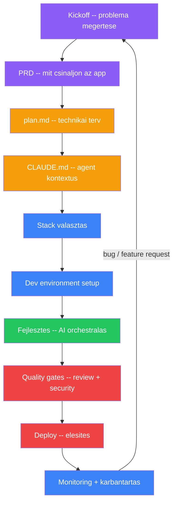
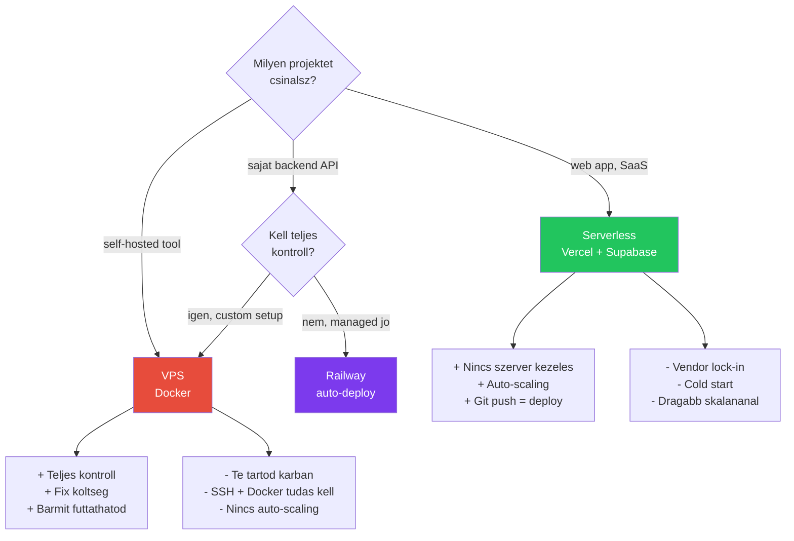

---
tags:
  - workflow
  - fejlesztes
kapcsolodo:
  - "[[cloud/docker-alapok|Docker alapok]]"
  - "[[cloud/docker-compose|Docker Compose]]"
  - "[[foundations/git-es-github|Git és GitHub]]"
  - "[[frontend/nextjs|Next.js]]"
  - "[[cloud/vercel|Vercel]]"
  - "[[cloud/railway|Railway]]"
  - "[[database/supabase|Supabase]]"
  - "[[foundations/linux|Linux]]"
  - "[[_moc/moc-deployment|MOC - Deployment]]"
datum: 2026-02-08
szint: "🧱 Brick"
---

# Szoftverfejlesztes alapjai

Egy komplett workflow guide AI-asszisztalt szoftverfejleszteshez, ahol AI agentek vegzik a kódolast, te pedig orchestralod a folyamatot. A lényeg nem a kod irasa, hanem a **kontextus menedzsment** -- mennyi szabadsagot adsz a modellnek, hogyan struktúralod a projektet, és hogyan tartod kezben a párhuzamos munkat.

> [!tldr] TL;DR
> A szoftverfejlesztes 2026-ban: te vagy a "rendezo", az AI az "operator". A sikeresseged azon mulik, hogy mennyire pontos a "forgatokonyved" (PRD, plan.md, CLAUDE.md) -- nem azon, hogy tudsz-e kódolni.

---

## A teljes workflow attekintese



A fazisok egymasra epulnek, de nem linearisak -- iteralsz. A fejlesztes kozben visszatersz a plan.md-hez, deploy utan jon az új feature, stb.

---

## 1. Kickoff -- probléma megertese

Az első lépés: tisztazni **mit akarunk építeni**. Nem kodrol van szo, hanem a probléma megerteserol. Ez lehet saját otlet, belső igény, vagy ugyfel brief.

### Milyen kerdeseket kell feltenni

| Kerdes | Miért fontos |
|--------|-------------|
| **Ki fogja használni?** | Mas UI kell 5 belső usernek mint 5000 külső felhasználónak |
| **Mi a fo probléma amit megold?** | Ha ezt nem tudod, az app felesleges feature-okkel lesz tele |
| **Mi a minimum ami működik?** (MVP) | Nem kell mindent egyszerre megcsinalni |
| **Van-e meglevo rendszer amit ki kell valtani?** | Migrácio, adatimport, kompatibilitas |
| **Mi a budget / timeline?** | Stack választast és scope-ot befolyasolja |
| **Milyen integracio kell?** | API-k, külső szolgáltatasok, auth provider-ek |

### Kickoff output

A kickoff vegen legyen egy rovid dokumentum ami tartalmazza:
- Probléma leirasa (2-3 mondat)
- Celcsoport
- Fo feature lista (max 10 pont az MVP-hez)
- Integracio igények
- Sikerkriteriumok -- honnan tudjuk hogy kesz?

---

## 2. PRD -- Product Requirements Document

A kickoff outputja egy **PRD** -- ez a "mit csináljon az app" dokumentum. Azert fontos, mert ebbol fog dolgozni az AI agent -- ha a PRD pontatlan, a kod is az lesz.

### PRD struktúra

```markdown
# [Projekt nev] -- PRD

## Osszefoglalo
Mi ez az alkalmazas es kinek szol? (2-3 mondat)

## Problema
Milyen problemat old meg? Miert most?

## Celcsoport
Ki fogja hasznalni? Technikai szintje?

## Fo funkciok (MVP)
1. Funkcio 1 -- rovid leires
2. Funkcio 2 -- rovid leires
3. ...

## User flow
Lepesrol lepesre: mit csinal a user az appal?
1. Megnyitja -> landing page
2. Regisztral -> email + jelszo
3. Dashboard -> projektek listaja
4. ...

## Nem-funkcionalis kovetelmenyek
- Teljesitmeny: mekkora terheles?
- Biztonsag: milyen adatokat kezel?
- Elerhetoseg: 99.9% uptime?

## Stack preferencia
(ha van -- ha nincs, a plan.md fazisban dontjuk el)

## Sikerkriteriumok
Honnan tudjuk, hogy kesz es jo?
```

### Milyen részletesseg kell az agenthez?

| Részletesseg | Mikor | Eredmeny |
|-------------|-------|---------|
| **Vazlatos** (5-10 mondat) | Gyors prototipus, kísérletezzes | Agent szabadon dönt, sok kerdes jon |
| **Kozepes** (1-2 oldal) | Legtobb projekt | Jó egyensuly szabadsag és irany kozott |
| **Részletes** (3+ oldal) | Ugyfel projekt, kritikus app | Agent pontosan azt csinálja amit kersz |

> [!tip] PRD és az AI agent
> A PRD nem az agentnek szol kozvetlenul -- a `plan.md` igen. A PRD neked és az ugyfelnek szol, a plan.md az agent szamara van leforditva.

---

## 3. plan.md -- technikai terv

A PRD-bol készül a **technikai terv**. Ez már az agent szamara irodik -- lépésrol lépésre leirja mit kell implementalni.

### plan.md struktúra

```markdown
# [Projekt nev] -- Technikai terv

## Stack
- Frontend: Next.js 15 + TypeScript + Tailwind
- Backend: Supabase (Postgres + Auth + Storage)
- Hosting: Vercel
- ...

## Fazisok

### Fazis 1: Projekt setup
- [ ] Next.js projekt letrehozasa
- [ ] Supabase projekt letrehozasa
- [ ] Auth setup
- [ ] Adatbazis schema megtervezese

### Fazis 2: Core funkciok
- [ ] Landing page (/)
- [ ] Dashboard (/dashboard)
- [ ] ...

### Fazis 3: Integracio es polish
- [ ] Email notifikacio
- [ ] ...

## Adatbazis schema
(SQL vagy szoveges leires)

## API endpoints
| Method | Path | Leires |
|--------|------|--------|
| GET | /api/projects | Projektek listazasa |
| POST | /api/projects | Uj projekt |
```

### Best practices

- **Fazisonkent haladj** -- ne add ki az egész plan.md-t egyszerre az agentnek, fazisonkent dolgozzatok
- **Checkbox-ok** -- pipald ki ami kesz, így az agent látja hol tart a projekt
- **Frissítsd fejlesztes kozben** -- ha valami valtozik, a plan.md legyen naprakesz
- **Legy konkret az UI-ban** -- "csinálj egy dashboard-ot" =/= "csinálj egy dashboard-ot bal oldali sidebar-ral, ahol a fo tartalomban kartyakon jelennek még a projektek, grid layout-ban"

> [!warning] A leggyakoribb hiba
> Tul vazlatos plan.md -> az agent "kreativkodik" -> nem azt kapod amit akarsz -> ujrairod -> dupla munka. **Inkabb tolts el 30 perccel többet a tervezessel**, mint 2 orat a javitassal.

---

## 4. CLAUDE.md -- agent kontextus

A **CLAUDE.md** a projekt "agyveleje" -- ebbol erti még az agent hogy hol tart, milyen szabalyok vannak, és mit nem szabad csinania. Ez a legfontosabb fájl az egész projektben.

### CLAUDE.md struktúra

```markdown
# CLAUDE.md

## Projekt leires
[1-2 mondat: mi ez az app es kinek szol]

## Tech stack
- [Technologia lista]

## Projekt struktura
[Fo mappak es fajlok leirasa]

## Konvenciok
- [Kod stilus szabalyok]
- [Fajl elnevezesi konvenciok]
- [Commit uzenet formatum]

## Fontos szabalyok
- [Amit SOHA nem csinalhat az agent]
- [Security szabalyok]
- [Teljesitmeny elvarasok]

## Jelenlegi allapot
[Hol tartunk a fejlesztesben, mi a kovetkezo lepes]
```

### Kontextus menedzsment stratégiak

A CLAUDE.md-ben meghatarozod az agent **szabadsagi fokat**:

| Stratégia | Mikor | Példa |
|-----------|-------|-------|
| **Strict** -- minden lépést eleirsz | Ugyfel projekt, kritikus kod | "Használj KIZAROLAG Supabase Auth-ot, NE használj [[backend/jwt|JWT]]-t kozvetlenul" |
| **Guided** -- iranyt adsz, részleteket ra bizod | Legtobb projekt | "Az auth [[backend/clerk|Clerk]]-kel legyen, a részleteket döntsd el te" |
| **Free** -- csak a celt adod még | Prototipus, kisarlet | "Csinálj egy auth rendszert, valaszd ki a legjobb megoldást" |

> [!tip] CLAUDE.md mint "elo dokumentum"
> A CLAUDE.md-t **folyamatosan frissítsd** fejlesztes kozben. Ha az agent rossz iranyba megy, adj hozzá egy szabalyt. Ha valami jol működik, dokumentald.

### Mikor legyen strict vs flexible

- **Strict**: auth, payment, adatkezeles, API design, security -- itt nincs helye kreativitasnak
- **Flexible**: UI layout, component struktúra, utility funkciok -- itt az agent jobban dönthet
- **Fontos**: ha nem specifikalasz valamit, az agent a saját "izlese" szerint dönt -- ez neha jó, neha nem

---

## 5. Stack választas

Milyen technologiakat használunk és miért.

### Tipikus stack kombinaciok

| Projekt tipus | Stack | Mikor |
|--------------|-------|-------|
| **SaaS / ugyfel app** | [[frontend/nextjs|Next.js]] + [[database/supabase|Supabase]] + [[cloud/vercel|Vercel]] | A leggyakoribb -- full-stack, gyors, managed |
| **Saját backend kell** | Next.js + [[cloud/railway|Railway]] + PostgreSQL | Ha a Supabase nem eleg (custom logic, worker-ek) |
| **Landing page** | Next.js + Vercel (static export) | Egyszerű, gyors, ingyenes hosting |
| **Self-hosted tool** | [[cloud/docker-alapok|Docker]] + VPS | Saját service-ek, teljes kontroll |
| **API / microservice** | Node.js/[[backend/hono|Hono]] + Railway | Lightweight backend, nincs frontend |

### Serverless vs VPS -- melyiket valaszd



> [!info] Default stack
> Ha nem tudod mit valassz: **Next.js + Supabase + Vercel**. Ez a legtobb SMB projektre megfelel.

### Stack dokumentum

Minden projekthez készíts egy rovid stack leirast (akar a `plan.md`-ben, akar kulon `STACK.md`-ben):

```markdown
## Stack

| Reteg | Technologia | Miert |
|-------|-------------|-------|
| Frontend | Next.js 15 + TypeScript | App Router, Server Components, Vercel nativ |
| Styling | Tailwind CSS v4 + shadcn/ui | Gyors UI fejlesztes, konzisztens design |
| Backend | Supabase | Postgres + Auth + Storage + Edge Functions |
| ORM | Drizzle | Type-safe, lightweight, jo DX |
| Auth | Supabase Auth / Clerk | Attol fugg mennyire komplex az auth igeny |
| Hosting | Vercel | Auto-deploy, preview PR-enkent |
| Monitoring | Vercel Analytics + PostHog | Alap metrikak + user tracking |
| Security | Aikido | Automatikus GitHub scan |
```

---

## 6. Dev environment setup

A fejlesztoi környezet felallitasa -- ez az a pont ahol a kod ténylegesen elkeszul.

### Projekt indítas nullarol

```bash
# 1. Next.js projekt letrehozasa
bunx create-next-app@latest my-project
cd my-project

# 2. Git repo + GitHub
git init
gh repo create my-project --public --source=.
git push -u origin main

# 3. Alap dependency-k
bun add zod lucide-react clsx tailwind-merge
bun add -d prettier prettier-plugin-tailwindcss

# 4. CLAUDE.md letrehozasa

# 5. Dev szerver inditas
bun run dev
```

### Environment variables kezelese

| Fájl | Mire | Commitolva? |
|------|------|-------------|
| `.env.local` | Lokális fejlesztesi titkos kulcsok | NEM -- `.gitignore`-ban |
| `.env.example` | Template -- milyen változók kellenek | IGEN -- ezt commitold |
| Vercel Dashboard | Production env változók | N/A -- Vercel kezeli |
| Railway Dashboard | Backend env változók | N/A -- Railway kezeli |

```bash
# .env.example (ezt commitolod)
NEXT_PUBLIC_SUPABASE_URL=your-url-here
NEXT_PUBLIC_SUPABASE_ANON_KEY=your-key-here
SUPABASE_SERVICE_ROLE_KEY=your-key-here  # SOHA nem NEXT_PUBLIC_!
```

### Alap dev environment checklist

- [ ] Git repo inicializalva, GitHub-ra push-olva
- [ ] `.gitignore` beállítva (node_modules, .env, .next, dist)
- [ ] `.env.local` + `.env.example` létrehozva
- [ ] CLAUDE.md létrehozva a projekt root-ban
- [ ] `plan.md` elkeszitve a Fazis 1 lépésekkel
- [ ] `bun run dev` működik, localhost-on betolt
- [ ] Vercel-hez csatlakoztatva (ha Vercel-re megy)

---

## 7. Fejlesztes -- AI agent orchestralas

Itt tortenik a tényleges kódolas. Nem te irod a kódot -- az AI agenteket iranyitod.

### Claude Code -- az elsődleges dev tool

A fő fejlesztő eszkoz terminalban fut, kozvetlenul a kódbázisban dolgozik.

**Alapvető workflow:**

```bash
# Session inditas a projekt mappajaban
cd my-project
claude

# Tipikus session: egy feature megcsinalasa
> "Implementald a plan.md Fazis 2 elso pontjat: Dashboard oldal"
> "Csinalj egy /dashboard route-ot, bal oldali sidebar-ral,
>  ahol kartyakon jelennek meg a projektek"
```

**Mikor használd:**
- Minden napi fejlesztesi feladat
- Fájlok létrehozasa, módosítasa, törlése
- Git műveletek (commit, branch, PR)
- Hibakereses (logok elemzese, hiba javitasa)
- Code review
- Refactoring, kod javitas

**Session kezeles:**
- **Rovid session-ok** -- egy feature = egy session. Ha kesz, commitold, zard le
- **Ne futtass tul hosszu session-t** -- 30-60 percnel hosszabb session-ben az agent "elfarad" (context window telik)
- **Compact** -- ha hosszu a session, tomorit és folytathatod
- **Új session** -- ha teljesen mas feladatot csinálsz, indíts ujat

### Párhuzamos fejlesztes

Ha a projekt eleg nagy, **több AI agent dolgozhat egyszerre**:

```bash
# Terminal 1 -- Feature A
cd my-project
claude
> "Implementald az auth rendszert a plan.md alapjan"

# Terminal 2 -- Feature B (worktree-ben)
cd my-project
claude --worktree
> "Implementald a dashboard UI-t"
```

**Worktree vs Branch:**
- **Worktree** -- kulon munkamappa, kulon fájlok, nincs conflict fejlesztes kozben
- **Branch** -- ugyanaz a mappa, de mas git agon
- **Worktree-t használj** ha ket agent egyszerre módosítana ugyanolyan fájlokat

**Merge conflictek kezelese:**
1. Az agentek worktree-ben dolgoznak -> nincs azonnali conflict
2. Ha kesz mindket feature -> merge-old egyenkent main-be
3. Ha van conflict -> az AI agent feloldja: *"oldd fel a merge conflictot a main-en"*

> [!warning] Párhuzamos agentek kockazata
> Ket agent nem dolgozhat **ugyanazon a fájlon** egyszerre. Ha mindketto a `layout.tsx`-et módosítja, conflict lesz. Oszd fel a munkat ugy, hogy a fájlok ne fedjek egymast.

---

## 8. Kontextus menedzsment -- a kulcs

**Ez a szekcio a legfontosabb az egész note-ban.** A nem-technikai fejlesztes sikeressege azon mulik, hogy mennyire jol menedzseled az agent kontektusat.

### Mi az a kontextus ablak?

Az AI agent egy "ablakban" dolgozik -- ez az összes szoveg amit egyszerre lat (a CLAUDE.md, a kod, a beszelgetes). Ha ez megtelik, az agent elkezd "felejteni".

| Fogalom | Egyszerű magyarazat |
|---------|-------------------|
| **Context window** | Az agent "munkamemoriaja" -- kb. egy regeny hossza |
| **Token** | Egy szo kb. 1-2 token. A context window ~200K token (Claude) |
| **Compact** | Az eddigi beszelgetes tomoritese, hogy tovabb tudj dolgozni |

### Mikor kell új session-t indítani

- Ha az agent "furcsa" valaszokat ad -> tele a context
- Ha teljesen mas feladatra valtasz -> tiszta lap jobb
- Ha compact utan is lassan reagal -> új session
- Ha az agent elfelejti amit 10 perce mondtal -> context overflow

### Szabadsagi skala

Mennyire adj szabad kezet az agentnek:

```
STRICT <-------------------------------> FREE
"ird meg PONTOSAN ezt"     "csinald meg ahogy gondolod"

Ugyfel kod      Belso tool      Prototipus
Security        UI polish       Kisarlet
Auth flow       Refactoring     Brainstorm
```

**Strict kontextus jellemzői:**
- Pontos file path-ok a CLAUDE.md-ben
- Tiltolistak ("NE használj X-et")
- Lépésrol lépésre utasitasok
- Code snippet-ek amit követni kell

**Free kontextus jellemzői:**
- Csak a cel van megadva
- Az agent dönt a megvalósítasrol
- Gyorsabb, de kiszamithatatlanabb
- Jó ha a megvalósítas nem kritikus

### Tipikus hibak kontextus menedzsmentben

| Hiba | Következmeny | Megoldás |
|------|-------------|---------|
| **Tul vazlatos prompt** | Agent kreativkodik, nem azt kapod | Legy konkretabb a prompt-ban |
| **Tul hosszu CLAUDE.md** | Agent elvesz benne, fontos szabalyt kihagy | Tomoritsd, priorizald |
| **Nincs CLAUDE.md** | Minden session-ben ujra el kell magyarazni mindent | Mindig legyen CLAUDE.md |
| **Nem commitolsz kozben** | Ha az agent elront valamit, nincs visszaut | Commitolj minden működo állapotot |
| **Tul hosszu session** | Agent "elfarad", inconsistent valaszok | Session-onkent egy feature |
| **Nem nezed at a kódot** | Security lyuk, rossz pattern megy élesbe | Mindig review deploy elott |

---

## 9. Quality gates -- review és security

Mielott bármi production-be menne, vegig kell menni a quality gate-eken.

### Minimum quality gate (minden projekthez)

```
1. Code review                  -- kod minoseg + security
2. bun run build                -- hiba nelkul buildel?
3. Security scan                -- nincs CRITICAL/HIGH vulnerability
4. Lokalis teszteles            -- fo user flow mukodik
5. bun audit                    -- dependency-k rendben
```

### Code review AI-val

```bash
# Session-ben:
"nezd at security szempontbol a kodot"     # Security fokuszu review
"van SQL injection vagy XSS ebben?"        # Specifikus vulnerability kereses
```

> [!warning] AI review != emberi review
> Az AI review jó első szűro, de NEM helyettesiti a manuális atnetest kritikus projekeknel. Auth, payment, és adatkezelo kódot mindig nezz at magad is.

### Security alapelvek

Minden projektre ervenyes, stack-fuggetlenul:

1. **Titkos kulcsok `.env`-ben** -- SOHA nem a kódban
2. **Input validacio** -- minden user input server-side validalva (Zod)
3. **Rate limiting** -- publikus endpoint-okon mindig
4. **HTTPS** -- mindenhol, kivetel nelkul
5. **RLS** -- ha Supabase, minden táblan bekapcsolva
6. **Dependency audit** -- rendszeresen (`bun audit`)
7. **Security scanning** -- GitHub-ra kotve, automatikus scan

---

## 10. Deploy -- élesites

A deploy stack-fuggo.

### Deploy opciok összefoglalo

| Platform | Tipus | Deploy modszer | Mikor |
|----------|-------|---------------|-------|
| [[cloud/vercel|Vercel]] | Serverless | `git push main` -> auto-deploy | Next.js app-ok, landing page-ek |
| [[cloud/railway|Railway]] | PaaS | `git push` -> auto-deploy | Backend API-k, worker-ek, DB |
| VPS | Saját szerver | SSH + `docker compose up -d` | Self-hosted tool-ok |
| [[database/supabase|Supabase]] | BaaS | Dashboard / CLI | DB, Auth, Storage, Edge Functions |

### Vercel deploy (leggyakoribb)

```bash
# 1. GitHub repo csatlakoztatás Vercel-hez (egyszer, webes feluleten)
# 2. Env valtozok beallitasa a Vercel Dashboard-on
# 3. Utana minden push automatikusan deployol:
git add . && git commit -m "feat: add dashboard" && git push
# -> Vercel automatikusan buildel es deployol
```

### VPS deploy (Docker)

```bash
# SSH a szerverre
ssh deploy@vps-ip

# Docker Compose-szal
cd /opt/my-app
docker compose pull        # Friss image-ek lehuzasa
docker compose up -d       # Hatterben inditas
docker compose logs -f     # Logok kovetese
```

Részletek: [[cloud/docker-alapok|Docker alapok]], [[cloud/docker-compose|Docker Compose]], [[foundations/linux|Linux]]

---

## 11. Monitoring és karbantartas

Deploy utan tudnod kell mi tortenik. Nem kell Prometheus-klasztert üzemeltetni -- de a minimum monitoring kötelező.

### Minimum monitoring setup

| Mit figyelsz | Eszkoz | Hogyan |
|-------------|--------|--------|
| **App elérheto-e** | UptimeRobot | Ping check 5 percenkent, email alert (ingyenes) |
| **Szerver metrikak** | Grafana | CPU, RAM, disk (VPS-en) |
| **App hibak** | Vercel/Railway log | Dashboard-on nezed |
| **Security** | Security scanner | Folyamatos scan, alert ha új vulnerability |
| **User behaviour** | PostHog | Feature usage, session replay |

### Iteracio -- az elet deploy utan

A deploy nem a vege -- a **kezdete**:

1. **User feedback** -> új feature request vagy bug report
2. **Monitoring alert** -> hiba investigation + fix
3. **Security alert** -> security patch
4. **Performance issue** -> optimalizacio
5. **Új feature** -> vissza a kickoff-hoz (kisebb scope-pal)

Minden iteracio ugyanazt a workflow-t követi: plan.md frissítes -> fejlesztes -> quality gate -> deploy.

---

## 12. Hibakereses és iteracio

Mi van ha valami nem működik? A debug is AI-asszisztalt -- de tudnod kell hogyan kerdezz.

### Hogyan olvasd a hibauzeneteket

Nem kell ertened a kódot, de a hibauzenetet ertened kell:

| Hibauzenet tipus | Mit jelent | Mit csinálj |
|-----------------|-----------|-------------|
| `500 Internal Server Error` | Szerver oldali hiba -- a kódban van a baj | Nézd még a logot (Vercel/Railway), add még az agentnek |
| `404 Not Found` | Az URL nem letezik | Route hianyzik vagy elgepelve |
| `CORS error` | A frontend nem ferhet hozzá a backend-hez | CORS beállítás hianyzik |
| `TypeError: Cannot read property of undefined` | Egy változó ures amit nem vartal | Az AI agent megtalálja és javitja |
| `Build failed` | A kod nem fordithato | `bun run build` output -> az agentnek |
| `NEXT_PUBLIC_ undefined` | Env változó hianyzik | Env változók beállítása |

### Debug workflow

```bash
# 1. Hibauzenet masolasa
# Vercel: Dashboard -> Deployments -> Function Logs
# Railway: Dashboard -> Deployments -> Logs
# VPS: docker compose logs -f

# 2. AI session-ben:
"Ez a hibauzenet jon production-ben: [PASTE]. Mi okozhatja es hogyan javitsuk?"

# 3. Ha nem talal megoldast:
"Adj mas megkozelitest, ez nem mukodik"
```

### Mikor indíts új session-t vs folytasd a regit

| Folytasd | Indíts ujat |
|----------|------------|
| Ugyanaz a bug, még debuggolod | A bug javitva, teljesen mas feladat jon |
| Az agent erti a kontextust | Az agent "elfelejti" amit mondtal |
| Rovid session (< 30 perc) | Hosszu session (> 60 perc) |
| Osszefuggo változatasok | Fuggetlen feature |

### Mikor kerj emberi segitseget

- **Infra probléma** ami nem kod szintű (DNS, SSL, szerver elérhetoseg)
- **Payment integracio** bug -- penzugyi tranzakciokat ne AI-val debuggolj egyedul
- **Data loss** gyanu -- azonnal allitsd le az appot, mentsd az adatot
- **Security breach** -- jelszavak, kulcsok kiszivarogtak -> azonnali invaldalas

---

## Összefoglaló: a workflow egy kepben

```
Kickoff -> PRD -> plan.md -> CLAUDE.md -> Stack -> Setup ->
  |
Fejlesztes (AI agentek)
  |
Quality gates (review, security scan, build)
  |
Deploy (Vercel / Railway / VPS)
  |
Monitoring (UptimeRobot, Grafana, PostHog)
  |
Iteracio -> vissza a plan.md-hez
```

A lényeg: **te vagy az orchestrator**, az AI az implementator. A minoseg azon mulik, mennyire jol definiálalod a kontextust, és mennyire szigoruan tartod be a quality gate-eket.

---

## Kapcsolodo

- [[cloud/devops|DevOps]] -- a DevOps workflow AI-first kontextusban
- [[cloud/docker-alapok|Docker alapok]] -- konténerizacio alapjai
- [[cloud/docker-compose|Docker Compose]] -- multi-service setup
- [[foundations/git-es-github|Git és GitHub]] -- verziókezeles
- [[frontend/nextjs|Next.js]] -- a fo framework
- [[cloud/vercel|Vercel]] -- serverless hosting
- [[cloud/railway|Railway]] -- PaaS hosting
- [[database/supabase|Supabase]] -- backend szolgáltatas
- [[foundations/linux|Linux]] -- szerver OS alapok
- [[_moc/moc-deployment|MOC - Deployment]]
