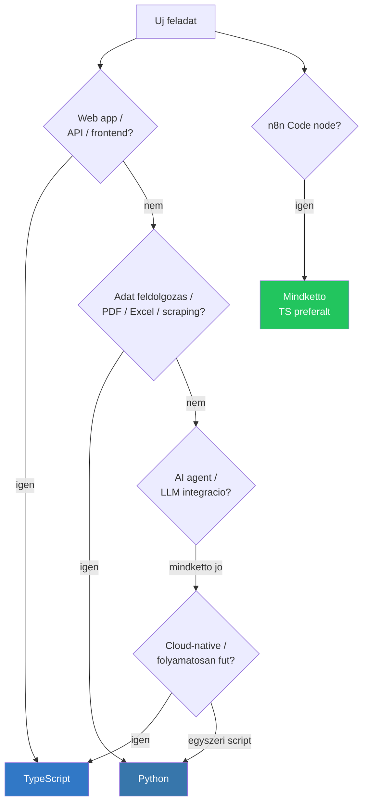
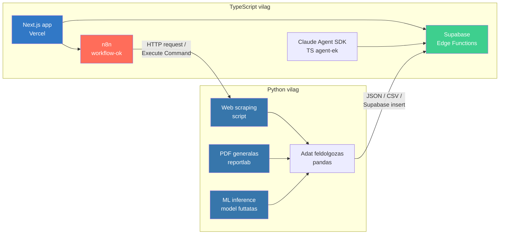

---
tags:
  - typescript
  - python
kapcsolodo:
  - "[[frontend/nextjs|Next.js]]"
  - "[[foundations/python-venv|Python venv]]"
  - "[[database/supabase|Supabase]]"
  - "[[database/drizzle|Drizzle]]"
  - "[[foundations/projekt-szintu-izolacio|Projekt-szintu izolacio]]"
datum: 2026-02-08
szint: "🧱 Brick"
---

# TypeScript vs Python

## Mikor melyiket?

A **TypeScript** es a **Python** ket teljesen kulonbozo filozofiaju nyelv, de egy modern stack-ben mindkettonek megvan a helye. A lenyeg: **nem kell valasztani** -- tudni kell mikor melyik a jobb eszkoz.



> [!tldr] Huvelykujj-szabaly
> **TypeScript** = ha a kod production-ben fut, masok is hasznaljak, vagy web-hez kapcsolodik.
> **Python** = ha egyszeri feldolgozas kell, adattal dolgozol, vagy specifikus Python library kell (PDF, ML, scraping).

---

## Osszehasonlitas

| Szempont | TypeScript | Python |
|----------|-----------|--------|
| **Tipusrendszer** | Statikus, strict -- forditaskor elkapja a hibakat | Dinamikus -- futasidoben derul ki (type hint opcionalis) |
| **Runtime** | Node.js / Bun / Deno | CPython (alapertelmezett), PyPy |
| **Package manager** | npm / bun / pnpm | pip / poetry / uv |
| **Web framework** | [[frontend/nextjs|Next.js]], [[backend/express|Express]], Fastify, [[backend/hono|Hono]] | FastAPI, Django, Flask |
| **Sebesseg** | Gyorsabb (V8 JIT, async I/O nativ) | Lassabb (GIL, interpreter overhead) |
| **Async** | Nativ (`async/await` mindenhol) | Async lehetseges de nem nativ okoszisztema |
| **AI/ML library-k** | Kevesebb (de Claude Agent SDK van TS-ben is) | Legjobb (PyTorch, scikit-learn, pandas, numpy) |
| **Adat feldolgozas** | Gyengebb (nincs pandas-szintu) | Kiraly (pandas, openpyxl, pdfplumber, BeautifulSoup) |
| **Cloud-native** | Nativ (serverless, edge, CDN) | Lehet, de nehezkesebb (nagyobb cold start) |
| **Tanulasi gorbe** | Meredekebb (tipusok, generics, build tooling) | Alacsonyabb (olvashato szintaxis, gyors prototipus) |
| **Izolacio** | `node_modules` per projekt ([[foundations/projekt-szintu-izolacio|Projekt-szintu izolacio]]) | [[foundations/python-venv|venv]] per projekt |

---

## TypeScript -- mikor hasznald

A fo nyelv web fejleszteshez. A teljes stack TypeScript-re epul:

**Fo use case-ek:**
- [[frontend/nextjs|Next.js]] full-stack app (frontend + API routes)
- [[database/supabase|Supabase]] Edge Functions (Deno runtime, TypeScript-first)
- Claude Agent SDK -- AI agent-ek epitese
- n8n Code node-ok (TS/JS preferalt)
- REST API / backend service ([[cloud/railway|Railway]]-en vagy [[cloud/vercel|Vercel]]-en)
- Barmi ami production-ben fut es masok is karbantartjak

**Erossegek:**
- **Type safety** -- a compiler elkapja a hibakat mielott production-be kerulne
- **Egy nyelv mindenhol** -- frontend, backend, edge function, n8n, CLI script
- **Ecosystem** -- npm a vilag legnagyobb package registryje
- **Serverless-barat** -- kis bundle, gyors cold start, edge-compatible
- **[[database/drizzle|Drizzle]] / [[database/prisma|Prisma]]** -- type-safe ORM, a query eredmeny tipusa automatikus

**Gyengesegek:**
- Build step kell (tsc / bun build) -- nem "csak futtatod"
- Adat feldolgozashoz (CSV, Excel, PDF) kevesebb kesz library
- ML/AI model training-re nem valo (de inference-re igen)
- A tipusrendszer bonyolult tud lenni (generics, mapped types, conditional types)

```typescript
// Tipusbiztos Supabase query -- ha a tabla schema valtozik, TS szol
const { data, error } = await supabase
  .from('leads')
  .select('name, email, phone')
  .eq('status', 'active')
// data tipusa automatikusan: { name: string, email: string, phone: string }[]
```

---

## Python -- mikor hasznald

Nem a fo stack nyelve, de vannak dolgok amiket Pythonban **sokkal egyszerubb** megcsinalni.

**Fo use case-ek:**
- PDF generalas / feldolgozas (reportlab, pdfplumber, PyPDF2)
- Excel fajlok kezelese (openpyxl, pandas)
- Web scraping (BeautifulSoup, Scrapy, Playwright)
- Adat feldolgozas es transzformacio (pandas, numpy)
- ML model training / fine-tuning (PyTorch, Hugging Face)
- Egyszeri automatizalasi scriptek
- Claude Agent SDK -- Python SDK is van

**Erossegek:**
- **Adatkezeles** -- pandas, numpy, openpyxl -> nincs TS-ben ilyen szintu
- **ML/AI okoszisztema** -- PyTorch, TensorFlow, Hugging Face, LangChain
- **Scraping** -- BeautifulSoup + requests = 5 perc alatt kesz
- **Gyors prototipus** -- nincs build step, nincs tipus-annotacio kenyszer, "csak ird es futtasd"
- **PDF/Excel** -- production-quality library-k amik TS-ben nem leteznek vagy gyengek

**Gyengesegek:**
- **GIL** (Global Interpreter Lock) -- egyszalu futtas, CPU-bound feladatoknal lassu
- **Deployment bonyolultabb** -- nagyobb container image, lassabb cold start
- **Nincs nativ type safety** -- type hint segit de nem kenyszerit
- **Izolacio** -- [[foundations/python-venv|venv]] mukodik de fajdalmasabb mint `node_modules`
- **Async** -- asyncio letezik, de az okoszisztema nagy resze szinkron

```python
# PDF-bol szoveg kinyerese -- Pythonban 3 sor, TS-ben nincs jo megoldas
import pdfplumber

with pdfplumber.open("szamla.pdf") as pdf:
    for page in pdf.pages:
        print(page.extract_text())
```

---

## Vegyes hasznalat a stack-ben

A ket nyelv nem zarja ki egymast -- a legjobb minta: **TypeScript a gerincnek, Python ahol specialis library kell**.



**Tipikus vegyes pattern:**
1. **n8n trigger** -> Python script futtatasa (scraping, PDF feldolgozas)
2. Python script eredmenye -> **Supabase-be mentes** (REST API-n vagy direct insert-tel)
3. **Next.js frontend** megjelenitei az adatot
4. Vagy: Python-ban adatfeldolgozas -> JSON export -> TypeScript API fogadja

> [!tip] Mikor hasznalj Python-t TS projekt mellett?
> Ha a feladat 80%-a adat feldolgozas (PDF, Excel, scraping, ML) es csak 20%-a web -- ird meg Python-ban es az eredmenyt pumpald be a TS stack-be JSON-kent vagy Supabase-en keresztul. Ne probalj meg mindent egy nyelven.

---

## Tooling osszehasonlitas

| Feladat | TypeScript | Python |
|---------|-----------|--------|
| **Projekt init** | `bunx create-next-app` | `python -m venv .venv && pip install` |
| **Csomagkezelo** | bun / npm / pnpm | pip / poetry / uv |
| **Linter** | ESLint / Biome | ruff / flake8 |
| **Formatter** | Prettier / Biome | black / ruff format |
| **Type checker** | tsc (beepitett) | mypy / pyright (opcionalis) |
| **Teszteles** | Vitest / Jest / bun test | pytest |
| **n8n Code node** | Teljes support | Korlatozott (nincs minden lib) |

---

## Kapcsolodo

- [[frontend/nextjs|Next.js]] -- fo TypeScript framework
- [[foundations/python-venv|Python venv]] -- Python izolacio
- [[database/supabase|Supabase]] -- TS-first Edge Functions
- [[database/drizzle|Drizzle]] -- type-safe ORM TypeScript-ben
- [[foundations/projekt-szintu-izolacio|Projekt-szintu izolacio]] -- mindket nyelvre ervenyes elv
