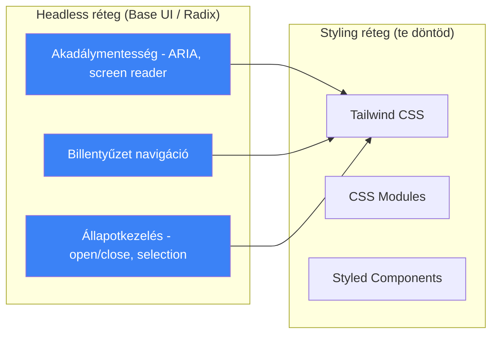
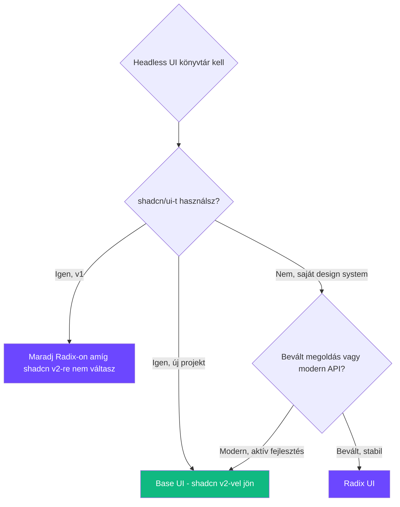

## Mi ez a kettő?

Mindkettő **headless (unstyled) React komponens könyvtár** - viselkedést és akadálymentességet adnak, kinézetet nem. A shadcn/ui eddig Radix-ra épült, de a v2-ben Base UI-ra vált.

> [!tldr]
> **Radix = bevált, stabil, moduláris.** **Base UI = modernebb API, egyetlen csomag, aktívabb fejlesztés.** Mindkettő unstyled - te döntöd el a kinézetet Tailwind-del, [[frontend/css-vs-nextjs-vs-react|CSS]]-sel, bármivel.

---

## Mire valók a headless komponensek?

A headless komponens könyvtárak megoldják azt, ami nehéz a UI fejlesztésben - **akadálymentesség (a11y), billentyűzet navigáció, ARIA attribútumok, fókusz kezelés** - anélkül, hogy ráerőltetnének egy kinézetet.



**Rétegek a gyakorlatban:**
1. **Headless** (Base UI / Radix) - viselkedés, a11y, state
2. **Design system** (shadcn/ui) - headless + Tailwind stílusok + konvenciók
3. **Alkalmazás** - shadcn komponensek testreszabva

---

## Összehasonlítás

| Szempont | Base UI | Radix UI |
|---|---|---|
| **Fejlesztő** | MUI csapat (Material UI mögött) | Workos (Radix mögötti csapat - **ugyanaz** mint a Base UI!) |
| **Csomag struktúra** | Egyetlen csomag: `@base-ui-components/react` | Külön csomag minden komponensre: `@radix-ui/react-dialog`, `@radix-ui/react-dropdown-menu`... |
| **API filozófia** | `render` prop - te döntöd milyen DOM elem legyen | `asChild` prop - gyerek elemre delegálja a renderelést |
| **Komponens szám** | Növekvő, v1.0 óta aktívan bővül | ~28 stabil komponens |
| **Combobox** | Beépített, dedikált komponens | Nincs natív - Command pattern-nel kerülőút |
| **Pozícionálás** | Floating UI beépítve (ugyanaz a csapat) | Saját pozícionálási rendszer |
| **shadcn/ui** | v2-ben erre vált | v1 erre épült |
| **Aktív fejlesztés** | Nagyon aktív, full-time csapat | Lassabb, community-driven |
| **[[foundations/typescript-vs-python|TypeScript]]** | First-class | First-class |
| **Bundle méret** | Tree-shakable egyetlen csomagból | Külön csomag = pontos kontroll |

---

## API különbségek kódban

### Dialog (Modal) - Radix vs Base UI

**Radix megközelítés:**

```tsx
import * as Dialog from '@radix-ui/react-dialog'

<Dialog.Root>
  <Dialog.Trigger asChild>
    <button>Megnyitás</button>
  </Dialog.Trigger>
  <Dialog.Portal>
    <Dialog.Overlay className="fixed inset-0 bg-black/50" />
    <Dialog.Content className="fixed top-1/2 left-1/2 ...">
      <Dialog.Title>Cím</Dialog.Title>
      <Dialog.Description>Leírás</Dialog.Description>
      <Dialog.Close asChild>
        <button>Bezárás</button>
      </Dialog.Close>
    </Dialog.Content>
  </Dialog.Portal>
</Dialog.Root>
```

**Base UI megközelítés:**

```tsx
import { Dialog } from '@base-ui-components/react/dialog'

<Dialog.Root>
  <Dialog.Trigger>Megnyitás</Dialog.Trigger>
  <Dialog.Portal>
    <Dialog.Backdrop className="fixed inset-0 bg-black/50" />
    <Dialog.Popup className="fixed top-1/2 left-1/2 ...">
      <Dialog.Title>Cím</Dialog.Title>
      <Dialog.Description>Leírás</Dialog.Description>
      <Dialog.Close>Bezárás</Dialog.Close>
    </Dialog.Popup>
  </Dialog.Portal>
</Dialog.Root>
```

> [!info] Fő API különbségek
> - Radix: `asChild` prop - a gyerek elem lesz a renderelt DOM node
> - Base UI: `render` prop - explicit megadod milyen elem legyen
> - Radix: `Dialog.Overlay` - Base UI: `Dialog.Backdrop`
> - Radix: `Dialog.Content` - Base UI: `Dialog.Popup`
> - Base UI-nál nem kell `asChild` mert a `render` prop flexibilisebb

### Composition pattern

**Radix - asChild:**

```tsx
// A Radix Trigger alapból <button>-t renderel
// asChild-dal a TE elemedet használja helyette
<Dialog.Trigger asChild>
  <MyCustomButton variant="primary">Kattints</MyCustomButton>
</Dialog.Trigger>
```

**Base UI - render:**

```tsx
// A Base UI render prop-pal explicit megadod az elemet
<Dialog.Trigger render={<MyCustomButton variant="primary" />}>
  Kattints
</Dialog.Trigger>
```

---

## Csomag struktúra - ez a legnagyobb gyakorlati különbség

**Radix - sok apró csomag:**

```json
{
  "dependencies": {
    "@radix-ui/react-dialog": "^1.0.5",
    "@radix-ui/react-dropdown-menu": "^2.0.6",
    "@radix-ui/react-tooltip": "^1.0.7",
    "@radix-ui/react-tabs": "^1.0.4",
    "@radix-ui/react-select": "^2.0.0",
    "@radix-ui/react-popover": "^1.0.7"
  }
}
```

**Base UI - egyetlen csomag:**

```json
{
  "dependencies": {
    "@base-ui-components/react": "^1.0.0"
  }
}
```

> [!tip] Gyakorlati hatás
> Radix-nál 10+ komponens használata = 10+ dependency a `package.json`-ban. Verziófrissítésnél mindegyiket külön kell updatelni. Base UI-nál egy `bun update` és kész.

---

## shadcn/ui és a váltás

A shadcn/ui a legelterjedtebb design system ami headless könyvtárra épül - és éppen **Radix-ról Base UI-ra vált** (v2):

| | shadcn/ui v1 | shadcn/ui v2 |
|---|---|---|
| **Headless réteg** | Radix UI | Base UI |
| **Miért?** | - | Aktívabb fejlesztés, jobb API, egyetlen csomag |
| **Hatás rád** | Jelenlegi projektek működnek | Új projektek automatikusan Base UI-t kapják |

> [!warning] Migráció
> Ha meglévő shadcn/ui v1 projekted van (Radix-alapú), az továbbra is működik. A shadcn/ui v2-re való frissítésnél kell majd figyelni a breaking change-ekre - de a shadcn/ui elrejti a headless réteget, szóval a legtöbb komponensednél nem kell változtatnod.

---

## shadcn CLI v4 - 2026 március

A CLI v4 jelentős frissítés - átláthatóság, AI agent integráció, és szélesebb framework támogatás:

### Új parancsok és flag-ek

```bash
# Projekt inicializálás (Base UI-val!)
npx shadcn@latest init --base base --template next

# Komponens hozzáadása
npx shadcn@latest add button

# Dry run - mi történne, fájlok nélkül
npx shadcn@latest add dialog --dry-run

# Diff - mi változott a registry-hez képest
npx shadcn@latest add button --diff

# View - teljes payload megtekintése
npx shadcn@latest add card --view

# Projekt info
npx shadcn@latest info

# Komponens keresés
npx shadcn@latest search
```

### CLI v4 parancs összefoglaló

| Parancs | Mit csinál |
|---------|-----------|
| `init` | Új projekt inicializálás (framework, base library, preset) |
| `add <component>` | Komponens hozzáadása a projekthez |
| `info` | Projekt info: framework, CSS vars, telepített komponensek |
| `search` | Keresés a registry-kben |
| `list` | Registry tartalmának listázása |
| `diff` | Upstream registry változások ellenőrzése |
| `create` | Vizuális projekt builder (`ui.shadcn.com/create`) |

### Init flag-ek

| Flag | Leírás |
|------|--------|
| `-t, --template` | Framework: `next`, `vite`, `start`, `react-router`, `laravel`, `astro` |
| `-b, --base` | Headless library: `radix` vagy `base` |
| `-p, --preset` | Design preset alkalmazása |
| `--monorepo` | Monorepo scaffold |
| `-d, --defaults` | Default konfiguráció |
| `-f, --force` | Meglévő fájlok felülírása |

### Preset rendszer

A **preset** egy megosztható design konfiguráció - színek, téma, ikon library, betűtípus, border radius egyben:

```bash
# Preset alkalmazása
npx shadcn@latest init --preset vega

# Vagy vizuálisan: ui.shadcn.com/create
npx shadcn@latest create
```

Beépített preset-ek: **Vega**, **Maya**, **Lyra** - vagy sajátot is csinálhatsz a vizuális builder-rel.

### Monorepo támogatás

A v4 CLI érti a monorepo struktúrát - a komponenseket és dependency-ket a helyes package-ekbe telepíti, import átírásokkal.

---

## shadcn Skills - AI agent integráció

A shadcn/skills a CLI v4-gyel érkezett (2026 március). **Skills** = AI kódolási agenteknek ([[toolbox/claude-code-projekt-setup|Claude Code]], Cursor, stb.) projekt-tudatos kontextust ad, hogy helyes kódot generáljanak.

**Mit ad a skill:**
- Radix UI és Base UI komponens API-k ismerete
- Helyes import path-ok a `components.json` alapján
- Szemantikus szín változók és pattern-ek
- CLI parancsok ismerete és használata

### Telepítés Claude Code-ban

```bash
# MCP szerveren keresztül
claude mcp add shadcn -- npx shadcn@latest mcp

# Vagy HTTP transport-tal
claude mcp add --transport http shadcn https://www.shadcn.io/api/mcp
```

> [!tip] Gyakorlati hatás
> A shadcn skill-lel Claude Code **tudja** hogy milyen headless library-t használsz (Radix vagy Base UI), és ennek megfelelő kódot generál. Nem kell a promptban megmondanod - a `components.json` alapján automatikusan érti.

---

## Melyiket válaszd?



**Röviden:**
- **Új projekt 2026-ban** - Base UI (shadcn/ui v2 erre épül, aktívabb fejlesztés)
- **Meglévő Radix projekt** - maradj Radix-on, nem kell migrálni amíg nem akarsz
- **Saját design system** - Base UI (modernebb API, egyetlen csomag, Floating UI beépítve)
- **Gyors prototípus** - mindegy melyik, shadcn/ui elrejti a különbséget

---

## AI-natív fejlesztés

A headless komponens könyvtárak különösen jól működnek AI coding tool-okkal, mert az API-k jól dokumentáltak és a pattern-ek konzisztensek. Claude Code ismeri mindkét library API-ját, és a shadcn Skills MCP-vel még pontosabb kódot generál.

> [!tip] Hogyan használd AI-val
> - *"Építs egy shadcn/ui Dialog komponenst Base UI-val, ami form-ot tartalmaz React Hook Form + Zod validációval"*
> - *"Migráld ezt a Radix Dialog-ot Base UI-ra - cseréld ki az asChild-ot render prop-ra, az Overlay-t Backdrop-ra"*
> - *"Telepítsd a shadcn MCP-t és adj hozzá egy Combobox komponenst a projekthez"*

---

## Kapcsolódó

- [[frontend/shadcn-ui|shadcn/ui]] - a legelterjedtebb design system headless komponensekre építve
- [[frontend/tailwind-css|Tailwind CSS]] - a shadcn/ui és mindkét headless könyvtár stílusozásának alapja
- [[frontend/nextjs|Next.js]] - mindkét könyvtár használható benne
- [[frontend/css-vs-nextjs-vs-react|CSS vs Next.js vs React]] - frontend technológia szintek összehasonlítása
