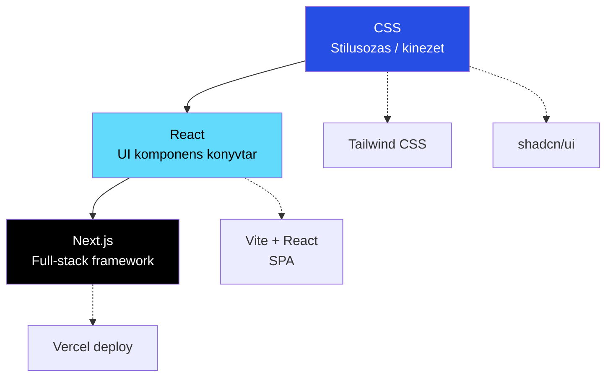

## Mi a különbség?

Ez a harom fogalom **mas-mas szintén** helyezkedik el a frontend fejlesztesben — nem egymas alternativai, hanem egymasra epulnek:

| Szint | Mi ez | Mire jó | Példa |
|---|---|---|---|
| **CSS** | Stilusnyelv | Elemek kinezete (szin, elrendezes, animacio) | `color: red`, Tailwind, shadcn/ui |
| **React** | UI könyvtár | Komponensek, state kezeles, interaktivitas | `useState`, `onClick`, JSX |
| **[[frontend/nextjs|Next.js]]** | Framework | SSR, routing, API routes, deployment | App Router, Server Components |

---

## Mikor melyiket használd?

### Csak CSS kell (framework nelkul)

- **Statikus landing page** — HTML + CSS eleg, nincs dinamikus tartalom
- **Email template** — React nem fut emailben, tiszta HTML/CSS kell
- **Egyszerű brochure site** — ha nincs interaktivitas, felesleges a JS framework

### React (Next.js nelkul, pl. Vite + React)

- **SPA (Single Page Application)** — admin panel, belső dashboard, ahol nincs SEO szükséglet
- **Widget beagyazas** — ha egy meglevo oldalba kell React komponenst tenni
- **Tanulas** — ha először tanulsz React-et, egyszerűbb Vite-tel mint Next.js-szel

### Next.js (a legtobb projekt)

- **SEO fontos** — SSR/SSG biztositja, hogy a Google indexeli
- **Full-stack** — frontend + API routes + auth egy helyen
- **[[cloud/vercel|Vercel]]** deploy — zero-config, preview deploymentek
- **Ugyfelek szamara** — production-ready, skálázható

> [!tip] Okolszabaly
> **Ugyfelprojekt = [[frontend/nextjs|Next.js]]** (mindig). **Belső tool / admin = React + Vite** (ha egyszerű). **Email / statikus = HTML + CSS**.

---

## CSS framework-ok összehasonlítas

| Framework | Megkozelites | Mikor használd | Jellemző használat |
|---|---|---|---|
| **Tailwind CSS** | Utility-first class-ok | Gyors fejlesztes, egyedi design | Elsődleges |
| **shadcn/ui** | Tailwind-alapu komponensek | Elore kesz, testreszabhato UI elemek | Elsődleges |
| **CSS Modules** | Scoped CSS fájlok | Izolált komponens stilusok | Ritkan |
| **Styled Components** | CSS-in-JS | Runtime stilusok, themed alkalmazások | Nem jellemző |
| **Bootstrap** | Elore kesz komponensek | Gyors prototipus, admin template | Legacy projektek |

---

## React vs Next.js — részletes

| Szempont | React (Vite) | [[frontend/nextjs|Next.js]] |
|---|---|---|
| **Rendering** | Csak CSR (kliens oldali) | SSR + SSG + ISR + CSR |
| **Routing** | React Router (manuális) | File-based (automatikus) |
| **API backend** | Kulon szerver kell | API routes beepitve |
| **SEO** | Rossz (JS renderezes) | Kivalo (szerver renderel) |
| **Deploy** | Statikus hosting eleg | [[cloud/vercel|Vercel]] / Node szerver kell |
| **Build meret** | Kisebb | Nagyobb (de optimalizáltabb) |
| **Tanulasi gorbe** | Alacsonyabb | Magasabb (de többet ad) |
| **Server Components** | Nincs | Igen (kevesebb JS a bongeszőben) |

---

## Kapcsolodo

- [[frontend/react-vs-spa-vs-preact|React vs SPA vs Preact]] — React, SPA minta és Preact kozotti különbségek
- [[frontend/nextjs|Next.js]] — a fo framework, részletes leiras
- [[backend/hono|Hono]] — backend API React SPA melle (Cloudflare-en)
- [[cloud/cloudflare|Cloudflare]] — SPA hosting (Pages) + API (Workers)
- [[cloud/vercel|Vercel]] — Next.js nativ hosting platformja
- [[frontend/bun-nextjs-projekt-setup|Bun - Next.js projekt setup]] — projekt indítas Next.js-szel
- [[frontend/env-valtozok-nextjs-ben|Env változók Next.js-ben]] — environment kezeles
- [[frontend/landing-page-cms-types|Landing Page CMS types]] — CMS választas frontend-ekhez
