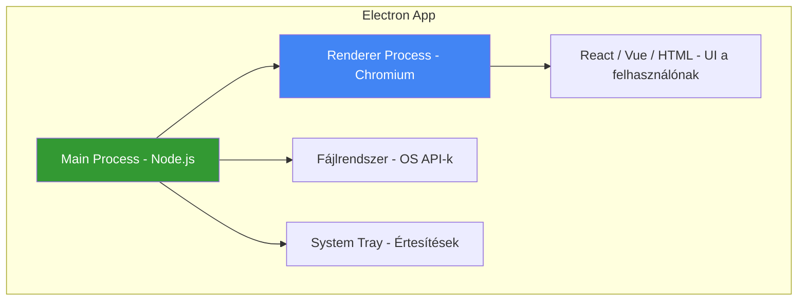

## Mi ez és mire jó?

Az **Electron** egy framework amivel **web technológiákkal (HTML, CSS, JavaScript/[[foundations/typescript-vs-python|TypeScript]]) írhatsz natív desktop alkalmazásokat** - Windows, macOS és Linux-ra egyszerre, egyetlen kódbázisból.

> [!tldr] Egy mondatban
> Az Electron = Chromium böngésző + Node.js runtime egy csomagban. A felhasználó egy "appot" lát, de valójában egy beágyazott böngészőablakban fut a webes UI, miközben a háttérben Node.js-szel eléred a fájlrendszert, OS API-kat, és mindent amit egy natív app tud.

### Miért létezik?

A natív desktop fejlesztés hagyományosan **platformonként külön nyelvet** igényelt (Swift macOS-re, C# Windows-ra, GTK Linux-ra). Az Electron lehetővé teszi, hogy **egy web fejlesztő** - aki HTML/CSS/JS-t tud - desktop appot csináljon mindhárom platformra.

### Kik használják?

| App | Mire | Megjegyzés |
|-----|------|------------|
| **VS Code** | Kódszerkesztő | A legjobb példa hatékony Electron-ra |
| **Obsidian** | Jegyzetkezelő | Markdown-alapú tudáskezelő |
| **Discord** | Chat | Kommunikáció |
| **Slack** | Céges chat | Enterprise kommunikáció |
| **Figma Desktop** | Design tool | Web app + desktop wrapper |
| **Notion** | Dokumentáció | Produktivitás |

---

## Architektúra

**Két fő process:**
- **Main process** - Node.js fut, kezeli az ablakot, fájlrendszert, OS integrációt, menüket. Egy van belőle.
- **Renderer process** - Chromium fut, a webes UI-t rendereli. Ablakonként egy.

A kettő között **IPC (Inter-Process Communication)** megy - a renderer kérhet a main-től fájlt olvasni, értesítést küldeni, stb.

---

## Electron vs. Tauri

A **Tauri** az Electron fő alternatívája - Rust-alapú, a rendszer beépített böngészőjét használja (WebView2 / WebKit):

| Szempont | Electron | Tauri |
|----------|----------|-------|
| **Nyelv (backend)** | JavaScript/TypeScript (Node.js) | Rust |
| **Böngésző motor** | Bundled Chromium | OS beépített WebView |
| **App méret** | ~150-300MB | ~2-10MB |
| **RAM használat** | Magas (~200-500MB) | Alacsony (~30-80MB) |
| **Tanulási görbe** | Alacsony (ha tudsz JS-t) | Magasabb (Rust kell) |
| **Ökoszisztéma** | Hatalmas, érett | Növekvő, fiatalabb |
| **Biztonság** | Gyengébb (Node.js hozzáférés) | Erősebb (Rust + capability rendszer) |
| **Cross-platform** | Win/Mac/Linux | Win/Mac/Linux + mobil (v2) |

> [!tip] Mikor melyiket?
> - **Electron** - ha a csapat JS/TS fejlesztőkből áll, gyors prototípus kell, vagy az ökoszisztéma érettsége fontos
> - **Tauri** - ha a méret/teljesítmény kritikus, a csapat ismeri a Rust-ot, vagy mobil target is kell

---

## Mikor használd (és mikor mást)?

| Szituáció | Electron? | Alternatíva |
|-----------|-----------|-------------|
| Desktop app web UI-val | **Igen** - ez a fő use case | Tauri (ha méret fontos) |
| Belső tool (dashboard) | **Igen** - gyors fejlesztés | Webes PWA (ha nem kell OS hozzáférés) |
| Egyszerű wrapper webalkalmazáshoz | Overkill | PWA vagy Tauri |
| Mobil app | **Nem** | React Native, Flutter |
| Teljesítménykritikus app (játék, videó) | **Nem** | Natív (Swift, C++, Rust) |
| Már létező React/Vue webalkalmazás - desktop | **Igen** - meglévő kód újrafelhasználása | - |

---

## Gyakori minták

### 1. Meglévő web app becsomagolása

A leggyakoribb minta: van egy működő **React/Vue/Angular webalkalmazásod**, és desktop appot akarsz belőle. Az Electron ezt triviálissá teszi - a webes kód szinte változatlanul fut, plusz hozzáadod az OS integrációt (tray icon, auto-update, lokális fájlkezelés).

### 2. Developer tools

Fejlesztői eszközök nagy része Electron-ban készül, mert a web UI rugalmassága (markdown rendering, syntax highlighting, extension API-k) nehezen lenne elérhető natívan. VS Code és Obsidian is ezt az utat választotta.

### 3. Cross-platform belső tool

Dashboardok, admin panelek, monitoring tool-ok - ahol a csapat web fejlesztőkből áll és mindhárom OS-en futnia kell.

---

## Buktatók

- **Méret és RAM** - egy üres Electron app ~150MB és ~150MB RAM. Ha az alkalmazásod egyszerű, ez indokolatlanul sok. Fontold meg a Tauri-t vagy egy PWA-t
- **Auto-update** - beépített `autoUpdater` modul van, de a konfigurálása nem triviális. Használj `electron-updater`-t (`electron-builder`-rel)
- **Biztonsági felület** - a Node.js hozzáférés a renderer process-ből **biztonsági kockázat**. Használj `contextBridge`-et és soha ne engedélyezd a `nodeIntegration: true`-t a renderer-ben
- **Ne frissítsd a Chromium-ot külön** - az Electron a saját Chromium verzióját bundle-öli. Ha a felhasználó böngészőjére építenél, az Tauri/PWA terület

---

## Hasznos linkek

- **Docs:** https://www.electronjs.org/docs
- **GitHub:** https://github.com/electron/electron
- **Tauri (alternatíva):** https://tauri.app

---

## AI-natív fejlesztés

Az Electron app fejlesztés jól párosul AI coding tool-okkal, mert a fő logika JavaScript/TypeScript - amit Claude Code kiválóan generál. Az IPC kommunikáció, a main/renderer process szétválasztás és az OS integráció boilerplate-je az, ahol az AI agent igazán időt spórol.

> [!tip] Hogyan használd AI-val
> - *"Hozz létre egy Electron + React + TypeScript projektet electron-builder-rel, auto-update-tel és tray icon-nal"*
> - *"Írj IPC handler-t ami a main process-ben fájlt olvas és a renderer-nek visszaküldi contextBridge-en keresztül"*
> - *"Alakítsd át ezt a meglévő Next.js dashboardot Electron desktop appá"*

---

## Kapcsolódó

- [[frontend/react|React]] - a legtöbb Electron app React-tel épül
- [[frontend/nextjs|Next.js]] - webalkalmazás becsomagolása Electron-nal
- [[frontend/react-native-es-expo|React Native és Expo]] - ha mobilra kell, nem desktopra
