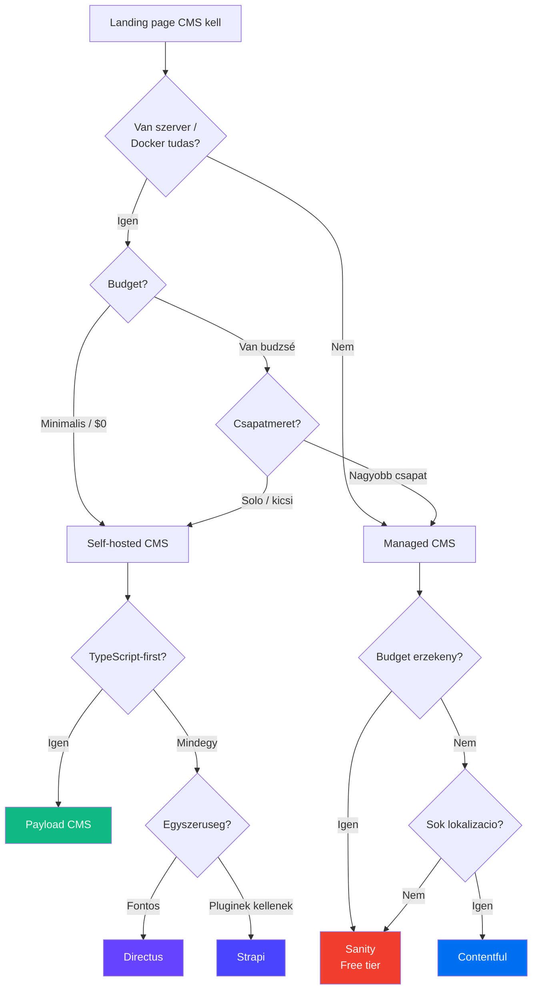

# Landing Page CMS types

Headless CMS valasztas landing page fejleszteshez [[frontend/nextjs|Next.js]] stack-kel. Ez a jegyzet osszehasonlitja a fobb opciot: self-hosted vs managed, developer experience, pricing es integracio szempontjabol.

## Mi az a Headless CMS?

A hagyomanyos CMS (WordPress) a tartalmat es a frontend-et egyutt kezeli. A **headless CMS** csak a tartalmat kezeli, es API-n (REST vagy GraphQL) szolgaltatja ki. A frontend teljesen fuggetlen -- lehet [[frontend/nextjs|Next.js]], Astro, barmi.

**Elonyok:**
- Teljes kontroll a frontend felett
- Ugyanaz a tartalom tobb platformra (web, mobile, email)
- Jobb performance (SSG/ISR a Next.js-szel)
- Fejleszto-barat workflow

## Dontesi fa



## Self-hosted opciok

### Payload CMS

A **Payload** egy TypeScript-first, Next.js-nativ headless CMS. A 3.0 verzio ota kozvetlenul Next.js App Router-be epul -- nincs kulon szerver.

**Fo jellemzok:**
- Next.js App Router nativ integracio (egyetlen app)
- TypeScript-bol generalt tipusok
- Beepitett Auth, Access Control, Upload
- Admin panel auto-generalt a schema-bol
- PostgreSQL vagy MongoDB backend (Postgres ajanlott a [[database/supabase|Supabase]]-zel)

**Telepites:**
```bash
npx create-payload-app@latest my-landing-page
# Valaszd: Next.js, PostgreSQL, Blank template
```

**Pelda collection (tartalom tipus):**
```typescript
// collections/LandingPages.ts
import { CollectionConfig } from 'payload'

export const LandingPages: CollectionConfig = {
  slug: 'landing-pages',
  admin: {
    useAsTitle: 'title',
  },
  fields: [
    { name: 'title', type: 'text', required: true },
    { name: 'slug', type: 'text', unique: true },
    { name: 'hero', type: 'group', fields: [
      { name: 'heading', type: 'text' },
      { name: 'subheading', type: 'textarea' },
      { name: 'cta', type: 'text' },
      { name: 'image', type: 'upload', relationTo: 'media' },
    ]},
    { name: 'sections', type: 'blocks', blocks: [
      // Feature grid, Testimonials, Pricing, FAQ stb.
    ]},
    { name: 'seo', type: 'group', fields: [
      { name: 'metaTitle', type: 'text' },
      { name: 'metaDescription', type: 'textarea' },
    ]},
  ],
}
```

> [!tip] Payload + Supabase
> A Payload 3.x PostgreSQL adapter-rel hasznalhato a [[database/supabase|Supabase]] adatbazissal. Ugyanaz a Postgres instance kezeli a CMS tartalmat es az app adatokat is.

**Deploy:** Egyetlen Next.js app, tehat [[cloud/vercel|Vercel]]-re vagy [[cloud/railway|Railway]]-re deploy-olhato. Docker-rel is self-hostolhato ([[cloud/docker-alapok|Docker alapok]]).

---

### Strapi

A **Strapi** a legnepszerubb open-source headless CMS. Erett okoszisztema, sok plugin, nagy community.

**Fo jellemzok:**
- Content-Type Builder (vizualis schema editor)
- REST es GraphQL API automatikusan
- Plugin rendszer (SEO, i18n, media library)
- Role-Based Access Control
- JavaScript/TypeScript (v5 mar TS-first)

**Telepites:**
```bash
npx create-strapi@latest my-cms
```

**Next.js integracio:**
```typescript
// lib/strapi.ts
const STRAPI_URL = process.env.STRAPI_URL || 'http://localhost:1337'

export async function getLandingPage(slug: string) {
  const res = await fetch(
    `${STRAPI_URL}/api/landing-pages?filters[slug]=${slug}&populate=deep`,
    {
      headers: { Authorization: `Bearer ${process.env.STRAPI_TOKEN}` },
      next: { revalidate: 60 }, // ISR: 60 masodpercenkent
    }
  )
  const data = await res.json()
  return data.data[0]
}
```

**Deploy:** Kulon szerver kell (nem fut Vercel-en). [[cloud/railway|Railway]] vagy [[cloud/docker-alapok|Docker]] a legjobb opcio.

> [!warning] Strapi gotcha-k
> - A Strapi es a Next.js frontend **ket kulon alkalmazas** -- ket deploy kell
> - A `populate=deep` lassu lehet sok relacional, inkabb explicit populate-et hasznalj
> - A free verzio korlatozott (nincs audit log, nincs content versioning)

---

### Directus

A **Directus** "instant API" barmilyen SQL adatbazisra. Nem kell schema-t kodban definialni -- rahuzod egy meglevo DB-re es azonnal van admin UI + API.

**Fo jellemzok:**
- Barmilyen SQL DB-re raulhet (Postgres, MySQL, SQLite, stb.)
- REST + GraphQL automatikusan
- Szep, modern admin UI
- Flows (automatizaciok, hasonlo az n8n-hez)
- Granular permissions
- Beepitett file storage (S3, Supabase Storage, local)

**Mikor jo valasztas:**
- Ha mar VAN egy adatbazisod ([[database/supabase|Supabase]]) es ahhoz akarsz admin feluletet
- Ha nem-fejlesztoknek kell szerkeszteni a tartalmat
- Ha gyorsan kell egy CMS, minimalis konfiguralassal

**Deploy:** Docker image, [[cloud/railway|Railway]]-re egy kattintas.

```yaml
# docker-compose.yml
services:
  directus:
    image: directus/directus:latest
    ports:
      - "8055:8055"
    environment:
      DB_CLIENT: pg
      DB_HOST: db.xyz.supabase.co
      DB_PORT: 5432
      DB_DATABASE: postgres
      DB_USER: postgres
      DB_PASSWORD: ${SUPABASE_DB_PASSWORD}
      SECRET: ${DIRECTUS_SECRET}
      ADMIN_EMAIL: admin@example.com
      ADMIN_PASSWORD: ${ADMIN_PASSWORD}
```

## Managed opciok

### Sanity

A **Sanity** egy managed headless CMS, ami kiemelkedik a **real-time collaboration** es a **customizable Studio** teren.

**Fo jellemzok:**
- Sanity Studio -- React-alapu, teljesen testreszabhato admin UI
- GROQ -- sajat query nyelv (erosebb, mint REST filterek)
- Real-time collaboration (Google Docs szintu)
- Content Lake -- hosted tartalom, nem kell DB-t kezelni
- Visual Editing (Next.js-ben live preview)
- Generous free tier

**Next.js integracio:**
```typescript
// sanity/client.ts
import { createClient } from '@sanity/client'

export const sanityClient = createClient({
  projectId: process.env.NEXT_PUBLIC_SANITY_PROJECT_ID!,
  dataset: 'production',
  apiVersion: '2024-01-01',
  useCdn: true,
})

// Lekerdezes GROQ-val
const page = await sanityClient.fetch(
  `*[_type == "landingPage" && slug.current == $slug][0]{
    title,
    hero { heading, subheading, "imageUrl": image.asset->url },
    sections[]{ ..., "imageUrl": image.asset->url }
  }`,
  { slug }
)
```

> [!tip] Sanity + Vercel Visual Editing
> A Sanity es a [[cloud/vercel|Vercel]] mely integracioja van: a Vercel Visual Editing-gel a content editor a live oldalon kattinthat egy elemre, es a Sanity Studio-ban szerkesztheti. Landing page-eknel ez nagyon jo UX a marketingeseknek.

---

### Contentful

A **Contentful** egy enterprise-grade managed CMS. Erett, stabil, de dragabb.

**Fo jellemzok:**
- Structured content modelling (eros tipusrendszer)
- Tobb locale / i18n beepitve
- GraphQL es REST API
- Webhooks (rebuild trigger [[cloud/vercel|Vercel]]-en)
- Rich text field sajat renderer-rel
- SDK-k minden platformra

**Mikor Contentful?**
- Enterprise projekt, ahol fontos a support es SLA
- Sok nyelv / lokalizacio kell
- Marketing csapat hasznalja a CMS-t
- Budget nem szuk

> [!warning] Contentful pricing
> A free tier nagyon korlatozott (5 user, 1 locale). Ha kinovod, hirtelen draga lesz ($300+/ho). Landing page-ekhez ez ritkan eri meg -- inkabb Sanity vagy self-hosted.

## Pricing osszehasonlitas

| CMS | Free tier | Fizetos kezdes | Self-hosted? | Megjegyzes |
|-----|-----------|----------------|--------------|------------|
| **Payload** | Korlatlan (OSS) | Cloud: $35/ho | Igen | Self-hosted = $0, csak hosting kell |
| **Strapi** | Korlatlan (OSS) | Cloud: $29/ho | Igen | Self-hosted = $0, de 2 deploy kell |
| **Directus** | Korlatlan (OSS) | Cloud: $15/ho | Igen | Self-hosted = $0, Docker-rel konnyu |
| **Sanity** | 3 user, 100K API CDN req/ho | $15/user/ho | Nem | Free tier boven eleg landing page-hez |
| **Contentful** | 5 user, 1 locale | $300/ho (Team) | Nem | Draga, enterprise-re van kitalálva |

> [!info] Hosting koltsegek self-hosted CMS-eknel
> Self-hosted nem jelenti, hogy ingyen van. Szamolj hosting koltseggel:
> - [[cloud/railway|Railway]]: ~$5-10/ho (Starter plan + DB)
> - VPS (Hetzner/DigitalOcean): ~$5-10/ho
> - [[database/supabase|Supabase]] DB: free tier-en is eleg landing page-hez

## Developer Experience osszehasonlitas

| Szempont | Payload | Strapi | Directus | Sanity | Contentful |
|----------|---------|--------|----------|--------|------------|
| **TypeScript** | Nativ | v5: Nativ | Partial | SDK: Igen | SDK: Igen |
| **Next.js integracio** | Beepitett | Fetch/SDK | Fetch/SDK | SDK + Visual Edit | SDK |
| **Schema definitio** | Kodban (TS) | UI vagy kod | UI (DB-bol) | Kodban (TS) | UI |
| **Admin UI** | Auto-generalt | Auto-generalt | Auto-generalt | React Studio | SaaS UI |
| **API tipus** | REST + Local API | REST + GraphQL | REST + GraphQL | GROQ + GraphQL | REST + GraphQL |
| **Learning curve** | Kozepes | Alacsony | Alacsony | Kozepes-Magas | Alacsony |
| **Migration** | Kodban (DB push) | Auto migration | Auto migration | Nincs (hosted) | Nincs (hosted) |
| **Customizability** | Nagyon magas | Magas (pluginek) | Kozepes (Flows) | Magas (Studio) | Alacsony |

## Mikor melyiket valaszd?

### Payload CMS -- ha a kod a kiraly
- TypeScript-first projekt
- Next.js App Router-t hasznalsz
- Egyetlen deploy-t akarsz (CMS + frontend = 1 app)
- Teljes kontroll kell a schema es az admin felett
- [[database/supabase|Supabase]] Postgres-t hasznalod DB-nek

### Strapi -- ha az okoszisztema fontos
- Plugin-eket akarsz hasznalni (SEO, i18n, media)
- Vizualis Content-Type Builder kell a csapatnak
- Mar ismered (legnagyobb community)
- Nem gond, hogy 2 kulon service-t deploy-olsz

### Directus -- ha gyorsasag kell
- Mar van adatbazisod es admin UI kell ra
- Nem-fejlesztok is kezelni fogjak
- Docker-ben akarsz mindent futtatni
- Minimalis konfigurálast akarsz

### Sanity -- ha a content editing experience a prioritas
- Marketing csapat szerkeszti a landing page-eket
- Visual editing kell (Vercel integracio)
- Real-time collaboration fontos
- Nem akarsz CMS-t hostolni / karbantartani

### Contentful -- ha enterprise
- SLA es support kell
- Sok nyelv / lokalizacio
- Nagyvallalati csapat
- Budget nem kerdes

## Ajanlas landing page-ekhez

> [!tip] A legjobb valasztas 2025-2026-ban
> **Solo dev / kis csapat + Next.js:** Payload CMS (self-hosted [[cloud/railway|Railway]]-n vagy [[cloud/vercel|Vercel]]-en)
> **Marketinges csapat is szerkeszt:** Sanity (Visual Editing + free tier)
> **Gyors MVP:** Directus ([[cloud/docker-alapok|Docker]]-rel, 5 perc setup)

Landing page-eknel altalaban keves a tartalom (5-20 oldal), ezert a **free tier** minden opcioval eleg. A dontest inkabb a **developer experience** es a **csapat igenyei** hatarozzak meg, nem a pricing.

## Kapcsolodo

- [[frontend/nextjs|Next.js]] -- frontend framework
- [[cloud/docker-alapok|Docker alapok]] -- self-hosted CMS konterizalas
- [[cloud/railway|Railway]] -- PaaS deploy self-hosted CMS-ekhez
- [[cloud/vercel|Vercel]] -- frontend deploy + Sanity Visual Editing
- [[database/supabase|Supabase]] -- adatbazis backend, Payload-dal is hasznalhato
