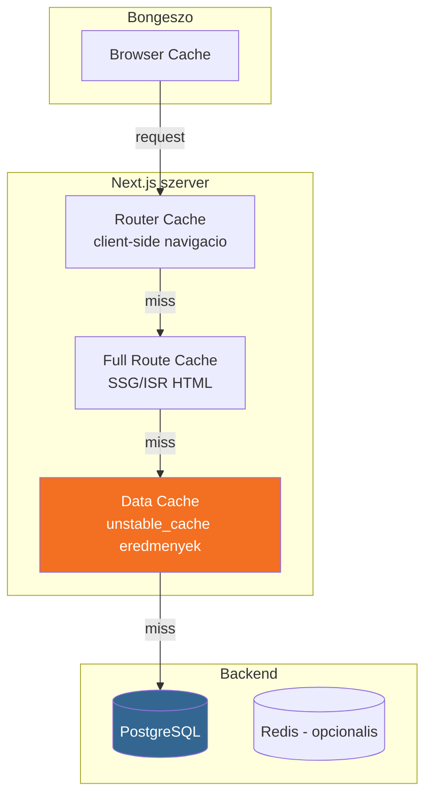

## Mi ez?

A [[frontend/nextjs|Next.js]] **Data Cache** egy szerver-oldali cache reteg, ami a Server Component-ek adatlekerdezéseinek eredmenyet tarolja. A lényeg: ha az adatod nem valtozik minden request-nel, ne kerdezd le ujra — cache-bol szolgald ki.

Ez **nem** a bongeszo cache, **nem** [[database/redis|Redis]], és **nem** CDN. Ez a Next.js szerver process memoriajaban (vagy fájlrendszeren) el, és kizarolag szerver-oldali adatlekerdezesekre vonatkozik.

> [!tldr] TL;DR
> `unstable_cache` = becsomagolod a DB query-idet → első hivas lefut → eredmeny cache-elodik → következo request-ek cache-bol kapjak → `revalidatePath()` hivas torli a cache-t → következo request ujra lefut.

---

## Miért kell ez?

Egy tipikus Server Component minden page load-nal lefuttatja a query-ket:

```tsx
// ❌ Minden page load = 12 DB query, fuggetlenul attol hogy valtozott-e az adat
export default async function Dashboard() {
  const [stats, listings, developers, ...] = await Promise.all([
    db.select(...).from(listings),
    db.select(...).from(listings),
    // ... 10 tovabbi query
  ]);
}
```

Ha az adat naponta 1x valtozik (pl. scrape schedule), ez felesleges: **24 ora × N user × 12 query = sok felesleges DB terheles**.

---

## A cache retegek mentalis modellje



A **Data Cache** (narancs) a mi szintűnk — itt cache-eljuk a [[database/drizzle|Drizzle]] query eredmenyeket.

> [!info] Next.js cache retegek
> - **Router Cache** — kliens-oldali, navigacio kozott cache-eli a prefetch-elt oldalakat
> - **Full Route Cache** — SSG/ISR oldalak HTML-jet cache-eli build-kor
> - **Data Cache** — szerver-oldali adatlekerdezes eredmenyeket cache-eli ← **ez a mi temank**
> - **Request Memoization** — ugyanazon render-en belul deduplikalja az azonos fetch hivasokat

---

## `unstable_cache` — hogyan működik

### Alap szintaxis

```tsx
import { unstable_cache as cache } from "next/cache";

const getCachedData = cache(
  async () => {
    // Ez a fuggveny CSAK EGYSZER fut le, utana cache-bol jon
    const result = await db.select().from(listings);
    return result;
  },
  ["unique-cache-key"],  // cache kulcs (string tomb)
);
```

### Teljes példa — Dashboard

```tsx
import { unstable_cache as cache } from "next/cache";
import { db } from "@/lib/db";
import { listings } from "@/lib/db/schema";

// 1. Definialod a cached fuggvenyt
const getDashboardData = cache(
  async () => {
    const [activeCount, avgPrice, topDevelopers] = await Promise.all([
      db.select({ count: sql`COUNT(*)::int` }).from(listings)
        .where(eq(listings.status, "active")),
      db.select({ avg: sql`AVG(price_per_sqm::numeric)::text` }).from(listings),
      db.execute(sql`SELECT developer, COUNT(*)::int ...`),
    ]);

    return { activeCount, avgPrice, topDevelopers };
  },
  ["dashboard"]  // cache kulcs
);

// 2. A page component meghivja — elso request: DB query, utana: cache
export default async function DashboardPage() {
  const { activeCount, avgPrice, topDevelopers } = await getDashboardData();
  return <div>...</div>;
}
```

### Mit csinál belul

```
1. request → getDashboardData()
2. cache lookup: van "dashboard" kulccsal tarolt adat?
   ├── IGEN (cache HIT) → visszaadja a tarolt eredmenyt, 0 DB query
   └── NEM (cache MISS) → lefuttatja a fuggvenyt
       → DB query-k futnak
       → eredmeny eltarolodik "dashboard" kulccsal
       → visszaadja az eredmenyt
```

> [!warning] Serialization
> A cache-elt adat JSON-kent szerializalodik. A `Date` objektumok **nem** tulelik a cache-t — `.toISOString()` string-kent kell tárolnii, vagy a kiolvasasnal `new Date()`-tel visszakonvertalni.

---

## Cache invalidacio — `revalidatePath` és `revalidateTag`

A cache magatol **soha nem jar le** (nincs automatikus TTL az `unstable_cache`-nel). Neked kell megmondani mikor frissüljon.

### `revalidatePath("/")`

Az adott URL-hez tartozo összes cached adatot torli:

```tsx
import { revalidatePath } from "next/cache";

// Scrape vegen: invalidaljuk a dashboard-ot
export async function runScrape(...) {
  // ... scrape logika ...

  // Cache torles — a kovetkezo "/" request friss adatot kap
  revalidatePath("/");
}
```

### `revalidateTag("tag")` (Next.js 16-ban modosult)

Tag-alapu invalidacio — finomabb kontroll:

```tsx
// Cache definicio tag-gel
const getData = cache(
  async () => { ... },
  ["dashboard"],
  { tags: ["dashboard"] }  // tag megadasa
);

// Invalidacio tag alapjan
revalidateTag("dashboard", "default");  // Next.js 16: masodik param kotelezo!
```

> [!bug] Next.js 16 breaking change
> A `revalidateTag()` Next.js 16-ban **masodik parametert** kapott (cache life profile). Ha nem akarod ezzel bajlodni, használd a `revalidatePath()`-t — egyszerűbb és ugyanazt csinálja route szintén.

---

## Mikor használd / Mikor NE

| Mikor IGEN | Mikor NE |
|-----------|----------|
| Dashboard aggregaciok (COUNT, AVG, SUM) | Felhasználó-specifikus adat (profil, kosar) |
| Ritkan változó adat (napi 1x scrape) | Valós ideju adat (chat, live feed) |
| Draga query-k (PERCENTILE_CONT, JOIN-ok) | Egyszerű, gyors query (<5ms) |
| Sok felhasználó, azonos adat | Egy felhasználó, egyedi adat |
| Server Component page-ek | Client Component-ek (azok fetch-elnek) |

---

## `unstable_cache` vs egyéb cache megoldások

| Megoldás | Hol el | Mikor jó | Komplexitas |
|----------|--------|----------|-------------|
| **`unstable_cache`** | Next.js process (memoria/fájl) | Single instance, SSR oldalakon | Alacsony — 5 sor kod |
| **[[database/redis|Redis]]** | Külső szerver | Multi-instance, elosztott rendszer | Kozepes — infra kell |
| **`globalThis` Map** | Node.js process memoria | HMR-safe singleton, dev-ben | Alacsony — de nincs invalidacio API |
| **React `cache()`** | Request scope | Deduplikacio egy renderben | Minimalis — de nem cross-request |
| **ISR (`revalidate`)** | Next.js build cache | Statikus oldalak idozitett frissítese | Alacsony — de nem on-demand |

> [!tip] Okolszabaly
> - **Single Next.js instance + DB query cache** → `unstable_cache` (a legegyszerubb)
> - **Több instance / microservice-ek** → [[database/redis|Redis]]
> - **Statikus oldal idozitett frissítessel** → ISR (`export const revalidate = 60`)
> - **Egy request-en beluli deduplikacio** → React `cache()` (nem osszekeverendo!)

---

## Gotchak

1. **`unstable_` prefix** — Igen, hivatalosan "unstable", de a Next.js csapat production-ben használja. A nev maradt, a funkcio stabil. Next.js 15+ ota nincs jobb alternativa Drizzle/raw DB query-khez.

2. **Date serialization** — A cache JSON-kent tarol. `Date` → string. A kiolvasasnal `new Date()` kell:
   ```tsx
   // Cache-ben tarold stringkent
   const jobs = rawJobs.map(j => ({
     ...j,
     createdAt: j.createdAt?.toISOString() ?? null,
   }));
   ```

3. **Dev mode** — `next dev`-ben a Data Cache **nem cache-el** alapbol (minden request friss adat). Ez szandekos, hogy ne kelljen fejlesztes kozben invalidalgatni. Production build-ben (`next build && next start`) működik a cache.

4. **Cache kulcs** — A string tomb (`["dashboard"]`) egyedi kell legyen az app-on belul. Ha ket különböző `cache()` hivasnak azonos a kulcsa, osszeakadnak.

5. **Nem "magic"** — A cache nem figyeli a DB-t. Neked kell meghivni a `revalidatePath()` / `revalidateTag()`-et amikor az adat valtozik (pl. scrape vegen, form submit utan).

---

## Valós példa — ingatlanpiaci dashboard

Egy ingatlanpiaci monitor dashboard **12 párhuzamos [[database/drizzle|Drizzle]] query-t** futtat:

```
Adat valtozasi gyakorisag: naponta 1x (scheduled scrape)
Felhasznalok: ~5-10 / nap
Query-k: 12 db (Promise.all)
Betoltesi ido cache nelkul: ~70ms (96 listing)
Betoltesi ido cache-sel: ~0ms (cache HIT) / ~70ms (cache MISS)
```

**Megoldás:**
1. `getDashboardData()` becsomagolva `unstable_cache`-be
2. `revalidatePath("/")` hivas a scrape runner vegen (sikeres scrape utan)
3. Eredmeny: napi ~1 DB query-csomag, minden mas request cache-bol

---

## Kapcsolodo

- [[frontend/nextjs|Next.js]] — a framework ami a Data Cache-t adja
- [[database/drizzle|Drizzle]] — az ORM aminek a query eredmenyeit cache-eljuk
- [[database/redis|Redis]] — alternativ/kiegészíto cache megoldás elosztott rendszereknel
- [[database/sql-adatbazisok|SQL adatbázisok]] — az adatbázis reteg amit cache-elunk
