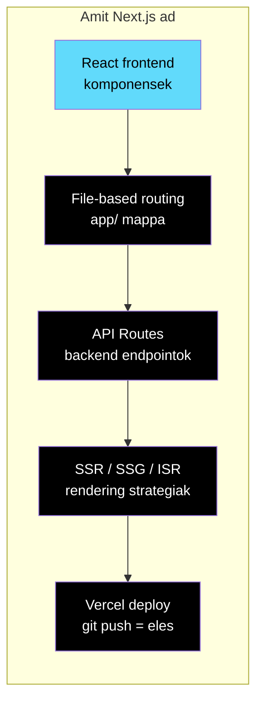

## Mi ez?

A **Next.js** egy React-alapu full-stack framework, amit a [[cloud/vercel|Vercel]] fejleszt. Server-side rendering (SSR), static site generation (SSG), API routes, és App Router — mindent egy helyen ad.

A bildr.hub fo framework-je: szinte **minden ugyfelprojekt és belső tool** Next.js-re epul.

---

## Miért pont Next.js?



| Elony | Miért fontos |
|-------|-------------------|
| **Full-stack egy helyen** | Frontend + API + auth middleware — nincs kulon backend szerver |
| **[[cloud/vercel|Vercel]] nativ** | Push to deploy, zero config, preview deployment-ek PR-enkent |
| **React okoszisztema** | A legnagyobb component library választek (shadcn/ui, Radix, stb.) |
| **Server Components** | Gyorsabb oldalbetoltes, kisebb JS bundle, DB query kozvetlenul |
| **TypeScript-first** | Type safety a teljes stack-ben |

---

## App Router — a mappastruktura az app

A Next.js 13+ ota az **App Router** a standard. A fájlrendszer = routing:

```
app/
├── layout.tsx          # Root layout (minden oldalon megjelenik)
├── page.tsx            # / (fooldal)
├── globals.css         # Globalis stilusok
├── api/
│   └── webhooks/
│       └── route.ts    # POST /api/webhooks
├── dashboard/
│   ├── layout.tsx      # Dashboard-specifikus layout (sidebar)
│   ├── page.tsx        # /dashboard
│   └── settings/
│       └── page.tsx    # /dashboard/settings
├── blog/
│   ├── page.tsx        # /blog (lista)
│   └── [slug]/
│       └── page.tsx    # /blog/barmilyen-cim (dinamikus)
└── (auth)/
    ├── login/
    │   └── page.tsx    # /login
    └── signup/
        └── page.tsx    # /signup
```

**Fontos konvenciok:**
- `page.tsx` — az oldal tartalma (ez renderelodik az URL-re)
- `layout.tsx` — wrapper ami megmarad navigacio kozott (navbar, sidebar)
- `route.ts` — API endpoint (nincs UI, csak request/response)
- `[slug]` — dinamikus route parameter
- `(group)` — route group, nem jelenik még az URL-ben (szervezésre jó)
- `loading.tsx` — loading state amig az oldal tolt
- `error.tsx` — error boundary az oldalhoz

---

## Server Components vs Client Components

Ez a Next.js legfontosabb koncepcioja — és a leggyakoribb buktato:

| | Server Component | Client Component |
|---|---|---|
| **Alapértelmezett** | Igen — minden komponens server | Nem — `'use client'` kell |
| **Hol fut** | Szerveren (Node.js) | Bongeszőben |
| **Adatbázis hozzáférés** | Kozvetlenul (`await db.query()`) | Nem — API route-on keresztul |
| **JS a bongeszőben** | Minimalis (csak HTML) | Teljes React bundle |
| **Interaktivitas** | Nincs (`onClick`, `useState` nem működik) | Teljes |
| **Mikor használd** | Adat megjelenítes, lista, statikus tartalom | Form, gomb, modal, dropdown, animacio |

```tsx
// Server Component (alapertelmezett) — kozvetlenul DB-bol olvas
// app/dashboard/page.tsx
import { createClient } from '@/lib/supabase/server'

export default async function Dashboard() {
  const supabase = await createClient()
  const { data: projects } = await supabase.from('projects').select('*')

  return (
    <div>
      <h1>Projektek</h1>
      {projects?.map(p => <ProjectCard key={p.id} project={p} />)}
    </div>
  )
}
```

```tsx
// Client Component — interaktivitas kell
// components/LikeButton.tsx
'use client'

import { useState } from 'react'

export function LikeButton() {
  const [liked, setLiked] = useState(false)
  return <button onClick={() => setLiked(!liked)}>{liked ? '❤️' : '🤍'}</button>
}
```

> [!warning] A leggyakoribb hiba
> `useState`, `useEffect`, `onClick` → hibauzenet: "You're importing a component that needs useState..."
> **Megoldás:** tedd a komponens tetejere `'use client'`-et. De **csak arra a komponensre** aminek kell — ne az egész oldalra.

---

## API Routes

Backend logika a Next.js-en belul — nem kell kulon szerver:

```typescript
// app/api/leads/route.ts
import { createClient } from '@/lib/supabase/server'
import { NextResponse } from 'next/server'

export async function GET() {
  const supabase = await createClient()
  const { data, error } = await supabase.from('leads').select('*')

  if (error) return NextResponse.json({ error: error.message }, { status: 500 })
  return NextResponse.json(data)
}

export async function POST(request: Request) {
  const body = await request.json()
  const supabase = await createClient()
  const { data, error } = await supabase.from('leads').insert(body)

  if (error) return NextResponse.json({ error: error.message }, { status: 500 })
  return NextResponse.json(data, { status: 201 })
}
```

**Mire jó az API route:**
- Webhook endpoint-ok (Stripe, n8n, extern service-ek)
- Szerver-oldali logika amit nem akarsz Server Component-ben
- Publikus API amire külső kliens is csatlakozik
- Rate limiting, auth middleware, input validacio

---

## Middleware

Az edge-en (CDN szintén) fut, **minden request elott**. Tipikus használat: auth check, redirect, geo-routing.

```typescript
// middleware.ts (project root-ban!)
import { createClient } from '@/lib/supabase/middleware'
import { NextResponse } from 'next/server'
import type { NextRequest } from 'next/server'

export async function middleware(request: NextRequest) {
  const { supabase, response } = createClient(request)
  const { data: { user } } = await supabase.auth.getUser()

  // Ha nincs bejelentkezett user es vedett route → redirect login-ra
  if (!user && request.nextUrl.pathname.startsWith('/dashboard')) {
    return NextResponse.redirect(new URL('/login', request.url))
  }

  return response
}

export const config = {
  matcher: ['/dashboard/:path*', '/api/:path*']
}
```

---

## Rendering stratégiak

| Stratégia | Mikor renderel | Mikor használd |
|-----------|---------------|---------------|
| **SSG** (Static) | Build-kor | Landing page, blog, dokumentácio |
| **SSR** (Server) | Minden request-nel | Dashboard, szemelyre szabott tartalom |
| **ISR** (Incremental) | Build + on-demand ujrageneralas | Blog ahol ritkan valtozik a tartalom |
| **CSR** (Client) | Bongeszőben | Interaktiv komponensek, admin felület |

```tsx
// SSG — statikus, build-kor generalodik
export default function LandingPage() {
  return <h1>Udv!</h1>
}

// SSR — minden request-nel fut (dinamikus adat)
export const dynamic = 'force-dynamic'
export default async function Dashboard() {
  const data = await fetchUserData()
  return <div>{data.name}</div>
}

// ISR — statikus, de 60 masodpercenkent ujrageneralodik
export const revalidate = 60
export default async function BlogPost() {
  const post = await fetchPost()
  return <article>{post.content}</article>
}
```

> [!tip] Tipikus használat
> **Landing page-ek:** SSG (`output: 'export'` a `next.config.ts`-ben) → [[cloud/vercel|Vercel]]-re deploy
> **Dashboard-ok:** SSR, Supabase auth middleware-rel
> **Belső toolok:** SSR + Client Components vegyes

---

## Stack integracio

| Terulet | Eszkoz | Hogyan kapcsolodik |
|---------|--------|--------------------|
| Hosting | [[cloud/vercel|Vercel]] | Nativ Next.js hosting, zero-config deploy, preview PR-enkent |
| Backend DB | [[database/supabase|Supabase]] | Postgres + Auth + Storage + Edge Functions |
| ORM | [[database/drizzle|Drizzle]], [[database/prisma|Prisma]] | Type-safe adatbázis kezeles Server Component-ekbol |
| Auth | [[backend/clerk|Clerk]] | Managed authentication, middleware integracio |
| Config | [[frontend/env-valtozok-nextjs-ben|Env változók Next.js-ben]] | `.env.local`, `NEXT_PUBLIC_` prefix, build-time vs runtime |
| CMS | [[frontend/landing-page-cms-types|Landing Page CMS types]] | Headless CMS integracio SSG-vel |
| Setup | [[frontend/bun-nextjs-projekt-setup|Bun - Next.js projekt setup]] | Projekt inicializalas Bun-nal (gyorsabb mint npm) |
| Deploy | [[cloud/railway|Railway]] | Alternativ hosting Docker-rel (ha Vercel nem eleg) |
| Cache | [[database/redis|Redis]] | API response cache, session store, rate limiting |

---

## Projekt struktúra (ajanlott)

```
my-next-app/
├── app/                    # App Router — oldalak, API-k, layout-ok
│   ├── (marketing)/        # Route group: landing page-ek
│   ├── (app)/              # Route group: bejelentkezett felhasznalok
│   ├── api/                # API endpoints
│   └── layout.tsx          # Root layout
├── components/             # Ujrahasznosithato UI komponensek
│   ├── ui/                 # shadcn/ui komponensek
│   └── ...
├── lib/                    # Utility funkciok, konfigok
│   ├── supabase/           # Supabase client (server + client)
│   └── utils.ts
├── public/                 # Statikus fajlok (kepek, favicon)
├── .env.local              # Env valtozok (GITIGNORE!)
├── .env.example            # Env valtozok template (commitolva)
├── next.config.ts          # Next.js konfiguracio
├── CLAUDE.md               # Agent kontextus es szabalyok
└── package.json
```

---

## Hasznos parancsok

```bash
# Dev szerver
bun run dev

# Production build (hibak itt derulnek ki!)
bun run build

# Production start (lokalis teszt)
bun run start

# Lint
bun run lint
```

---

## Kapcsolodo

- [[backend/hono|Hono]] — edge-nativ API framework (alternativa ha csak backend API kell)
- [[cloud/cloudflare|Cloudflare]] — edge hosting platform (Next.js is futhat rajta, de Hono nativabb)
- [[backend/express|Express]] — klasszikus Node.js backend framework
- [[cloud/vercel|Vercel]] — nativ Next.js hosting platform
- [[frontend/env-valtozok-nextjs-ben|Env változók Next.js-ben]] — environment változók kezelese
- [[frontend/bun-nextjs-projekt-setup|Bun - Next.js projekt setup]] — projekt setup guide
- [[backend/clerk|Clerk]] — authentication integracio
- [[database/supabase|Supabase]] — backend szolgáltatas
- [[database/drizzle|Drizzle]] — type-safe ORM
- [[database/prisma|Prisma]] — magas szintű ORM
- [[database/redis|Redis]] — cache és session store
- [[frontend/nextjs-data-cache-es-revalidacio|Next.js Data Cache és revalidacio]] — unstable_cache, revalidatePath, Data Cache működese
- [[frontend/landing-page-cms-types|Landing Page CMS types]] — CMS választas landing page-ekhez
- [[frontend/css-vs-nextjs-vs-react|CSS vs Next.js vs React]] — frontend technologiak összehasonlítasa
- [[backend/edge-function|Edge function]] — edge runtime működese Next.js middleware-ben
