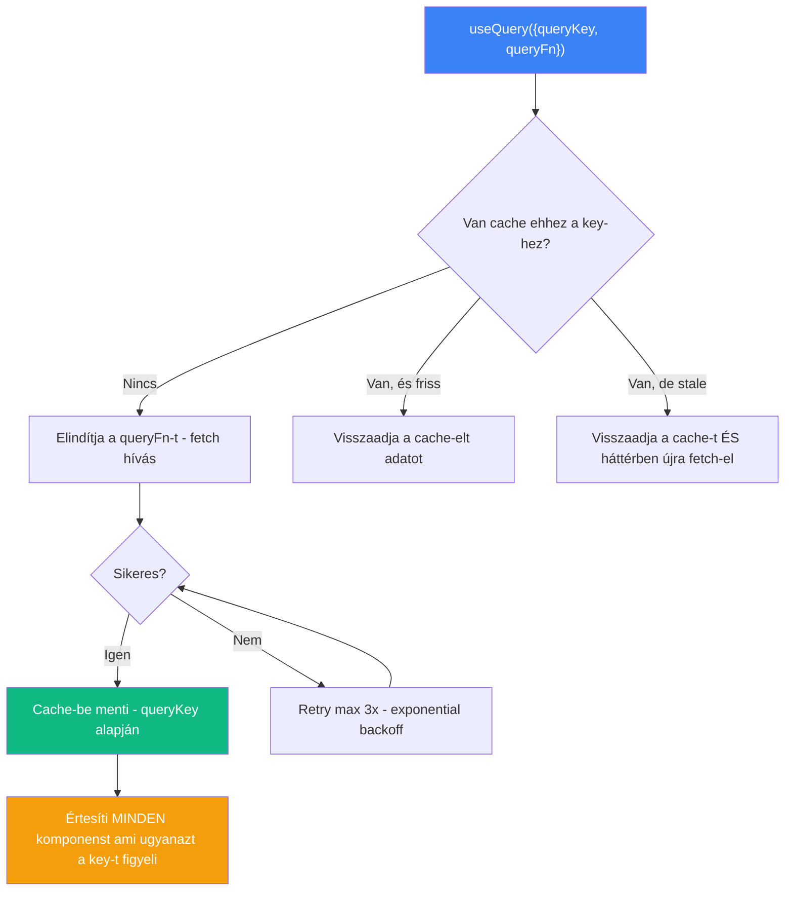
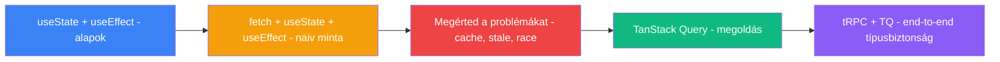

## Miről szól ez a jegyzet?

A [[frontend/react-state-tipusok|React State típusok]] jegyzet elmagyarázta, hogy a szerver state (API-ból jövő adat) más eszközt igényel mint a lokális state. Ez a jegyzet **részletesen bemutatja** a problémát: miért fájdalmas a kézi fetch + useState + useEffect minta, és hogyan oldja meg a [[frontend/tanstack-query|TanStack Query]].

> [!tldr]
> A React nem ad beépített adatlekérési megoldást. A "naiv" minta (fetch + useState + useEffect) **működik**, de minden egyes API híváshoz 10-15 sor boilerplate kód kell, nincs cache, nincs retry, nincs deduplikáció. A TanStack Query mindezt **egyetlen `useQuery()` hívásra** csökkenti.

---

## A három szereplő

Ahhoz hogy megértsd miért jó a TanStack Query, először értsd meg a három dolgot amit felváltja:

### fetch - "az adat lekérése"

A **fetch** a böngésző beépített API-ja HTTP kérések küldésére. Nem React-specifikus - sima JavaScript.

| Mit csinál | Analógia |
|-----------|---------|
| HTTP kérést küld a szerverre, visszakapja a választ | "Rendelsz ételt egy étteremből" |

A fetch önmagában **nem tudja**: hol tárold az eredményt, mit mutass amíg töltődik, mi történjen hibánál. Ezekre kell a useState és useEffect.

### useState - "az adat tárolása"

A **useState** (lásd: [[frontend/react-hooks|React Hooks]]) a komponens memóriája. A fetch által visszakapott adatot **ide teszed**, és onnan olvassa a UI.

| Mit csinál | Analógia |
|-----------|---------|
| Egy értéket megjegyez renderelések között | "Az ételt leteszed az asztalra" |

De a useState önmagában nem tud fetch-elni - csak tárol. Kell valami ami **elindítja** a fetch-et a megfelelő időpontban.

### useEffect - "az elindítás"

A **useEffect** (lásd: [[frontend/react-hooks|React Hooks]]) mellékhatásokat kezel - itt indítod el a fetch hívást. "Amikor a komponens megjelenik (mount), kérd le az adatot."

| Mit csinál | Analógia |
|-----------|---------|
| A komponens megjelenésekor elindít valamit | "Amikor leülsz az étteremben, leadod a rendelést" |

---

## A "naiv" minta - fetch + useState + useEffect

Ez az a minta amit a legtöbb React tutorial tanít, és amit a TanStack Query kiváltja:

```
                    ┌─ useState(null)     → adat tárolás
                    │
Komponens mount ────┼─ useState(true)     → loading jelzés
                    │
                    ├─ useState(null)     → error tárolás
                    │
                    └─ useEffect(() => {
                         fetch('/api/users')  → adat lekérés
                           .then(setData)       → siker: tárold
                           .catch(setError)     → hiba: tárold
                           .finally(setLoading) → végén: loading ki
                       }, [])
```

**Minden egyes API híváshoz kellenek ezek:**

| Sor | Mit csinál | Miért kell |
|-----|-----------|-----------|
| `const [data, setData] = useState(null)` | Az API válaszát tárolja | A UI-nak kell az adat |
| `const [isLoading, setIsLoading] = useState(true)` | Betöltés jelzés | A UI-nak kell tudni, hogy töltődik-e |
| `const [error, setError] = useState(null)` | Hiba tárolás | A UI-nak kell a hibaüzenet |
| `useEffect(() => { fetch... }, [])` | A fetch indítása mount-kor | Magától nem indul el |
| `setData(result)` | Siker esetén tárold | Különben nem jelenik meg |
| `setError(err)` | Hiba esetén tárold | Különben a user nem tudja mi a baj |
| `setIsLoading(false)` | Végén jelezd hogy kész | Különben örökre "töltődik" |

---

## Miért fájdalmas ez?

| Probléma | Mi történik | Következmény |
|----------|------------|--------------|
| **Boilerplate** | Minden API híváshoz 3 useState + 1 useEffect | 10-15 sor ismétlődő kód per endpoint |
| **Cache hiánya** | Ha navigálsz és visszajössz - újra fetch | Lassú, felesleges hálózati forgalom |
| **Deduplikáció hiánya** | Ha 3 komponens kéri ugyanazt - 3 fetch | 3x annyi request a szerverre |
| **Race condition** | Gyors navigáció - régi fetch válasz felülírja az újat | Rossz adatot mutat a UI |
| **Stale data** | Az adat elavul, de nem frissül | A user régi adatot lát |
| **Refetch logika** | Mikor kérje újra? Tab váltás? Mutation után? | Kézzel kell írni minden esetet |
| **Error retry** | Ha a szerver átmenetileg nem válaszol | Kézzel kell retry logikát írni |

> [!warning] A "fetch + useState + useEffect" minta skálázási problémája
> 5 API endpointtal = **75 sor boilerplate kód** (5 x 15 sor). 20 endpointtal = 300 sor. És ez még nem tartalmazza a cache-elést, retry-t, invalidációt. **Ez az a pont ahol a TanStack Query megtérül.**

---

## A megoldás - TanStack Query

A [[frontend/tanstack-query|TanStack Query]] a fenti 3 dolgot (fetch + useState + useEffect) **egyetlen hívásba** csomagolja, plusz cache-t, retry-t és deduplikációt ad:

| A naiv minta | TanStack Query |
|-------------|----------------|
| 3 x useState (data, loading, error) | `useQuery()` - `{ data, isLoading, error }` egyben |
| useEffect + fetch | `queryFn` - a TanStack Query hívja meg a megfelelő időben |
| Kézi cache | Automatikus cache (`queryKey` alapján) |
| Nincs retry | Automatikus retry (3x, exponential backoff) |
| Nincs deduplikáció | Egy fetch, minden komponens kapja |
| Kézi refetch | `refetchOnWindowFocus`, `refetchInterval`, `invalidateQueries` |

### A transzformáció vizuálisan

```
ELŐTTE (naiv minta):                    UTÁNA (TanStack Query):

const [data, setData] = useState(null)
const [loading, setLoading] = useState(true)    const { data, isLoading, error } = useQuery({
const [error, setError] = useState(null)          queryKey: ['users'],
                                                  queryFn: () => fetch('/api/users')
useEffect(() => {                                   .then(r => r.json())
  setLoading(true)                              })
  fetch('/api/users')
    .then(r => r.json())
    .then(data => setData(data))
    .catch(err => setError(err))
    .finally(() => setLoading(false))
}, [])

15 sor                                  5 sor + cache + retry + dedup
```

---

## Mi történik a háttérben?

Amikor `useQuery()`-t hívsz, a TanStack Query a háttérben:



---

## Mikor maradj a naiv mintánál?

A TanStack Query **nem mindig szükséges:**

| Szituáció | Minta |
|-----------|-------|
| Egyetlen egyszerű fetch, nincs cache igény | fetch + useState + useEffect elég |
| [[frontend/nextjs|Next.js]] Server Components (RSC) | Az RSC maga fetch-el - nincs szükség client-side adatkezelésre |
| Statikus adat ami soha nem változik | Egyszer fetch, useState-be, kész |
| Tanulás / kis prototípus | A naiv minta segít megérteni mi történik a háttérben |

> [!tip] Hüvelykujjszabály
> Ha **2+ különböző API endpointot** hívogatsz, és a felhasználó **navigál** az oldalak között - TanStack Query. Ha **egyetlen fetch** kell egy egyszerű oldalon - a naiv minta is jó.

---

## A tanulási útvonal



1. **[[frontend/react-hooks|React Hooks]]** - értsd meg mi az a useState és useEffect
2. **[[frontend/react-state-tipusok|React State típusok]]** - értsd meg, hogy a szerver state más mint a lokális state
3. **Ez a jegyzet** - értsd meg a naiv fetch minta problémáit
4. **[[frontend/tanstack-query|TanStack Query]]** - a megoldás: useQuery, useMutation, invalidáció, cache
5. **tRPC** - tRPC + TanStack Query = end-to-end típusbiztonság

---

## AI-natív fejlesztés

Az adatlekérési pattern-ek konvertálása (naiv minta -> TanStack Query) az egyik legjobb AI use case. Claude Code-dal pillanatok alatt átalakíthatsz egy useState+useEffect fetch-et useQuery-re, és az összes cache/retry/invalidation logikát automatikusan megkapod.

> [!tip] Hogyan használd AI-val
> - *"Refaktoráld ezt a useState + useEffect fetch mintát TanStack Query useQuery-re, queryKey-jel és error handling-gel"*
> - *"Írj egy useMutation-t ami POST-ol az API-ra és utána invalidálja a users query-t"*
> - *"Állíts be TanStack Query-t ebben a Next.js projektben - QueryClientProvider, alapértelmezett staleTime, devtools"*

---

## Kapcsolódó

- [[frontend/react-hooks|React Hooks]] - useState, useEffect koncepcionálisan
- [[frontend/react-state-tipusok|React State típusok]] - lokális vs szerver vs globális state
- [[frontend/tanstack-query|TanStack Query]] - a megoldás a szerver state kezelésre
- [[frontend/react-szintaxis|React szintaxis]] - React kód olvasási alapok
