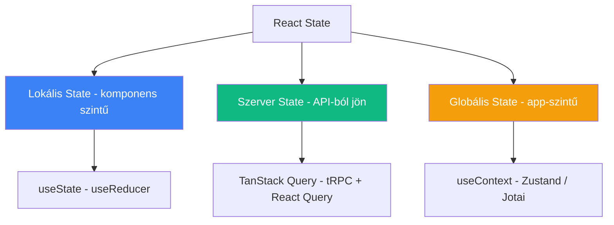

## Miről szól ez a jegyzet?

A [[frontend/react-hooks|React Hooks]] jegyzet elmagyarázta **mi az a hook** és hogyan működik a useState, useEffect. De a React-ben nem minden "állapot" egyforma - az **állapot típusa** határozza meg, melyik eszközzel kezeld.

> [!tldr]
> A React-ben háromféle állapot van: **lokális** (komponens szintű), **szerver** (API-ból jövő adat), és **globális** (app-szintű). A legtöbb fejlesztő hibája: mindenre useState-et használ. A helyes megközelítés: **szerver state-re [[frontend/tanstack-query|TanStack Query]]**, lokálisra useState, globálisra Context vagy Zustand.

---

## A három state típus

---

### 1. Lokális state - "ez a komponens dolga"

Az adat **csak ebben a komponensben** releváns, máshol nem kell.

| Példák | Eszköz |
|--------|--------|
| Form input értéke (amit a user éppen gépel) | `useState` |
| Modal nyitva/zárva | `useState` |
| Accordion melyik panel nyitva | `useState` |
| Dropdown kiválasztott elem | `useState` |
| Tab melyik fül aktív | `useState` |
| Checkbox ki van-e pipálva | `useState` |

**Hogyan ismered fel:** Ha az adatot **csak egy komponens** használja, és **az adat eltűnhet ha a komponens unmount-ol** - az lokális state.

> [!tip] A "lifting state up" minta
> Ha két testvér komponensnek kell ugyanaz az adat - emeld a közös szülőbe a useState-et, és props-ként add le. Ez a React alapvető adatáramlási mintája: **felülről lefelé**, props-on keresztül.

---

### 2. Szerver state - "az adat a szerveren él"

Az adat **nem a böngészőben keletkezik** - a szerveren/adatbázisban van, és API-n keresztül kéred le. Ez a leggyakoribb state típus egy webalkalmazásban.

| Példák | Eszköz |
|--------|--------|
| Felhasználók listája | TanStack Query `useQuery` |
| Rekord részletei | TanStack Query `useQuery` |
| Dashboard metrikák | TanStack Query `useQuery` + refetchInterval |
| Keresési eredmények | TanStack Query `useQuery` |
| Új rekord mentése | TanStack Query `useMutation` |
| tRPC hívások | `trpc.user.list.useQuery()` |

**Hogyan ismered fel:** Ha az adatot **fetch/API hívásból kapod**, **más felhasználók is módosíthatják**, és **elavulhat** (stale) - az szerver state.

**Miért nem useState erre?** Mert a szerver state-nek speciális igényei vannak amit a useState nem tud:

| Igény | useState | TanStack Query |
|-------|----------|----------------|
| Cache | Nincs - minden navigációnál újra fetch | Automatikus cache |
| Loading / Error | Kézzel kell kezelni | Beépítve |
| Elavulás (staleness) | Nem tudja | `staleTime`, `refetchOnWindowFocus` |
| Deduplikáció | Ha 3 komponens kéri - 3 fetch | Egy fetch, 3 komponens kapja |
| Mutation utáni frissítés | Manuális | `invalidateQueries()` |
| Offline / retry | Nincs | Beépítve |

Részletesen lásd: [[frontend/react-adatkezeles|React adatkezelés]]

---

### 3. Globális state - "az egész app-nak kell"

Az adat **több, nem kapcsolódó komponensben** kell, és props-szal nem praktikus leadni (mert túl mélyen van = "prop drilling").

| Példák | Eszköz |
|--------|--------|
| Bejelentkezett felhasználó | `useContext` (auth provider) |
| Téma (dark/light mode) | `useContext` (theme provider) |
| Nyelv (lokalizáció) | `useContext` (i18n provider) |
| Bevásárlókosár | Zustand / Jotai |
| Értesítések (toast) | Zustand / Context |
| Sidebar nyitva/zárva (globálisan) | Zustand |

**Hogyan ismered fel:** Ha az adat **bárhonnan kell** az app-ban (header, sidebar, mélyen beágyazott komponens), és **a böngészőben keletkezik** (nem API-ból jön) - az globális state.

> [!info] Context vs Zustand/Jotai
> A `useContext` jó **ritkán változó** adatokhoz (téma, auth, nyelv). **Gyakran változó** adatokhoz (kosár, UI state) a Context lassú - ilyenkor Zustand vagy Jotai a jobb választás, mert finomabb re-render kontrollt adnak.

---

## Döntési fa - melyik state melyik eszköz?

| Kérdés | Válasz | Eszköz |
|--------|--------|--------|
| Az adat API-ból/szerverről jön? | Igen | **TanStack Query** |
| Az adat csak egy komponensben kell? | Igen | **useState** |
| Az adat több nem-szülő-gyerek komponensben kell? | Igen, ritkán változik | **useContext** |
| Az adat több komponensben kell és gyakran változik? | Igen | **Zustand / Jotai** |
| Komplex state logika (sok állapotátmenet)? | Igen | **useReducer** |

> [!warning] A leggyakoribb hiba
> A legtöbb React fejlesztő **mindent useState-be tesz** - beleértve az API-ból jövő adatot is. Így kézi cache-elést, loading/error kezelést, refetch logikát kell írni. **A szerver state NEM lokális state** - használj TanStack Query-t rá.

---

## AI-natív fejlesztés

A state management döntések az egyik leggyakoribb kérdés amit AI coding tool-nak feltehetsz. Claude Code segít eldönteni melyik state típusba tartozik az adatod, és a megfelelő eszközzel (useState, TanStack Query, Zustand) implementálja - nem kell kézzel kitalálnod a struktúrát.

> [!tip] Hogyan használd AI-val
> - *"Ez a komponens 3 useState-et használ API adathoz - refaktoráld TanStack Query useQuery-re"*
> - *"Állíts be Zustand store-t a sidebar state-hez és a notification rendszerhez, TypeScript típusokkal"*
> - *"Dönts: ez a feature lokális state, szerver state vagy globális state? És melyik eszközt használjam?"*

---

## Kapcsolódó

- [[frontend/react-hooks|React Hooks]] - hook-ok koncepcionálisan (miért léteznek, életciklus, szabályok)
- [[frontend/react-adatkezeles|React adatkezelés]] - a szerver state kezelés részletesen (fetch minta - TanStack Query)
- [[frontend/tanstack-query|TanStack Query]] - szerver state management library
- [[frontend/react-szintaxis|React szintaxis]] - hook-ok szintaxisa
