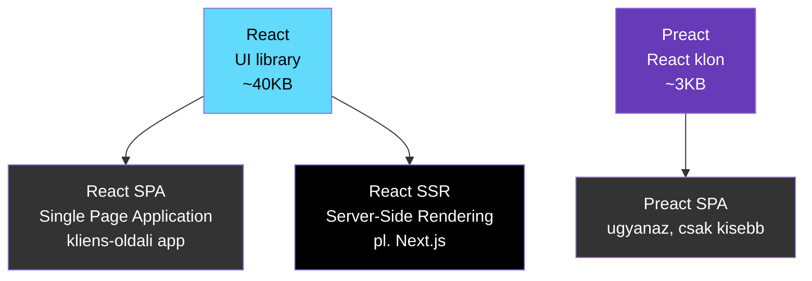
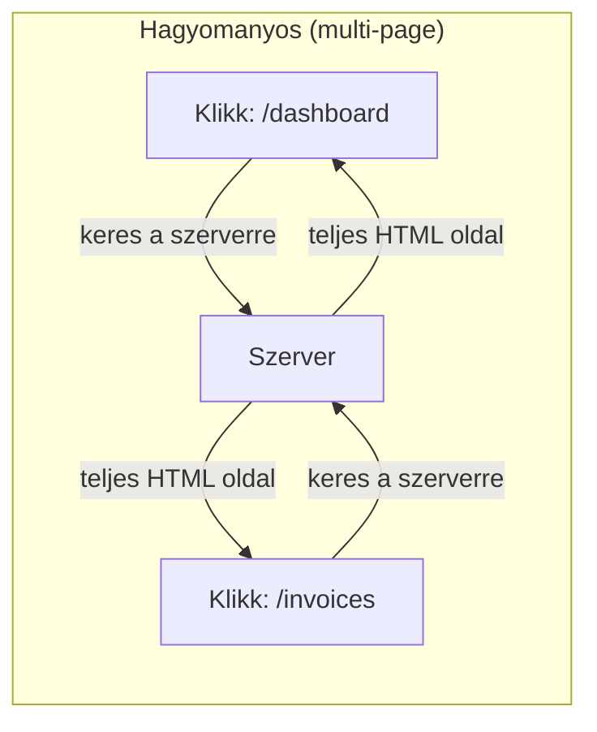
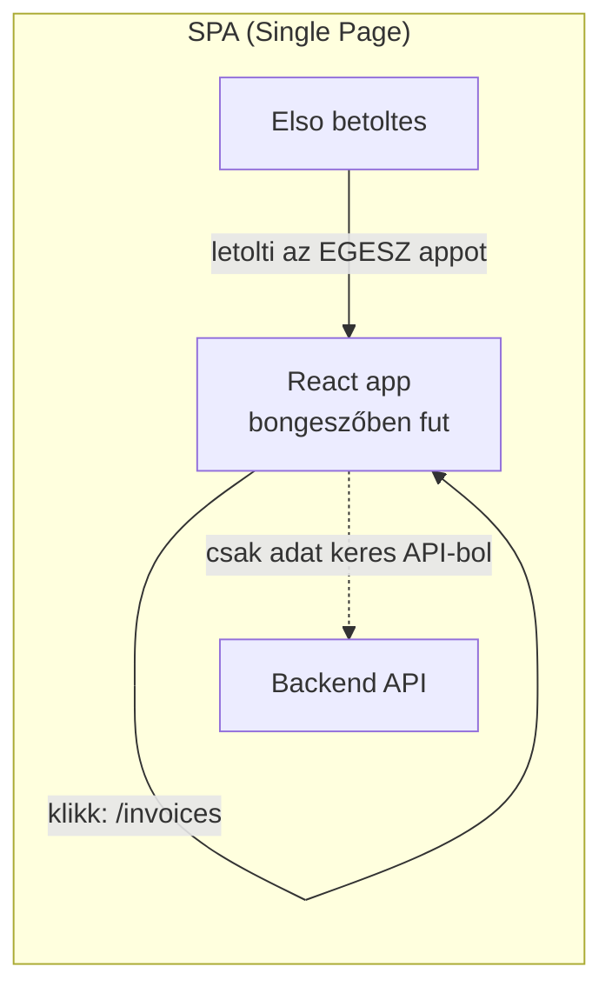
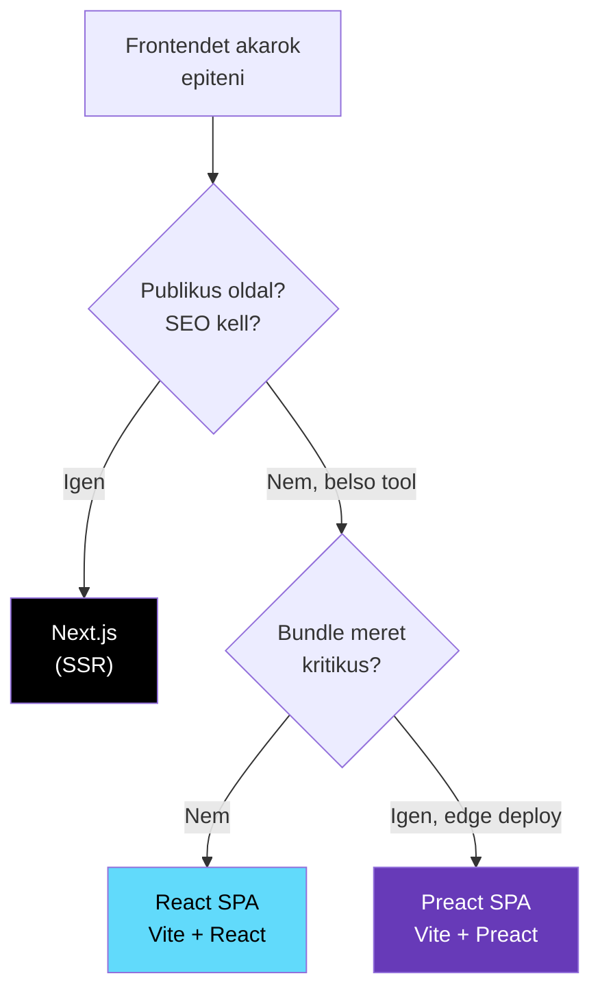

## A lenyeg 30 masodpercben

Ez a harom fogalom **nem harom kulonbozo technologia** — ket library + egy alkalmazas minta:

| Fogalom | Mi ez | Analogia |
|---------|-------|----------|
| **React** | UI library (felhasznaloi feluletet epitesz vele) | A LEGO kockak |
| **SPA** | Alkalmazas minta (hogyan hasznalod a React-et) | Hogyan rakod ossze a LEGO-t |
| **Preact** | Konnyu React klon (ugyanaz, de kisebb) | Ugyanaz a LEGO, de mini valtozatban |



---

## React — a UI library

A **React** egy JavaScript library (nem framework!) amivel **felhasznaloi feluletet** epitesz. Komponenseket irsz, amik HTML-t generalnak:

```tsx
// Egy React komponens — ez EGY "kocka" a feluleten
function InvoiceCard({ vendor, amount, dueDate }) {
  return (
    <div className="card">
      <h3>{vendor}</h3>
      <p>{amount} Ft</p>
      <p>Hatarido: {dueDate}</p>
    </div>
  )
}
```

A React **onmagaban nem egy app** — csak a UI reteget adja. Ahhoz hogy egy teljes alkalmazas legyen, dontened kell:

- **Hogyan delivereled a felhasznalonak?** → Ez a SPA vs SSR kerdes
- **Hogyan kezeled a routingot?** → React Router, vagy Next.js file-based routing
- **Hogyan kezeled az adatokat?** → Fetch API, TanStack Query, stb.

---

## SPA (Single Page Application) — egy alkalmazas minta

Az **SPA** nem egy technologia, hanem egy **minta (pattern)** — hogyan mukodik az app a bongeszőben.

### Hogyan mukodik egy hagyomanyos weboldal?



Minden kattintasnal **uj oldal toltodik be a szerverrol** → feher villanas, lassabb.

### Hogyan mukodik az SPA?



Az SPA **egyetlen HTML oldalt** tolt be, es utana **minden a bongeszőben tortenik**:

- Navigacio? → A React atrajzolja a feluletet, nincs ujratoltes
- Adat kell? → API hivas a hatterben (fetch), a szerver csak JSON-t kuld
- Eredmeny: **gyors, gordulekeny, app-szeru elmeny** (mint egy mobil app)

### SPA vs SSR (Next.js)

| Szempont | SPA (React + Vite) | SSR ([[frontend/nextjs|Next.js]]) |
|----------|-------------------|-----------------|
| **Hol renderel** | Bongeszőben (kliens) | Szerveren, majd bongeszőben |
| **Elso betoltes** | Lassabb (le kell tolteni az egesz appot) | Gyorsabb (kesz HTML jon) |
| **SEO** | Rossz (Google nem latja a tartalmat) | Kivalo (szerver renderelt HTML) |
| **Navigacio** | Gyors (nincs ujratoltes) | Gyors (prefetch) |
| **Komplexitas** | Egyszerubb | Bonyolultabb |
| **Backend** | Kulon kell (pl. [[backend/hono|Hono]]) | Beepitve (API Routes) |
| **Mire jo** | Belso tool, admin, dashboard | Publikus site, SEO, marketing |

> [!tip] Okolszabaly
> **Belso tool:** SPA eleg — senki nem Google-ozi a szamlakat
> **Publikus oldal:** [[frontend/nextjs|Next.js]] SSR — SEO fontos, Google indexeles kell

### React SPA setup (Vite)

```bash
# React SPA letrehozas Vite-tel
npm create vite@latest my-app -- --template react-ts

# Ez lesz az eredmeny:
# my-app/
# ├── src/
# │   ├── App.tsx        ← fo komponens
# │   ├── main.tsx       ← belepesi pont
# │   └── ...
# ├── index.html         ← az EGYETLEN HTML fajl
# └── vite.config.ts
```

A build eredmenye: **statikus fajlok** (HTML + JS + CSS), amiket barmelyik hosting kiszolgalhat — pl. [[cloud/cloudflare|Cloudflare]] Pages.

---

## Preact — a mini React

A **Preact** a React **konnyusulyu klonja**. Ugyanazt az API-t adja (ugyanugy irsz komponenseket), de **~3KB** vs React **~40KB**.

| Szempont | React | Preact |
|----------|-------|--------|
| **Meret** | ~40KB (gzipped) | ~3KB (gzipped) |
| **API** | Eredeti | 99% kompatibilis |
| **Sebesseg** | Gyors | Kicsit gyorsabb |
| **Okoszisztema** | Hatalmas (shadcn, react-query, stb.) | Kisebb, de React lib-ek tobbsege fut |
| **Fejleszto** | Meta (Facebook) | Jason Miller (egyeni) |
| **Mikor valaszd** | Alapertelmezett valasztas | Ha a bundle meret kritikus (edge, mobil) |

```tsx
// Preact — UGYANUGY nez ki mint a React
import { useState } from 'preact/hooks'

function Counter() {
  const [count, setCount] = useState(0)
  return <button onClick={() => setCount(count + 1)}>{count}</button>
}
```

> [!info] Mikor erdemes Preact-et hasznalni?
> - **Edge deploy** (pl. [[cloud/cloudflare|Cloudflare]] Workers) — ahol a bundle meret szamit
> - **Mobil-first app** — ahol a felhasznalok lassu halozaton vannak
> - **Ha nem kell a React teljes okoszisztema** — nincs shadcn/ui, nincs React-specifikus library
>
> **Mikor NE hasznald:**
> - Ha shadcn/ui, Radix, React Query, stb. kell → maradj React-nel
> - Ha a csapat React-et ismer → ne bonyolitsd Preact-tel
> - A 37KB kulonbseg a legtobb appnal **nem szamit** (gyors neten ez ~10ms)

---

## Melyiket valaszd? (dontesi fa)



Belso tool projektekhez: **React SPA** a legjobb valasztas — belso tool, nincs SEO igeny, a React okoszisztema (shadcn/ui, react-query) hasznos, es a 40KB meret [[cloud/cloudflare|Cloudflare]] Pages-en nem problema.

---

## Kapcsolodo

- [[frontend/css-vs-nextjs-vs-react|CSS vs Next.js vs React]] — CSS, React, Next.js szintek kozotti kulonbseg
- [[frontend/nextjs|Next.js]] — fullstack framework (SSR + React)
- [[backend/hono|Hono]] — backend API a React SPA melle
- [[cloud/cloudflare|Cloudflare]] — SPA hosting (Pages) + API hosting (Workers)
- [[backend/edge-function|Edge function]] — miert szamit a meret edge-en
- [[frontend/bun-nextjs-projekt-setup|Bun - Next.js projekt setup]] — ha megis Next.js-t valasztasz
