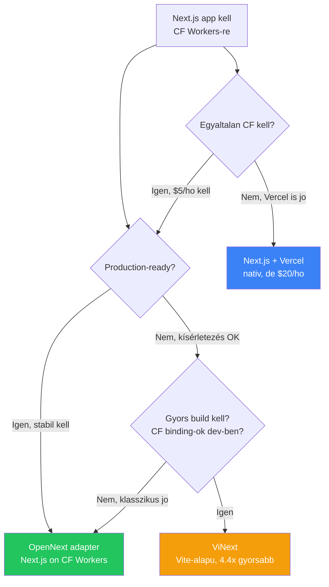

# ViNext

**Kategoria:** `framework` (Next.js alternativa, Vite-alapu)
**URL:** https://github.com/cloudflare/vinext
**Ar/Terv:** Ingyenes, open source (Cloudflare)
**Statusz:** Kíserleti — nem production-tested meg

---

## Mi ez es mire jo?

A **ViNext** egy **Next.js drop-in replacement**, ami a [[frontend/nextjs|Next.js]] API feluletét **Vite-on implementalja ujra**, nem wrappeli. Az `app/`, `pages/`, es `next.config.js` fajljaid valtozatlanul mukodnek, de a build rendszer Vite (nem Turbopack), es egyetlen paranccsal deployolhato [[cloud/cloudflare|Cloudflare]] Workers-re.

**A kulonbseg az OpenNext adapterhez kepest:**

| Szempont | **OpenNext adapter** | **ViNext** |
|---|---|---|
| **Megkozelites** | Next.js build output → CF Workers wrapper | Next.js API ujraimplementalasa Vite-on |
| **Build tool** | Next.js Turbopack | Vite + Rolldown |
| **Build sebesseg** | Next.js native speed | **4.4x gyorsabb** |
| **Bundle meret** | Next.js native output | **57% kisebb** |
| **Erettseg** | Stabil, production-ready | Kísérleti (~1 hetes) |
| **Next.js kompatibilitas** | Teljes (ami Next.js tud) | 94% API coverage |
| **Karbantartas** | Next.js verziokhoz kell igazitani | Fuggetlen Vite plugin |

> [!tldr] Egy mondatban
> A ViNext nem a Next.js-t csomagolja be CF Workers-re, hanem **ujraepiti a Next.js-t Vite-ra** — gyorsabb build, kisebb bundle, nativ CF integracio, de meg kíserleti.

> [!warning] Kísérleti statusz
> A ViNext a cikk megjeleneskor < 1 hetes volt. **Nem battle-tested**, nem ajanlott production-re megfontolas nelkul. A README nyiltan dokumentalja a hianyzo feature-oket.

---

## Miert erdekes

### 1. AI-val epitettek

Egy Cloudflare mernok + AI irta **1 het alatt, ~$1100 token koltseggel**. 800+ session, szinte az osszes kod AI-generalt.

**Tanulsag:** Ha egy teljes framework reimplementacio lehetseges AI-val 1 het alatt, belso mini app-ok es landing page-ek simán megepithetok ViNext-tel is, ha stabilizalodik.

### 2. Vite dev server = nativ CF binding-ok dev-ben

Az OpenNext megkozelitesnel `npm run dev` Node.js-ben fut, es a CF binding-ok (D1, R2, KV) nem erhetoek el. A ViNext-nel a `vinext dev` **kozvetlenul a workerd runtime-ban** fut — D1, R2, AI binding-ok dev-ben is mukodnek, workaround nelkul.

```bash
npx vinext dev     # Vite HMR + CF bindings élőben
npx vinext deploy  # egy parancs, kesz
```

### 3. TPR — Traffic-aware Pre-Rendering

A legerdekesebb feature: a ViNext **elemzi a Cloudflare zone analytics-et** deploy-kor, es **csak a top 90% forgalmu oldalakat** rendereli elore.

```
TPR: 12,847 unique paths — 184 pages cover 90% of traffic
TPR: Pre-rendered 184 pages in 8.3s → KV cache
```

**Miert fontos landing page-eknel:**
- Nem kell `generateStaticParams()` — a rendszer magatol tudja melyik oldal nepszeru
- A build ido percekrol **masodpercekre** csokken
- Viralis oldalakat automatikusan felveszi a kovetkezo deploy-nal

---

## Benchmarkok

**Production build ido (33 route-os teszt app):**

| Framework | Ido | Osszehasonlitas |
|---|---|---|
| Next.js 16.1.6 | 7.38s | Alap |
| ViNext (Vite 7 / Rollup) | 4.64s | **1.6x gyorsabb** |
| ViNext (Vite 8 / Rolldown) | 1.67s | **4.4x gyorsabb** |

**Kliens bundle meret (gzipped):**

| Framework | Meret | Osszehasonlitas |
|---|---|---|
| Next.js 16.1.6 | 168.9 KB | Alap |
| ViNext (Rollup) | 74.0 KB | **56% kisebb** |
| ViNext (Rolldown) | 72.9 KB | **57% kisebb** |

> [!info] Benchmark kontextus
> Ezek compilation/bundling sebesseget mernek, nem production serving-et. Egy 33 route-os app, nem reprezentativ minta. De a trend egyertelmu: a Vite/Rolldown stack **jelentosen gyorsabb** mint a Turbopack.

---

## Tamogatott feature-ok

**Implementalva:**
- React Server Components (RSC)
- Server Actions
- Middleware
- ISR (Incremental Static Regeneration)
- App Router + Pages Router
- Client-side navigation + hydration
- TypeScript
- Caching (pluggable — KV, R2, egyeb)

**Meg nem tamogatott:**
- Statikus pre-rendering build-kor
- `generateStaticParams()` (de TPR kivalitja!)
- Build-time route pre-compilation
- Nehany edge case Next.js API-bol (6% hianyzik)

---

## Setup — lepesrol lepesre

### 1. Meglevo Next.js projekt migralasa

```bash
# Automatikus migracio
npx vinext init

# Vagy AI-val
npx skills add cloudflare/vinext
```

### 2. Package.json — `next` → `vinext` csere

```json
{
  "scripts": {
    "dev": "vinext dev",
    "build": "vinext build",
    "deploy": "vinext deploy"
  }
}
```

Az `app/`, `pages/`, `next.config.js` **valtozatlan marad**.

### 3. Fejlesztes

```bash
npx vinext dev      # Vite HMR + CF bindings
```

### 4. Deploy

```bash
npx vinext deploy   # build + Workers konfig + deploy egyben
```

---

## Best Practices

### Architektura / Struktura

- A projekt struktura **ugyanaz mint egy Next.js appe** — `app/`, `pages/`, `public/`, `next.config.js`
- A ViNext 95%-a tiszta Vite — routing, SSR pipeline, RSC integracio, semmi Cloudflare-specifikus
- CF binding-okat kozvetlenul hasznalhatod server component-ekbol es route handler-ekbol

### Caching konfiguracio

```typescript
import { KVCacheHandler } from "vinext/cloudflare";
import { setCacheHandler } from "next/cache";

// KV-alapu cache (gyors, edge-en)
setCacheHandler(new KVCacheHandler(env.MY_KV_NAMESPACE));

// Alternativa: R2-alapu cache (nagy fajlokhoz)
```

A cache layer pluggable — KV a tipikus, R2 ha nagy object-eket cache-elsz.

### Mikor valaszd (a jovoben)

- **Most:** Probald ki side project-en, ne production-ben
- **Ha stabilizalodik:** Tokeletes lesz belso mini appokhoz (gyorsabb build = gyorsabb iteracio)
- **Landing page-ekhez:** A TPR feature onmagaban megeri, ha sok oldal van

---

## Gyakori mintak / Hasznalati esetek

### 1. Belso tool gyors prototipus

```bash
npx vinext init     # meglevo Next.js app → ViNext
npx vinext dev      # CF bindings (D1, R2) eloben dev-ben
npx vinext deploy   # production 1 paranccsal
```

Build ido: **1.67s** (Rolldown-nal) vs 7.38s (Next.js) — gyorsabb iteracio.

### 2. Landing page tomeges pre-rendering nelkul

TPR: 12K+ URL-bol automatikusan kivalasztja a top 184-et ami a forgalom 90%-at adja → pre-rendereli KV-be → a tobbi on-demand SSR.

### 3. CF platform deep integration

```typescript
// Server component-ben kozvetlenul:
export default async function Page() {
  const ai = env.AI;  // Cloudflare AI binding
  const result = await ai.run('@cf/meta/llama-3-8b', {
    prompt: "Summarize this invoice..."
  });
  return <div>{result.response}</div>;
}
```

Nincs workaround, nincs adapter layer — a CF binding-ok first-class citizen-ek.

---

## Buktatók es hibak amiket elkerulj

- **Ne hasznald production-ben megfontolas nelkul** — kíserleti, < 1 hetes, nem battle-tested
- **94% API coverage** — a maradek 6% lehet pont az amire szukseged van. Ellenorizd a [README limitaciok listajat](https://github.com/cloudflare/vinext)
- **`generateStaticParams()` nem mukodik** — de a TPR ezt kivaltja ha Cloudflare zone analytics elerheto
- **Nem minden Next.js plugin kompatibilis** — a Vite plugin rendszer mas mint a webpack/Turbopack
- **Rolldown (Vite 8) meg alpha** — a 4.4x gyorsasag ehhez kotott, Vite 7-tel "csak" 1.6x

---

## ViNext vs OpenNext vs Vercel — dontesi fa



> [!tip] Okolszabaly (2026 marciusa)
> **Production:** OpenNext adapter (stabil, teljes Next.js kompatibilitas).
> **Kísérletezés / side project:** ViNext (gyorsabb, kisebb, jobb DX, de kíserleti).
> **Ha a ViNext stabilizalodik:** Erdemes lesz migralni — a Vite ecosystem erosebb es nyiltabb mint a Turbopack.

---

## Hasznos parancsok / kodreszletek

```bash
# Telepites / migracio
npx vinext init                    # meglevo projekt atalakitas

# Fejlesztes
npx vinext dev                     # Vite HMR + CF bindings

# Deploy
npx vinext deploy                  # build + deploy egyben
```

---

## Hasznos linkek

- **GitHub:** https://github.com/cloudflare/vinext
- **Blog post:** https://blog.cloudflare.com/vinext/
- **Benchmarks:** https://benchmarks.vinext.workers.dev
- **Vite docs:** https://vite.dev
- **Rolldown:** https://rolldown.rs

---

## Kapcsolodo

- [[frontend/nextjs|Next.js]] — a framework amit ViNext ujraimplemental
- [[cloud/cloudflare|Cloudflare]] — a platform ahova ViNext deployol
- [[backend/hono|Hono]] — alternativa ha nem kell Next.js, csak API
- [[cloud/vercel|Vercel]] — a Next.js nativ hostingja (dragabb, de legstabilabb)
- [[backend/edge-function|Edge function]] — miert jo az edge computing
