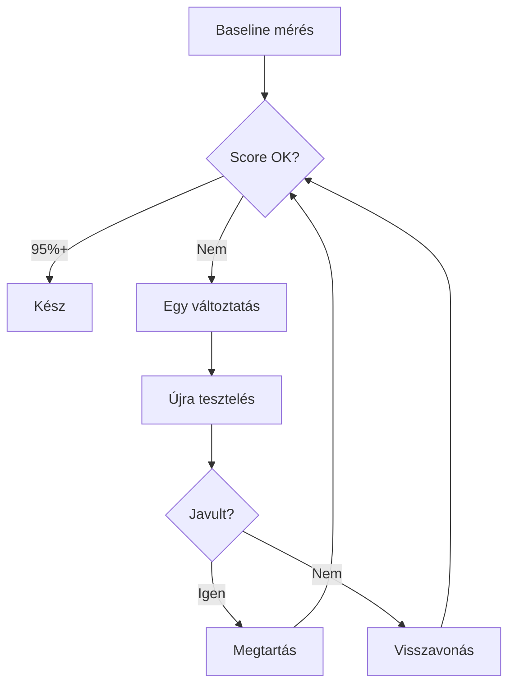

---
tags:
  - github
  - ai
  - ml
datum: 2026-03-26
szint: "🏗️ Builder"
url: https://github.com/karpathy/autoresearch
kapcsolodo:
  - "[[toolbox/claude-code|Claude Code]]"
  - "[[toolbox/claude-code-skills-es-plugins|Claude Code Skills]]"
  - "[[_moc/moc-ai-tooling|MOC - AI Tooling]]"
---

# autoresearch

**Kategória:** `AI research automation` / `skill optimization`
**URL:** https://github.com/karpathy/autoresearch

---

## Mi ez és mire jó?

> [!tldr] Egy mondatban
> AI agent ami autonóm módon kísérletezik: módosít, tesztel, megtartja ha jobb, visszavonja ha rosszabb - és ezt ismétli amíg alszol.

Az eredeti repo LLM training kódot optimalizál (single-GPU, 5 perces futások), de a **módszer** univerzális. A lényeg:

1. Van egy fájl amit az agent módosíthat
2. Van egy metrika ami mérhető (val_bpb / checklist pass rate)
3. Az agent egy változtatást csinál, méri, megtartja vagy visszavonja
4. Ismétli autonóm módon

Ez a "hill climbing" legegyszerűbb formája - de meglepően hatékony ha a változtatások kicsik és a metrika megbízható.

---

## Mikor hasznos?

- **Skill optimalizálás** - ha egy [[toolbox/claude-code|Claude Code]] skill az esetek 70%-ában jó és 30%-ában nem, ez a módszer automatikusan javítja
- **Prompt engineering** - bármilyen ismételten használt prompt finomhangolása
- **Config tuning** - ha van mérhető output (page load speed, test pass rate, bundle size)

### Mikor NE használd

- Ha nincs mérhető, objektív metrika (szubjektív minőség nem scorolható megbízhatóan)
- Ha a teljes újraírás gyorsabb lenne mint az inkrementális javítás
- Ha a skill ritkán fut - nincs elég minta a trendek észleléséhez

---

## A módszer mélyebben

A changelog amit az agent generál a legértékesebb output - teljes rekord arról mi működik és mi nem az adott skill-nél. Amikor jobb modellek jönnek, a changelog-ot átadod és onnan folytatja.

### Hogyan alkalmazd a gyakorlatban

**A checklist a kulcs** - 3-6 igen/nem kérdés ami definiálja mit jelent a "jó" output. Példa:

- Van-e frontmatter `dátum:` mező? (igen/nem)
- Van-e legalább 2 `[[backlink]]`? (igen/nem)
- Max 120 sor? (igen/nem)
- Nincs benne kódblokk ami nem szükséges? (igen/nem)

> [!warning] 6+ kérdésnél a skill "gaming"-elni kezdi a checklist-et
> Ahogy egy diák aki bemagolja a válaszokat anélkül hogy értené az anyagot - a skill is túloptimalizálhat a checklist-re anélkül hogy a tényleges minőség javulna.

---

## AI-natív fejlesztés

A módszer közvetlenül alkalmazható [[toolbox/claude-code|Claude Code]] skill-ekre. A lényeg: nem kell a repót klónozni, a **módszer** a fontos - kis változtatások, mérés, keep/revert loop.

> [!tip] Hogyan használd AI-val
> "Futtass autoresearch-öt a [skill neve] skill-emen. Checklist: [felsorolás]. Tesztelj 5 különböző input típussal és javítsd amíg 90%+ nem lesz."

---

## Kapcsolódó

- [[toolbox/claude-code|Claude Code]] - az agent ami futtatja
- [[github/napkin|napkin]] - hasonló "agent-first" szemlélet, de tudásbázisra nem optimalizálásra
- [[toolbox/claude-code-skills-es-plugins|Claude Code Skills]] - a skill-ek amiket ezzel a módszerrel optimalizálhatsz
