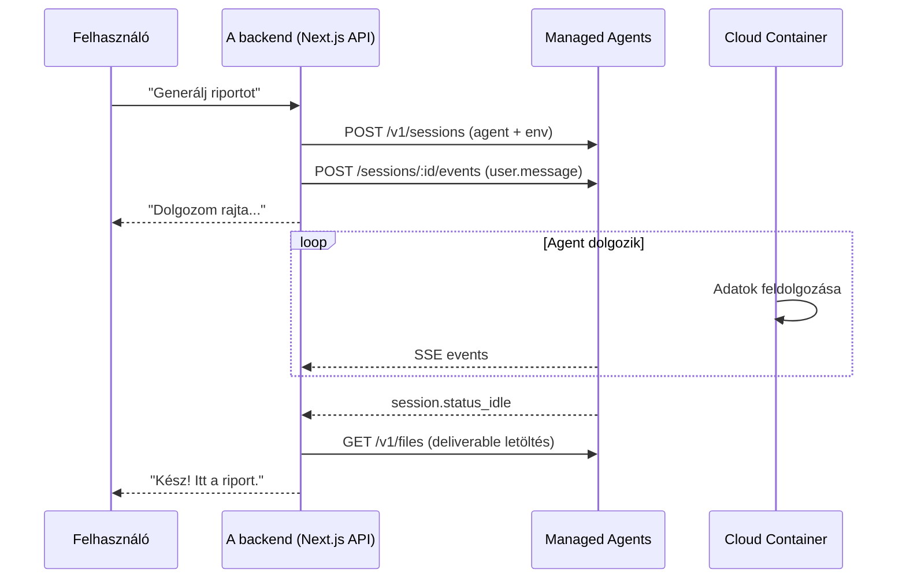
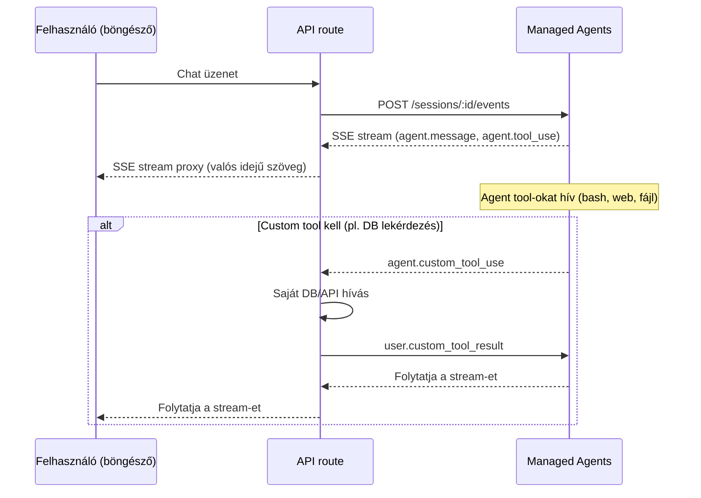
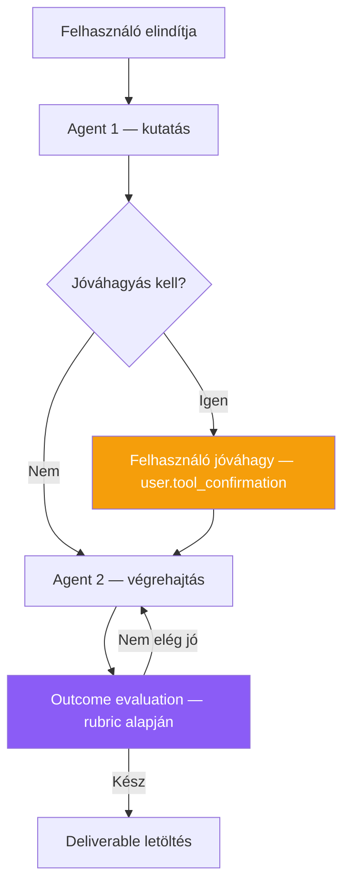

---
tags:
  - ai
  - agent
  - integracio
datum: 2026-04-08
szint: "🏗️ Builder"
kapcsolodo:
  - "[[toolbox/claude-managed-agents|Claude Managed Agents]]"
  - "[[guides/claude-managed-agents-technikai-felepites|Managed Agents - Technikai felépítés]]"
  - "[[guides/claude-managed-agents-research-preview|Managed Agents - Research Preview]]"
  - "[[toolbox/claude-agent-sdk|Claude Agent SDK]]"
  - "[[toolbox/mcp-model-context-protocol|MCP]]"
  - "[[foundations/sdk|SDK]]"
---

# Claude Managed Agents - Integrációs minták

> [!tldr] Miért releváns
> A [[toolbox/claude-managed-agents|Claude Managed Agents]] igazi ereje nem a CLI-s fejlesztés, hanem hogy **beágyazd a saját SaaS termékedbe**. A felhasználóid agent session-öket indítanak anélkül, hogy tudnák, mi fut a háttérben. Ez a note a három fő integrációs pattern-t mutatja be valós példákkal.

---

## A három integrációs pattern

### 1. Backend worker — aszinkron feladat feldolgozás

A felhasználó elindít egy feladatot, a backend feldolgozza, és értesíti ha kész.



**Mikor használd:**
- Hosszan futó feladatok (percek-órák)
- A felhasználó nem vár valós időben
- Fájl output kell (Excel, PDF, kód)

**Kulcs implementációs részletek:**
- Agent és environment **egyszer** létrehozva, újrahasználható
- Session minden kérésnél új
- Webhook vagy polling a kész státuszhoz
- Files API-val töltöd le az output-ot

---

### 2. Real-time asszisztens — streaming válaszok

Chat-szerű felület ahol a felhasználó közvetlenül kommunikál az agent-tel, és valós időben látja a választ.



**Mikor használd:**
- Chat interfész (ügyfélszolgálat, asszisztens)
- A felhasználó interaktívan irányítja az agent-et
- Valós idejű feedback kell

**Kulcs implementációs részletek:**
- SSE stream proxy a frontend felé (Next.js API route → browser EventSource)
- Custom tool-ok a saját rendszereidhez (DB query, API hívás, felhasználói adatok)
- Permission policy-val kontrollálod mit tehet az agent
- Session **újrahasználható** — a felhasználó folytathatja a beszélgetést

---

### 3. Multi-step workflow — orchestráció

Komplex flow ahol több lépés, jóváhagyás vagy agent együttműködés kell.



**Mikor használd:**
- Több fázisú munka (kutatás → draft → review → véglegesítés)
- Human-in-the-loop jóváhagyás szükséges
- Minőségi garancia kell (outcome + rubric)

**Kulcs implementációs részletek:**
- `always_ask` permission policy a kritikus tool-okra
- Outcome rubric-kal definiálod a minőségi elvárásokat
- Multi-agent: coordinator delegál szakértő agent-eknek
- A felhasználó `user.interrupt`-tal bármikor közbeszólhat

---

## Három valós példa — amit te építhetsz

### Példa 1: Ügyfélszolgálati agent — SaaS termékbe ágyazva

**Szcenárió:** Van egy SaaS appod (pl. projektmenedzsment tool). Az ügyfélszolgálatot egy Claude agent segíti, aki ismeri a terméket és hozzáfér a felhasználó adataihoz.

| Elem | Konfiguráció |
|------|-------------|
| **Agent** | System prompt: "Te a ProductName support asszisztense vagy. Segíts a felhasználóknak." |
| **Tools** | `agent_toolset_20260401` (web_search kikapcsolva) + custom tool-ok |
| **Custom tool-ok** | `get_user_account` — felhasználó fiók adatai, `get_billing_info` — számlázás, `search_knowledge_base` — tudásbázis keresés |
| **Environment** | `limited` networking — csak a te API-d `allowed_hosts`-ban |
| **Permission** | Custom tool-ok: te kontrollálod. Beépített tool-ok: `always_allow` (nincs bash) |

**Flow:**
1. Felhasználó megnyitja a chat widget-et
2. Next.js API route session-t indít (vagy meglévőt folytatja)
3. User üzenet → agent válaszol, közben custom tool-okkal lekéri az adatokat
4. Agent a tudásbázisból és a felhasználó kontextusából válaszol
5. Ha nem tud segíteni → eszkaláció (custom tool: `create_support_ticket`)

**Miért Managed Agents és nem sima Messages API?**
- Az agent **többlépéses** kutakodást végez (tudásbázis + account + billing)
- Session perzisztens — a felhasználó visszajöhet később
- Sandbox biztosítja, hogy az agent nem fér hozzá máshoz

---

### Példa 2: Dokumentum feldolgozó — batch munkák

**Szcenárió:** Egy jogi/pénzügyi app ahol a felhasználók szerződéseket töltenek fel, és az agent kivonatot készít, összehasonlít, és strukturált adatot generál.

| Elem | Konfiguráció |
|------|-------------|
| **Agent** | System prompt: jogi dokumentum elemzési expertise |
| **Tools** | `agent_toolset_20260401` (bash + read + write + edit) |
| **Environment** | Python + `pip: ["pdfplumber", "openpyxl", "pandas"]` |
| **Outcome** | Rubric: "Minden szerződés összefoglalva, kockázatok jelölve, Excel output" |
| **Networking** | `limited` — nincs kimenő hálózat (érzékeny dokumentumok) |

**Flow:**
1. Felhasználó feltölt 10 szerződést
2. Feltöltöd Files API-val a container-be
3. Session indul outcome-mal: "Elemezd mind a 10 szerződést, készíts összefoglaló Excel-t"
4. Agent iterál: PDF-eket olvas → Python-nal feldolgoz → .xlsx-et generál
5. Grader ellenőrzi a rubric alapján (minden szerződés szerepel? kockázatok jelölve?)
6. Ha nem elég → agent javít. Ha OK → letöltöd az Excel-t Files API-ból
7. Felhasználó megkapja az eredményt

**Miért Managed Agents?**
- **Hosszan futó** — 10 dokumentum feldolgozása percekig tart
- **Outcome** garantálja a minőséget
- **Sandbox** — érzékeny dokumentumok izolált container-ben
- Nem kell PDF parser kódot írni — az agent Python-nal megoldja

---

### Példa 3: Kód generátor — multi-agent pipeline

**Szcenárió:** Egy fejlesztői platform ahol a felhasználók prompt-ból appot generálnak.

| Elem | Konfiguráció |
|------|-------------|
| **Coordinator agent** | "Engineering Lead" — feladatot elosztja |
| **Code writer agent** | Kódot ír, teszteket futtat |
| **Reviewer agent** | Read-only tools, code review-t ad |
| **Environment** | Node.js + Python + Go pre-installed, `unrestricted` networking |
| **Outcome** | Rubric: "Futó app, tesztek zöldek, nincs lint error" |

**Flow:**
1. Felhasználó: "Készíts egy todo app-ot Next.js-szel és Tailwind-del"
2. Coordinator agent elosztja:
   - Code writer thread: megírja az appot
   - Code writer kész → coordinator továbbküldi a reviewer-nek
   - Reviewer thread: átnézi, feedback-et ad
   - Coordinator visszaküldi a feedback-et a code writer-nek
3. Outcome evaluation: app fut? tesztek zöldek?
4. Ha nem → újabb iteráció
5. Ha igen → felhasználó letölti/deployolja

**Miért multi-agent?**
- **Párhuzamos munka** — reviewer és writer külön context-ben
- **Szakértő prompt-ok** — minden agent a saját területére optimalizált
- **Közös fájlrendszer** — writer ír, reviewer olvas, nem kell fájlokat másolgatni

---

## Döntési fa — melyik pattern-t válaszd?

```
Kérdés: A felhasználó valós időben figyeli az agent-et?
  │
  ├─ IGEN → A felhasználó interaktívan irányít?
  │           ├─ IGEN → Pattern 2 (Real-time asszisztens)
  │           └─ NEM  → Pattern 1 (Backend worker) + progress bar
  │
  └─ NEM  → Több lépés vagy jóváhagyás kell?
              ├─ IGEN → Pattern 3 (Multi-step workflow)
              └─ NEM  → Pattern 1 (Backend worker)
```

---

## Kapcsolódó

- [[toolbox/claude-managed-agents|Claude Managed Agents]] — fő overview, árazás, architektúra
- [[guides/claude-managed-agents-technikai-felepites|Managed Agents - Technikai felépítés]] — agent setup, tools, permissions, events API részletesen
- [[guides/claude-managed-agents-research-preview|Managed Agents - Research Preview]] — outcomes, multi-agent, memory részletesen
- [[toolbox/claude-agent-sdk|Claude Agent SDK]] — ha saját agent loop-ot akarsz kódban (nem hosted)
- [[toolbox/mcp-model-context-protocol|MCP]] — custom tool-ok helyett MCP server-rel is bővítheted az agent-et
- [[foundations/sdk|SDK]] — SDK koncepció (custom tool-ok SDK-kkal implementálhatók)
