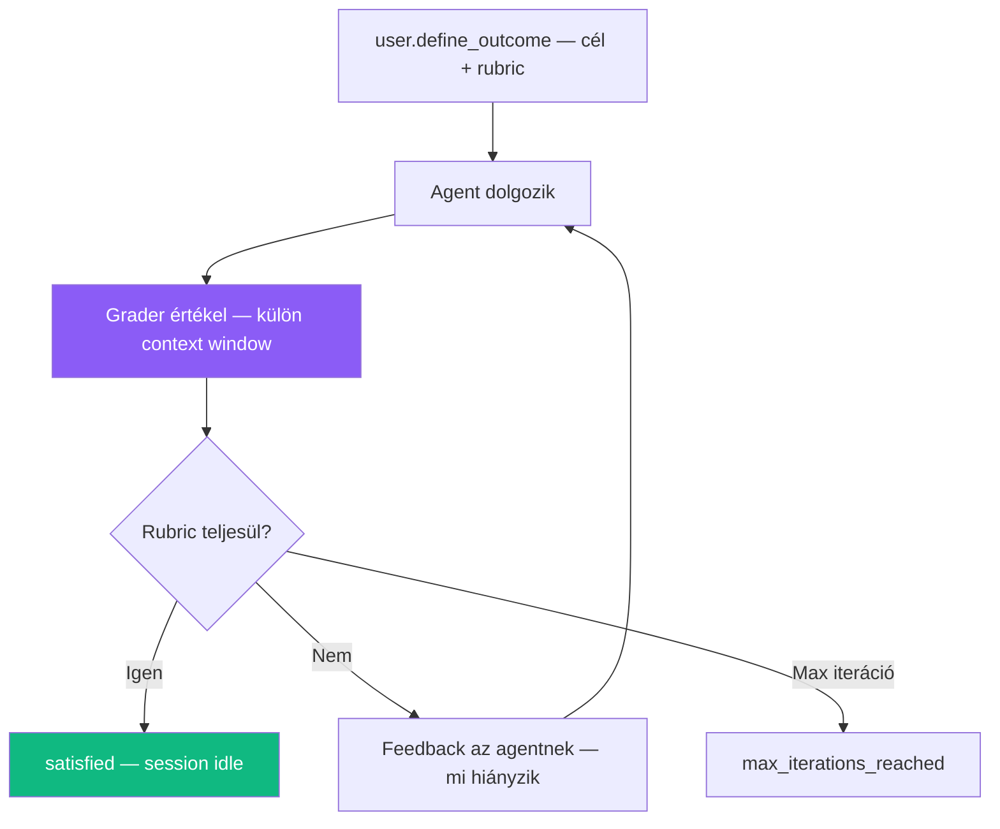

---
tags:
  - ai
  - agent
  - research-preview
datum: 2026-04-08
szint: "🏗️ Builder"
kapcsolodo:
  - "[[toolbox/claude-managed-agents|Claude Managed Agents]]"
  - "[[guides/claude-managed-agents-technikai-felepites|Managed Agents - Technikai felépítés]]"
  - "[[guides/claude-managed-agents-integracios-mintak|Managed Agents - Integrációs minták]]"
  - "[[toolbox/claude-code|Claude Code]]"
  - "[[toolbox/claude-agent-sdk|Claude Agent SDK]]"
  - "[[toolbox/mcp-model-context-protocol|MCP]]"
  - "[[toolbox/claude-code-agent-teams|Claude Code Agent Teams]]"
---

# Claude Managed Agents - Research Preview

> [!tldr] Miért releváns
> A Managed Agents három legérdekesebb funkciója még research preview-ban van: **Outcomes** (self-evaluation rubric alapján), **Multi-agent** (coordinator + worker agentek), és **Memory** (session-ök közötti tudás perzisztencia). Ezek mutatják, merre tart az agent platform — és mire számíthatsz hamarosan production-ben.

> [!warning] Hozzáférés
> Mindhárom research preview funkció külön hozzáférést igényel: [Request access](https://claude.com/form/claude-managed-agents). Extra beta header: `managed-agents-2026-04-01-research-preview`

---

## Outcomes — célvezérelt munka rubric-kal

### Mi ez?

Az outcome egy session-t a "beszélgetés" szintről a **"deliverable" szintre** emeli. Definiálsz egy célt és egy rubric-ot (értékelési szempontrendszert), és Claude addig iterál amíg a rubric kritériumait nem teljesíti.

### Hogyan működik?



A **grader** egy külön context window-ban fut — nem látja az agent implementációs döntéseit, ezért objektívebben tud értékelni. Criterion-onként ad visszajelzést: mi stimmel, mi hiányzik.

### Rubric

A rubric egy markdown dokumentum, ami leírja a minőségi követelményeket. Inline szövegként vagy Files API-val feltölthető fájlként adod meg.

Jó rubric-ok jellemzői:
- Criterion-onként strukturált (## szekciók)
- Mérhető, ellenőrizhető feltételek ("Uses historical data from last 5 years")
- Nem szubjektív ("clearly labeled sheets" vs "nice formatting")

### Iteráció

- Alapértelmezett: **3 iteráció**, max: **20**
- `max_iterations` paraméterrel állítható
- Outcome evaluation event-ek a stream-en: `span.outcome_evaluation_start/ongoing/end`
- Eredmény típusok: `satisfied`, `needs_revision`, `max_iterations_reached`, `failed`, `interrupted`

### Deliverable-ek letöltése

Az agent a `/mnt/session/outputs/` mappába ír. Files API-val töltheted le:
```
GET /v1/files?scope_id=$session_id   → fájlok listázása
GET /v1/files/$file_id/content       → letöltés
```

### Mikor használd?

- **Strukturált output kell** — Excel, PDF, kódbázis ami megfelel specifikációnak
- **Mérhető minőségi elvárások** — rubric-ban leírható követelmények
- **Iteratív javítás** — ne az első próbálkozás legyen a végleges

### Mikor NE

- Szubjektív, nehezen mérhető feladatok ("write a creative essay")
- Egyszerű Q&A — arra a sima Messages API elég
- Ha a rubric és a description ellentmondanak — `failed` eredményt kapsz

---

## Multi-agent orchestration

### Mi ez?

Egy **coordinator agent** más agent-eket spawn-ol és irányít párhuzamosan. Mindegyik saját thread-ben fut izolált context-tel, de **közös fájlrendszeren** osztoznak.

### Hogyan működik?

| Jellemző | Részlet |
|----------|--------|
| **Közös fájlrendszer** | Minden agent ugyanazt a container-t látja |
| **Izolált context** | Minden agent saját conversation history (thread) |
| **Perzisztens thread-ek** | Coordinator újra szólhat egy korábbi agent-nek, az emlékszik |
| **Egy szint mélység** | Coordinator → sub-agent OK, de sub-agent → sub-sub-agent NEM |
| **Saját konfig** | Minden agent a saját model/prompt/tools-szal fut |

### Konfiguráció

Az agent `callable_agents` array-ében adod meg a meghívható agent-eket:

```json
{
  "name": "Engineering Lead",
  "callable_agents": [
    {"type": "agent", "id": "reviewer_id", "version": 1},
    {"type": "agent", "id": "test_writer_id", "version": 1}
  ]
}
```

Session létrehozásakor nem kell külön megadni a callable agent-eket — az orchestrator konfigjából jönnek.

### Thread-ek

| Fogalom | Mi ez |
|---------|-------|
| **Primary thread** | Session-szintű stream — condensed nézet az összes aktivitásról |
| **Agent thread** | Egy sub-agent teljes reasoning + tool call history-ja |

A session status aggregáció: ha bármelyik thread `running`, az egész session `running`.

### Multi-agent event-ek

| Event | Mikor |
|-------|-------|
| `session.thread_created` | Coordinator új thread-et spawn-olt |
| `session.thread_idle` | Egy agent thread kész |
| `agent.thread_message_sent` | Agent üzenetet küldött másik thread-nek |
| `agent.thread_message_received` | Agent üzenetet kapott másik thread-ből |

### Mire jó a delegálás?

| Feladat | Agent típus |
|---------|-------------|
| **Code review** | Reviewer agent — focused prompt, read-only tools |
| **Test generálás** | Test agent — ír és futtat teszteket, production kódot nem nyúl |
| **Research** | Search agent — web tool-ok, összefoglalót ad vissza |
| **Dokumentáció** | Docs agent — kódbázis alapján dokumentál |

> [!info] [[toolbox/claude-code-agent-teams|Claude Code Agent Teams]] vs Managed Agents multi-agent
> Az Agent Teams a [[toolbox/claude-code|Claude Code]] CLI-n belüli multi-agent koordináció (lokálisan, terminálban). A Managed Agents multi-agent API szinten, felhőben fut — SaaS termékekbe integrálható.

---

## Memory — session-ök közötti tudás

### Mi ez?

A Managed Agents session-ök alapból **ephemeral-ak** — ami történt, eltűnik. A **memory store** lehetővé teszi, hogy az agent tanulságokat vigyen át session-ök között: user preferenciák, projekt konvenciók, korábbi hibák, domain kontextus.

### Architektúra

| Fogalom | Mi ez |
|---------|-------|
| **Memory store** | Workspace-szintű dokumentum-gyűjtemény (text fájlok) |
| **Memory** | Egy dokumentum a store-ban (max 100KB, ~25K token) |
| **Memory version** | Immutable verzió minden mutációról (audit trail) |

### Hogyan működik?

1. Létrehozol egy memory store-t (`POST /v1/memory_stores`)
2. Session-höz csatolod a `resources[]` array-ben
3. **Az agent automatikusan** ellenőrzi a store-t feladat előtt és ír bele ha tanult valamit

Nem kell extra prompting vagy konfiguráció — a memory tools automatikusan elérhetővé válnak:

| Memory tool | Mit csinál |
|-------------|-----------|
| `memory_list` | Dokumentumok listázása |
| `memory_search` | Full-text keresés |
| `memory_read` | Dokumentum olvasása |
| `memory_write` | Dokumentum létrehozása/felülírása |
| `memory_edit` | Dokumentum módosítása |
| `memory_delete` | Dokumentum törlése |

### Több store — tipikus pattern-ek

Max **8 memory store** per session. Miért több?

| Pattern | Leírás |
|---------|--------|
| **Shared reference** | Egy read-only store konvenciókkal, domain tudással — minden session-höz csatolva |
| **Per-user/per-project** | Egy store user-enként vagy projektenként |
| **Különböző lifecycle** | Egy hosszú életű tudásbázis + egy rövid életű projekt store |

Access szintek: `read_write` (default) vagy `read_only`.

### Versioning és audit

Minden memory mutáció immutable version-t hoz létre:
- `created` — első írás
- `modified` — update
- `deleted` — törlés

Verziókon szűrhetsz: `memory_id`, `session_id`, `api_key_id`, időtartomány. **Redact** művelet a tartalom törlésére audit trail megtartásával (PII, secrets eltávolítás).

### Optimistic concurrency

Safe content edit-ek `content_sha256` precondition-nel — ha közben más írta a memory-t, 409 conflict-ot kapsz ahelyett hogy felülírnád.

---

## Research Preview státusz összefoglaló

| Funkció | Státusz | Mire jó | Kulcs gondolat |
|---------|---------|---------|----------------|
| **Outcomes** | Research preview | Rubric-alapú self-evaluation és iteráció | Grader külön context window-ban fut |
| **Multi-agent** | Research preview | Coordinator + worker agent-ek párhuzamosan | Közös fájlrendszer, izolált context, 1 szint mély |
| **Memory** | Research preview | Session-ök közötti tudás perzisztencia | Automatikus — agent magától olvas/ír |

Ezek a funkciók várhatóan GA-ba kerülnek — érdemes figyelni a [changelog](https://platform.claude.com/docs/en/about-claude/changelog)-ot.

---

## Kapcsolódó

- [[toolbox/claude-managed-agents|Claude Managed Agents]] — fő overview, árazás, use case-ek
- [[guides/claude-managed-agents-technikai-felepites|Managed Agents - Technikai felépítés]] — agent setup, tools, permissions, environments
- [[guides/claude-managed-agents-integracios-mintak|Managed Agents - Integrációs minták]] — hogyan építsd be a saját termékedbe
- [[toolbox/claude-code|Claude Code]] — lokális CLI ami hasonló agent loop-ot futtat
- [[toolbox/claude-agent-sdk|Claude Agent SDK]] — programmatic agent building
- [[toolbox/mcp-model-context-protocol|MCP]] — tool-ok szabványos csatlakoztatása
- [[toolbox/claude-code-agent-teams|Claude Code Agent Teams]] — lokális multi-agent koordináció a CLI-ben
