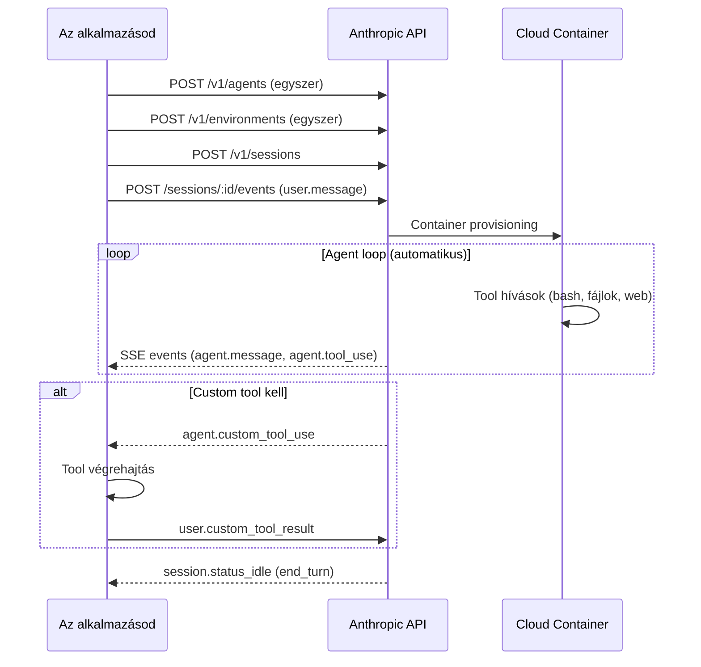

---
tags:
  - ai
  - agent
  - api
datum: 2026-04-08
szint: "🏗️ Builder"
kapcsolodo:
  - "[[toolbox/claude-managed-agents|Claude Managed Agents]]"
  - "[[guides/claude-managed-agents-research-preview|Managed Agents - Research Preview]]"
  - "[[guides/claude-managed-agents-integracios-mintak|Managed Agents - Integrációs minták]]"
  - "[[toolbox/mcp-model-context-protocol|MCP]]"
  - "[[toolbox/claude-code|Claude Code]]"
  - "[[foundations/sdk|SDK]]"
---

# Claude Managed Agents - Technikai felépítés

> [!tldr] Miért releváns
> Ez a note a [[toolbox/claude-managed-agents|Claude Managed Agents]] technikai részleteit bontja ki: hogyan konfigurálsz agent-et, milyen environment-et adsz neki, hogyan kezeled a tool jogosultságokat, és hogyan kommunikálsz az agent-tel events-en keresztül.

---

## Agent konfiguráció

Az agent egy **újrafelhasználható, verzionált konfiguráció** — egyszer hozod létre, utána ID-vel hivatkozol rá session-ökben.

### Mezők

| Mező | Kötelező | Mit csinál |
|------|----------|-----------|
| `name` | Igen | Human-readable név |
| `model` | Igen | Claude model (4.5+ modellek) |
| `system` | Nem | System prompt — az agent személyisége és viselkedése |
| `tools` | Nem | Beépített toolset + custom tools + MCP tools |
| `mcp_servers` | Nem | [[toolbox/mcp-model-context-protocol|MCP]] server-ek csatlakoztatása |
| `skills` | Nem | Domain-specifikus kontextus progressive disclosure-rel |
| `callable_agents` | Nem | Más agent-ek amiket ez az agent meghívhat (→ multi-agent) |
| `metadata` | Nem | Tetszőleges key-value párok saját tracking-hez |

### Lifecycle

| Művelet | Mi történik |
|---------|-------------|
| **Create** | Új agent, version: 1 |
| **Update** | Új verzió generálódik. Omitted mezők megmaradnak. Scalar-ok felülíródnak, array-ek teljes cserével. |
| **Archive** | Read-only lesz. Meglévő session-ök futnak tovább, újat nem lehet indítani. |
| **List versions** | Teljes verzió history audit-hoz |

---

## Environment — container konfiguráció

Az environment a **container template** ahol az agent fut. Egyszer hozod létre, több session is használhatja, de mindegyik session **saját izolált container instance-t** kap.

### Package-ek

Pre-installált runtime-ok a container-ben (Python, Node.js, Go, stb.), amiket a `packages` mezővel bővíthetsz:

| Manager | Mező | Példa |
|---------|------|-------|
| apt | `apt` | `"ffmpeg"`, `"imagemagick"` |
| npm | `npm` | `"typescript@5.0"` |
| pip | `pip` | `"pandas"`, `"numpy"` |
| cargo | `cargo` | `"ripgrep@14"` |
| gem | `gem` | `"rails:7.1.0"` |
| go | `go` | `"golang.org/x/tools/cmd/goimports@latest"` |

Több manager megadásakor abc sorrendben futnak. Verziópinelés opcionális — alapból latest.

### Networking

| Mód | Leírás |
|-----|--------|
| `unrestricted` | Teljes kimenő hálózat (safety blocklist-tel). **Alapértelmezett.** |
| `limited` | Csak az `allowed_hosts` lista + opcionálisan MCP szerverek és package registry-k |

> [!warning] Figyelem
> Production-ben **mindig `limited`** networking-et használj explicit `allowed_hosts` listával. Principle of least privilege.

A `limited` módban két extra bool:
- `allow_mcp_servers` — MCP endpoint-ok elérése (default: false)
- `allow_package_managers` — PyPI, npm, stb. (default: false)

### Lifecycle

- Environment-ök persist-álnak amíg nem archiválod/törlöd
- Nem verzionáltak — ha frissíted, érdemes logolni a változásokat
- Session-ök **nem** osztanak fájlrendszert, még ha ugyanazt az environment-et is használják

---

## Tool-ok konfigurálása

### Agent Toolset

Az `agent_toolset_20260401` az összes beépített tool-t egyszerre engedélyezi. Részletes konfigurálás:

**Specifikus tool-ok kikapcsolása:**
```json
{
  "type": "agent_toolset_20260401",
  "configs": [
    { "name": "web_fetch", "enabled": false },
    { "name": "web_search", "enabled": false }
  ]
}
```

**Csak specifikus tool-ok engedélyezése:**
```json
{
  "type": "agent_toolset_20260401",
  "default_config": { "enabled": false },
  "configs": [
    { "name": "bash", "enabled": true },
    { "name": "read", "enabled": true },
    { "name": "write", "enabled": true }
  ]
}
```

### Custom tool-ok

A Messages API `tool_use`-hoz hasonlóan definiálhatsz kliens-oldali tool-okat. Claude eldönti mikor hívja, de **a te kódod futtatja**:

1. Session stream-en `agent.custom_tool_use` event érkezik
2. Session megáll (`requires_action`)
3. Te végrehajtod a tool-t
4. `user.custom_tool_result` event-tel visszaküldöd az eredményt
5. Session folytatódik

A custom tool-ok definíciója a Messages API-val azonos formátumú (name, description, input_schema).

### MCP server-ek

Az agent config-ban `mcp_servers` array-ben adod meg. Az [[toolbox/mcp-model-context-protocol|MCP]] tool-ok automatikusan elérhetővé válnak. URL-alapú csatlakozás:

```json
{
  "mcp_servers": [
    {"type": "url", "name": "github", "url": "https://mcp.example.com/github"}
  ]
}
```

---

## Permission policies — tool jogosultságok

Két policy típus a server-oldali tool-okhoz:

| Policy | Viselkedés |
|--------|-----------|
| `always_allow` | Tool automatikusan fut, nincs jóváhagyás |
| `always_ask` | Session megáll, vár a `user.tool_confirmation` event-re |

### Hierarchia

- **Agent toolset** alapértelmezés: `always_allow`
- **MCP toolset** alapértelmezés: `always_ask` (biztonsági okokból — új MCP tool-ok ne fussanak jóváhagyás nélkül)
- Egyedi tool-okra felülírható a `configs` array-ben

**Tipikus pattern — mindent engedélyez, kivéve bash:**

```json
{
  "type": "agent_toolset_20260401",
  "default_config": { "permission_policy": {"type": "always_allow"} },
  "configs": [
    { "name": "bash", "permission_policy": {"type": "always_ask"} }
  ]
}
```

### Jóváhagyás kezelése

Amikor `always_ask` tool-t hív az agent:
1. `agent.tool_use` event érkezik a stream-en
2. `session.status_idle` + `stop_reason: requires_action`
3. Te döntesz: `user.tool_confirmation` → `result: "allow"` vagy `"deny"` + opcionális `deny_message`
4. Session visszamegy `running`-ba

> [!info] Analógia
> Ez pont olyan mint a [[toolbox/claude-code|Claude Code]] permission rendszere: van "auto" mód (always_allow) és van interaktív mód ahol jóváhagyást kér. A Managed Agents-ben te programozod a jóváhagyási logikát.

---

## Events és streaming

Az agent-tel **SSE (Server-Sent Events)** stream-en keresztül kommunikálsz. Kétirányú:

### User → Agent events

| Event | Mikor |
|-------|-------|
| `user.message` | Feladat leírása vagy irányítás |
| `user.tool_confirmation` | Tool jóváhagyás/elutasítás |
| `user.custom_tool_result` | Custom tool eredmény visszaküldése |
| `user.interrupt` | Agent megállítása |
| `user.define_outcome` | Outcome definiálása (research preview) |

### Agent → User events

| Event | Mikor |
|-------|-------|
| `agent.message` | Szöveges válasz |
| `agent.tool_use` | Beépített tool hívás |
| `agent.mcp_tool_use` | MCP tool hívás |
| `agent.custom_tool_use` | Custom tool hívás (te hajtod végre) |
| `session.status_idle` | Agent kész — `stop_reason` mondja meg miért (end_turn, requires_action) |

### Usage tracking

A session object-ben kumulatív token statisztikák:
```json
{
  "usage": {
    "input_tokens": 5000,
    "output_tokens": 3200,
    "cache_creation_input_tokens": 2000,
    "cache_read_input_tokens": 20000
  }
}
```

Cache 5 perces TTL-lel — egymás utáni turn-ök cache read-eket kapnak.

---

## API flow összefoglalás



---

## Kapcsolódó

- [[toolbox/claude-managed-agents|Claude Managed Agents]] — fő overview, árazás, use case-ek
- [[guides/claude-managed-agents-research-preview|Managed Agents - Research Preview]] — outcomes, multi-agent, memory
- [[guides/claude-managed-agents-integracios-mintak|Managed Agents - Integrációs minták]] — hogyan építsd be a saját termékedbe
- [[toolbox/mcp-model-context-protocol|MCP]] — tool-ok szabványos csatlakoztatása
- [[toolbox/claude-code|Claude Code]] — lokális CLI ami hasonló tool-készletet használ
- [[foundations/sdk|SDK]] — SDK mint koncepció
