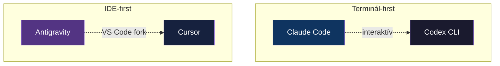
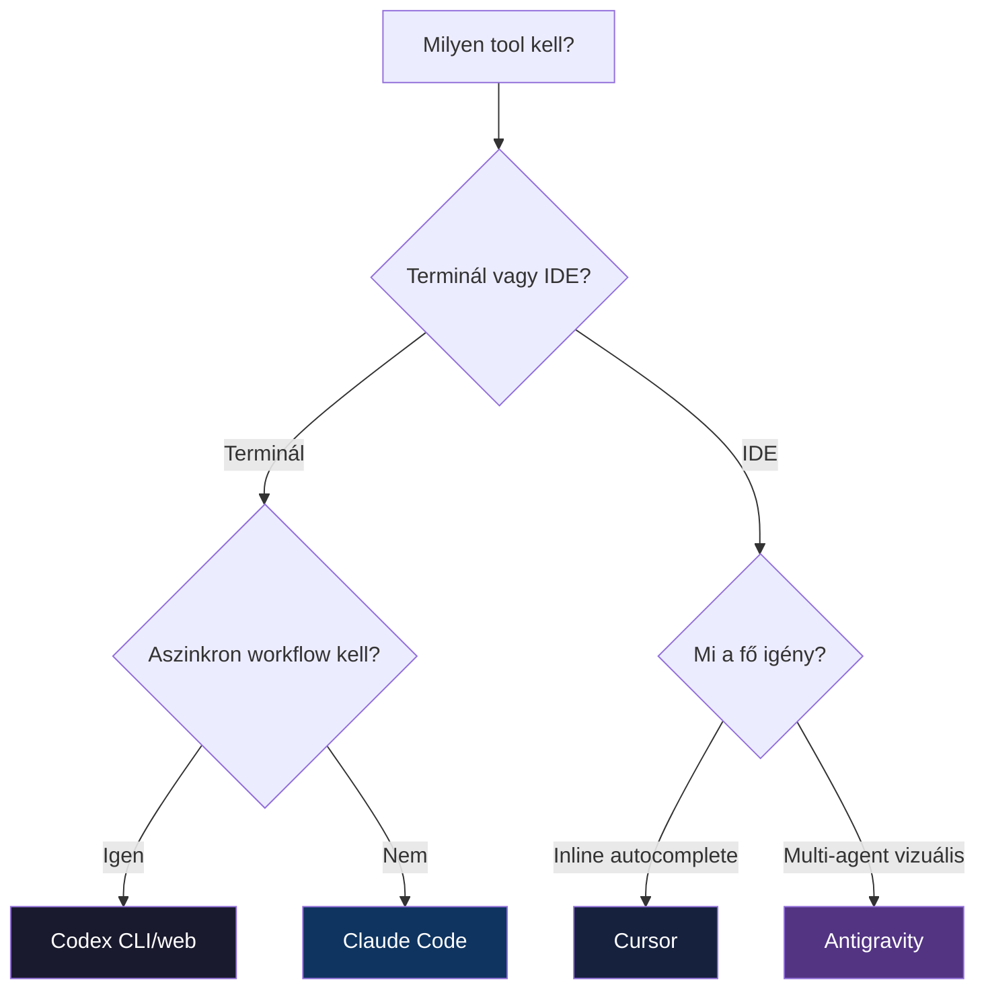

---
tags:
  - eszkoz
  - ai
  - osszehasonlitas
datum: 2026-03-07
szint: "🧱 Brick"
kapcsolodo:
  - "[[toolbox/claude-code-projekt-setup|Claude Code projekt setup]]"
  - "[[toolbox/openai-codex-cli|OpenAI Codex CLI]]"
  - "[[toolbox/google-antigravity|Google Antigravity]]"
  - "[[toolbox/cursor-es-claude-konfiguracio|Cursor és Claude konfiguráció]]"
  - "[[toolbox/ai-first-fejlesztoi-workflow|AI-first fejlesztői workflow]]"
  - "[[_moc/moc-ai-tooling|MOC - AI Tooling]]"
---

# AI coding agentek összehasonlítása

## Összefoglaló

2025-26-ban négy meghatározó AI coding tool formálja a fejlesztői munkafolyamatokat. Mindegyik más paradigmát képvisel — nincs egyetlen "legjobb", de van, amelyik a te munkastílusodhoz a legjobban illik.

---

## A négy paradigma



| Tool | Paradigma | Interfész | Készítő |
|------|-----------|-----------|---------|
| **Claude Code** | Terminál-first, autonóm agent | CLI | Anthropic |
| **Codex CLI** | Aszinkron cloud agent | CLI + web | OpenAI |
| **Antigravity** | Agent-first IDE | GUI (VS Code fork) | Google |
| **Cursor** | Inline AI IDE | GUI (VS Code fork) | Cursor, Inc. |

---

## Részletes összehasonlítás

| | Claude Code | Codex CLI / web | Antigravity | Cursor |
|---|-------------|-----------------|-------------|--------|
| **Modell** | Claude (Opus, Sonnet) | GPT-5 Codex | Gemini 2.5 Pro/Flash | Claude, GPT, egyéb |
| **Árazás** | API-alapú (~$50-150/hó) | ChatGPT Plus ($20/hó) | Ingyenes (preview) | $20/hó (Pro) |
| **Kontextus fájl** | `CLAUDE.md` | `AGENTS.md` | — | `.cursor/rules/` |
| **MCP támogatás** | Natív, teljes | Támogatott | Kompatibilis | Beépített |
| **Agent képességek** | Agent Teams, SDK | Aszinkron cloud sandbox | Multi-agent Manager | Background Agent |
| **Párhuzamos munka** | Agent Teams + worktree | Több cloud task egyszerre | Manager view agent-ek | Background Agent |
| **Kód minőség** | Legjobb (Claude Opus) | Jó (GPT-5) | Jó (Gemini 2.5) | Modelltől függ |
| **Inline autocomplete** | Nincs | Nincs | Van | Legjobb (Tab) |
| **Fájl szerkesztés** | Terminálban, diff-ekkel | Terminálban vagy PR-ben | IDE-ben | IDE-ben |
| **Open source** | Igen | Igen (CLI) | Nem | Nem |

---

## Mikor melyiket?

### Claude Code — terminált szereted, komplex agentic workflow

```
✅ Terminál-native workflow
✅ Komplex, többlépéses feladatok
✅ Legjobb kód minőség (Claude Opus)
✅ Agent Teams párhuzamos munkához
✅ Skills/Plugins testreszabás
✅ Open source

❌ Nincs GUI/IDE integráció
❌ Nincs inline autocomplete
❌ API költség (nincs fix ár)
```

**Ideális:** senior fejlesztőknek, akik terminálban élnek és komplex refaktorokat, feature fejlesztéseket végeznek.

### Codex — aszinkron workflow, GitHub-centrikus

```
✅ Aszinkron végrehajtás (indítsd el, gyere vissza)
✅ ChatGPT Plus-ben benne van ($20/hó)
✅ Több task párhuzamosan
✅ Eredmény PR-ként érkezik

❌ Nincs interaktív iteráció (web app-ban)
❌ GitHub-függő
❌ Kevésbé kontrollálható, mint a lokális tool-ok
```

**Ideális:** ha már fizetsz ChatGPT Plus-ért, és szereted az aszinkron "fire and forget" stílust.

### Antigravity — vizuális agent kezelés, Google ökoszisztéma

```
✅ Manager view — vizuális multi-agent orchestrálás
✅ Beépített browser loop
✅ Jelenleg ingyenes (preview)
✅ Google ökoszisztéma integráció (GCP, Firebase)

❌ Még preview-ban van (instabil lehet)
❌ VS Code fork — még egy IDE
❌ Google lock-in kockázat
```

**Ideális:** ha vizuálisan akarod kezelni az agent-eket, vagy Google ökoszisztémában dolgozol.

### Cursor — inline autocomplete, gyors szerkesztés

```
✅ Legjobb inline autocomplete (Tab)
✅ VS Code felület — ismerős
✅ Gyors, kis módosításokhoz kiváló
✅ Modell-választás (Claude, GPT, egyéb)

❌ Kevésbé jó komplex agent feladatokhoz
❌ $20/hó
❌ Nem open source
```

**Ideális:** napi kódoláshoz, gyors szerkesztésekhez, ha szereted a VS Code felületet.

---

## Lehet kombinálni

A tool-ok nem zárják ki egymást. Sok fejlesztő kettőt vagy hármat is használ:

| Kombináció | Mikor |
|------------|-------|
| **Claude Code + Cursor** | Claude Code a komplex feladatokra (refaktor, új feature) + Cursor a napi kódolásra (gyors fix-ek, autocomplete) |
| **Codex + Claude Code** | Codex az aszinkron PR-ekhez + Claude Code az interaktív munkához |
| **Antigravity + Claude Code** | Antigravity a vizuális tervezéshez + Claude Code a pontos implementációhoz |

> [!tip] A legjobb stratégia
> Válassz egy **elsődleges tool-t** (ami a legtöbb munkádat lefedi), és egy **kiegészítőt** (ami a hiányosságait pótolja). A legtöbb fejlesztőnek a Claude Code + Cursor kombináció működik a legjobban.

---

## Konfigurációs fájlok cross-reference

| Konfig típus | Claude Code | Codex | Cursor |
|-------------|-------------|-------|--------|
| **Projekt kontextus** | `CLAUDE.md` | `AGENTS.md` | `.cursor/rules/*.mdc` |
| **Globális settings** | `~/.claude/settings.json` | ChatGPT fiók | Cursor Settings |
| **Projekt settings** | `.claude/settings.json` | — | `.cursor/mcp.json` |
| **MCP szerverek** | `settings.json` → `mcpServers` | `AGENTS.md` | `.cursor/mcp.json` |
| **Skills / Rules** | `.claude/skills/` | — | `.cursor/rules/` |

Ha több tool-t is használsz, érdemes szinkronban tartani a kontextus fájlokat:

```bash
# Példa: CLAUDE.md és AGENTS.md szinkronban tartása
# A tartalom nagyrészt azonos, csak a formátum különbözik
```

---

## Döntési fa



---

## Kapcsolódó

- [[toolbox/claude-code-projekt-setup|Claude Code projekt setup]] — Claude Code beállítása
- [[toolbox/openai-codex-cli|OpenAI Codex CLI]] — Codex részletesen
- [[toolbox/google-antigravity|Google Antigravity]] — Antigravity részletesen
- [[toolbox/cursor-es-claude-konfiguracio|Cursor és Claude konfiguráció]] — Cursor beállítása
- [[toolbox/ai-first-fejlesztoi-workflow|AI-first fejlesztői workflow]] — hogyan illeszkednek a napi munkába
