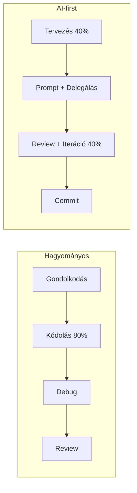

---
tags:
  - eszkoz
  - ai
  - dev-tool
  - workflow
datum: 2026-03-06
szint: "🧱 Scout"
kapcsolodo:
  - "[[toolbox/claude-code-agent-teams|Claude Code Agent Teams]]"
  - "[[toolbox/claude-agent-sdk|Claude Agent SDK]]"
  - "[[toolbox/claude-code-projekt-setup|Claude Code projekt setup]]"
  - "[[toolbox/mcp-model-context-protocol|MCP — Model Context Protocol]]"
  - "[[toolbox/git-worktree-vs-branch|Git worktree vs branch]]"
  - "[[toolbox/tmux|tmux]]"
  - "[[_moc/moc-environment-setup|MOC - Environment Setup]]"
  - "[[_moc/moc-ai-tooling|MOC - AI Tooling]]"
---

# AI-first fejlesztői workflow

## Összefoglaló

Hogyan strukturáld a munkádat úgy, hogy az **AI (Claude Code) legyen az elsődleges implementáló**, te pedig az architekturális döntéshozó és reviewer. Ez nem azt jelenti, hogy nem kódolsz — hanem azt, hogy a kódolás nagy részét delegálod, és a magasabb szintű gondolkodásra fókuszálsz.

## A hagyományos vs AI-first workflow



## Az AI-first nap

### 1. Tervezés (reggel)

- **[[toolbox/claude-code-projekt-setup|CLAUDE.md]] frissítés** — ha változott valami a kontextusban
- **Feladatok lebontása** — nagy feature-t kisebb, önálló darabokra bontsd
- **Branch stratégia** — feature branch minden önálló feladathoz

### 2. Implementáció (delegálás)

```bash
# Indíts egy tmux session-t, hogy több Claude Code fusson párhuzamosan
tmux new-session -s work

# Panel 1: Claude Code a fő feladaton
claude

# Panel 2: Claude Code agent team a teszteken
# Ctrl+b, % (split)
claude
```

**Hatékony prompt minták:**

```
"Implementáld a user registration flow-t:
- POST /api/auth/register endpoint
- Drizzle insert a users táblába
- Clerk webhook handler a user.created event-re
- Error handling: duplicate email, invalid input
- Vitest tesztek"
```

### 3. Review (kritikus!)

Minden AI-generált kódot nézz át:
- **Logika** — csinája-e amit kértél?
- **Biztonság** — van-e SQL injection, XSS, stb.?
- **Konvenciók** — illeszkedik-e a projekt stílusához?
- **Edge case-ek** — kezel-e hibás inputot?

### 4. Iteráció

```
"A review-m alapján:
1. A validateInput()-nak Zod schema-t kell használnia
2. Hiányzik a rate limiting a register endpoint-on
3. A teszt nem fed le a duplicate email esetet"
```

## Worktree-k és Agent Teams

Több feature párhuzamos fejlesztéséhez [[toolbox/git-worktree-vs-branch|worktree-k]]-kel:

```bash
# Worktree-k: izolált munkakönyvtárak
git worktree add ../my-project-feature-a feature-a
git worktree add ../my-project-feature-b feature-b

# Külön Claude Code session mindegyikben
cd ../my-project-feature-a && claude
cd ../my-project-feature-b && claude
```

Vagy [[toolbox/claude-code-agent-teams|Agent Teams]]-szel:

```
"Hozz létre egy agent team-et:
- frontend-agent: implementálja a UI-t
- backend-agent: implementálja az API-t
- test-agent: írja a teszteket"
```

## Kontextus kezelés

> [!tip] A kontextus a legfontosabb erőforrás
> Claude Code context window-ja véges. Ha túl sok mindent adsz egyszerre, a minőség romlik. Kisebb, fókuszált feladatok → jobb output.

**Jó kontextus:**
- `CLAUDE.md` — projekt konvenciók
- A releváns fájlok (max 5-10)
- Pontos feladat leírás

**Rossz kontextus:**
- Az egész kódbázis
- Homályos instrukciók ("javítsd ki a bug-ot")
- Több nem kapcsolódó feladat egyszerre

## Anti-pattern-ek

| Anti-pattern | Miért rossz | Helyette |
|-------------|-------------|----------|
| "Írd meg az egész appot" | Túl nagy kontextus, rossz minőség | Bontsd feature-ökre |
| Nem olvasod el a kódot | Bugs, security issue-k | Mindig review-zz |
| Mindig ugyanaz a session | Context window megtelik | Új session új feladathoz |
| Copy-paste Stack Overflow | Claude jobban érti a kontextust | Kérdezd Claude-ot |
| Nem commitolsz gyakran | Ha elromlik, sokat vesztesz | Kis, gyakori commit-ok |

## Kapcsolódó

- [[toolbox/claude-code-agent-teams|Claude Code Agent Teams]] — párhuzamos agent munka
- [[toolbox/claude-code-projekt-setup|Claude Code projekt setup]] — CLAUDE.md és skill-ek
- [[toolbox/git-worktree-vs-branch|Git worktree vs branch]] — izolált feature munka
- [[toolbox/tmux|tmux]] — terminál multiplexer párhuzamos session-ökhöz
