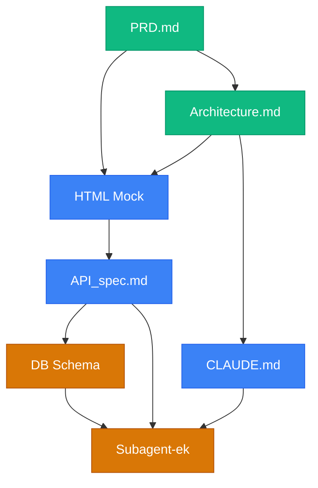

---
tags:
  - ai
  - claude-code
  - modszertan
  - architektura
datum: 2026-03-26
szint: "🏗️ Builder"
kapcsolodo:
  - "[[toolbox/claude-code-projekt-setup|Claude Code]]"
  - "[[toolbox/claude-code-agent-teams|Claude Code Agent Teams]]"
  - "[[toolbox/screenshot-to-code|Screenshot to Code]]"
  - "[[toolbox/get-shit-done|Get Shit Done (GSD)]]"
---

# Claude Code Building Structure

> [!tldr]
> App építés metodológia [[toolbox/claude-code-projekt-setup|Claude Code]]-dal: dokumentum-vezérelt pipeline, ahol **minden kód előtt dokumentáció készül**, és a subagent-ek a specifikáció alapján dolgoznak - nem ad hoc promptolás alapján.

---

## A pipeline



---

## 1. PRD.md - Product Requirements Document

**Mi ez:** A termék leírása üzleti szemszögből - mit csinál az app, kinek, miért.

**Tartalom:**
- Probléma és megoldás (1-2 bekezdés)
- Target user és use case-ek
- Feature lista prioritással (must / should / nice-to-have)
- Sikermetrikák (ha van)

**Miért első:** Minden más ebből származik. Ha a PRD nem tiszta, az architektúra és az API spec is homályos lesz - a subagent-ek pedig rossz dolgot fognak építeni jól.

---

## 2. Architecture.md - Rendszerterv

**Mi ez:** Technikai döntések dokumentuma - stack, komponensek, adatfolyam.

**Tartalom:**
- Stack választás (framework, DB, hosting, auth)
- Komponens diagram (mermaid)
- Adatfolyam: user action -> frontend -> API -> DB -> response
- Külső szolgáltatások (Stripe, Resend, stb.)
- Mappastruktúra terv

**Miért itt:** Az Architecture a PRD technikai fordítása. A HTML mock ebből tudja, milyen adatok jelennek meg, az API spec ebből tudja, milyen endpoint-ok kellenek.

---

## 3. CLAUDE.md - Projekt konvenciók

**Mi ez:** A Claude Code projekt memóriája - minden session beolvassa.

**Tartalom (Architecture alapján):**
- Projekt összefoglaló (1-2 mondat)
- Stack és konvenciók (csomagkezelő, naming, file structure)
- Gotchas szekció (üres az elején, de a struktúra legyen kész)

**Miért korán:** A HTML mock és az implementáció is ezt olvassa - ha a konvenciók itt vannak, a subagent-ek konzisztens kódot írnak.

---

## 4. HTML Mock - Vizuális prototípus

**Mi ez:** Egyetlen (vagy néhány) statikus HTML fájl, ami megmutatja hogyan néz ki és működik az app - hardcoded adatokkal.

**Honnan épül:**
- PRD -> milyen feature-ök jelennek meg
- Architecture -> milyen adatstruktúrák, milyen oldalak

**Miért HTML mock és nem Figma:** Claude Code közvetlenül generálja, azonnal látod a böngészőben, és - a legfontosabb - **ez lesz az API spec inputja**. A mock-ból leolvasható: milyen adatra van szüksége a frontend-nek, milyen action-öket küld a user.

> [!tip] Hogyan promptold
> "Készíts egy HTML mock-ot a PRD.md és Architecture.md alapján. Tailwind CDN-nel, hardcoded adatokkal, minden fő oldalra. Responsiveness nem kell, a fő layout és adat-megjelenítés legyen korrekt."

---

## 5. API_spec.md - Backend contract

**Mi ez:** Az összes API endpoint specifikációja - a frontend HTML mock alapján visszafejtve.

**Hogyan készül:**
1. Nézd végig a HTML mock-ot
2. Minden megjelenített adathoz -> milyen GET endpoint kell
3. Minden user action-höz (gomb, form, toggle) -> milyen POST/PUT/DELETE kell
4. Request/response séma minden endpoint-ra

**Miért a frontend-ből és nem az Architecture-ből:** Az Architecture mondja meg a rendszer struktúráját, de a **frontend mondja meg, mit vár a user**. Ha az API spec-et az Architecture-ből írod, könnyen készítesz endpoint-okat amiket senki nem használ.

---

## 6. DB Schema - Adatmodell

**Mi ez:** Az adatbázis séma az API spec alapján.

**Hogyan készül:**
- Minden API response -> milyen tábla és milyen mezők kellenek
- Relációk az endpoint-ok közötti adatkapcsolatokból
- Index-ek a query pattern-ek alapján

**Sorrendiség:** API spec -> Schema, nem fordítva. Ha előbb tervezed a DB-t, akkor a DB struktúrája diktálja az API-t - és a frontend kénytelen alkalmazkodni.

---

## 7. Subagent-ek - Párhuzamos implementáció

Ez a pont ahol a [[toolbox/claude-code-agent-teams|Claude Code Agent Teams]] belép. A dokumentumok készen vannak, a subagent-ek megkapják a specifikációt:

| Subagent | Input | Output |
|---|---|---|
| **@schema** | API_spec.md + Architecture.md | Drizzle/Prisma schema, migrációk |
| **@backend** | API_spec.md + schema | API route-ok, validáció, auth |
| **@frontend** | HTML Mock + API_spec.md | React komponensek, API hívások |
| **@tests** | API_spec.md | Integration tesztek |

**Miért működik:** Minden subagent-nek megvan a saját specifikációja (a .md fájlok). Nem kell a lead session-nek mindent elmagyarázni - a dokumentumok tartalmazzák a kontextust.

---

## Miért nem a szokásos sorrend?

### A hagyományos bottom-up: DB -> API -> Frontend

A legtöbb tutorial és bootcamp így tanítja: tervezd meg a DB schemát, írd meg az API-t, építsd rá a frontend-et. Ez logikusnak tűnik ("alulról építkezz, stabil alap"), de a gyakorlatban:

- **Felesleges endpoint-ok** - írsz egy `GET /users/:id/settings` endpoint-ot mert a DB-ben van egy settings tábla, de a frontend-en sehol nem jelenik meg
- **Rossz adatforma** - a DB normalizált (3 JOIN kell egy oldal megjelenítéséhez), de a frontend egy flat objektumot vár
- **Újratervezés** - amikor végre a frontend-hez érsz, kiderül hogy a user flow más adatot igényel

### Ez a pipeline: Frontend -> API -> DB (top-down)

```text
Szokásos:                          Ez a pipeline:
──────────                         ──────────────
DB Schema (mit TUDUNK tárolni)     HTML Mock (mit LÁT a user)
    ↓                                  ↓
API (amit a DB ki tud szolgálni)   API Spec (amit a frontend KELL)
    ↓                                  ↓
Frontend (alkalmazkodik az API-    DB Schema (ami az API-t ki
  hoz, néha kompromisszumokkal)      tudja szolgálni)
```

**A lényeg:** ha a frontend-ből indulsz, minden amit építesz, az a user szempontjából releváns. Nem lesz felesleges endpoint, nem lesz rossz adatforma, nem kell visszamenni és újratervezni.

> [!info] Miért jobb ez Claude Code subagent-ekkel?
> A .md specifikációk **interface-ként** működnek a párhuzamos agent-ek között. Az API spec a frontend és a backend közötti contract - ha ez kész, a kettő párhuzamosan fejleszthető. Bottom-up-nál a frontend subagent blokkolt amíg az API nincs kész.

---

## Mikor használd ezt a struktúrát

- **Greenfield app** - nulláról indulsz, nincs meglévő kódbázis
- **MVP gyártás** - projekteknél ahol gyorsan kell működő app
- **Komplex app** - 5+ oldalas, adatbázis, auth, API

### Mikor NE

- Landing page / statikus site - ott elég a direkt prompt
- Meglévő app bővítése - ott a kódbázis a specifikáció
- Egyfunkciós tool - túlzás lenne 6 dokumentum egy script-hez

---

## AI-natív fejlesztés

Ez a pipeline kifejezetten AI-natív fejlesztésre lett tervezve: a dokumentum-vezérelt megközelítés biztosítja, hogy a subagent-ek specifikáció alapján dolgozzanak, nem ad hoc promptolás alapján. A top-down sorrend (frontend -> API -> DB) minimalizálja az újratervezést és maximalizálja a párhuzamos agent munkát.

> [!tip] Hogyan használd AI-val
> - *"Indíts egy új projektet a Building Structure pipeline szerint: először PRD.md, aztán Architecture.md, majd CLAUDE.md - minden lépésnél várd meg a jóváhagyásomat"*
> - *"A HTML Mock kész. Nézd végig és készítsd el az API_spec.md-t: minden megjelenített adathoz GET endpoint, minden user action-höz POST/PUT/DELETE"*

---

## Kapcsolódó

- [[toolbox/get-shit-done|Get Shit Done (GSD)]] - session-szintű produktivitási workflow (ez a strukturált, projekt-szintű verzió)
- [[toolbox/claude-code-agent-teams|Claude Code Agent Teams]] - a subagent orchestráció, ami a pipeline végén fut
- [[toolbox/claude-code-projekt-setup|Claude Code]] - az eszköz maga
- [[toolbox/screenshot-to-code|Screenshot to Code]] - a HTML Mock fázist gyorsíthatja screenshot-ból
