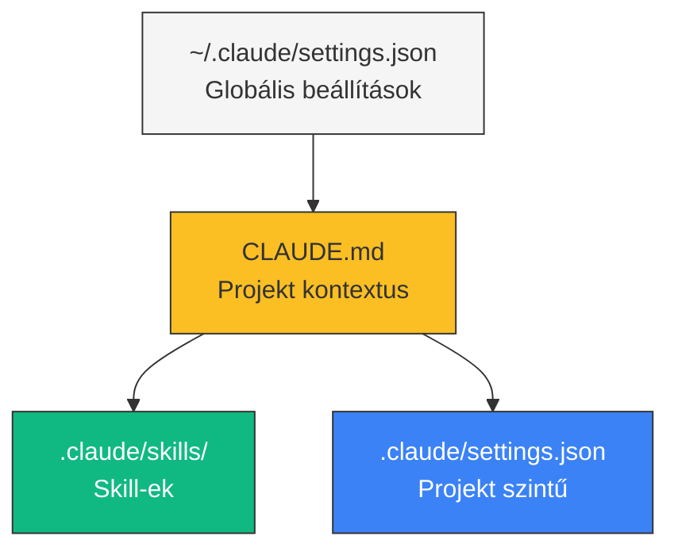

---
tags:
  - eszkoz
  - ai
  - dev-tool
datum: 2026-03-06
szint: "🧱 Scout"
kapcsolodo:
  - "[[toolbox/claude-code-agent-teams|Claude Code Agent Teams]]"
  - "[[toolbox/claude-agent-sdk|Claude Agent SDK]]"
  - "[[toolbox/claude-code-skills-es-plugins|Claude Code Skills és Plugins]]"
  - "[[toolbox/mcp-model-context-protocol|MCP — Model Context Protocol]]"
  - "[[toolbox/git-worktree-vs-branch|Git worktree vs branch]]"
  - "[[_moc/moc-environment-setup|MOC - Environment Setup]]"
  - "[[_moc/moc-ai-tooling|MOC - AI Tooling]]"
---

# Claude Code projekt setup

## Összefoglaló

Hogyan konfigurálj egy új vagy meglévő projektet **Claude Code** számára, hogy a lehető legtöbbet hozd ki az AI-asszisztált fejlesztésből. A helyes beállítás drámaian javítja a kód minőségét és csökkenti a félreértéseket.

## A három szint



| Szint | Fájl | Mikor töltődik be |
|-------|------|-------------------|
| Globális | `~/.claude/settings.json` | Mindig |
| Projekt | `CLAUDE.md` | Ha a working directory-ban van |
| Skill | `.claude/skills/*/SKILL.md` | Explicit hivatkozáskor |

## CLAUDE.md — a legfontosabb fájl

A `CLAUDE.md` a projekt gyökérében van, és **automatikusan betöltődik** minden Claude Code session-ben. Ez a fő kontextus forrás.

### Mit írj bele

```markdown
# Projekt neve

## Tech Stack
- Next.js 14 (App Router)
- TypeScript (strict mode)
- Supabase (auth + DB)
- Drizzle ORM
- Tailwind CSS + shadcn/ui

## Konvenciók
- Server Components alapértelmezett, "use client" csak ha kell
- Drizzle query-k: src/db/queries/ mappában, nem a komponensekben
- Env változók: .env.local (soha ne commitold)
- Tesztek: Vitest, __tests__/ mappában

## Mappastruktúra
src/
├── app/           # Next.js App Router
├── components/    # React komponensek
├── db/            # Drizzle séma + queries
├── lib/           # Utility-k, helperek
└── types/         # TypeScript típusok

## Amit NE csinálj
- Ne használj `any` típust
- Ne commitolj .env fájlokat
- Ne írj console.log-ot production kódba (használj logger-t)
- Ne módosíts migration fájlokat kézzel
```

> [!tip] Tartsd rövidnek
> A CLAUDE.md az **agent context window-jába** töltődik. Ha túl hosszú (200+ sor), a lényeges információ elvész. Csak a legfontosabb konvenciókat és kontextust írd bele.

## Skills (`.claude/skills/`)

A skill-ek **speciális instrukciók**, amiket a Claude Code trigger szabályok alapján tölt be. Nem mindig aktívak — csak amikor relevásak.

```
.claude/skills/
├── obsidian-note/
│   ├── SKILL.md           # Fő instrukciók
│   └── references/        # Kiegészítő fájlok
└── frontend-design/
    └── SKILL.md
```

### Mikor hasznos skill

- **Ismétlődő feladatok** — mindig ugyanazt a formátumot / workflow-t követed
- **Komplex munkafolyamatok** — sok lépés, amit könnyű elfelejteni
- **Csapat konvenciók** — mindenki ugyanazt a mintát használja

## Hooks (`.claude/settings.json`)

Hook-ok automatikusan lefutó shell parancsok bizonyos események során:

```json
{
  "hooks": {
    "PreToolUse:Write": [
      {
        "command": "if echo \"$CLAUDE_FILE_PATH\" | grep -qE '\\.env$'; then echo 'BLOCKED'; exit 2; fi"
      }
    ],
    "PostToolUse:Bash": [
      {
        "command": "echo 'Bash command completed'"
      }
    ]
  }
}
```

**Hasznos hook példák:**
- `.env` fájlok írásának blokkolása
- Automatikus lint futtatás fájl mentés után
- Security audit minden commit előtt

## MCP Szerverek

Claude Code MCP (Model Context Protocol) szervereket is tud használni, amik extra tool-okat adnak:

```json
{
  "mcpServers": {
    "supabase": {
      "command": "npx",
      "args": ["-y", "@anthropic-ai/mcp-server-supabase"]
    },
    "playwright": {
      "command": "npx",
      "args": ["@anthropic-ai/mcp-server-playwright"]
    }
  }
}
```

## Checklist új projekthez

- [ ] `CLAUDE.md` létrehozása a projekt gyökérében
- [ ] Tech stack és konvenciók dokumentálása
- [ ] `.claude/settings.json` hook-ok beállítása
- [ ] Releváns MCP szerverek konfigurálása
- [ ] `.gitignore`-ba: `.claude/` ha szükséges
- [ ] Skill létrehozása ismétlődő feladatokhoz

## Kapcsolódó

- [[toolbox/claude-code-agent-teams|Claude Code Agent Teams]] — párhuzamos agent munka
- [[toolbox/claude-agent-sdk|Claude Agent SDK]] — saját agent-ek építése
- [[toolbox/git-worktree-vs-branch|Git worktree vs branch]] — izolált munka agent-eknek
