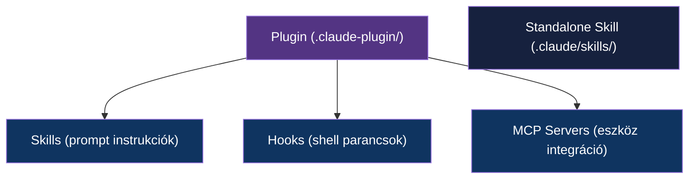

---
tags:
  - eszkoz
  - ai
  - dev-tool
datum: 2026-03-07
szint: "🧱 Brick"
kapcsolodo:
  - "[[toolbox/claude-code-projekt-setup|Claude Code projekt setup]]"
  - "[[toolbox/mcp-model-context-protocol|MCP — Model Context Protocol]]"
  - "[[toolbox/claude-code-agent-teams|Claude Code Agent Teams]]"
  - "[[_moc/moc-ai-tooling|MOC - AI Tooling]]"
---

# Claude Code Skills és Plugins

## Összefoglaló

A Claude Code **skills** és **plugins** rendszere lehetővé teszi, hogy testreszabd az agent viselkedését. A skill egy egyedi prompt instrukció, amit Claude automatikusan vagy parancsra betölt. A plugin egy csomagolt bundle, ami skill-eket, hook-okat és MCP szervereket foglal egybe.

A [[toolbox/claude-code-projekt-setup|Claude Code projekt setup]] jegyzet bemutatja az alapokat — ez a jegyzet a rendszer mélyebb rétegeit tárgyalja.

---

## Skills vs Plugins



| | Skill | Plugin |
|---|-------|--------|
| **Micsoda** | Egyedi prompt instrukció | Csomagolt skill + hook + MCP bundle |
| **Hol van** | `.claude/skills/` | `.claude-plugin/` vagy registry |
| **Telepítés** | Manuális vagy `--plugin-dir` | Registry, GitHub URL, lokális |
| **Scope** | Projekt vagy globális | Projekt vagy globális |
| **Tartalmaz** | SKILL.md + references/ | plugin.json + skills/ + hooks/ + mcp-servers/ |

---

## Skill felépítése

### SKILL.md struktúra

Minden skill egy `SKILL.md` fájl YAML frontmatter-rel:

```markdown
---
name: obsidian-note
description: Obsidian jegyzet készítése a vault-ba
trigger: "obsidianba|vault-ba|jegyzetbe"
user_invocable: true
---

Amikor a felhasználó Obsidian jegyzetet kér, kövesd ezeket a lépéseket:

1. Olvasd be a vault struktúrát
2. Használd a meglévő frontmatter konvenciókat
3. Hozd létre a jegyzetet a megfelelő mappában
4. Add hozzá a backlink-eket
```

### Frontmatter mezők

| Mező | Kötelező | Leírás |
|------|----------|--------|
| `name` | Igen | Skill azonosító (egyedi) |
| `description` | Igen | Rövid leírás — Claude ezt látja, amikor eldönti, hogy használja-e |
| `trigger` | Nem | Regex pattern — ha a user üzenete illeszkedik, a skill automatikusan aktiválódik |
| `user_invocable` | Nem | Ha `true`, a felhasználó `/skill-name` parancsként is meghívhatja |

### references/ mappa

A skill mellé tehetsz kiegészítő fájlokat a `references/` mappába:

```
.claude/skills/
└── obsidian-note/
    ├── SKILL.md
    └── references/
        ├── frontmatter-template.md
        ├── example-note.md
        └── folder-structure.txt
```

A `references/` tartalmát Claude automatikusan kontextusként kapja, amikor a skill aktiválódik. Ide kerülnek a sablonok, példák, konvenciók.

### Trigger szabályok

A `trigger` mező regex pattern — ha a felhasználó üzenete illeszkedik, a skill **automatikusan aktiválódik**:

```yaml
# Egyszerű kulcsszavak
trigger: "obsidianba|vault-ba"

# Összetettebb pattern
trigger: "PR review|review this PR|nézd át a PR-t"

# Nincs trigger — csak manuálisan hívható
# (hagyd ki a trigger mezőt)
```

> [!tip] User-invocable skills
> Ha `user_invocable: true`, a felhasználó `/skill-name` parancsként is meghívhatja a skill-t. Ez hasznos, ha nem akarsz automatikus trigger-t, de szeretnéd, hogy könnyen elérhető legyen.

---

## Plugin rendszer

### Plugin struktúra

```
.claude-plugin/
├── plugin.json          # Manifest — a plugin leírása
├── skills/
│   ├── review/
│   │   └── SKILL.md
│   └── deploy/
│       ├── SKILL.md
│       └── references/
│           └── deploy-checklist.md
├── hooks/
│   └── pre-commit.sh
└── mcp-servers/
    └── config.json
```

### plugin.json manifest

```json
{
  "name": "my-project-plugin",
  "version": "1.0.0",
  "description": "Projekt-specifikus Claude Code plugin",
  "skills": ["skills/review", "skills/deploy"],
  "hooks": {
    "PreToolUse": [{
      "command": "bash hooks/pre-commit.sh",
      "event": "Edit"
    }]
  },
  "mcpServers": {
    "project-tools": {
      "command": "node",
      "args": ["mcp-servers/server.js"]
    }
  }
}
```

### Telepítési módok

| Mód | Parancs | Mikor |
|-----|---------|-------|
| **Lokális könyvtár** | `claude --plugin-dir ./my-plugin` | Fejlesztés közben |
| **GitHub URL** | `claude --plugin github:user/repo` | Megosztott plugin |
| **Registry** | Automatikus (ha konfigurálva) | Hivatalos plugin-ek |

### Hivatalos plugin-ek

Néhány plugin beépítetten elérhető:

| Plugin | Mire jó |
|--------|---------|
| **Playwright** | Browser automatizáció, screenshot, UI tesztelés |
| **Supabase** | Supabase projekt kezelés, DB, edge functions |
| **Context7** | Naprakész library dokumentáció |

Ezek a `settings.json`-ben MCP szerverként is konfigurálhatók — lásd [[toolbox/mcp-model-context-protocol|MCP — Model Context Protocol]].

---

## Skill fejlesztési workflow

### 1. Létrehozás

```bash
# Skill könyvtár létrehozása
mkdir -p .claude/skills/my-skill/references

# SKILL.md megírása
cat > .claude/skills/my-skill/SKILL.md << 'EOF'
---
name: my-skill
description: Leírás, amit Claude lát
trigger: "kulcsszó1|kulcsszó2"
---

Instrukciók ide...
EOF
```

### 2. Tesztelés

```bash
# Plugin-ként betöltés teszteléshez
claude --plugin-dir .claude/skills/my-skill
```

Mondj valamit, ami a trigger-re illeszkedik, és figyeld, hogy Claude aktiválja-e a skill-t.

### 3. Iteráció

A skill fejlesztés **Create → Eval → Improve → Benchmark** ciklust követ:
1. **Create** — írd meg az első verziót
2. **Eval** — teszteld különböző inputokkal
3. **Improve** — finomítsd a prompt-ot és a trigger-t
4. **Benchmark** — mérd meg, hogy mennyire megbízhatóan aktiválódik

### 4. Publikálás

Ha a skill általánosan hasznos, plugin-be csomagolhatod és megoszthatod:
- GitHub repóba tedd a plugin struktúrát
- Mások `--plugin github:user/repo` paranccsal telepíthetik

---

## Gyakorlati példák

### Obsidian jegyzet skill

```markdown
---
name: obsidian-note
description: Obsidian jegyzet készítése a vault-ba
trigger: "obsidianba|vault-ba|jegyzetbe"
user_invocable: true
---

Amikor Obsidian jegyzetet kell készíteni:

1. Olvasd be a vault struktúrát (mappák, meglévő jegyzetek)
2. Olvasd be 2-3 hasonló jegyzetet a frontmatter konvenciókért
3. Használd a meglévő formátumot (tags, datum, szint, kapcsolodo)
4. Hozd létre a jegyzetet a megfelelő mappában
5. Add hozzá a [[wiki-link]] backlink-eket
6. Ellenőrizd, hogy minden link létező fájlra mutat
```

### Code review skill

```markdown
---
name: code-review
description: Kód review készítése PR-hez
trigger: "review.*PR|nézd át|code review"
---

PR review készítésekor:

1. Olvasd végig az összes változtatást
2. Ellenőrizd: biztonsági problémák, teljesítmény, olvashatóság
3. Adj visszajelzést kategóriánként (critical / suggestion / nit)
4. Ha minden rendben, explicit mondd ki
```

### Frontend design skill

```markdown
---
name: frontend-design
description: UI komponens tervezése és implementálása
trigger: "komponenst|UI-t|felületet.*tervez"
user_invocable: true
---

UI komponens tervezésekor:

1. Kérdezd meg a felhasználót a design rendszerről (Tailwind? shadcn/ui?)
2. Nézd meg a meglévő komponenseket az src/components/ mappában
3. Kövesd a projekt konvencióit (naming, file structure)
4. Először tervezd meg a komponens API-t (props), aztán implementáld
5. Responsive legyen (mobile-first)
```

---

## Kapcsolódó

- [[toolbox/claude-code-projekt-setup|Claude Code projekt setup]] — alapszintű skill és hook konfiguráció
- [[toolbox/mcp-model-context-protocol|MCP — Model Context Protocol]] — MCP szerverek plugin-ekben
- [[toolbox/claude-code-agent-teams|Claude Code Agent Teams]] — skill-ek agent team-ekben
