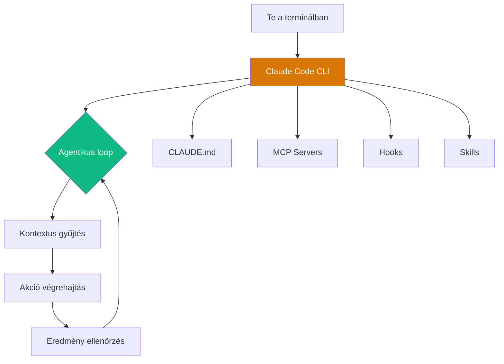

---
tags:
  - eszkoz
  - ai
  - dev-tool
datum: 2026-03-26
szint: "🧱 Scout"
kapcsolodo:
  - "[[toolbox/claude-code-projekt-setup|Claude Code projekt setup]]"
  - "[[toolbox/claude-code-skills-es-plugins|Claude Code Skills és Plugins]]"
  - "[[toolbox/claude-code-agent-teams|Claude Code Agent Teams]]"
  - "[[toolbox/claude-agent-sdk|Claude Agent SDK]]"
  - "[[toolbox/mcp-model-context-protocol|MCP]]"
  - "[[toolbox/tmux|tmux]]"
  - "[[toolbox/coderabbit|CodeRabbit]]"
  - "[[toolbox/vitest|Vitest]]"
  - "[[toolbox/playwright|Playwright]]"
  - "[[toolbox/sentry|Sentry]]"
  - "[[foundations/git-es-github|Git és GitHub]]"
  - "[[_moc/moc-ai-tooling|MOC - AI Tooling]]"
---

# Claude Code - áttekintés

Az Anthropic terminál-alapú AI kódolási asszisztense - agentikus kódolás közvetlenül a terminálból.

> [!info] Részletes jegyzetekhez
> Ez egy áttekintő jegyzet. A specifikus témákat lásd:
> - [[toolbox/claude-code-projekt-setup|Claude Code projekt setup]] - CLAUDE.md, konfiguráció, MCP
> - [[toolbox/claude-code-skills-es-plugins|Claude Code Skills és Plugins]] - skill rendszer, hook-ok
> - [[toolbox/claude-code-agent-teams|Claude Code Agent Teams]] - multi-agent koordináció

---

## Mi ez és mire jó?

A **Claude Code** egy CLI tool, ami a terminálodban él és természetes nyelven kezeli a kódolási feladatokat: bugfix, feature fejlesztés, refactoring, git workflow, code review - mindet a teljes kódbázis kontextusában.

```
Te:          "Fix the auth middleware bug"
Claude Code: 1. Beolvassa a releváns fájlokat
             2. Megérti a kontextust (CLAUDE.md, projekt struktúra)
             3. Javít, tesztel, commitol
             4. Visszajelez: "Fixed the JWT expiry check in middleware.ts"
```

---

## Open source státusz

> [!warning] NEM teljesen open source
> A GitHub repo ([anthropics/claude-code](https://github.com/anthropics/claude-code)) **publikus** (76K+ star), de a **core CLI forráskódja proprietary**. A JS/TS forrás bundled/compiled formában van az npm-en - nem olvasható, nem fork-olható.

| Szempont | Státusz |
|----------|---------|
| GitHub repo | Publikus (76K+ star) |
| Forráskód | Proprietary (bundled JS) |
| Licensz | Anthropic Commercial Terms |
| Issue tracking | Nyílt (5600+ issue) |
| Plugin/skill rendszer | Nyílt - bárki írhat |
| claude-code-action | MIT licensz (GitHub Actions integráció) |
| Agent SDK | Nyílt (`@anthropic-ai/claude-agent-sdk`) |

**Versenytársi kontextus:**
- OpenAI Codex CLI - Apache 2.0 (teljesen nyílt)
- Google Gemini CLI - Apache 2.0 (teljesen nyílt)
- Claude Code - proprietary (community nyomás az open source-ra)

---

## Architektúra



---

## Kulcs képességek

| Képesség | Leírás |
|----------|--------|
| **CLAUDE.md** | Projekt-szintű memória fájl - konvenciók, szabályok, gotcha-k |
| **[[toolbox/mcp-model-context-protocol|MCP]] Servers** | Model Context Protocol - külső tool-ok csatlakoztatása (DB, API, docs) |
| **Hooks** | Shell scriptek lifecycle eventekhez: `PreToolUse`, `PostToolUse`, `SessionStart` |
| **Skills** | Markdown-alapú workflow-k - slash command-dal hívhatók (`/deploy`, `/commit`) |
| **Subagents** | Mini-agentek saját prompttal és tool hozzáféréssel - párhuzamos munka |
| **Agent Teams** | Multi-agent orchestráció - [[toolbox/claude-code-agent-teams|lásd részletesen]] |
| **Worktrees** | Izolált [[foundations/git-es-github|Git]] worktree-k (`claude --worktree`) - feature branch-ek izoláltan |

### Telepítés és használat

```bash
# Telepítés
npm install -g @anthropic-ai/claude-code

# Interaktív session
claude

# Non-interactive (automatizáláshoz)
claude -p "List all TODO comments in src/"

# Worktree-vel
claude --worktree

# Modell választás
claude --model sonnet  # gyorsabb, olcsóbb
claude --model opus    # legokosabb
```

### MCP konfiguráció

A `.claude/settings.json`-ban:

```json
{
  "mcpServers": {
    "supabase": {
      "command": "npx",
      "args": ["-y", "@anthropic-ai/mcp-server-supabase"]
    },
    "context7": {
      "command": "npx",
      "args": ["-y", "@anthropic-ai/mcp-server-context7"]
    }
  }
}
```

### Hook példa

```json
{
  "hooks": {
    "PreToolUse": [
      {
        "matcher": "Bash",
        "command": "echo 'Bash command requested'"
      }
    ]
  }
}
```

---

## Mikor használd (és mikor mást)?

| Feladat | Claude Code | Alternatíva |
|---------|------------|-------------|
| Kód írás / bugfix | Igen - elsődleges | - |
| Komplex refactoring | Igen - plan mode + subagents | - |
| Párhuzamos fejlesztés | Igen - Agent Teams | - |
| Code review | Igen - `/review-pr` | [[toolbox/coderabbit|CodeRabbit]] (automatikus) |
| Research / összehasonlítás | Részben | Gemini (hosszabb context) |

> [!tip] CLAUDE.md mint projekt memória
> A CLAUDE.md Gotchas szekció sokat segít hosszú projekteknél. Minden bugfix és workaround azonnali bejegyzése kulcsfontosságú - a következő session-ben biztosan kelleni fog.

---

## AI-natív fejlesztés

A Claude Code maga az AI-natív fejlesztés elsődleges eszköze - a terminálból vezérelt agentikus kódolás, subagent-ek, hook-ok és skill-ek rendszere lehetővé teszi, hogy a fejlesztő természetes nyelven irányítsa a teljes fejlesztési ciklust. A CLAUDE.md, MCP és Agent Teams kombinációja teszi igazán hatékonnyá.

> [!tip] Hogyan használd AI-val
> - *"Plan mode-ban gondold végig a feature-t, aztán implementáld subagent-ekkel párhuzamosan"*
> - *"Adj hozzá egy CLAUDE.md Gotchas szekciót ezzel a workaround-dal, hogy a következő session-ben is tudd"*
