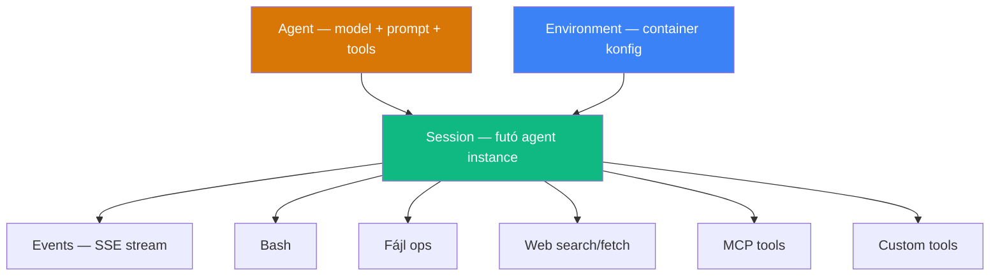

---
tags:
  - ai
  - platform
  - agent
datum: 2026-04-08
szint: "🧱 Brick"
kapcsolodo:
  - "[[toolbox/claude-code|Claude Code]]"
  - "[[toolbox/claude-agent-sdk|Claude Agent SDK]]"
  - "[[toolbox/mcp-model-context-protocol|MCP]]"
  - "[[guides/claude-managed-agents-technikai-felepites|Managed Agents - Technikai felépítés]]"
  - "[[guides/claude-managed-agents-research-preview|Managed Agents - Research Preview]]"
  - "[[guides/claude-managed-agents-integracios-mintak|Managed Agents - Integrációs minták]]"
  - "[[toolbox/claude-code-agent-teams|Claude Code Agent Teams]]"
  - "[[toolbox/sentry|Sentry]]"
---

# Claude Managed Agents

**Kategória:** `platform` / `ai`
**Docs:** https://platform.claude.com/docs/en/managed-agents/overview
**Státusz:** Public beta (2026-04-08)

---

## Mi ez és mire jó?

> [!tldr] Egy mondatban
> Az Anthropic felhő-alapú agent infrastruktúrája — te definiálod az agent-et (model, prompt, tools), ők futtatják a teljes agent loop-ot sandbox-ban. A [[toolbox/claude-agent-sdk|Claude Agent SDK]]-hoz és a sima Messages API-hoz képest ez a "hosted" megoldás.

A **Managed Agents** egy composable API suite, amivel production-ready AI agenteket építhetsz és deployolhatsz az Anthropic infrastruktúráján. A lényeg: nem kell sandbox-ot, state management-et, tool execution-t, checkpointing-ot, credential kezelést magadnak megírnod.

### Miért más mint a Messages API?

| | Messages API | Managed Agents |
|---|---|---|
| **Agent loop** | Te írod (prompt → response → tool → result → prompt) | Anthropic futtatja automatikusan |
| **Tool execution** | Te hajtod végre kliens-oldalon | Cloud container-ben fut (bash, fájlok, web) |
| **Session** | Stateless (te kezeled a history-t) | Perzisztens — órákig futhat, disconnect-et túléli |
| **Sandbox** | Saját megoldás kell | Beépített, izolált container |
| **Skálázás** | Te kezeled | Anthropic kezeli |
| **Ideális** | Custom agent loop, fine-grained kontroll | Hosszan futó feladatok, minimális infra |

---

## Architektúra — 4 core concept

| Koncepció | Mi ez | Analógia |
|-----------|-------|----------|
| **Agent** | Model + system prompt + tools + [[toolbox/mcp-model-context-protocol|MCP]] servers + skills. Egyszer hozod létre, utána ID-vel hivatkozol. Verzionált. | Mint egy CLAUDE.md + tool konfig, de API szinten |
| **Environment** | Cloud container template — package-ek, network szabályok, runtime-ok | Mint egy Dockerfile |
| **Session** | Egy futó agent instance egy environment-ben. Konkrét feladatot old meg. | Mint egy [[toolbox/claude-code|Claude Code]] session, de felhőben |
| **Events** | User üzenetek és agent válaszok SSE stream-en | Mint a Messages API streaming, de kétirányú |

---

## Hogyan működik a flow?

1. **Agent létrehozása** → `POST /v1/agents` — model, system prompt, tools
2. **Environment létrehozása** → `POST /v1/environments` — container config (package-ek, network)
3. **Session indítása** → `POST /v1/sessions` — agent + environment összekötése
4. **User üzenet küldése** → `POST /v1/sessions/:id/events` — feladat leírása
5. **Stream figyelése** → `GET /v1/sessions/:id/stream` — SSE stream az agent munkájáról

Claude **önállóan** dönt a tool hívásokról: fájlokat ír/olvas, bash-t futtat, web-et keres — mind a container-ben. Te csak a stream-et figyeled.

---

## Mikor használd?

- **Hosszan futó feladatok** — percekig-órákig tartó munka (kód generálás, dokumentum feldolgozás, kutatás)
- **Aszinkron munka** — felhasználó elindítja, visszajön később az eredményért
- **Multi-step agent munka** — komplex feladatok ahol Claude többször iterál tool hívásokkal
- **Gyors prototípus → production** — nem akarsz sandbox-ot, retry logikát, state-et magad építeni
- **SaaS integrációk** — Claude-ot beágyazod a saját termékedbe

### Mikor NE használd

- **Egyszerű prompt → válasz** — arra a Messages API elég
- **Teljes kontroll kell az agent loop felett** — a [[toolbox/claude-agent-sdk|Claude Agent SDK]] jobb erre
- **Lokális fejlesztés** — arra a [[toolbox/claude-code|Claude Code]] CLI van
- **Determinisztikus flow** — ha mindig A→B→C, nem kell AI agent

---

## Beépített tool-ok

| Tool | Név | Mit csinál |
|------|-----|-----------|
| Bash | `bash` | Shell parancsok futtatása a container-ben |
| Read | `read` | Fájl olvasás |
| Write | `write` | Fájl írás |
| Edit | `edit` | String replacement fájlban |
| Glob | `glob` | Fájl keresés pattern-nel |
| Grep | `grep` | Szöveg keresés regex-szel |
| Web fetch | `web_fetch` | URL tartalom lekérése |
| Web search | `web_search` | Web keresés |

Ezeket az `agent_toolset_20260401` tool type-pal engedélyezed. Egyenként is ki/be kapcsolhatók. Emellett **custom tool-ok** (kliens-oldali) és **[[toolbox/mcp-model-context-protocol|MCP]] szerverek** is csatlakoztathatók.

---

## Árazás

Két dimenzió:

| Tétel | Ár |
|-------|-----|
| **Token-ök** | Standard Claude API árak (Sonnet 4.6: $3/$15 MTok, Opus 4.6: $5/$25 MTok) |
| **Session runtime** | **$0.08 / session-óra** (csak `running` státuszban, ms pontosság) |

> [!example] Példa — 1 óra, Opus 4.6
> - 50K input × $5/MTok = $0.25
> - 15K output × $25/MTok = $0.375
> - Runtime: $0.08
> - **Összesen: ~$0.71**

Prompt caching működik — cache read-ek 10%-os input áron. Web search: $10/1000 keresés (standard ár). Batch API és fast mode **nem** elérhető Managed Agents-szel.

---

## Kik használják már?

| Cég | Használat |
|-----|-----------|
| **Notion** | Feladatok delegálása Claude-nak workspace-en belül (kód, prezentáció, website) |
| **Rakuten** | Enterprise agentek Slack/Teams-ben — 1 hét/agent deployment |
| **Asana** | "AI Teammates" — feladatokat vesznek fel és draftelnek deliverable-eket |
| **[[toolbox/sentry|Sentry]]** | Debug agent + PR-író agent láncolva — bug → reviewable fix |
| **Vibecode** | Prompt → deployed app pipeline |

---

## Hozzáférés és rate limit-ek

- **Public beta** — minden API account-on elérhető
- Beta header kell: `anthropic-beta: managed-agents-2026-04-01` (SDK auto)
- Rate limit: 60 create/perc, 600 read/perc
- Research preview funkciók (outcomes, multi-agent, memory) → külön access kell

---

## Az Anthropic agent ökoszisztéma

| Szint | Eszköz | Mikor |
|-------|--------|-------|
| **Lokális CLI** | [[toolbox/claude-code|Claude Code]] | Terminálból interaktív fejlesztés |
| **Programmatic SDK** | [[toolbox/claude-agent-sdk|Claude Agent SDK]] | Saját agent loop kódban, custom orchestráció |
| **Hosted platform** | **Managed Agents** | Felhőben futó agent, minimális infra |
| **Protokoll** | [[toolbox/mcp-model-context-protocol|MCP]] | Tool-ok szabványos csatlakoztatása bármelyik szinthez |

---

## Kapcsolódó

- [[toolbox/claude-code|Claude Code]] — lokális CLI fejlesztői eszköz
- [[toolbox/claude-agent-sdk|Claude Agent SDK]] — programmatic agent building (nem hosted)
- [[toolbox/mcp-model-context-protocol|MCP]] — tool-ok csatlakoztatásának protokollja
- [[guides/claude-managed-agents-technikai-felepites|Managed Agents - Technikai felépítés]] — agent setup, environment, tools, permissions részletesen
- [[guides/claude-managed-agents-research-preview|Managed Agents - Research Preview]] — outcomes, multi-agent orchestration, memory
- [[guides/claude-managed-agents-integracios-mintak|Managed Agents - Integrációs minták]] — hogyan építsd be a saját SaaS termékedbe (3 pattern + 3 valós példa)
- [[toolbox/claude-code-agent-teams|Claude Code Agent Teams]] — CLI-s multi-agent koordináció (nem felhőben)
- [[toolbox/sentry|Sentry]] — egyik korai Managed Agents integráció
