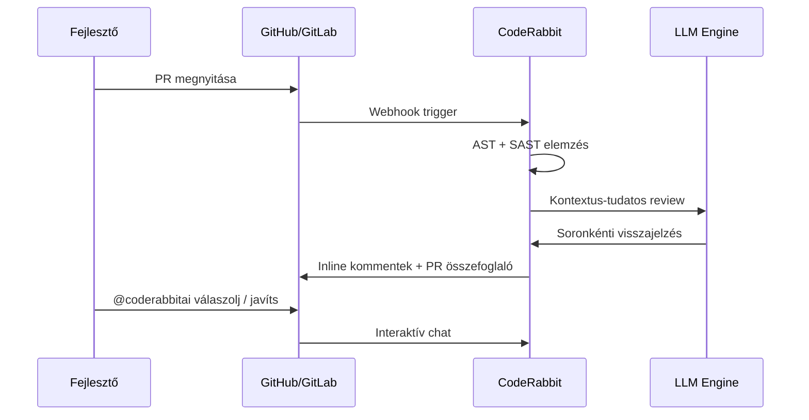

---
tags:
  - eszkoz
  - ai
  - code-review
datum: 2026-03-26
szint: "🧱 Scout"
kapcsolodo:
  - "[[foundations/git-es-github|Git és GitHub]]"
  - "[[toolbox/claude-code-projekt-setup|Claude Code]]"
  - "[[toolbox/claude-code-agent-teams|Claude Code Agent Teams]]"
  - "[[toolbox/aikido|Aikido]]"
  - "[[_moc/moc-ai-tooling|MOC - AI Tooling]]"
---

# CodeRabbit

**Kategória:** `code review` / `ai`
**Docs:** https://docs.coderabbit.ai/

---

## Mi ez és mire jó?

AI-alapú pull request reviewer, ami kontextus-tudatos, soronkénti kód review-t ad automatikusan minden PR-hez - közvetlenül GitHub/GitLab kommentekben.

A **CodeRabbit** egy SaaS szolgáltatás, ami webhook-on keresztül figyeli a repóidat. Ha PR nyílik, AST elemzést + statikus analízist (SAST) + LLM-alapú review-t futtat, és a találatokat inline kommentekként posztolja a PR-be.



---

## Fő képességek

| Funkció | Leírás |
|---------|--------|
| **Soronkénti review** | Nem csak linting - kontextus-tudatos visszajelzés minden változott sorra |
| **PR összefoglaló** | Auto-generált high-level summary + release note draft |
| **Interaktív chat** | `@coderabbitai` tag-gel kérdezhetsz, unit test generálást kérhetsz |
| **Code Graph** | Dependency-k megértése a kódbázison belül |
| **Konfigurálható** | `.coderabbit.yaml` a repóban - repo/org szintű testreszabás |
| **Multi-language** | JS, TS, Python, Java, C#, Go, Rust, PHP, és több |
| **IDE támogatás** | VS Code, Cursor, Windsurf |

---

## Árazás

| Csomag | Ár | Mit ad |
|--------|-----|--------|
| **Free / Open Source** | $0 | Nyílt forráskódú projektekre mindig ingyenes (rate limit: 200 fájl/óra) |
| **Lite** | $12/hó/fejlesztő | Alap AI review limitekkel |
| **Pro** | $24/hó/fejlesztő (éves) | Korlátlan review + minden integráció |
| **Enterprise** | Egyedi | SOC 2, self-hosting, dedikált support |

14 napos free trial, bankkártya nélkül.

---

## Telepítés (GitHub)

1. GitHub Marketplace - CodeRabbit - Install
2. Repók kiválasztása - Authorize
3. Kész - automatikusan review-olja az új PR-eket

**Opcionális konfiguráció** - `.coderabbit.yaml` a repó gyökerében:

```yaml
# .coderabbit.yaml
reviews:
  auto_review:
    enabled: true
    drafts: false  # draft PR-eket ne review-ozza
  path_filters:
    - "!**/*.md"   # markdown fájlokat hagyja ki
    - "!dist/**"   # build output-ot hagyja ki
```

---

## Mikor használd?

- **Minden csapatprojektnél** ahol rendszeres PR review flow van
- **Solo fejlesztőként** is hasznos - elkapja amit te nem vettél észre (security, edge case-ek)
- **Open source projekteknél** - ingyenes, és a kontribútorok PR-jeit automatikusan review-olja

### Mikor NE használd

- **Architekturális döntésekhez** - az inline review jól elkapja a bug-okat, de szisztémás/architekturális problémákat kevésbé lát
- **Nagyon kis projekteknél** - ha nincs PR flow, nincs mit review-olni

---

## Claude Code workflow integráció

A CodeRabbit és a [[toolbox/claude-code-projekt-setup|Claude Code]] jól kiegészítik egymást:

```
Claude Code (fejlesztés)     CodeRabbit (review)
────────────────────────     ──────────────────
Megírja a kódot              Review-olja a PR-t
Commitol, PR-t nyit          Inline kommenteket ad
Javít a feedback alapján     Újra review-ol
```

> [!tip] Gyakorlati workflow
> 1. Claude Code-dal fejleszt + commitol
> 2. `gh pr create` - CodeRabbit automatikusan review-olja
> 3. A CodeRabbit kommenteket Claude Code-dal javítod: `"Fix the issues CodeRabbit found in PR #123"`
> 4. Push - CodeRabbit újra review-ol

**CodeRabbit vs Claude Code code review:**

| Szempont | CodeRabbit | Claude Code (`/review-pr`) |
|----------|-----------|--------------------------|
| Automatizmus | Automatikus minden PR-nél | Manuális - te indítod |
| Kontextus | Teljes kódbázis + dependency graph | Aktuális session kontextus |
| Output | GitHub/GitLab inline kommentek | Terminálba írja |
| Ár | $24/hó/fejlesztő | Claude API token költség |

---

## AI-natív fejlesztés

Automatikus PR review - kiegészíti az AI coding tool-ok munkáját review oldalon. Míg a Claude Code megírja a kódot, a CodeRabbit automatikusan ellenőrzi minden PR-nél: bug-ok, security problémák, edge case-ek. Ez a kettős AI workflow (generálás + review) drámaian csökkenti a hibák production-be jutását.

> [!tip] Hogyan használd AI-val
> - *"A CodeRabbit kommenteket javítsd ki a PR-ben - nézd meg a #123 PR inline kommentjeit és fix-eld"*
> - *"Állítsd be a .coderabbit.yaml-t hogy a test fájlokat és a generated kódot hagyja ki a review-ból"*

---

## Összehasonlítás más AI review toolokkal

| Tool | Erőssége | Gyengesége |
|------|----------|------------|
| **CodeRabbit** | Legtöbb platform, 46% accuracy runtime bug-okon, 2M+ repó | Architekturális problémákat kevésbé lát |
| **GitHub Copilot** | Natív GitHub integráció | Limitált kontextus (csak az adott PR) |
| **Qodo Merge** | Self-hosted opció, open-source | Kevésbé plug-and-play |
| **Cursor BugBot** | Magas konfidencia, alacsony false-positive | Szűkebb scope - csak bug-finding |
