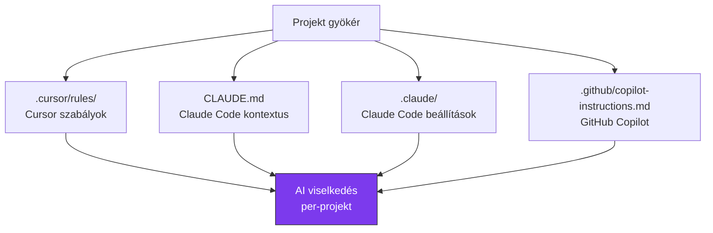

---
tags:
  - eszkoz
  - ai
  - dev-tool
  - konfiguracio
datum: 2026-03-06
szint: "🧱 Scout"
kapcsolodo:
  - "[[toolbox/claude-code-projekt-setup|Claude Code projekt setup]]"
  - "[[toolbox/ai-first-fejlesztoi-workflow|AI-first fejlesztői workflow]]"
  - "[[toolbox/ai-coding-agentek-osszehasonlitasa|AI coding agentek összehasonlítása]]"
  - "[[toolbox/google-antigravity|Google Antigravity]]"
  - "[[foundations/projekt-szintu-izolacio|Projekt-szintű izoláció]]"
  - "[[_moc/moc-environment-setup|MOC - Environment Setup]]"
  - "[[_moc/moc-ai-tooling|MOC - AI Tooling]]"
---

# Cursor és Claude konfiguráció

## Összefoglaló

Az AI coding tool-ok (Cursor, Claude Code) projektszintű konfigurációs fájlokat használnak, hogy a projekt kontextusát, konvencióit és szabályait megértsék. Ezek a fájlok a repóba commitolva **minden fejlesztő és agent számára** azonos viselkedést biztosítanak — a [[foundations/projekt-szintu-izolacio|projekt-szintű izoláció]] kiterjesztése az AI tool-okra.

## A konfigurációs fájlok



## Cursor konfiguráció (`.cursor/`)

### Rules — projekt szabályok

A `.cursor/rules/` mappa szabályfájlokat tartalmaz, amiket a Cursor automatikusan betölt kontextusként.

```
.cursor/
└── rules/
    ├── general.mdc        # Általános projekt konvenciók
    ├── frontend.mdc       # Frontend-specifikus szabályok
    └── database.mdc       # Adatbázis konvenciók
```

**Példa rule fájl:**

```markdown
---
description: Általános projekt konvenciók
globs:
alwaysApply: true
---

# Projekt konvenciók

## Tech Stack
- Next.js 15 (App Router)
- TypeScript (strict mode)
- Drizzle ORM
- Tailwind CSS + shadcn/ui

## Szabályok
- Server Components alapértelmezett
- "use client" csak ha interaktivitás kell
- Minden API route-nak legyen input validációja (Zod)
- Ne használj `any` típust
```

**Glob-alapú szabályok** — csak bizonyos fájloknál aktiválódnak:

```markdown
---
description: React komponens szabályok
globs: ["src/components/**/*.tsx", "src/app/**/*.tsx"]
alwaysApply: false
---

# Komponens szabályok
- Functional component-ek, ne class-ok
- Props type-ot mindig definiáld (ne inline)
- Használj forwardRef-et ha DOM ref kell
```

### `.cursorignore` — fájlok kizárása

```bash
# .cursorignore
node_modules/
.next/
dist/
*.lock
.env*
```

## Claude Code konfiguráció

A [[toolbox/claude-code-projekt-setup|Claude Code projekt setup]] jegyzet részletesen tárgyalja a Claude Code konfigurációt. Itt az összehasonlításra fókuszálunk.

### `CLAUDE.md` — fő kontextus

```markdown
# My SaaS App

## Tech Stack
- Next.js 15, TypeScript, Drizzle ORM, Tailwind CSS

## Konvenciók
- Server Components alapértelmezett
- API route-ok: src/app/api/ mappában
- Drizzle query-k: src/db/queries/ mappában
```

### `.claude/settings.json` — hook-ok és MCP

```json
{
  "hooks": {
    "PreToolUse:Write": [
      {
        "command": "if echo \"$CLAUDE_FILE_PATH\" | grep -qE '\\.env$'; then echo 'BLOCKED'; exit 2; fi"
      }
    ]
  },
  "mcpServers": {
    "playwright": {
      "command": "npx",
      "args": ["@anthropic-ai/mcp-server-playwright"]
    }
  }
}
```

### `.claude/skills/` — speciális workflow-ok

```
.claude/skills/
├── code-review/
│   └── SKILL.md          # Code review instrukciók
└── migration/
    └── SKILL.md          # DB migráció workflow
```

## Összehasonlítás

| Szempont | Cursor (`.cursor/`) | Claude Code (`CLAUDE.md` + `.claude/`) |
|----------|--------------------|-----------------------------------------|
| Kontextus fájl | `.cursor/rules/*.mdc` | `CLAUDE.md` |
| Glob-alapú szabályok | Igen (`globs:` frontmatter) | Igen (skill trigger) |
| Hook-ok | Nincs | Igen (`settings.json`) |
| MCP szerverek | Beépített | `settings.json`-ban |
| Ignore fájl | `.cursorignore` | `.claude/settings.json` `ignorePaths` |
| Skills/Templates | Nincs | `.claude/skills/` |
| Commitolható | Igen | Igen |

## Best practices

### 1. Mindkét tool konfigurálása

Ha a csapatban többen használnak különböző AI tool-okat, tartsd karban mindkét konfigurációt:

```
projekt/
├── .cursor/
│   └── rules/
│       └── general.mdc
├── .claude/
│   ├── settings.json
│   └── skills/
├── CLAUDE.md
└── .github/
    └── copilot-instructions.md
```

> [!tip] Tartsd szinkronban
> A szabályok legyenek konzisztensek a tool-ok között. Ha a Cursor rule azt mondja "Server Components alapértelmezett", a CLAUDE.md-ben is legyen ez.

### 2. Szabály kategorizálás

```
# Cursor rules struktúra
.cursor/rules/
├── 01-general.mdc        # Általános konvenciók
├── 02-frontend.mdc       # Frontend szabályok
├── 03-backend.mdc        # Backend szabályok
├── 04-database.mdc       # DB konvenciók
└── 05-testing.mdc        # Teszt konvenciók
```

### 3. Ne ismételd magad

A Cursor rules és a CLAUDE.md tartalom között sok az átfedés. Ha egy konvenciót módosítasz, mindkét helyen frissítsd.

### 4. Commitold a repóba

```bash
# .gitignore - ezeket NE ignoráld:
# .cursor/rules/ → commitolni kell
# CLAUDE.md → commitolni kell
# .claude/settings.json → commitolni kell (ha nincs benne titok)
# .claude/skills/ → commitolni kell

# De ezeket igen:
echo ".env*" >> .gitignore
echo "!.env.example" >> .gitignore
```

> [!warning] Titkok a konfigurációban
> Ha az MCP szerver konfigurációban API kulcsok vannak, tedd a `~/.claude/settings.json` globális fájlba, ne a projekt szintűbe.

### 5. Ignore pattern-ek

Mindkét tool-nál zárj ki mindent, ami zajos és nem releváns:

```bash
# .cursorignore / .claude settings ignorePaths
node_modules/
.next/
dist/
*.lock
coverage/
.git/
```

## AI tool választás

| Szempont | Cursor | Claude Code |
|----------|--------|-------------|
| Interfész | GUI (VS Code fork) | CLI (terminál) |
| Erőssége | Inline edit, autocomplete | Komplex feladatok, agentic workflow |
| [[toolbox/ai-first-fejlesztoi-workflow\|AI-first workflow]] | Kódszerkesztés közben | Delegálás, review ciklus |
| Csapat setup | `.cursor/rules/` | `CLAUDE.md` + skills |
| Árazás | Előfizetés | Token-alapú |

## Kapcsolódó

- [[toolbox/claude-code-projekt-setup|Claude Code projekt setup]] — részletes Claude Code konfigurációs útmutató
- [[toolbox/ai-first-fejlesztoi-workflow|AI-first fejlesztői workflow]] — hogyan használd az AI tool-okat hatékonyan
- [[foundations/projekt-szintu-izolacio|Projekt-szintű izoláció]] — az elv, amit az AI konfiguráció is követ
