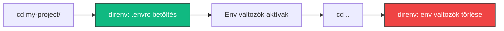

---
tags:
  - eszkoz
  - dev-tool
  - environment
datum: 2026-03-06
szint: "🌱 Newcomer"
kapcsolodo:
  - "[[foundations/projekt-szintu-izolacio|Projekt-szintű izoláció]]"
  - "[[toolbox/nix|Nix]]"
  - "[[frontend/env-valtozok-nextjs-ben|Env változók Next.js-ben]]"
  - "[[toolbox/fnm|fnm]]"
  - "[[_moc/moc-environment-setup|MOC - Environment Setup]]"
---

# direnv

## Összefoglaló

A **direnv** egy shell extension, ami automatikusan betölti és eltávolítja az env változókat amikor belépsz vagy kilépsz egy mappából. A projekt gyökerében elhelyezel egy `.envrc` fájlt, és onnan kezdve a `cd` parancs elég — nem kell kézzel `source .env`-et futtatnod.

## Miért hasznos?

A [[foundations/projekt-szintu-izolacio|projekt-szintű izoláció]] egyik fontos eleme az env változók kezelése. Jelenleg a legtöbb projekt `.env` vagy `.env.local` fájlokat használ, amiket a framework (Next.js, Express) olvas be. De mi van azokkal a változókkal, amiket a **shell**-ben kell beállítani?

```
# Ezeket a shell-nek kell tudnia, nem a framework-nek:
AWS_PROFILE=dev-account
KUBECONFIG=~/.kube/dev-cluster.yaml
DATABASE_URL=postgresql://localhost:5432/myapp
PATH=$PATH:./node_modules/.bin
```

Direnv nélkül:
```bash
cd my-project
export AWS_PROFILE=dev-account
export DATABASE_URL=postgresql://localhost:5432/myapp
# ... elfelejteni reset-elni kifelé menet
```

Direnv-vel:
```bash
cd my-project    # automatikusan betöltődik
cd ..            # automatikusan törlődik
```



## Setup

### 1. Telepítés

```bash
brew install direnv
```

### 2. Shell hook

```bash
# .zshrc-be hozzáadni:
eval "$(direnv hook zsh)"
```

> [!tip] Sorrend a .zshrc-ben
> A direnv hook-ot a **legvégére** tedd a `.zshrc`-ben, minden más inicializálás (fnm, stb.) után. Így a direnv felül tudja írni amit kell.

### 3. Projekt beállítás

```bash
cd my-project

# .envrc fájl létrehozása
cat > .envrc << 'EOF'
export DATABASE_URL=postgresql://localhost:5432/myapp
export AWS_PROFILE=dev-account
export NODE_ENV=development
EOF

# Engedélyezés (biztonsági lépés)
direnv allow
```

### 4. `.envrc` hozzáadása a `.gitignore`-hoz

```bash
echo ".envrc" >> .gitignore
```

> [!warning] Ne commitold az `.envrc`-t
> Az `.envrc` titkos értékeket tartalmazhat (API kulcsok, connection string-ek). Mindig legyen a `.gitignore`-ban. Készíts egy `.envrc.example`-t a dokumentációhoz.

## Gyakori minták

### Alap env változók betöltés

```bash
# .envrc
export DATABASE_URL=postgresql://localhost:5432/myapp
export REDIS_URL=redis://localhost:6379
export API_KEY=dev-key-12345
```

### `.env` fájl betöltése

Ha már van `.env` fájlod (amit a [[frontend/env-valtozok-nextjs-ben|Next.js]] is használ), direnv-vel is betöltheted:

```bash
# .envrc
dotenv .env.local
```

### PATH kiterjesztés

```bash
# .envrc - lokális binárisok hozzáadása a PATH-hoz
PATH_add ./node_modules/.bin
PATH_add ./scripts
```

### Nix integráció

A direnv igazi ereje a [[toolbox/nix|Nix]]-szel együtt jön ki — automatikusan aktiválja a Nix fejlesztői környezetet:

```bash
# .envrc
use flake
```

Ezzel `cd`-nél a Nix environment is betöltődik — Node.js, Python, adatbázisok, minden.

### Layout (virtuális környezet)

```bash
# .envrc - Python venv automatikus aktiválás
layout python3

# .envrc - Node verzió (fnm-mel kombóban)
use node
```

## Biztonsági modell

A direnv **nem futtat automatikusan** semmit, amíg explicit `direnv allow`-val nem engedélyezed. Ha az `.envrc` változik, újra kell engedélyezned:

```bash
# Új/módosított .envrc engedélyezése
direnv allow

# Engedély visszavonása
direnv deny

# .envrc újraértékelése
direnv reload
```

Ez véd a rosszindulatú `.envrc` fájlok ellen — ha klónozol egy repót ami tartalmazza, nem fut le automatikusan.

## Direnv vs `.env` fájlok

| Szempont | `.env` (dotenv) | direnv |
|----------|----------------|--------|
| Ki olvassa | A framework (Next.js, Express) | A shell |
| Mikor töltődik | App induláskor | `cd`-nél |
| Scope | Csak az app process | Minden shell parancs |
| Unload | Nincs (process-hez kötött) | `cd`-nél automatikus |
| Nix integráció | Nincs | Natív |

> [!info] Nem helyettesíti a `.env`-et
> A direnv és a `.env.local` két különböző célt szolgálnak. A `.env.local`-t a framework olvassa (Next.js, Express), a direnv-et a shell. Komplex projekteknél mindkettő kell.

## Hasznos parancsok

```bash
direnv allow             # Aktuális .envrc engedélyezése
direnv deny              # Engedély visszavonása
direnv reload            # .envrc újratöltése
direnv status            # Aktuális állapot
direnv edit .            # .envrc szerkesztése (allow automatikus utána)
```

## Kapcsolódó

- [[foundations/projekt-szintu-izolacio|Projekt-szintű izoláció]] — az elv, aminek a direnv egy fontos eszköze
- [[toolbox/nix|Nix]] — direnv + Nix kombó a legteljesebb reprodukálható környezet
- [[frontend/env-valtozok-nextjs-ben|Env változók Next.js-ben]] — framework-szintű env kezelés
- [[toolbox/fnm|fnm]] — Node verziókezelés, ami a direnv-vel együtt is használható
