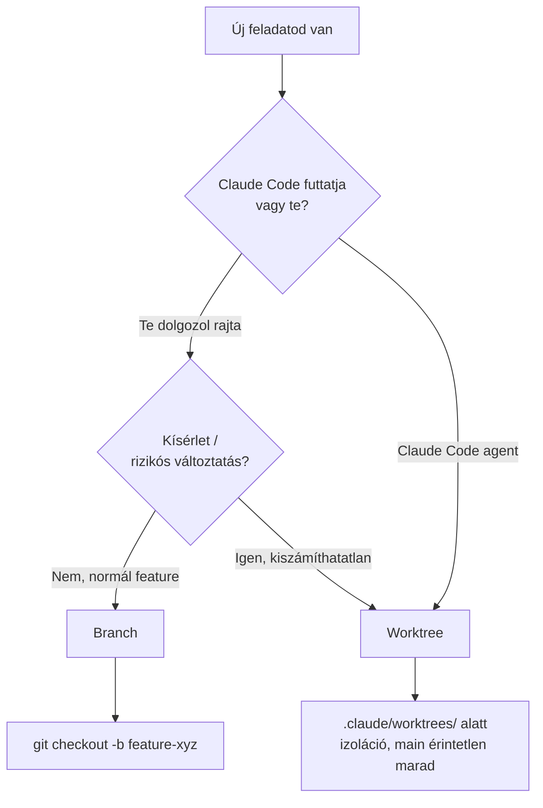

---
tags:
  - eszkoz
  - git
  - workflow
datum: 2026-03-06
szint: "🧱 Scout"
kapcsolodo:
  - "[[foundations/git-es-github|Git es GitHub]]"
  - "[[toolbox/tmux|tmux]]"
  - "[[foundations/szoftverfejlesztes-alapjai|Szoftverfejlesztes alapjai]]"
  - "[[toolbox/claude-code-agent-teams|Claude Code Agent Teams]]"
---

## Branch vs Worktree — mi a különbség?

A **branch** egy párhuzamos fejlesztési vonal — de ugyanabban a mappában dolgozol, csak a Git állapota vált. A **worktree** ennél több: egy teljesen külön könyvtár, ahol egy másik branch van kijelölve, és **egyszerre mindkettőben dolgozhatsz**.

```
Branch:
  ~/Projects/myapp  (main branch)
       ↕ git checkout feature-auth
  ~/Projects/myapp  (feature-auth branch)
  → Ugyanaz a mappa, csak a branch vált. Egyszerre csak egyen dolgozhatsz.

Worktree:
  ~/Projects/myapp              (main branch — itt te dolgozol)
  ~/Projects/myapp-auth         (feature-auth branch — itt Claude dolgozik)
  → Két különböző mappa, két különböző branch, EGYSZERRE.
```

---

## Mikor melyiket?



### Használj **branch**-et ha:

- Te dolgozol rajta, szekvenciálisan
- Egy feature, egy task, normál fejlesztési flow
- Gyors javítás, hotfix
- Nem kell párhuzamosan más branchen is lenni

### Használj **worktree**-t ha:

- **Claude Code agent fut** egy hosszú vagy rizikós feladaton → közben te dolgozhatsz main-en
- **Két Claude Code agent párhuzamosan** dolgozik különböző feature-ökön
- Ki akarod próbálni valamit **úgy, hogy a main ne változzon**
- Egy PR-t review-olsz miközben a saját featuredön is dolgozol

---

## Claude Code és a worktree

A Claude Code natívan támogatja a worktree-ket. Két módon jön létre:

### 1. Automatikusan — Task tool `isolation: "worktree"`

Amikor egy agent `isolation: "worktree"` móddal fut (Claude Code ezt belül kezeli), a Claude:
1. Létrehoz egy új worktree-t `.claude/worktrees/<random-név>/` alatt
2. Az agent ebben az izolált másolatban dolgozik
3. Ha az agent nem csinált változtatást → worktree automatikusan törlődik
4. Ha változtatott → visszakapod a worktree elérési útját és a branch nevét

```
Eredmény: az agent nem tudja elrontani a main working tree-det,
még ha hibát csinál is.
```

### 2. Manuálisan — `EnterWorktree` vagy `git worktree add`

```bash
# Új worktree létrehozása új branch-csel
git worktree add ../myapp-feature-auth -b feature-auth

# Létező branch-et kitérképezés worktree-be
git worktree add ../myapp-hotfix hotfix/fix-login

# Worktree-k listája
git worktree list

# Worktree törlése (branch megmarad)
git worktree remove ../myapp-feature-auth

# Worktree + branch törlése egyszerre
git worktree remove ../myapp-feature-auth
git branch -d feature-auth
```

### Claude Code worktree struktúra

```
myapp/
├── .claude/
│   └── worktrees/
│       ├── feature-auth/      ← Claude agent 1 dolgozik itt
│       └── fix-payment/       ← Claude agent 2 dolgozik itt
├── src/
└── package.json               ← te dolgozol itt (main)
```

---

## Párhuzamos Claude Code agents — a fő use case

A worktree igazi ereje: **két Claude Code session egymással párhuzamosan, egymástól függetlenül** dolgozik ugyanazon a repón.

```bash
# Terminal 1 (tmux window 1): te / Claude a main-en
cd ~/Projects/myapp
claude
# > "Írj unit teszteket az auth modulhoz"

# Terminal 2 (tmux window 2): Claude egy feature-ön
cd ~/Projects/myapp
git worktree add .claude/worktrees/payment -b feature-payment
cd .claude/worktrees/payment
claude
# > "Implementáld a Stripe payment flow-t"
```

→ Mind a kettő fut, mind a kettő ír fájlokat, **de különböző könyvtárakban** — nincs konfliktus.

> [!tip] tmux + worktree kombó
> A [[toolbox/tmux|tmux]] window-ok tökéletesek erre: minden worktree-nek saját window, minden window-ban egy Claude Code session. Nevezd el a window-okat (`Ctrl+a ,`) a worktree neve alapján.

---

## Worktree → merge vissza main-be

Amikor a Claude Code végzett a worktree-ben:

```bash
# 1. Ellenőrzöd a változtatásokat
cd .claude/worktrees/feature-payment
git diff main

# 2. Commit (ha még nincs)
git add -A && git commit -m "Add Stripe payment flow"

# 3. Visszamész main-re és merge-elsz
cd ~/Projects/myapp
git merge feature-payment

# 4. Worktree takarítás
git worktree remove .claude/worktrees/feature-payment
git branch -d feature-payment
```

---

## Korlátok

- **Ugyanaz a branch nem lehet két worktree-ben** egyszerre → minden worktree-nek saját branch kell
- **Uncommitted changes** worktree törlés előtt → commit vagy stash kell
- **node_modules** nem osztódik meg worktree-k között → minden worktree-ben külön `npm install` kell

> [!warning] node_modules a worktree-ben
> Ha a Claude Code agent `npm install`-t futtat a worktree-ben, az ott egy teljesen új `node_modules`-t hoz létre — nem az eredeti mappa node_modules-ját használja. Ez lemezhelyet foglal, de szükséges az izolációhoz.

---

## Összefoglaló döntési táblázat

| Szempont | Branch | Worktree |
|---|---|---|
| Párhuzamos munka | Kell checkout-olni | Egyidejű |
| Claude Code izoláció | Módosítja a wd-t | Saját mappa |
| Egyszerűség | Egyszerűbb | Kicsit komplexebb |
| Lemezterület | Kevesebb | Minden worktree = másolat |
| Normál fejlesztés | Ideális | Felesleges overhead |
| Kísérletezés / agent futtatás | Rizikós | Ideális |

---

## Kapcsolódó

- [[foundations/git-es-github|Git es GitHub]] — branch alapok, merge, rebase
- [[toolbox/tmux|tmux]] — worktree-k párhuzamos kezeléséhez, session-önként egy worktree
- [[foundations/szoftverfejlesztes-alapjai|Szoftverfejlesztes alapjai]] — a teljes dev workflow, amiben a worktree/branch döntés szerepel
- [[toolbox/claude-code-agent-teams|Claude Code Agent Teams]] — teammate-ek izolált worktree-kben dolgoznak párhuzamosan
