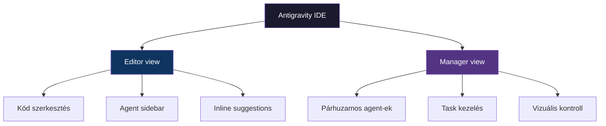

---
tags:
  - eszkoz
  - ai
  - ide
datum: 2026-03-07
szint: "🧱 Brick"
kapcsolodo:
  - "[[toolbox/ai-coding-agentek-osszehasonlitasa|AI coding agentek összehasonlítása]]"
  - "[[toolbox/cursor-es-claude-konfiguracio|Cursor és Claude konfiguráció]]"
  - "[[toolbox/mcp-model-context-protocol|MCP — Model Context Protocol]]"
  - "[[_moc/moc-ai-tooling|MOC - AI Tooling]]"
---

# Google Antigravity

## Összefoglaló

Az Antigravity a Google **agent-first IDE**-je — egy VS Code fork, ami a Gemini modellcsaládra épül. 2025 novemberben jelent meg public preview-ként. A legnagyobb újítása a **két nézet**: az Editor (hagyományos IDE kódoláshoz) és a Manager ("Mission Control", ami több agent párhuzamos munkáját vizualizálja).

---

## Két nézet

### Editor view

A hagyományos IDE felület — VS Code-ra épül, agent sidebar-ral. Hasonló élmény, mint a Cursor:
- Kód szerkesztés szintaxis kiemeléssel
- Agent sidebar chat-tel
- Inline kód javaslatok
- Terminál, fájlkezelő, Git integráció

### Manager view — "Mission Control"

Ez az Antigravity egyedi jellemzője. Egy vizuális dashboard, ahol:
- **Több agent** dolgozhat párhuzamosan különböző feladatokon
- Minden agent saját **workspace**-ben fut (izolált környezet)
- Vizuálisan látod, ki min dolgozik, hol tart
- Task-okat hozol létre, agent-ekhez rendeled
- Beépített **browser loop** — az agent automatikusan teszteli a UI-t

> [!tip] Mikor használd a Manager view-t?
> Ha egyszerre több feladaton kell dolgozni (pl. frontend + backend + tesztek), a Manager view-ban vizuálisan orchestrálhatod az agent-eket. Ez hasonló a Claude Code Agent Teams-hez, de vizuális felülettel.

---

## Főbb jellemzők

| Jellemző | Leírás |
|----------|--------|
| **Multi-agent** | Több agent dolgozhat párhuzamosan különböző workspace-eken |
| **Beépített browser loop** | Automatikus UI tesztelés — az agent megnyitja a böngészőt és ellenőrzi a munkáját |
| **Cross-surface szinkronizáció** | Desktop, web és mobil kliens között szinkronizál |
| **MCP támogatás** | MCP szerver integráció, hasonlóan más tool-okhoz |
| **Model optionality** | Gemini (alapértelmezett), de Claude Sonnet és más modellek is választhatók |
| **Beépített deployment** | Firebase és GCP integráció közvetlenül az IDE-ből |

---

## Modell támogatás

Az Antigravity elsősorban a Google **Gemini** modellcsaládját használja:
- **Gemini 2.5 Pro** — komplex feladatokhoz, nagy kontextus
- **Gemini 2.5 Flash** — gyors, egyszerű feladatokhoz

De nem kizárólagos: más modelleket is támogat (Claude Sonnet, GPT), így nem vagy bezárva a Google ökoszisztémába.

---

## Árazás

| Tier | Ár | Mit tartalmaz |
|------|----|---------------|
| **Free** | $0 | Public preview alatt teljes hozzáférés |
| **Pro** (várható) | ~$20/hó | Teljes funkciókészlet egyéni fejlesztőknek |
| **Enterprise** (várható) | ~$40-60/user/hó | Csapat funkciók, admin kontroll, SLA |

> [!tip] Public preview
> 2026 elején még ingyenesen elérhető a public preview. Ha ki akarod próbálni, most érdemes — nem kell fizetni érte.

---

## Összehasonlítás Cursor-ral

Mivel mindkettő VS Code fork, érdemes összehasonlítani:

| | Antigravity | Cursor |
|---|-------------|--------|
| **Alapja** | VS Code fork | VS Code fork |
| **AI modell** | Gemini (+ más) | Claude, GPT (+ más) |
| **Fő erősség** | Multi-agent Manager view | Inline autocomplete (Tab) |
| **Aszinkron agent** | Igen (Manager view) | Részben (Background Agent) |
| **MCP** | Igen | Igen |
| **Ár** | Jelenleg ingyenes | $20/hó (Pro) |
| **Ökoszisztéma** | Google (GCP, Firebase) | Független |

---

## Mikor érdemes az Antigravity-t használni?

**Jó választás, ha:**
- **Vizuális agent kezelés** fontos — látni akarod, melyik agent min dolgozik
- **Google ökoszisztémában** dolgozol (GCP, Firebase, Cloud Run)
- **Multi-agent vizuális orchestrálás** kell — Manager view ezt adja
- **Ingyenesen** akarsz AI IDE-t használni (public preview)
- Szereted a VS Code felületet, de többet akarsz, mint amit a Cursor ad

**Nem ideális, ha:**
- Terminál-first workflow-t szeretsz (→ Claude Code)
- A legjobb inline autocomplete kell (→ Cursor)
- Stabil, production-ready tool kell (még preview-ban van)
- Nem akarsz új IDE-t tanulni

---

## Kapcsolódó

- [[toolbox/ai-coding-agentek-osszehasonlitasa|AI coding agentek összehasonlítása]] — részletes összevetés más tool-okkal
- [[toolbox/cursor-es-claude-konfiguracio|Cursor és Claude konfiguráció]] — Cursor beállítása, összehasonlítás
- [[toolbox/mcp-model-context-protocol|MCP — Model Context Protocol]] — MCP szerverek az Antigravity-ben
