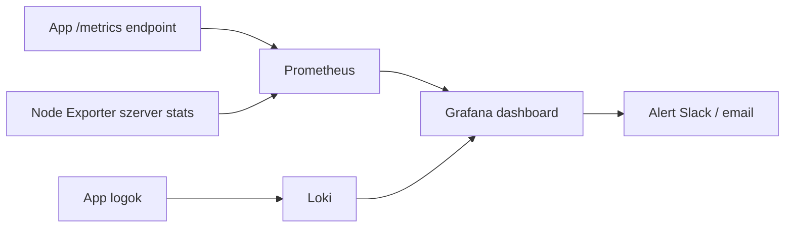

---
tags:
  - eszkoz
  - monitoring
  - observability
datum: 2026-03-06
szint: "🧱 Scout"
kapcsolodo:
  - "[[cloud/hostinger|Hostinger]]"
  - "[[cloud/railway|Railway]]"
  - "[[database/supabase|Supabase]]"
---

# Grafana

**Kategória:** `monitoring` / `observability`
**URL:** https://grafana.com
**Ár/Terv:** Self-hosted (ingyenes) / Grafana Cloud Free (10k series, 14 nap log) / Pro ($8/hó)

---

## Mi ez és mire jó?

> [!tldr] Egy mondatban
> A Grafana egy nyílt forráskódú **dashboard és monitoring platform** — összegyűjti a metrics-eket, log-okat és trace-eket, és vizualizálja őket. Megtudod mi történik az appodban és a szerveredben valós időben.

Fejlesztés közben Claude Code megírja a kódot, de deploy után hogyan tudod, hogy az app jól fut? Hány kérés jön be? Hol lassul le? Mikor volt error? A Grafana erre való.

**A három megfigyelhetőségi pillér amit Grafana kezel:**

| Pillér | Mi ez | Forrás |
|---|---|---|
| **Metrics** | Számszerű mérések időben (pl. CPU %, kérések/sec) | Prometheus, InfluxDB |
| **Logs** | Szöveges naplók eseményekről | Loki, Elasticsearch |
| **Traces** | Egy kérés útja a rendszeren keresztül | Tempo, Jaeger |

**Mikor használd:**
- VPS-en fut az app (pl. [[cloud/hostinger|Hostinger]]) és nem akarsz vakon dolgozni
- Több service fut és látni akarod melyik fogyaszt erőforrást
- Error rate, response time, uptime monitoring kell
- n8n workflow-k lefutásait követnéd

**Mikor NE használd:**
- Ha csak 1 app fut és a Railway/Vercel beépített log-ja elég
- Ha még fejlesztési fázisban vagy — ne optimalizálj amit még nem mértél

---

## Monitoring stack



---

## Setup — lépésről lépésre

### Opció 1: Grafana Cloud (legegyszerűbb)

1. grafana.com → "Start for free" → GitHub-bal
2. Azonnal kapsz egy hosted Grafana instance-t + Prometheus + Loki endpoint-okat
3. Free tier: 10k active series (metrics), 50GB log, 14 nap megőrzés

### Opció 2: Self-hosted Docker-rel (VPS-en)

```bash
# Grafana + Prometheus + Loki stack
# docker-compose.yml

version: '3'
services:
  grafana:
    image: grafana/grafana:latest
    ports:
      - "3000:3000"
    volumes:
      - grafana_data:/var/lib/grafana
    environment:
      - GF_SECURITY_ADMIN_PASSWORD=<JELSZÓ>
    restart: unless-stopped

  prometheus:
    image: prom/prometheus:latest
    ports:
      - "9090:9090"
    volumes:
      - ./prometheus.yml:/etc/prometheus/prometheus.yml
      - prometheus_data:/prometheus
    restart: unless-stopped

  loki:
    image: grafana/loki:latest
    ports:
      - "3100:3100"
    restart: unless-stopped

volumes:
  grafana_data:
  prometheus_data:
```

```bash
docker compose up -d
# Grafana: http://<IP>:3000
# User: admin / jelszó amit megadtál
```

### Prometheus konfig (prometheus.yml)

```yaml
global:
  scrape_interval: 15s

scrape_configs:
  - job_name: 'node'
    static_configs:
      - targets: ['node-exporter:9100']  # szerver metrics

  - job_name: 'app'
    static_configs:
      - targets: ['localhost:3001']  # az app /metrics endpoint-ja
```

### Node Exporter — szerver metrics gyűjtése

```bash
# Futtatás Docker-rel a VPS-en
docker run -d \
  --name node-exporter \
  --restart unless-stopped \
  -p 9100:9100 \
  -v /proc:/host/proc:ro \
  -v /sys:/host/sys:ro \
  prom/node-exporter
```

Ez automatikusan adja: CPU, RAM, Disk, Network metrics.

---

## Best Practices

### Dashboard szervezés

- **Egy dashboard = egy témakör** (ne zsúfolj mindent egy helyre)
- Ajánlott dashboardok:
  - `Server Overview` — CPU, RAM, Disk, Network (Node Exporter)
  - `App Performance` — request rate, latency, error rate
  - `Logs` — szűrhető log viewer Loki-val

### Alerting — értesítés ha valami rosszul megy

```
Grafana → Alerting → Alert rules → New alert rule
```

Hasznos alert-ek:
- CPU > 90% több mint 5 percig
- Disk > 80%
- HTTP error rate > 5%
- App nem válaszol (up == 0)

Notification channel: email, Slack, Telegram (Webhook)

### Metrics az app-ból (Next.js / Node.js)

```typescript
// npm install prom-client
import { collectDefaultMetrics, Registry, Counter } from 'prom-client'

const register = new Registry()
collectDefaultMetrics({ register })

const httpRequests = new Counter({
  name: 'http_requests_total',
  help: 'Total HTTP requests',
  labelNames: ['method', 'path', 'status'],
  registers: [register],
})

// GET /metrics endpoint
app.get('/metrics', async (req, res) => {
  res.set('Content-Type', register.contentType)
  res.end(await register.metrics())
})
```

---

## Hasznos linkek

- Grafana Cloud: https://grafana.com/auth/sign-up
- Dashboard templates: https://grafana.com/grafana/dashboards/
  - Node Exporter Full: `1860` (szerver overview)
  - Docker: `179`
- Docs: https://grafana.com/docs/

> [!tip] Kész dashboardok importálása
> Grafana dashboard-ok importálhatók ID alapján: Dashboard → Import → ID megadás. A `1860`-as Node Exporter dashboard azonnal használható, nem kell nulláról építeni.

---

## Kapcsolódó

- [[cloud/hostinger|Hostinger]] — a szerver ahol a Grafana + Prometheus futhat
- [[cloud/railway|Railway]] — ha Railway-en fut az app, a beépített logok elégek lehetnek Grafana nélkül
- [[database/supabase|Supabase]] — Supabase metrics-eket is be lehet kötni Grafana-ba
