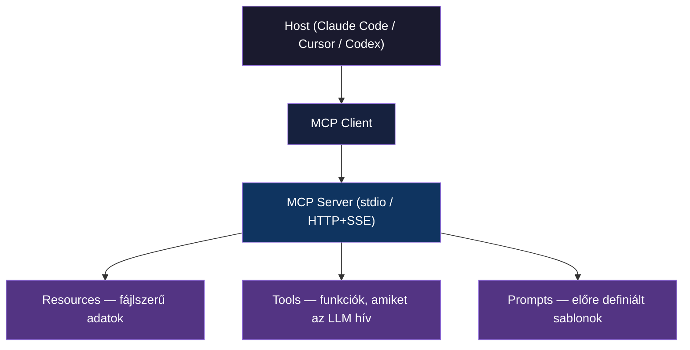

---
tags:
  - eszkoz
  - ai
  - protokoll
datum: 2026-03-07
szint: "🧱 Brick"
kapcsolodo:
  - "[[toolbox/claude-code-projekt-setup|Claude Code projekt setup]]"
  - "[[toolbox/claude-code-skills-es-plugins|Claude Code Skills és Plugins]]"
  - "[[toolbox/claude-agent-sdk|Claude Agent SDK]]"
  - "[[toolbox/ai-coding-agentek-osszehasonlitasa|AI coding agentek összehasonlítása]]"
  - "[[_moc/moc-ai-tooling|MOC - AI Tooling]]"
---

# MCP — Model Context Protocol

## Összefoglaló

Az MCP egy nyílt szabvány, ami egységes interfészt ad LLM-ek és külső eszközök (adatbázisok, API-k, fájlrendszerek, böngészők) közötti kommunikációhoz. Gondolj rá úgy, mint az **USB-C a tool integrációkhoz** — egy csatlakozó, ami mindenhol működik.

MCP nélkül minden AI tool + minden külső szolgáltatás = N×M egyedi integráció. MCP-vel minden tool egyetlen protokollon keresztül beszél, és bármely MCP szerver bármely MCP klienssel működik.

---

## Architektúra



**Három primitív:**

| Primitív | Mire való | Példa |
|----------|-----------|-------|
| **Resources** | Adatok, amiket az LLM kontextusként kap | Fájl tartalom, DB séma, API válasz |
| **Tools** | Funkciók, amiket az LLM meghívhat | SQL query futtatás, screenshot készítés |
| **Prompts** | Előre definiált prompt sablonok | "Elemezd ezt a táblát", "Review PR" |

---

## Transport módok

### stdio — lokális szerver

Az esetek 99%-ában ezt használod. Az MCP szerver ugyanazon a gépen fut, mint a host alkalmazás. A kommunikáció stdin/stdout-on keresztül történik.

```
Host process ──stdin/stdout──> MCP Server process
```

- Gyors, nincs hálózati overhead
- Nem kell port, nem kell auth
- A host indítja a szerver processt

### HTTP+SSE — remote szerver

Csapat-szintű szolgáltatásokhoz, ahol a szerver egy távoli gépen fut.

```
Host ──HTTP POST──> Remote MCP Server
      <──SSE──────
```

- Megosztott adatforrások (pl. csapat DB, belső API)
- Központi credential kezelés
- Ritkábban használt, de hasznos enterprise környezetben

---

## Konfiguráció Claude Code-ban

### Globális konfiguráció

`~/.claude/settings.json` — minden projektben érvényes, **ide kerülnek az API kulcsok**.

```json
{
  "mcpServers": {
    "supabase": {
      "command": "npx",
      "args": ["-y", "@anthropic-ai/mcp-server-supabase"],
      "env": {
        "SUPABASE_ACCESS_TOKEN": "sbp_xxx..."
      }
    }
  }
}
```

### Projekt szintű konfiguráció

`.claude/settings.json` — csak az adott projektben érvényes. API kulcsot **ne** tegyél ide (commitolódik).

```json
{
  "mcpServers": {
    "filesystem": {
      "command": "npx",
      "args": [
        "-y",
        "@modelcontextprotocol/server-filesystem",
        "/Users/user/project/docs"
      ]
    }
  }
}
```

> [!warning] API kulcsok helye
> Mindig a globális settings-be (`~/.claude/settings.json`) tedd az API kulcsokat. A projekt szintű settings commitolódik a repóba — oda csak kulcs nélküli szerver konfigot tegyél.

---

## Népszerű MCP szerverek

| Szerver | Mire jó | Telepítés |
|---------|---------|-----------|
| **Playwright** | Browser automatizáció, screenshot, UI tesztelés | `npx @anthropic-ai/mcp-server-playwright` |
| **Supabase** | DB query, migráció, edge function deploy, típus generálás | `npx @anthropic-ai/mcp-server-supabase` |
| **Context7** | Naprakész library dokumentáció lekérdezése | `npx @anthropic-ai/mcp-server-context7` |
| **Filesystem** | Fájl műveletek korlátozott scope-pal | `npx @modelcontextprotocol/server-filesystem` |
| **Git** | Git repó olvasás, commit történet, keresés | `npx @modelcontextprotocol/server-git` |
| **Memory** | Persistent tudásgráf session-ök között | `npx @modelcontextprotocol/server-memory` |
| **Fetch** | Web tartalom letöltés, markdown konverzió | `npx @anthropic-ai/mcp-server-fetch` |
| **Neon** | Neon Postgres DB kezelés, branching, migráció | `npx @anthropic-ai/mcp-server-neon` |

> [!tip] Nincs mindegyikre szükség
> Csak azt az MCP szervert add hozzá, amire tényleg szükséged van. Minden extra szerver növeli a kontextust és lassítja az indulást. A **least privilege** elv érvényes: ha nem kell DB hozzáférés, ne add hozzá a Supabase szervert.

---

## Saját MCP szerver építése

### Python SDK

```python
from mcp.server.fastmcp import FastMCP

mcp = FastMCP("my-tools")

@mcp.tool()
def calculate_bmi(weight_kg: float, height_m: float) -> float:
    """Testtömegindex kalkulátor."""
    return weight_kg / (height_m ** 2)

@mcp.resource("config://app")
def get_config() -> str:
    """Alkalmazás konfiguráció."""
    return "App version: 1.0"

if __name__ == "__main__":
    mcp.run()
```

Telepítés: `pip install mcp`

### TypeScript SDK

```typescript
import { McpServer } from "@modelcontextprotocol/sdk/server/mcp.js";
import { StdioServerTransport } from "@modelcontextprotocol/sdk/server/stdio.js";

const server = new McpServer({ name: "my-tools", version: "1.0.0" });

server.tool("calculate_bmi", { weight_kg: "number", height_m: "number" },
  async ({ weight_kg, height_m }) => ({
    content: [{ type: "text", text: String(weight_kg / (height_m ** 2)) }]
  })
);

const transport = new StdioServerTransport();
await server.connect(transport);
```

Telepítés: `npm install @modelcontextprotocol/sdk`

### Regisztráció Claude Code-ban

```json
{
  "mcpServers": {
    "my-tools": {
      "command": "python",
      "args": ["path/to/my_server.py"]
    }
  }
}
```

---

## MCP más AI tool-okban

| Tool | MCP támogatás | Konfiguráció |
|------|---------------|-------------|
| **Claude Code** | Natív, teljes | `settings.json` — `mcpServers` |
| **Cursor** | Beépített | `.cursor/mcp.json` |
| **Codex CLI** | Támogatott | `AGENTS.md` vagy config fájl |
| **Antigravity** | Kompatibilis | IDE beállítások |

Az MCP legnagyobb ereje, hogy **egy szerver konfig több tool-ban is működik** — ha megírsz egy MCP szervert, az Claude Code-ban, Cursor-ban és más MCP-kompatibilis eszközben is használható.

---

## Biztonsági megfontolások

1. **API kulcsok mindig globális settings-ben** — soha ne commitold a repóba
2. **Least privilege** — csak a szükséges tool-okat és resource-okat engedélyezd
3. **Credential szerver-oldalon marad** — az MCP szerver kezeli az autentikációt, az LLM nem látja a nyers kulcsokat
4. **Audit** — loggold, hogy az LLM milyen tool hívásokat csinál (különösen write műveleteknél)
5. **Scope korlátozás** — pl. a Filesystem szerver csak a megadott könyvtárakhoz fér hozzá

> [!warning] Ne adj teljes rendszer hozzáférést
> Ha filesystem MCP-t használsz, explicit add meg, mely könyvtárakhoz férhet hozzá. Ne add meg a gyökér könyvtárat.

---

## Kapcsolódó

- [[toolbox/claude-code-projekt-setup|Claude Code projekt setup]] — MCP konfig a projekt setup részeként
- [[toolbox/claude-code-skills-es-plugins|Claude Code Skills és Plugins]] — a plugin rendszer MCP szervereket is csomagol
- [[toolbox/claude-agent-sdk|Claude Agent SDK]] — MCP szerverek használata SDK-ból
- [[toolbox/ai-coding-agentek-osszehasonlitasa|AI coding agentek összehasonlítása]] — MCP támogatás tool-onként
